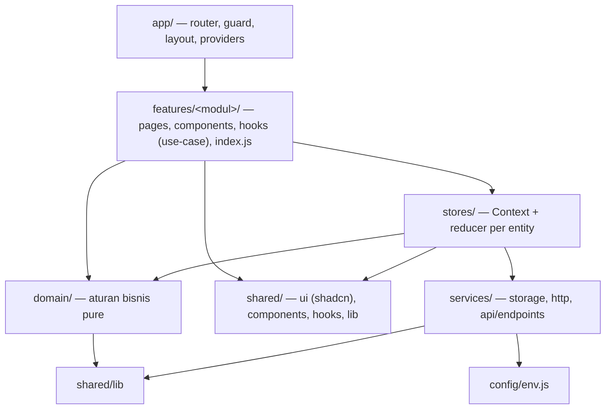
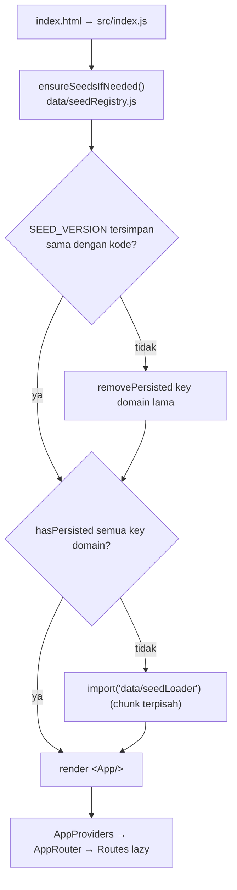

# 01 — Arsitektur Frontend

## Ringkasan
- SPA **React 19 + Vite 6**, struktur **feature-based** dengan lapisan **domain** (aturan bisnis pure), **stores** (state), **services** (storage/HTTP), dan **shared** (UI & util).
- Saat ini data hidup di **localStorage** (mode demo, `VITE_DATA_SOURCE=local`). Lapisan HTTP untuk Laravel API sudah siap (`services/http`, `services/api/endpoints.js`) dan dipakai saat `VITE_DATA_SOURCE=api` (lihat 10).
- Deploy ke **Vercel** sebagai static SPA (`frontend/vercel.json`).
- Keputusan arsitektur: `docs/adr/0001-feature-based-architecture.md`.

## Lapisan & aturan dependensi



| Lapisan | Boleh import | Tidak boleh import |
|---|---|---|
| `app/` | semua | — |
| `features/<x>/` | `stores`, `domain`, `shared`, `services/http|api`, `config`, **`@/features/<y>` (index.js saja)** | internal feature lain, `app/`, `services/storage` |
| `stores/` | `domain`, `shared`, `services` | `features`, `app` |
| `domain/` | `domain`, `shared/lib` | React, `stores`, `services`, `shared/ui|components|hooks` |
| `shared/components` | `shared/*`, `domain`, `stores` | `features`, `app` |
| `shared/lib|ui|hooks`, `services/`, `config/` | sesama lapisan bawah | `stores`, `features`, `app` |

Aturan ini **ditegakkan ESLint** (`frontend/.eslintrc.cjs`, `npm run lint`).

## Struktur folder `frontend/src/`
```
index.js                 bootstrap: ensureSeedsIfNeeded() → render <App/>
app/
  App.js                 AppProviders + AppRouter + Toaster
  providers/AppProviders.js   QueryClient + semua store provider
  router/routes.js       KONFIGURASI route (public, standalone, protected groups + module RBAC)
  router/guards.js       RequireAccess (grup) · RequireModule (halaman, role kustom)
  router/AppRouter.js    membangun <Routes> dari routes.js
  layout/AppLayout.js    sidebar + header + Outlet
  layout/navConfig.js    menu per role + buildNavConfig()
features/
  auth/        pages: Welcome, Login, RoleSelect
  landing/     pages: Home · components: Landing* · data/landingData.js
  inquiry/     pages: DashboardInquiry, InquiryPipeline, ClientDetailInquiry, InquiryMasterData
               components: dashboard/, pipeline/, clientDetail/ · hooks: useClientOutcomeActions
  assessment/  pages: AssessmentFill (publik), AssessmentMasterData, ParentAssessmentView
               components: masterData/, parentAssessment/
  schedule/    pages: DashboardSchedule, CalendarPage, ActiveClients, ActiveClientDetail
               components: calendar/, analytics/ · hooks: useSessionActions · index.js (public API)
  finance/     pages: FinancePortal · components: *Tab, *Dialog
  therapist/   pages: MySchedule, TherapistSummary, TherapistClientDetail, PrintClientReport
               components: SessionReportModal, ClientReportHistoryDrawer, summary/
  parent/      pages: ClientDashboard
  master/      pages: DashboardRevenue, BranchPerformance, UserManagement, RoleModuleAccess
stores/        authStore, clientsStore, schedulesStore, creditsStore, assessmentsStore, therapistsStore, masterDataStore
domain/        branch, status, client, schedule, credit, rbac  (+ __tests__)
services/
  storage/localStore.js       satu-satunya akses localStorage domain (+ resetDemoData)
  http/httpClient.js          axios: token Sanctum, camelCase↔snake_case, ApiError
  http/apiError.js            normalisasi error (422 fieldErrors, 409 konflik, 401)
  http/tokenStore.js          penyimpanan token
  api/endpoints.js            peta URL endpoint Laravel
shared/
  ui/                         shadcn (generated)
  components/                 StatusBadge, EmptyState, ConfirmDialog, FilterBar, … (app-aware)
  hooks/                      usePersistentState (usePersistentReducer/State), useUrlFilters, use-toast
  lib/                        utils (cn), id, format, periods, fileUpload, caseConverter
  constants/testIds/
config/env.js                 VITE_DATA_SOURCE, VITE_API_BASE_URL, VITE_API_TIMEOUT_MS
data/                         seed demo (*.seed.json, seedLoader, seedRegistry)
```

## Boot flow


Initializer reducer memanggil `getSeedLoader()`, yang **melempar error** jika `ensureSeedsIfNeeded()` belum selesai. Jangan render `App` di luar `src/index.js` (test memanggil `ensureSeedsIfNeeded()` dulu).

## Provider tree (`app/providers/AppProviders.js`)
```
QueryClientProvider
 └ AuthProvider → TherapistsProvider → ClientsProvider → SchedulesProvider
   → CreditsProvider → AssessmentsProvider → MasterDataProvider → HolidaysProvider → {children}
```
Store **tidak saling memanggil**. Efek lintas store diorkestrasi oleh **hook use-case** di feature (contoh `useSessionActions`: complete sesi → potong kredit → majukan status client). Lihat 05.

## Pola data per lapisan
| Kebutuhan | Tempat | Contoh |
|---|---|---|
| Aturan bisnis / kalkulasi | `domain/*.js` (pure + test) | `applySessionCompleted`, `advanceStatus`, `checkConflicts` |
| State entity + persist | `stores/<x>Store.js` | `useClients().updateClient` |
| Aksi lintas store | `features/<m>/hooks/use<X>Actions.js` | `useSessionActions().completeSession` |
| Validasi UI, toast, navigate | komponen halaman | `SessionDetailModal.handleComplete` |
| Akses localStorage | `services/storage/localStore.js` | `readPersisted`, `writePersisted` |
| Request API | `services/http/httpClient.js` + `services/api/endpoints.js` | `api.post(ENDPOINTS.schedules.complete(id))` |

## Persistence (mode demo)
- `shared/hooks/usePersistentState.js`: `usePersistentReducer(key, reducer, seedFactory)` dan `usePersistentState(key, seedFactory)` → baca/tulis via `services/storage/localStore.js`.
- Key = `STORAGE_PREFIX` (`therapedia_v5_`) + key. Data `therapedia_v4_*` dimigrasi otomatis (string-replace istilah lama).
- `resetDemoData()` (tombol Reset Demo Data di `AppLayout`) menghapus semua key `therapedia_*` lalu kembali ke `/`.

## Seed & versioning
| File | Peran |
|---|---|
| `data/*.seed.json` | Data demo mentah, field relatif `_createdDaysAgo`, `_weekOffset`, `_dayOfWeek`, `_issuedDaysAgo`, … |
| `data/staffUsers.seed.json` | Akun staf demo (dipakai `authStore`) |
| `scripts/generate_demo_seed.py` | Generator seed JSON |
| `data/seedLoader.js` | Ubah field relatif `_*` menjadi tanggal nyata relatif hari ini |
| `data/seedRegistry.js` | `SEED_VERSION`, `ensureSeedsIfNeeded()`, `getSeedLoader()` |

Seed diubah → **naikkan `SEED_VERSION`**. Sesi `scheduled` yang tanggalnya lewat otomatis menjadi `completed` saat seed dimuat.

## Build, test, lint
| Perintah (di `frontend/`) | Isi |
|---|---|
| `npm run dev` | dev server :3000 |
| `npm run build` | build ke `dist/`; vendor dipisah (`vendor-react`, `vendor-charts`, `vendor-radix`, `vendor-date`, `vendor-icons`) |
| `npm test` | Vitest: `domain/__tests__` (aturan), `features/*/__tests__` (hook use-case), `app/__tests__/routes.smoke.test.js` (render semua route per role) |
| `npm run lint` | ESLint + batas lapisan |

Alias `@` → `frontend/src`; file `.js` boleh berisi JSX (config `esbuild.loader`).
