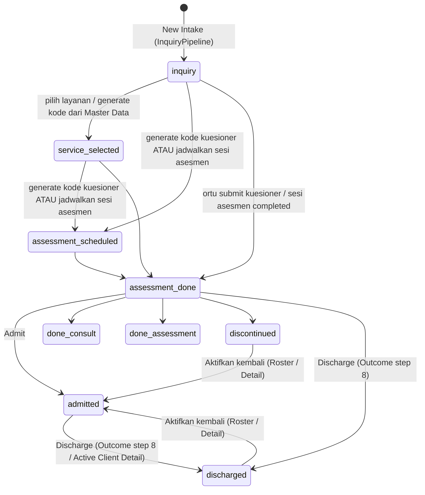

# 04 — Flow Inquiry, Pipeline & Asesmen

> Keputusan klien 3 Okt 2026 yang menyentuh dokumen ini sudah diimplementasi di frontend; register keputusan + status: [12-keputusan-klien.md](12-keputusan-klien.md).

## Tujuan & role
Menerima calon client baru (intake), menggerakkannya melalui pipeline 8 tahap, menerbitkan kode kuesioner untuk orang tua, membaca hasil asesmen (skor kuadran sensori Winnie Dunn), lalu memutuskan outcome.
Role: **Admin Inquiry** (utama), Master, Manager (lihat), Terapis (lihat hasil asesmen), **Orang tua** (isi kuesioner publik).

## State machine status client

Catatan: urutan langkah **tidak dikunci**. Layanan, kode kuesioner, dan jadwal asesmen boleh diisi dalam urutan apa pun; status **otomatis** hanya melompat maju ke tahap tertinggi yang sudah tercapai (mis. langsung jadwalkan asesmen dari `inquiry` → `assessment_scheduled`) lewat `advanceStatus(current, target)` di `domain/client.js` (urutan `PIPELINE_FLOW`; status hasil akhir tidak disentuh). Perubahan **manual** boleh ke **tahap mana pun** (maju maupun mundur): tombol outcome di `OutcomeCard` plus blok "Ubah status ke tahap lain" (`changeStatus` → `buildStatusChangePatch`); salah klik cukup cari client di pipeline lalu ubah statusnya (tidak ada tombol revert khusus).

## Langkah per layar

### 1. New Intake: `/admin-inquiry/pipeline`
- Komponen: `features/inquiry/pages/InquiryPipeline.js` → board `pipeline/PipelineBoard.js`, kartu `pipeline/PipelineCard.js`, kolom dari `STAGE_COLUMNS` di `pipeline/pipelineConfig.js` (grup `main` dan `outcome`).
- Dialog New Intake → `handleCreateIntake`. Field wajib: nama anak (nama lengkap), DOB, nama ortu, WhatsApp, email (email hanya data, tanpa email otomatis). 1 client = 1 ortu. Opsional: **catatan intake** (`intakeNote`: keluhan utama, rujukan, dll; bisa diedit di `EditIntakeDialog`, tampil di `IntakeDataCard`, portal terapis, dan laporan cetak). Hasil asesmen memakai laporan sesi yang sama dengan terapi (`session_reports`), bukan catatan di client.
- Data: `makeInquiryClient(form, existingCodes)` → `addClient()`. Status `inquiry` dan **`clientCode`** = grup huruf pertama nama + counter 5 digit (`nextClientCode`, mis. Kenzo → `KO-00001`; juga kode login ortu).
- Pipeline **tidak** mendukung drag & drop. Status berubah lewat aksi di Client Detail.
- Filter & search disimpan di URL (`useUrlFilters`). Pencarian client: awal nama anak, awal nama ortu, atau awal kode client (`matchesClientSearch`). Cabang mengikuti pola scoping (02).

### 2. Client Detail: `/admin-inquiry/pipeline/:id`
`features/inquiry/pages/ClientDetailInquiry.js` merangkai kartu-kartu di `features/inquiry/components/clientDetail/`:

| Step | Kartu | Handler → action | Efek data |
|---|---|---|---|
| 1 | `IntakeDataCard` + `EditIntakeDialog` | `handleSaveEditIntake` → `updateClient` | edit biodata |
| 2 | `ServiceSelectionCard` | `handleToggleService` → `updateClient` | `serviceTypes[]`, `serviceType`; `inquiry` → `service_selected` |
| 3 | `QuestionnaireCodeCard` | `handleGenerateQuestionnaireCode` → `useQuestionnaireCodeActions.issueCode`; hapus: `handleDeleteQuestionnaireCode` → `deleteCode` | tambah `{code: {typeCode}-{acak}, categoryId, status: "issued", expiresAt?}` ke `assessmentCodes` (jadi `submitted` saat ortu mengisi). Admin memilih **masa berlaku** (tanpa / 7 / 14 / 30 hari) saat generate; `inquiry/service_selected` → `assessment_scheduled`. Kode yang **belum diisi** bisa dihapus (tombol hanya role `canDelete`; konfirmasi; status client tidak mundur). Kode yang sudah diisi tidak bisa dihapus (`isQuestionnaireCodeFilled`) |
| 4 | `AssessmentScheduleCard` | buka `features/schedule/components/calendar/AddScheduleModal` (type `assessment`) | `useSessionActions.createSessions` → sesi asesmen (tanpa kredit); `inquiry/service_selected` → `assessment_scheduled` (sama seperti step 3, salah satu cukup, urutan bebas) |
| 5 | `ParentAnswerCard` | link ke `/admin-inquiry/parent-assessment/:id` | baca jawaban |
| 6 | `GDriveLinkCard` | `handleSaveGDriveLink` → `updateClient` | `gdriveClientLink` |
| 7 | `InvoiceCard` | lihat invoice terakhir + `PaymentProofViewerModal` | read-only (invoice diterbitkan Finance, lihat 06) |
| 8 | `OutcomeCard` + `DiscontinueDialog` | `handleOutcomeAdmit` / `DoneConsult` / `DoneAssessment` / `Discontinue` | lihat bawah |

Outcome step 8 memakai hook use-case `useClientOutcomeActions()` (`features/inquiry/hooks/useClientOutcomeActions.js`): `admit`, `reactivate`, `markDoneConsult`, `markDoneAssessment`, `discontinue`, `discharge`, `changeStatus` (ke tahap mana pun). Fase API = satu endpoint `POST /clients/{id}/transition`. Kolom pipeline **Discharged** (grup `outcome`) menampilkan client yang sudah keluar dari terapi.

**Admit** (`admit`): `status=admitted`, `finalOutcome=admitted`, `dateOfJoin=today`. Jika belum ada record kredit → `addRecord(newCreditRecord({ id: "cr-<clientId>", … }))`. Client boleh di-admit dengan **0 kredit** (frozen) sampai Finance menambah paket.
**Reactivate** (`reactivate`, dari Active Clients Roster / detail): client `discharged`/`discontinued` → `admitted` lewat `buildActivationPatch` (`domain/client.js`): `dateOfJoin` asal dipertahankan, `dateOfDischarge`/`dischargeReason`/`dischargeNote` dikosongkan, record kredit dipastikan ada. `admit` memakai patch yang sama.
**Discharge** (`discharge`, kartu ke-5 `OutcomeCard` + `DischargeDialog`, juga dipakai detail Active Client): alasan wajib (pilihan cepat Master Data atau ketik sendiri), catatan opsional → `status=discharged`, `dateOfDischarge=today`; `finalOutcome` tidak diubah. **Efek lain (8 Okt 2026)**: semua jadwal aktif client (scheduled / rescheduled / reschedule_pending, termasuk recurring) dihapus dan sisa sesi paket hangus (`applyDischargeForfeit`, ledger `discharge`, tampil di Log Kredit & Saldo Finance); riwayat sesi completed/cancelled tetap. Hook mengembalikan `{ deletedSchedules, forfeitedCredits }`. `changeStatus(client, "discharged")` menjalankan efek yang sama.
**Discontinue**: alasan wajib diisi → `status=discontinued`, `dateOfDiscontinue=today` (field sendiri), `dischargeReason="other"`, `dischargeNote=alasan`.
**Ubah status manual** (`changeStatus`): ke tahap pipeline mana pun; tahap awal mengosongkan outcome & data keluar, `admitted` memakai aktivasi, discontinue/discharge membuka dialog alasan. **Hapus client / inquiry**: `DeleteButton` di header Client Detail (hanya role `canDelete`; hapus permanen, sesi, invoice, dan seluruh data kredit client ikut terhapus; `useClientDeleteActions`).

### 3. Isi kuesioner (ortu): `/assessment` (publik)
`features/assessment/pages/AssessmentFill.js`
1. Stage `code`: input kode (atau tautan `/assessment?code=XXX`: kode **terisi dan langsung diproses otomatis**, ortu tidak perlu mengetik; kode salah/kedaluwarsa tetap menampilkan pesan di form). Admin mengirim tautan itu: tiap kode di Questionnaire Code Generator punya tautan (`buildQuestionnaireLink`, `domain/assessment.js`) + tombol **Salin Link**, dan toast setelah generate punya aksi **Salin Link** (juga di Master Asesmen) → dicari di semua `clients[].assessmentCodes[].code` (case-insensitive). Akses dicek `checkQuestionnaireAccess` (`domain/assessment.js`): ditolak bila kode **sudah diisi** (hanya sekali isi), **kedaluwarsa** (`expiresAt` dicek saat dibuka, tanpa job), atau ada **invoice Assessment kode itu yang belum punya bukti transfer** (`proof_required`). Invoice assessment terbit **otomatis saat kode dibuat** (`useQuestionnaireCodeActions.issueCode` → `issueInvoice({ type: assessment, assessmentCode })`, nominal = harga **layanan (master paket) yang dipilih saat generate kode**, wajib dipilih di `QuestionnaireCodeCard` dan `GenerateCodeDialog` (`shared/components/AssessmentServiceSelect.js`); `DEFAULT_ASSESSMENT_FEE` hanya cadangan hook); menghapus kode ikut menghapus invoice-nya bila belum lunas.
   - Stage `proof` (`components/AssessmentProofCard.js`): ortu **wajib** mengunggah bukti transfer (JPG/PNG/PDF ≤ 5 MB, `processProofFile` → `uploadPaymentProof`) sebelum bisa mengisi kuesioner. Cukup terunggah; Finance menandai lunas terpisah di Menunggu Pembayaran. Invoice tanpa `assessmentCode` (manual Finance) berlaku untuk semua kode client itu.
2. Stage `form`: render `sections[].questions[]` dari kategori. Progress bar dan tombol lompat ke pertanyaan belum diisi. Semua pertanyaan wajib diisi. **Checkbox persetujuan (consent)** wajib dicentang sebelum kirim.
3. Submit (`handleSubmit`): setiap jawaban → `{questionId,itemNo,quadrant,domain,question,answer,score}`. `score` = angka di awal jawaban. Disimpan ke `assessmentAnswers` dengan `submittedAt` dan `consentAt`; kode jadi `submitted`. Status client **tidak berubah** (tetap `assessment_scheduled`; maju ke `assessment_done` saat sesi asesmen selesai atau diubah manual). Entri jawaban menyimpan `code` (satu entri per kode; client boleh punya beberapa kode sekategori). Tanpa klasifikasi otomatis.
4. Stage `done`: tombol WhatsApp ke admin (pesan template `wa.me`).

### 4. Lihat hasil asesmen: `/admin-inquiry/parent-assessment/:id` (juga `/therapist/parent-assessment/:id`)
**Pilih Kuesioner** (8 Okt 2026): satu client bisa menerbitkan beberapa kode, jadi halaman hasil menampilkan kartu per KODE (`listQuestionnaireResults`, `domain/assessment.js`): nama kuesioner, kode, status *Sudah diisi* / *Belum diisi*, tanggal, jumlah butir. Klik kartu untuk membuka hasilnya (kartu belum diisi nonaktif); default = yang terakhir diisi; deep link `?kode=XXX` (dipakai chip di `ParentAnswerCard`). Menu muncul bila client punya >1 kode.
`features/assessment/pages/ParentAssessmentView.js` + `features/assessment/components/parentAssessment/*`
- `quadrantTotals`: jumlah `score` per kode kuadran (AV/SN/RG/SK, dari `MasterDataContext.quadrants`) → `QuadrantSummary`.
- **Kuadran soal & lead text domain bersifat opsional** (Assessment Master Data): soal boleh `quadrant: null` ("Tanpa kuadran": tidak diberi badge, tidak ikut `quadrantTotals`/hitungan kuadran) dan `leadText` domain boleh kosong (tidak ditampilkan; tidak lagi diisi default "Anakku ...").
- Tampilan: `AssessorSheetView` (lembar evaluasi assessor), `ParentMatrixView`, `QuickInquiryView`, `ScoringLegend`, `SignatureBlock`, `DocumentHeader`. Halaman ini print-friendly (`print:` classes).

### 5. Sesi asesmen di kalender
Jika sesi `type=assessment` di-complete dari `SessionDetailModal`, status client `inquiry/service_selected/assessment_scheduled` otomatis menjadi `assessment_done` (lihat 05).

## Master data pendukung
| Route | Halaman | Isi |
|---|---|---|
| `/admin-inquiry/assessments` | `AssessmentMasterData.js` + `assessment/*` | CRUD kategori kuesioner, section, pertanyaan. 12 tipe soal (selengkap Google Form) di `assessment/assessmentConfig.js` (`QUESTION_TYPES`: `scale_0_5`, `range` (linear scale), `multiple_choice`, `checkbox_multi`, `dropdown`, `free_text` (paragraf), `short_text`, `number`, `date`, `birth_date` (usia dihitung otomatis, tak boleh masa depan), `time`, `yes_no`). Helper: `normalizeQuestionType`, `isOptionBasedType`, `isScoredQuestionType`. **Hanya `scale_0_5`/`range`/`multiple_choice`/`dropdown` yang diberi skor**; tipe lain `score=null` dan tidak masuk matriks skor/total kuadran di hasil asesmen. Belum ada: grid & upload file. Setiap kategori punya **kode jenis asesmen** (`typeCode`, wajib, unik; awalan kode kuesioner). `GenerateCodeDialog` menerbitkan kode (read-only, `{typeCode}-{acak}`, masa berlaku opsional) untuk client mana pun (`inquiry` → `service_selected`); tombol hapus kategori/domain/soal hanya untuk role `canDelete` |
| `/admin-inquiry/master-data` | `InquiryMasterData.js` | CRUD layanan (`services`, bisa aktif/nonaktif), kuadran (`quadrants`), serta pilihan cepat **alasan cancel** & **alasan discharge** (`ReasonListTab`; user tetap bisa mengetik alasan sendiri di form) |

## Dashboard inquiry: `/admin-inquiry`
`DashboardInquiry.js` + `dashboard/*`: `KpiCards`, `TrendCharts`, `FunnelServiceCharts`, tab `AwaitingQuestionnaireTab` (kode sudah terbit tapi belum diisi, dengan tombol follow-up WA, **pencarian** awal nama/ortu/kode/telepon), `FilteredRosterTab`, `DiscontinuedTab` (log drop-off dengan kolom **Tanggal Drop-off** `dateOfDiscontinue` dan pencarian yang sama). Filter periode memakai `shared/lib/periods.js`.

## Aturan bisnis & edge case
- Satu client bisa punya **banyak layanan** dan **banyak kode kuesioner** (multi kategori).
- Kuesioner **hanya diisi sekali** per kode (tanpa submit ulang/revisi). Hasil dapat dilihat semua staf internal; ortu tidak melihat hasil.
- Kode kuesioner dibuat `buildQuestionnaireCode` (acak 6 karakter tanpa `0/O/1/I`, dicek unik terhadap semua kode yang ada); kode client berurutan per grup (`nextClientCode`).
- Perubahan status tidak ada audit log; backend mencatat riwayat di `client_status_histories` (+ `updated_by`).

## File terkait
`frontend/src/features/inquiry/pages/`, `frontend/src/features/assessment/pages/AssessmentFill.js`, `frontend/src/stores/clientsStore.js`, `frontend/src/stores/assessmentsStore.js`, `frontend/src/stores/masterDataStore.js`, `frontend/src/domain/client.js` (`makeInquiryClient`, `advanceStatus`), `frontend/src/domain/status.js` (`STATUS_META`), `frontend/src/shared/lib/id.js` (`genCode`), `frontend/src/features/inquiry/hooks/useClientOutcomeActions.js`
