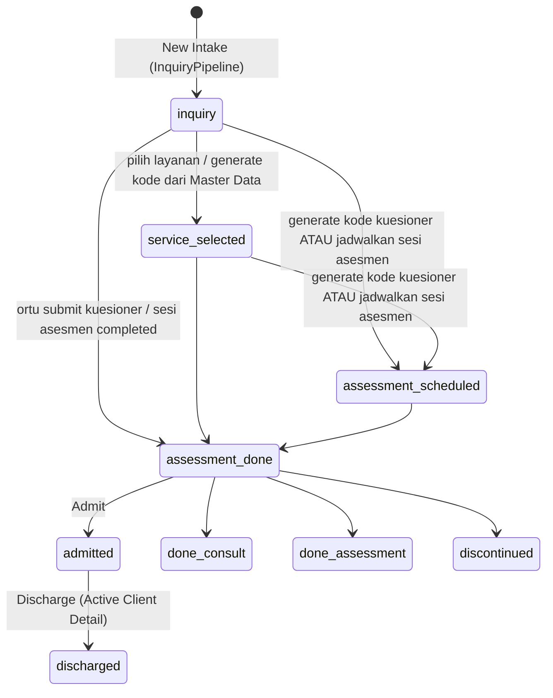

# 04 — Flow Inquiry, Pipeline & Asesmen

## Tujuan & role
Menerima calon client baru (intake), menggerakkannya melalui pipeline 8 tahap, menerbitkan kode kuesioner untuk orang tua, membaca hasil asesmen (skor kuadran sensori Winnie Dunn), lalu memutuskan outcome.
Role: **Admin Inquiry** (utama), Master, Manager (lihat), Terapis (lihat hasil asesmen), **Orang tua** (isi kuesioner publik).

## State machine status client

Catatan: urutan langkah **tidak dikunci**. Layanan, kode kuesioner, dan jadwal asesmen boleh diisi dalam urutan apa pun; status hanya melompat maju ke tahap tertinggi yang sudah tercapai (mis. langsung jadwalkan asesmen dari `inquiry` → `assessment_scheduled`). Tombol outcome (Admit / Done Consult / Done Assessment / Discontinue) di `OutcomeCard` **tidak dikunci** ke tahap tertentu, jadi bisa dipakai dari tahap mana pun. Transisi otomatis hanya **maju** lewat `advanceStatus(current, target)` di `domain/client.js` (urutan `PIPELINE_FLOW`; status hasil akhir tidak disentuh).

## Langkah per layar

### 1. New Intake: `/admin-inquiry/pipeline`
- Komponen: `features/inquiry/pages/InquiryPipeline.js` → board `pipeline/PipelineBoard.js`, kartu `pipeline/PipelineCard.js`, kolom dari `STAGE_COLUMNS` di `pipeline/pipelineConfig.js` (grup `main` dan `outcome`).
- Dialog New Intake → `handleCreateIntake`. Field wajib: nama anak (nama lengkap), DOB, nama ortu, WhatsApp, email. Opsional: **catatan intake** (`intakeNote`: keluhan utama, rujukan, dll; bisa diedit di `EditIntakeDialog`, tampil di `IntakeDataCard`, portal terapis, dan laporan cetak). Hasil asesmen memakai laporan sesi yang sama dengan terapi (`session_reports`), bukan catatan di client.
- Data: `makeInquiryClient(form)` → `addClient()`. Status `inquiry` dan `clientAccessCode = genCode("TDC")`.
- Pipeline **tidak** mendukung drag & drop. Status berubah lewat aksi di Client Detail.
- Filter & search disimpan di URL (`useUrlFilters`). Cabang mengikuti pola scoping (02).

### 2. Client Detail: `/admin-inquiry/pipeline/:id`
`features/inquiry/pages/ClientDetailInquiry.js` merangkai kartu-kartu di `features/inquiry/components/clientDetail/`:

| Step | Kartu | Handler → action | Efek data |
|---|---|---|---|
| 1 | `IntakeDataCard` + `EditIntakeDialog` | `handleSaveEditIntake` → `updateClient` | edit biodata |
| 2 | `ServiceSelectionCard` | `handleToggleService` → `updateClient` | `serviceTypes[]`, `serviceType`; `inquiry` → `service_selected` |
| 3 | `QuestionnaireCodeCard` | `handleGenerateQuestionnaireCode` → `updateClient`; hapus: `handleDeleteQuestionnaireCode` → `useQuestionnaireCodeActions.deleteCode` | tambah `{code: ASM-XXXX, categoryId, status: "issued"}` ke `assessmentCodes` (jadi `submitted` saat ortu mengisi); `inquiry/service_selected` → `assessment_scheduled`. Kode yang **belum diisi** bisa dihapus (konfirmasi; hanya tercatat di audit `assessment_code.deleted`, tanpa revert; status client tidak mundur). Kode yang sudah diisi tidak bisa dihapus (`isQuestionnaireCodeFilled`) |
| 4 | `AssessmentScheduleCard` | buka `features/schedule/components/calendar/AddScheduleModal` (type `assessment`) | `useSessionActions.createSessions` → sesi asesmen (tanpa kredit); `inquiry/service_selected` → `assessment_scheduled` (sama seperti step 3, salah satu cukup, urutan bebas) |
| 5 | `ParentAnswerCard` | link ke `/admin-inquiry/parent-assessment/:id` | baca jawaban |
| 6 | `GDriveLinkCard` | `handleSaveGDriveLink` → `updateClient` | `gdriveClientLink` |
| 7 | `InvoiceCard` | lihat invoice terakhir + `PaymentProofViewerModal` | read-only (invoice diterbitkan Finance, lihat 06) |
| 8 | `OutcomeCard` + `DiscontinueDialog` | `handleOutcomeAdmit` / `DoneConsult` / `DoneAssessment` / `Discontinue` | lihat bawah |

Outcome step 8 memakai hook use-case `useClientOutcomeActions()` (`features/inquiry/hooks/useClientOutcomeActions.js`): `admit`, `markDoneConsult`, `markDoneAssessment`, `discontinue`. Fase API = satu endpoint `POST /clients/{id}/transition`.

**Admit** (`admit`): `status=admitted`, `finalOutcome=admitted`, `dateOfJoin=today`. Jika belum ada record kredit → `addRecord(newCreditRecord({ id: "cr-<clientId>", … }))`. Client boleh di-admit dengan **0 kredit** (frozen) sampai Finance menambah paket.
**Discontinue**: alasan wajib diisi → `status=discontinued`, `dischargeReason="other"`, `dischargeNote=alasan`.

### 3. Isi kuesioner (ortu): `/assessment` (publik)
`features/assessment/pages/AssessmentFill.js`
1. Stage `code`: input kode → dicari di semua `clients[].assessmentCodes[].code` (case-insensitive) → ketemu client + kategori.
2. Stage `form`: render `sections[].questions[]` dari kategori. Tersedia progress bar dan tombol lompat ke pertanyaan belum diisi. Semua pertanyaan wajib diisi.
3. Submit (`handleSubmit`): setiap jawaban → `{questionId,itemNo,quadrant,domain,question,answer,score}`. `score` = angka di awal jawaban (`"4 - Sering"` → 4). Hasilnya disimpan ke `assessmentAnswers` (entry kategori yang sama di-replace). Status `inquiry/service_selected/assessment_scheduled` → `assessment_done`.
4. Stage `done`: tombol WhatsApp ke admin (pesan template `wa.me`).

### 4. Lihat hasil asesmen: `/admin-inquiry/parent-assessment/:id` (juga `/therapist/parent-assessment/:id`)
`features/assessment/pages/ParentAssessmentView.js` + `features/assessment/components/parentAssessment/*`
- `quadrantTotals`: jumlah `score` per kode kuadran (AV/SN/RG/SK, dari `MasterDataContext.quadrants`) → `QuadrantSummary`.
- Tampilan: `AssessorSheetView` (lembar evaluasi assessor), `ParentMatrixView`, `QuickInquiryView`, `ScoringLegend`, `SignatureBlock`, `DocumentHeader`. Halaman ini print-friendly (`print:` classes).

### 5. Sesi asesmen di kalender
Jika sesi `type=assessment` di-complete dari `SessionDetailModal`, status client `inquiry/service_selected/assessment_scheduled` otomatis menjadi `assessment_done` (lihat 05).

## Master data pendukung
| Route | Halaman | Isi |
|---|---|---|
| `/admin-inquiry/assessments` | `AssessmentMasterData.js` + `assessment/*` | CRUD kategori kuesioner, section, pertanyaan. 6 tipe soal di `assessment/assessmentConfig.js` (`QUESTION_TYPES`: `scale_0_5`, `range`, `multiple_choice`, `checkbox_multi`, `free_text`, `yes_no`). `GenerateCodeDialog` bisa menerbitkan kode untuk client mana pun (`inquiry` → `service_selected`) |
| `/admin-inquiry/master-data` | `InquiryMasterData.js` | CRUD layanan (`services`, bisa aktif/nonaktif), kuadran (`quadrants`), serta pilihan cepat **alasan cancel** & **alasan discharge** (`ReasonListTab`; user tetap bisa mengetik alasan sendiri di form) |

## Dashboard inquiry: `/admin-inquiry`
`DashboardInquiry.js` + `dashboard/*`: `KpiCards`, `TrendCharts`, `FunnelServiceCharts`, tab `AwaitingQuestionnaireTab` (kode sudah terbit tapi belum diisi, dengan tombol follow-up WA), `FilteredRosterTab`, `DiscontinuedTab`. Filter periode memakai `shared/lib/periods.js`.

## Aturan bisnis & edge case
- Satu client bisa punya **banyak layanan** dan **banyak kode kuesioner** (multi kategori).
- Submit ulang kuesioner kategori yang sama **menimpa** jawaban lama. Tidak ada riwayat versi.
- Kode `ASM-XXXX` dan `TDC-XXXX` dibuat dari 32 karakter tanpa `0/O/1/I`, dan **tidak dicek keunikannya** (lihat 11).
- Perubahan status tidak dicatat sebagai log. Backend nanti wajib menulis `inquiry_pipeline_logs`.

## File terkait
`frontend/src/features/inquiry/pages/`, `frontend/src/features/assessment/pages/AssessmentFill.js`, `frontend/src/stores/clientsStore.js`, `frontend/src/stores/assessmentsStore.js`, `frontend/src/stores/masterDataStore.js`, `frontend/src/domain/client.js` (`makeInquiryClient`, `advanceStatus`), `frontend/src/domain/status.js` (`STATUS_META`), `frontend/src/shared/lib/id.js` (`genCode`), `frontend/src/features/inquiry/hooks/useClientOutcomeActions.js`
