# 05 — Flow Penjadwalan, Sesi & Kredit

> Keputusan klien 3 Okt 2026 yang menyentuh dokumen ini sudah diimplementasi di frontend; register keputusan + status: [12-keputusan-klien.md](12-keputusan-klien.md).

## Tujuan & role
Mengelola timetable mingguan per terapis, membuat jadwal tunggal atau berulang, mendeteksi bentrok, dan memproses hasil sesi (selesai/batal/pindah) yang memengaruhi **kredit** client.
Role: **Admin Schedule** (utama), Master, dan **Manager** boleh mengubah status sesi karena punya akses modul `weekly_calendar` (hak aksi mengikuti akses modul RBAC, bukan daftar role; lihat 02). Finance (lihat bila diberi modul), Terapis (isi laporan sesi).

## Status sesi

```mermaid
stateDiagram-v2
  [*] --> scheduled: AddScheduleModal
  scheduled --> completed: Complete (therapy: −1 kredit)
  scheduled --> cancelled: Cancel (admin pilih potong kredit atau tidak)
  scheduled --> rescheduled: Reschedule (pindah slot, kredit tetap)
  scheduled --> reschedule_pending: Tandai menunggu jadwal pengganti
  rescheduled --> completed
  rescheduled --> cancelled
  rescheduled --> rescheduled: pindah lagi
  completed --> scheduled: Revert 1x (alasan wajib)
  cancelled --> scheduled: Revert 1x (kembali ke status sebelumnya)
  rescheduled --> scheduled: Revert 1x (ke jadwal asal; 2x reschedule = jadwal tersimpan terakhir)
  reschedule_pending --> scheduled: Revert 1x (jadwal asal)
  reschedule_pending --> rescheduled: dapat slot baru
  reschedule_pending --> cancelled: Drop (cancel; admin pilih potong kredit atau tidak)
```



## Layar

### Weekly Calendar: `/admin-schedule/calendar`
`features/schedule/pages/CalendarPage.js`
- Desktop: grid hari × jam (`features/schedule/components/calendar/WeeklyCalendar.js`, Senin–Sabtu, 08:00–17:00). Mobile: `features/schedule/components/calendar/DayAgenda.js`.
- Filter terapis, search client, toggle tampilkan client discharged, dan navigasi minggu.
- Klik slot kosong → `AddScheduleModal`. Klik chip sesi → `SessionDetailModal`.
- Chip berwarna sesuai status. Chip **Frozen** (ikon salju) muncul untuk sesi therapy `scheduled/rescheduled` milik client dengan sisa kredit 0.
- **Bulk action** (pilih banyak chip) lewat `useSessionActions`:
  - Complete → `bulkComplete(ids)`: aturan sama dengan complete tunggal (kredit therapy −1 per sesi, idempoten; asesmen memajukan pipeline).
  - Reschedule → `bulkReschedule(itemsMap)`: geser N hari / ke tanggal tertentu / ganti terapis; jejak `rescheduledFrom` memakai `getOriginSlot`.
  - Revert → `bulkRevert(ids, { reason })` (tombol Bulk Revert + `BulkRevertDialog`): membatalkan completed / cancelled / rescheduled / pending sekaligus dengan satu alasan wajib; aturan sama dengan revert tunggal (hanya 1x per sesi). Sesi status lain, yang sudah di-revert, dan yang slot-nya sudah terisi dilewati dan dilaporkan.
  - Cancel → `bulkCancel(ids, { mode, note, deductCredit })`: `mode` hanya menentukan alasan (`leave` = `izin_keluarga`, `other` = `lainnya`). Admin **wajib memilih** potong kredit atau tidak (berlaku untuk seluruh sesi terpilih; tanpa pilihan ditolak).
  - Bulk Reschedule melewati/menolak tanggal tujuan yang hari libur.

### Tambah jadwal: `features/schedule/components/calendar/AddScheduleModal.js`
- **Tanpa pilih service**: `serviceType` diturunkan dari layanan client (`getClientServiceIds`), tidak ada dropdown layanan (juga tidak per hari).
- Mode **single**: satu sesi. `type` = `assessment` (tanpa paket kredit) atau `therapy` (pakai `creditPackageId`). Pembuatan lewat `useSessionActions.createSessions`; sesi `assessment` otomatis memajukan client `inquiry/service_selected` → `assessment_scheduled`. **Tanggal libur** ditolak (toast + peringatan di bawah pemilih tanggal).
- Mode **multi-day pattern** (therapy saja): pilih hari (Senin–Sabtu). Tiap hari bisa punya jam, terapis, dan paket sendiri (`dayConfigs`). Jika recurring, berlaku N minggu (default 12).
  → `buildRecurringSchedules(base, weeks, selectedDays, dayConfigs, holidayDates)` di `domain/schedule.js` **melewati tanggal libur** (`holidayDateSet`, `domain/holiday.js`) → `addSchedules(list)`.
- **Conflict check**: `checkConflicts({...})` (`domain/schedule.js`). Tidak ada konsep jam kerja terapis: bentrok = terapis yang sama sudah handle client lain (overlap jam, tanggal sama; mengabaikan `cancelled` & `reschedule_pending`). Kalender mingguan menandai sesi bentrok (chip merah + ikon) lewat `findTherapistClashIds`. Pembuatan jadwal hanya **warning**; admin tetap bisa "Schedule Anyway".

### Detail sesi: `features/schedule/components/calendar/SessionDetailModal.js` (Sheet kanan)
Handler di komponen hanya validasi UI + toast; perubahan data lewat `useSessionActions()` (`features/schedule/hooks/useSessionActions.js`). Hak ubah status: `canManageSchedule(hasPermission)` = akses modul `weekly_calendar` (`domain/schedule.js`); hak **hapus** terpisah (`canDelete`, tombol `DeleteButton`).

| Aksi | Siapa | Use-case | Efek |
|---|---|---|---|
| Simpan laporan | semua yang membuka | `saveReport` | `buildReportPatch`: `activitySection`, `noteSection` (+`progressNote`), `homeworkSection`, `reportUpdatedAt` |
| Complete | akses `weekly_calendar` | `completeSession` | status `completed` + laporan. `therapy` → `spendPackageCredit()`. `assessment` → client `advanceStatus(…, "assessment_done")` |
| Cancel | akses `weekly_calendar` | `cancelSession(schedule, { cancelReason, note, deductCredit })` | status `cancelled` + `cancelReason` (string: pilihan cepat Master Data atau teks custom, wajib terisi). **`deductCredit` (boolean) wajib**: komponen `DeductCreditChoice` tanpa nilai awal (tombol konfirmasi nonaktif sampai admin memilih "Potong 1 kredit" / "Jangan potong kredit"); tanpa nilai, use-case melempar error. Mengembalikan `{ cancelCount, deducted, quotaExceeded }` untuk toast |
| Reschedule | akses `weekly_calendar` | `rescheduleSession` | wajib beda slot, **tidak boleh bentrok** dan **tidak boleh di tanggal libur** (diblokir komponen) → status `rescheduled`, `rescheduledFrom` (jadwal asal pertama), `rescheduledPrev` (slot tepat sebelum pemindahan ini), `revertedAt = null`. Netral kredit |
| Tandai pending | akses `weekly_calendar` | `markPending` | status `reschedule_pending` + `pendingFrom/At/Reason/Note`, `previousStatus`. Netral kredit |
| Drop pending | akses `weekly_calendar` | `dropPending(schedule, { note, deductCredit })` | = cancel sesi menggantung: status `cancelled`, `cancelReason = RESCHEDULE_DROPPED`; admin **wajib memilih** potong kredit atau tidak (dan masuk penghitung kuota paket) |
| Revert (completed/cancel/reschedule/pending) | akses `weekly_calendar` | `revertSession` (+ `previewRevert`) | **Hanya 1x**: `RevertSessionPanel` memblokir/menyembunyikan tombol bila `revertedAt` terisi (`canRevertSession`); transisi baru mengosongkan `revertedAt`. Completed/cancel: status kembali ke `previousStatus`; diblokir bila slot sudah terisi. **Reschedule**: kembali ke `rescheduledPrev` (reschedule 1x = jadwal asal berstatus `scheduled`; sudah 2x = jadwal tersimpan terakhir, tetap `rescheduled`). **Pending**: kembali ke status sebelumnya di jadwal asal. Kredit: baris `reversal` di history (`applySessionReverted`), kuota paket dikoreksi; asesmen completed mengembalikan tahap client. Kredit dibalik lewat baris `reversal` di ledger; status client otomatis dipulihkan dari `clientStatusFrom` pada sesi asesmen |
| Hapus sesi | role `canDelete` + akses modul | `deleteSession` | soft delete (`deletedAt/deletedBy`); sesi `completed` harus di-revert dulu. Pelaku di `deletedBy` |

## Aturan kredit (`frontend/src/domain/credit.js`, dipakai reducer `stores/creditsStore.js`)
| Fungsi domain (aksi reducer) | Kapan | Aturan |
|---|---|---|
| `applySessionCompleted` (`SPEND_PACKAGE_CREDIT`) | therapy completed | Pakai paket `creditPackageId`. Fallback ke paket pertama yang masih bersisa. −1 (min 0). Status paket `depleted` saat 0. **Idempoten**: dilewati jika `history` sudah punya `used` untuk `scheduleId` yang sama. Jika tidak ada paket bersisa → tidak terjadi apa-apa |
| `applySessionCancelled` (`HANDLE_CANCELLATION`) | cancel / drop pending / bulk cancel | `cancelCount` **paket target** += 1 (kuota 3 per paket, hanya penghitung). `deductCredit = true` (dan saldo paket > 0) → `cancel_penalty` −1 kredit; selain itu `cancel_excused` (kredit utuh). Tanpa paket / saldo 0 → `cancel_excused` |
| `applySessionReverted` (`REVERT_SESSION_CREDIT`) | revert completed / cancel | Membalik mutasi sesi yang belum dibalik: `used` → +1 kredit; `cancel_penalty` → +1 kredit & `cancelCount` paket −1; `cancel_excused` → `cancelCount` paket −1. Baris lama tidak diubah; ditambah baris `reversal` (`reversesId`). Satu baris hanya bisa dibalik sekali. Complete lagi sesudahnya membuat baris `used` baru (`findLiveSessionEntry`) |
| (tidak dipanggil) | reschedule / tandai pending | kredit dan kuota tidak berubah |

- Kuota cancel = **`CANCEL_QUOTA` = 3 per paket** (`packages[].cancelCount`). Ringkasan UI: `summarizeCreditRecord` → `cancelCount` / `cancelQuota` dari paket yang sedang dipakai (`activePackageOf`). **Hanya penghitung**: setelah kuota lewat UI memberi peringatan, potong kredit tetap keputusan admin di tiap cancel.
- **Frozen**: total `remainingCredit` = 0. Sesi tetap bisa dibuat (tidak diblokir), tetapi ditandai di kalender dan detail client. Kredit ditambah lewat Finance (06).
- Backend: `POST /schedules/{id}/revert`, reversal ledger — lihat `schema.md` §06.2–§06.3.
- Semua aturan di atas ber-test: `frontend/src/domain/__tests__/credit.test.js`, regresi hook di `features/schedule/__tests__/useSessionActions.test.js`.

## Active Clients: `/admin-schedule/clients`
`features/schedule/pages/ActiveClients.js`
- Tab `roster` (**Client Roster**) berisi client `admitted` **plus** `discharged` dan `discontinued`, dengan filter **status client** (Semua/Active/Discharged/Discontinued; param URL `status`), cabang, status kredit, dan search. Client discharged/discontinued punya tombol **Aktifkan** (juga di detail): konfirmasi → `useClientOutcomeActions().reactivate` → kembali `admitted`. Tombol Sesi/Jadwalkan/Discharge hanya untuk client active. Birthday & analytics tetap hanya client active (`isActiveClient`).
- Tab `birthday` berisi client yang berulang tahun di bulan terpilih, dengan tombol ucapan WA.
- Tab `analytics` → `features/schedule/components/analytics/ClientAnalyticsTab.js` (lazy).
- Detail `/admin-schedule/clients/:id` → `ActiveClientDetail.js` (halaman profile client): progres kredit per paket (`CreditBar`), **Jadwal Rutin Mingguan** (recurring; `deriveRecurringRoutines` di `domain/schedule.js`: pola hari + jam + terapis dari sesi aktif mendatang yang bertanda recurring atau berulang ≥2x), di bawahnya **Jadwal Aktif di Kalender** (`upcomingActiveSessions`: sesi mendatang scheduled / rescheduled / pending, klik untuk detail), riwayat sesi, history kredit, **Discharge** (`handleDischarge`: wajib pilih alasan lewat `ReasonPicker` → `status=discharged`, `dateOfDischarge=today`), dan tombol **Hapus Client** (hanya role `canDelete`, soft delete + sesi & invoice ikut disembunyikan).
- Tab **Advanced Analytics** (`ClientAnalyticsTab`): filter periode sesi termasuk **Rentang Kustom** (pilih tanggal awal–akhir, `makePeriodMatcher("custom", start, end)`).
- Pencarian client: awal nama anak / awal nama ortu / awal kode client (`matchesClientSearch` di `domain/client.js`).

## Hari libur: `/admin-schedule/holidays` (modul `holidays`)
`features/schedule/pages/Holidays.js`, store `stores/holidaysStore.js` (key `holidays`), domain `domain/holiday.js`. Tambah libur (tanggal, nama, semua cabang atau satu cabang; non-master terkunci ke cabangnya) dan hapus (tombol hanya untuk `canDelete`, hard delete). Efek: jadwal berulang melewati tanggal itu; pembuatan sesi, reschedule, dan bulk reschedule di tanggal itu ditolak. Menambah libur **tidak** mengubah sesi yang sudah ada (halaman menampilkan jumlah sesi terdampak untuk diatur manual).

## Monitoring laporan sesi: `/admin-schedule/unreported-reports` (modul `unreported_reports`)
`features/schedule/pages/UnreportedSessions.js`: semua sesi `completed` yang ketiga bagian laporannya kosong (`isUnreportedSession`), filter cabang/terapis/rentang tanggal/pencarian client, ringkasan per terapis, dan tombol "Buka Sesi" (`SessionDetailModal`). Untuk dipantau manager. Backend: view `v_unreported_sessions`.

## Schedule Dashboard: `/admin-schedule`
`DashboardSchedule.js`: KPI client aktif, chart status sesi per bulan, daftar kredit rendah/habis, ulang tahun, dan pie alasan discharge. Mengikuti scoping cabang dan `shared/lib/periods.js`.

## Orkestrasi lintas store (hook use-case)
Store tidak saling memanggil. Rangkaian lintas store ada di `useSessionActions`:
```
completeSession():  updateSchedule(...)  →  spendPackageCredit(...)  →  updateClient(... advanceStatus → assessment_done)
cancelSession():    updateSchedule(...)  →  handleScheduleCancellation({ deductCredit })
bulkComplete():     applyCompletionEffects(per sesi)  →  updateSchedulesMany(ids, completed)
```
`usePackageConversionActions` (finance, lihat 06) memakai pola yang sama: `convertPackage` (kredit) → `deleteSchedules` (semua jadwal terapi mendatang client) (pelaku di `deletedBy`; konversi tercatat di log invoice).
Saat migrasi API, setiap fungsi ini menjadi **satu request ke endpoint transaksional** (`ENDPOINTS.schedules.complete(id)` dst., lihat 10); komponen tidak berubah.

## File terkait
`frontend/src/features/schedule/` (pages, components/calendar, hooks/useSessionActions.js, index.js), `frontend/src/stores/schedulesStore.js`, `frontend/src/stores/creditsStore.js`, `frontend/src/domain/schedule.js`, `frontend/src/domain/credit.js`, `frontend/src/domain/client.js` (`DEFAULT_DISCHARGE_REASONS`, `advanceStatus`), `frontend/src/shared/components/ReasonPicker.js`