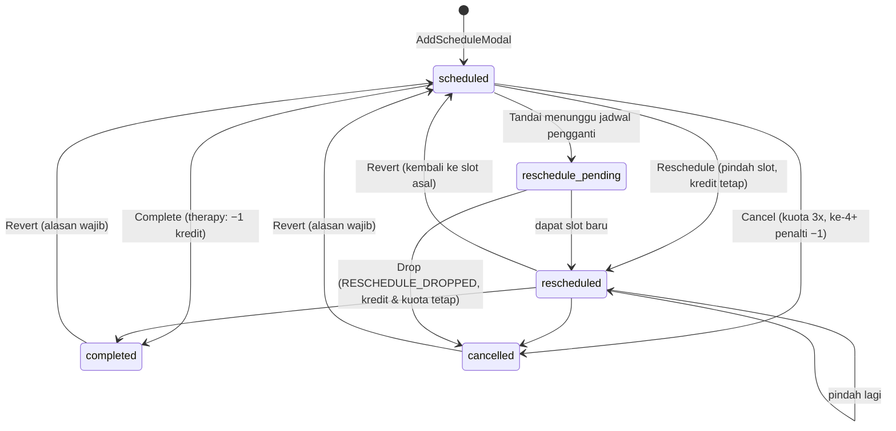

# 05 — Flow Penjadwalan, Sesi & Kredit

## Tujuan & role
Mengelola timetable mingguan per terapis, membuat jadwal tunggal atau berulang, mendeteksi bentrok, dan memproses hasil sesi (selesai/batal/pindah) yang memengaruhi **kredit** client.
Role: **Admin Schedule** (utama, satu-satunya yang boleh mengubah status sesi bersama Master), Manager & Finance (lihat), Terapis (isi laporan sesi).

## Status sesi



## Layar

### Weekly Calendar: `/admin-schedule/calendar`
`features/schedule/pages/CalendarPage.js`
- Desktop: grid hari × jam (`features/schedule/components/calendar/WeeklyCalendar.js`, Senin–Sabtu, 08:00–17:00). Mobile: `features/schedule/components/calendar/DayAgenda.js`.
- Filter terapis, search client, toggle tampilkan client discharged, dan navigasi minggu.
- Klik slot kosong → `AddScheduleModal`. Klik chip sesi → `SessionDetailModal`.
- Chip berwarna sesuai status. Chip **Frozen** (ikon salju) muncul untuk sesi therapy `scheduled/rescheduled` milik client dengan sisa kredit 0.
- **Bulk action** (pilih banyak chip) lewat `useSessionActions`:
  - Complete → `bulkComplete(ids)`: aturan sama dengan complete tunggal (kredit therapy −1 per sesi, idempoten; asesmen memajukan pipeline).
  - Reschedule → `bulkReschedule(itemsMap)`: geser N hari / ke tanggal tertentu / ganti terapis; jejak `rescheduledFrom` memakai `getOriginSlot`.
  - Revert → `bulkRevert(ids, { reason })` (tombol Bulk Revert + `BulkRevertDialog`): membatalkan completed / cancelled / rescheduled sekaligus dengan satu alasan wajib; aturan sama dengan revert tunggal. Sesi status lain dan sesi yang slot-nya sudah terisi dilewati dan dilaporkan; satu batch audit (`schedule.bulk_reverted`).
  - Cancel → `bulkCancel(ids, { mode })`: mode `leave` = masuk kuota cancel (alasan `izin_keluarga`, aturan sama dengan cancel tunggal); mode `other` = alasan `lainnya`, tanpa perubahan kredit/kuota.

### Tambah jadwal: `features/schedule/components/calendar/AddScheduleModal.js`
- Mode **single**: satu sesi. `type` = `assessment` (tanpa paket kredit) atau `therapy` (pakai `creditPackageId`). Pembuatan lewat `useSessionActions.createSessions`; sesi `assessment` otomatis memajukan client `inquiry/service_selected` → `assessment_scheduled` (audit `client.status_changed`).
- Mode **multi-day pattern** (therapy saja): pilih hari (Senin–Sabtu). Tiap hari bisa punya jam, terapis, type, dan paket sendiri (`dayConfigs`). Jika recurring, berlaku N minggu (default 12).
  → `buildRecurringSchedules(base, weeks, selectedDays, dayConfigs)` di `domain/schedule.js` → `addSchedules(list)`.
- **Conflict check**: `checkConflicts({...})` (`domain/schedule.js`). Tidak ada konsep jam kerja terapis: bentrok = terapis yang sama sudah handle client lain (overlap jam, tanggal sama; mengabaikan `cancelled` & `reschedule_pending`). Kalender mingguan menandai sesi bentrok (chip merah + ikon) lewat `findTherapistClashIds`. Pembuatan jadwal hanya **warning**; admin tetap bisa "Schedule Anyway".

### Detail sesi: `features/schedule/components/calendar/SessionDetailModal.js` (Sheet kanan)
Handler di komponen hanya validasi UI + toast; perubahan data lewat `useSessionActions()` (`features/schedule/hooks/useSessionActions.js`). Hak ubah status: `canManageSchedule(role)` = `master`, `admin_schedule`.

| Aksi | Siapa | Use-case | Efek |
|---|---|---|---|
| Simpan laporan | semua yang membuka | `saveReport` | `buildReportPatch`: `activitySection`, `noteSection` (+`progressNote`), `homeworkSection`, `reportUpdatedAt` |
| Complete | master, admin_schedule | `completeSession` | status `completed` + laporan. `therapy` → `spendPackageCredit()`. `assessment` → client `advanceStatus(…, "assessment_done")` |
| Cancel | master, admin_schedule | `cancelSession` | status `cancelled` + `cancelReason` (string: pilihan cepat Master Data atau teks custom, wajib terisi) → `handleScheduleCancellation()`; mengembalikan `{ cancelCount, penalized }` untuk toast |
| Reschedule | master, admin_schedule | `rescheduleSession` | wajib beda slot dan **tidak boleh bentrok** (dicek komponen, diblokir) → status `rescheduled` + `rescheduledFrom` |
| Tandai pending | master, admin_schedule | `markPending` | status `reschedule_pending` + `pendingFrom/At/Reason/Note`. Kredit tidak berubah |
| Drop pending | master, admin_schedule | `dropPending` | status `cancelled`, `cancelReason = RESCHEDULE_DROPPED`. **Tidak** memanggil credits, sehingga netral (`isCreditNeutralCancel`) |
| Revert (batalkan completed/cancel/reschedule) | master, admin_schedule | `revertSession` (+ `previewRevert` untuk pratinjau) | UI: `RevertSessionPanel` di bawah detail sesi `completed`/`cancelled`. Alasan wajib. Completed/cancel: status kembali ke `previousStatus` (fallback `scheduled`/`rescheduled`); diblokir bila slot sudah terisi. **Reschedule**: jadwal kembali ke slot & terapis asal (`rescheduledFrom`), status `scheduled`, jejak dihapus, tanpa efek kredit (audit `schedule.reschedule_reverted`). Kredit: baris `reversal` di history (`applySessionReverted`), kuota cancel dikoreksi; asesmen completed mengembalikan tahap client. Audit `schedule.completion_reverted` / `cancellation_reverted` + `credit.reversed`, `revertsAuditId` menunjuk log asal |

## Aturan kredit (`frontend/src/domain/credit.js`, dipakai reducer `stores/creditsStore.js`)
| Fungsi domain (aksi reducer) | Kapan | Aturan |
|---|---|---|
| `applySessionCompleted` (`SPEND_PACKAGE_CREDIT`) | therapy completed | Pakai paket `creditPackageId`. Fallback ke paket pertama yang masih bersisa. −1 (min 0). Status paket `depleted` saat 0. **Idempoten**: dilewati jika `history` sudah punya `used` untuk `scheduleId` yang sama. Jika tidak ada paket bersisa → tidak terjadi apa-apa |
| `applySessionCancelled` (`HANDLE_CANCELLATION`) | cancel biasa | `cancelCountTotal += 1`. Cancel ke-1..`CANCEL_QUOTA` (3) → `cancel_excused` (kredit utuh). Selebihnya → `cancel_penalty` −1 kredit |
| `applySessionReverted` (`REVERT_SESSION_CREDIT`) | revert completed / cancel | Membalik mutasi sesi yang belum dibalik: `used` → +1 kredit; `cancel_penalty` → +1 kredit & kuota −1; `cancel_excused` → kuota −1. Baris lama tidak diubah; ditambah baris `reversal` (`reversesId`). Satu baris hanya bisa dibalik sekali. Complete lagi sesudahnya membuat baris `used` baru (`findLiveSessionEntry`) |
| (tidak dipanggil) | drop pending / reschedule / bulk cancel `other` | kredit dan kuota tidak berubah |

- Kuota cancel (`leaveQuota`) = **`CANCEL_QUOTA` = 3**, dihitung **per client sepanjang masa** (`cancelCountTotal`), bukan per paket atau per periode.
- **Frozen**: total `remainingCredit` = 0. Sesi tetap bisa dibuat (tidak diblokir), tetapi ditandai di kalender dan detail client. Kredit ditambah lewat Finance (06).
- Aksi "batalkan completed/cancel" (revert) tersedia di UI (tabel aksi di atas). Backend: `POST /schedules/{id}/revert`, reversal ledger + audit — lihat `schema.md` §06.3.
- Semua aturan di atas ber-test: `frontend/src/domain/__tests__/credit.test.js`, regresi hook di `features/schedule/__tests__/useSessionActions.test.js`.

## Active Clients: `/admin-schedule/clients`
`features/schedule/pages/ActiveClients.js`
- Tab `roster` berisi client `admitted`, dengan filter cabang/status kredit dan search.
- Tab `birthday` berisi client yang berulang tahun di bulan terpilih, dengan tombol ucapan WA.
- Tab `analytics` → `features/schedule/components/analytics/ClientAnalyticsTab.js` (lazy).
- Detail `/admin-schedule/clients/:id` → `ActiveClientDetail.js`: progres kredit per paket (`CreditBar`), riwayat sesi, history kredit, dan **Discharge** (`handleDischarge`: wajib pilih alasan (pilihan cepat dari Master Data **atau** ketik sendiri lewat `ReasonPicker`) → `status=discharged`, `dateOfDischarge=today`).

## Schedule Dashboard: `/admin-schedule`
`DashboardSchedule.js`: KPI client aktif, chart status sesi per bulan, daftar kredit rendah/habis, ulang tahun, dan pie alasan discharge. Mengikuti scoping cabang dan `shared/lib/periods.js`.

## Orkestrasi lintas store (hook use-case)
Store tidak saling memanggil. Rangkaian lintas store ada di `useSessionActions`:
```
completeSession():  updateSchedule(...)  →  spendPackageCredit(...)  →  updateClient(... advanceStatus → assessment_done)
cancelSession():    updateSchedule(...)  →  handleScheduleCancellation(...)
bulkComplete():     applyCompletionEffects(per sesi)  →  updateSchedulesMany(ids, completed)
```
Saat migrasi API, setiap fungsi ini menjadi **satu request ke endpoint transaksional** (`ENDPOINTS.schedules.complete(id)` dst., lihat 10); komponen tidak berubah.

## File terkait
`frontend/src/features/schedule/` (pages, components/calendar, hooks/useSessionActions.js, index.js), `frontend/src/stores/schedulesStore.js`, `frontend/src/stores/creditsStore.js`, `frontend/src/domain/schedule.js`, `frontend/src/domain/credit.js`, `frontend/src/domain/client.js` (`DEFAULT_DISCHARGE_REASONS`, `advanceStatus`), `frontend/src/shared/components/ReasonPicker.js`