# 05 — Flow Penjadwalan, Sesi & Kredit

> Keputusan klien 3 Okt 2026 yang menyentuh dokumen ini sudah diimplementasi di frontend; register keputusan + status: [12-keputusan-klien.md](12-keputusan-klien.md).

## Tujuan & role
Mengelola timetable mingguan per terapis, membuat jadwal tunggal atau berulang, mendeteksi bentrok, dan memproses hasil sesi (selesai/batal/pindah) yang memengaruhi **kredit** client.
Role: **Admin Schedule** (utama), Master, dan **Manager** boleh mengubah status sesi karena punya akses modul `weekly_calendar` (hak aksi mengikuti akses modul RBAC, bukan daftar role; lihat 02). Finance (lihat bila diberi modul), Terapis (isi laporan sesi).

## Status sesi

```mermaid
stateDiagram-v2
  [*] --> scheduled: AddScheduleModal
  scheduled --> completed: Complete (therapy: −1 kredit)
  scheduled --> cancelled: Cancel / Off (satu aksi; alasan dari satu daftar; admin pilih potong kredit atau tidak)
  scheduled --> rescheduled: Reschedule (pindah slot, kredit tetap)
  scheduled --> reschedule_pending: Tandai menunggu jadwal pengganti
  rescheduled --> completed
  rescheduled --> cancelled
  rescheduled --> rescheduled: pindah lagi
  completed --> scheduled: Revert 1x (alasan wajib)
  cancelled --> scheduled: Revert 1x (kembali ke status sebelumnya)
  rescheduled --> scheduled: Revert 1x (ke jadwal asal; 2x reschedule = jadwal tersimpan terakhir)
  reschedule_pending --> scheduled: Revert 1x (jadwal asal)
  reschedule_pending --> rescheduled: dapat slot baru
  reschedule_pending --> cancelled: Drop (cancel; admin pilih potong kredit atau tidak)
```



## Layar

### Weekly Calendar: `/admin-schedule/calendar`
`features/schedule/pages/CalendarPage.js`
- Desktop: grid hari × jam (`features/schedule/components/calendar/WeeklyCalendar.js`, Senin–Sabtu, 08:00–17:00). Mobile: `features/schedule/components/calendar/DayAgenda.js`.
- Filter terapis, search client, toggle tampilkan client discharged, dan navigasi minggu.
- Klik slot kosong → `AddScheduleModal`. Klik chip sesi → `SessionDetailModal`.
- Chip berwarna sesuai status. Chip **Frozen** (ikon salju) muncul untuk sesi therapy `scheduled/rescheduled` milik client dengan sisa kredit 0.
- **Bulk action** (pilih banyak chip) lewat `useSessionActions`:
  - Complete → `bulkComplete(ids)`: aturan sama dengan complete tunggal (kredit therapy −1 per sesi, idempoten; asesmen memajukan pipeline).
  - Reschedule → `bulkReschedule(rows)` + `BulkRescheduleDialog`: **tujuan per sesi** (tanggal, jam mulai/selesai, terapis per baris; isi cepat "geser N hari / satu tanggal / satu terapis" hanya mengisi baris). **Atomik**: `planBulkReschedule` (`domain/schedule.js`) mengecek tiap baris terhadap jadwal lain, sesama baris dalam batch, dan hari libur; bila ada satu saja bermasalah (bentrok, libur, belum berubah, jam terbalik) tombol Simpan nonaktif dan hook mengembalikan `{ ok:false, issues }` tanpa menyimpan apa pun. Slot asal yang ditinggalkan sesi lain dalam batch boleh dipakai. Jejak `rescheduledFrom` memakai `getOriginSlot`. Reschedule Pending tidak tersedia di jalur massal (lakukan per sesi).
  - Revert → `bulkRevert(ids, { reason })` (tombol Bulk Revert + `BulkRevertDialog`): membatalkan completed / cancelled / rescheduled / pending sekaligus dengan satu alasan wajib; aturan sama dengan revert tunggal (hanya 1x per sesi). Sesi status lain, yang sudah di-revert, dan yang slot-nya sudah terisi dilewati dan dilaporkan.
  - Cancel → `bulkCancel(ids, { mode, note, deductCredit })`: `mode` hanya menentukan alasan (`leave` = `izin_keluarga`, `other` = `lainnya`). Admin **wajib memilih** potong kredit atau tidak (berlaku untuk seluruh sesi terpilih; tanpa pilihan ditolak).

### Tambah jadwal: `features/schedule/components/calendar/AddScheduleModal.js`
- **Tanpa pilih service**: `serviceType` diturunkan dari layanan client (`getClientServiceIds`), tidak ada dropdown layanan (juga tidak per hari).
- Mode **single**: satu sesi. `type` = `assessment` (tanpa paket kredit) atau `therapy` (pakai `creditPackageId`). Pembuatan lewat `useSessionActions.createSessions`; sesi `assessment` otomatis memajukan client `inquiry/service_selected` → `assessment_scheduled`. **Tanggal libur** ditolak (toast + peringatan di bawah pemilih tanggal).
- Mode **multi-day pattern** (therapy saja): pilih hari (Senin–Sabtu). Tiap hari bisa punya jam, terapis, dan paket sendiri (`dayConfigs`). Jika recurring, berlaku N minggu (default 12).
  → `buildRecurringSchedules(base, weeks, selectedDays, dayConfigs, holidayDates)` di `domain/schedule.js` **melewati tanggal libur** (`holidayDateSet`, `domain/holiday.js`) → `addSchedules(list)`.
- **Client sedang cuti (log cuti Finance, 06)**: mode single, sesi terapi di tanggal cuti → panel peringatan ungu (`add-schedule-leave-panel`) dan **jadwal aktif DIBLOKIR** (tombol Confirm nonaktif, submit ditolak dengan toast). Finance harus **menyelesaikan cuti lebih awal** dulu (tab Cuti → Akhiri Lebih Awal / Void), baru admin bisa menambah jadwalnya. Tidak ada pilihan membatalkan-sebagai-cuti dari sini. Jadwal **berulang** dan **Ganti Jadwal Rutin** tidak bertanya: tanggal cuti **dilewati otomatis** seperti hari libur (`clientLeaveDateSet`, `domain/leave.js`), dengan toast jumlah tanggal yang dilewati. Sesi asesmen tidak terpengaruh.
- **Conflict check**: `checkConflicts({...})` (`domain/schedule.js`). Jam kerja per hari tidak ada (hanya angka maks sesi per bulan untuk utilisasi, tidak memblokir): bentrok = terapis yang sama sudah handle client lain (overlap jam, tanggal sama; mengabaikan `cancelled` & `reschedule_pending`). Kalender mingguan menandai sesi bentrok (chip merah + ikon) lewat `findTherapistClashIds`. Pembuatan jadwal hanya **warning**; admin tetap bisa "Schedule Anyway".

### Detail sesi: `features/schedule/components/calendar/SessionDetailModal.js` (Sheet kanan)
Handler di komponen hanya validasi UI + toast; perubahan data lewat `useSessionActions()` (`features/schedule/hooks/useSessionActions.js`). Hak ubah status: `canManageSchedule(hasPermission)` = akses modul `weekly_calendar` (`domain/schedule.js`); hak **hapus** terpisah (`canDelete`, tombol `DeleteButton`).

| Aksi | Siapa | Use-case | Efek |
|---|---|---|---|
| Simpan laporan | semua yang membuka | `saveReport` | `buildReportPatch`: `activitySection`, `noteSection` (+`progressNote`), `homeworkSection`, `reportUpdatedAt` |
| Complete | akses `weekly_calendar` | `completeSession` | status `completed` + laporan. `therapy` → `spendPackageCredit()`. `assessment` → client `advanceStatus(…, "assessment_done")` |
| Cancel / Off | akses `weekly_calendar` | `cancelSession(schedule, { cancelReason, note, deductCredit })` | **Cancel dan Off adalah SATU aksi** (revisi 7 Okt 2026; tombol *Cancel / Off Sesi*): status `cancelled` + `cancelReason` (string **CODE**: kode alasan dari **satu daftar** Master Data → tab *Alasan Cancel / Off* [OL, S, SCA, MCU, FM, TI, H, NS, atau kode buatan sendiri] atau teks custom, wajib terisi; form menampilkan `KODE - Nama`, tetapi yang dikirim/disimpan adalah KODE; riwayat & detail di semua modul menampilkan KODE, nama panjang hanya sebagai tooltip) + `cancelNote`. **`deductCredit` (boolean) wajib**: komponen `DeductCreditChoice` tanpa nilai awal; tanpa nilai, use-case melempar error. **Pilihan potong memakai CREDIT LEAVE paket dulu** (kredit sesi utuh; ledger `cancel_leave`); credit leave habis → memotong 1 kredit sesi (`cancel_penalty`); "Jangan potong" tidak memakai apa pun. Kuota cancel 3x per paket **diganti** credit leave per paket (diatur di master paket); pembatalan karena cuti Finance (`leaveId`) tidak memakai credit leave maupun kredit sesi (ia memotong jatah cuti 30 hari). Mengembalikan `{ cancelCount, deducted, quotaExceeded }`. Sesi cancelled tidak memakai slot terapis, bisa di-revert 1x. **Tidak ada lagi status/tombol Off, invoice cuti, atau "Hitung sebagai cuti"**: cuti hanya dicatat Finance (06) dan menampilkan badge **Cuti** di kalender |
| Reschedule | akses `weekly_calendar` | `rescheduleSession` | wajib beda slot, **tidak boleh bentrok** dan **tidak boleh di tanggal libur** (diblokir komponen) → status `rescheduled`, `rescheduledFrom` (jadwal asal pertama), `rescheduledPrev` (slot tepat sebelum pemindahan ini), `revertedAt = null`. Netral kredit |
| Tandai pending | akses `weekly_calendar` | `markPending` | status `reschedule_pending` + `pendingFrom/At/Reason/Note`, `previousStatus`. Netral kredit |
| Drop pending | akses `weekly_calendar` | `dropPending(schedule, { note, deductCredit })` | = cancel sesi menggantung: status `cancelled`, `cancelReason = RESCHEDULE_DROPPED` (code `RD`); admin **wajib memilih** potong kredit atau tidak (dan masuk penghitung kuota paket) |
| Revert (completed/cancel/reschedule/pending) | akses `weekly_calendar` | `revertSession` (+ `previewRevert`) | **Hanya 1x**: `RevertSessionPanel` memblokir/menyembunyikan tombol bila `revertedAt` terisi (`canRevertSession`); transisi baru mengosongkan `revertedAt`. Completed/cancel: status kembali ke `previousStatus`; diblokir bila slot sudah terisi. **Reschedule**: kembali ke `rescheduledPrev` (reschedule 1x = jadwal asal berstatus `scheduled`; sudah 2x = jadwal tersimpan terakhir, tetap `rescheduled`). **Pending**: kembali ke status sebelumnya di jadwal asal. Kredit: baris `reversal` di history (`applySessionReverted`), kuota paket dikoreksi; asesmen completed mengembalikan tahap client. Kredit dibalik lewat baris `reversal` di ledger; status client otomatis dipulihkan dari `clientStatusFrom` pada sesi asesmen |
| Hapus sesi | role `canDelete` + akses modul | `deleteSession` | hapus permanen (ADR 0005; laporan sesi ikut terhapus); sesi `completed` harus di-revert dulu agar kredit konsisten |

## Aturan kredit (`frontend/src/domain/credit.js`, dipakai reducer `stores/creditsStore.js`)
| Fungsi domain (aksi reducer) | Kapan | Aturan |
|---|---|---|
| `applySessionCompleted` (`SPEND_PACKAGE_CREDIT`) | therapy completed | Pakai paket `creditPackageId`. Fallback ke paket pertama yang masih bersisa. −1 (min 0). Status paket `depleted` saat 0. **Idempoten**: dilewati jika `history` sudah punya `used` untuk `scheduleId` yang sama. Jika tidak ada paket bersisa → tidak terjadi apa-apa |
| `applySessionCancelled` (`HANDLE_CANCELLATION`) | cancel / drop pending / bulk cancel | `cancelCount` **paket target** += 1 (kuota 3 per paket, hanya penghitung). `deductCredit = true` (dan saldo paket > 0) → `cancel_penalty` −1 kredit; selain itu `cancel_excused` (kredit utuh). Tanpa paket / saldo 0 → `cancel_excused` |
| `applySessionReverted` (`REVERT_SESSION_CREDIT`) | revert completed / cancel | Membalik mutasi sesi yang belum dibalik: `used` → +1 kredit; `cancel_penalty` → +1 kredit & `cancelCount` paket −1; `cancel_excused` → `cancelCount` paket −1. Baris lama tidak diubah; ditambah baris `reversal` (`reversesId`). Satu baris hanya bisa dibalik sekali. Complete lagi sesudahnya membuat baris `used` baru (`findLiveSessionEntry`) |
| (tidak dipanggil) | reschedule / tandai pending | kredit dan kuota tidak berubah |

- Kuota cancel = **`CANCEL_QUOTA` = 3 per paket** (`packages[].cancelCount`). Ringkasan UI: `summarizeCreditRecord` → `cancelCount` / `cancelQuota` dari paket yang sedang dipakai (`activePackageOf`). **Hanya penghitung**: setelah kuota lewat UI memberi peringatan, potong kredit tetap keputusan admin di tiap cancel.
- **Frozen**: total `remainingCredit` = 0. Sesi tetap bisa dibuat (tidak diblokir), tetapi ditandai di kalender dan detail client. Kredit ditambah lewat Finance (06).
- Backend: `POST /schedules/{id}/revert`, reversal ledger — lihat `schema.md` §06.2–§06.3.
- Semua aturan di atas ber-test: `frontend/src/domain/__tests__/credit.test.js`, regresi hook di `features/schedule/__tests__/useSessionActions.test.js`.

## Active Clients: `/admin-schedule/clients`
`features/schedule/pages/ActiveClients.js`
- **Tabel Performa Kehadiran (Advanced Analytics Active Client)** khusus kehadiran: Kehadiran %, Hadir (selesai), Tidak Hadir, dan Sesi Berikutnya. **Tidak hadir = hanya cancel yang memotong kredit** (baris ledger `cancel_penalty` yang belum dibalik; `isCreditedAbsence` di `domain/credit.js`); cancel tanpa potong kredit (`cancel_excused`) tidak dihitung. Kehadiran % = hadir ÷ (hadir + tidak hadir); KPI Tingkat Kehadiran memakai aturan yang sama (grafik tren "Batal" tetap menghitung semua cancel). Backend: dari `credit_ledger.action = 'cancel_penalty'` tanpa baris `reversal`. Tanpa kolom sisa paket per jenis (jenis paket bisa banyak), tanpa status kredit, dan tanpa perhitungan/peringatan kuota cancel (kuota cancel hanya di Client Roster, detail client, dan dialog cancel). KPI Utilisasi Kredit tetap di kartu atas; kartu KPI "Perlu Renewal" dan tabel Perlu Renewal sudah dihapus (daftar renewal sekarang di tab **Perlu Renewal** modul Finance, lihat 06). **Catatan sesi** (`historyNote`) juga tampil & bisa diubah di detail sesi (`SessionDetailModal`, dari kalender).
- **Kuota cancel dirinci per paket** (`cancelQuotaByPackage`, komponen `shared/components/CancelQuotaList.js`): kolom Riwayat Cancel di Client Roster, kartu riwayat sesi di detail client, detail client terapis, cetak laporan, dan tabel Analytics menampilkan satu baris per paket aktif ("Regular Therapist #1: 2/3 cancel", paket sejenis diberi nomor urut). Tidak ada lagi satu angka gabungan yang ambigu; peringatan "lewat kuota" muncul pada paket yang melewati 3x. Paket 0 sesi disembunyikan kecuali tidak ada paket bersisa (lalu paket terakhir).
- **Ganti / hapus jadwal rutin (recurring)**: tombol **Ganti Jadwal Rutin** di card Jadwal Rutin (detail client `/admin-schedule/clients/:id`) dan **Ganti Rutin** di setiap baris roster Active Client → `ClientRoutineDialog.js`. UI-nya sama dengan *Weekly Days & Flexible Time Pattern* di AddScheduleModal: tombol hari **Mon–Sat** (aktif/nonaktifkan hari) dan satu kartu per hari berisi **Start Time, End Time, Therapist, Paket Kredit** (pilihan paket sama: paket bersisa, atau paket terakhir bila Frozen). Admin bisa mengubah per hari, menghapus hari (ikon sampah / matikan chip), menambah hari lewat chip, mengganti hanya paket kredit (sesi lama diganti sesi baru berpaket baru), atau **Buat Baru (ganti semua)**, dengan `Berlaku mulai` (≥ hari ini) dan `Jumlah minggu` pola baru (bawaan = sampai sesi terjadwal terakhir, min 4). Saat simpan (`planRoutineChange` → `useSessionActions().replaceRoutine`): sesi lama pada pola yang berubah/dihapus dihapus lalu sesi pola baru dibuat (hari libur dilewati). Yang tersentuh **hanya sesi `scheduled` pada pola itu mulai tanggal berlaku**; completed / cancelled / off / rescheduled / reschedule_pending tidak diubah, kredit tidak berubah (sesi terjadwal belum memotong kredit). Bentrok terapis (dengan client lain atau antar sesi baru) memblokir simpan dan ditampilkan. Pola dikenali dari hari+jam+terapis (`routineKeyOf`), bukan id seri. Tiap kartu rutin menampilkan **masa berlaku seri** (`seriesPeriod`: sesi paling awal – paling akhir seri itu, semua status; **semua hari dalam satu seri berbagi tanggal mulai & akhir yang sama**) + jumlah sesi terjadwal tersisa. Sesi dari modal Tambah Jadwal (pola multi-hari) dan dari Ganti Jadwal Rutin membawa `seriesId` yang sama (= `schedules.series_id`); data lama/seed tanpa `seriesId` dianggap satu seri. Di backend masa berlaku = `schedule_series.starts_on`–`ends_on`. Tombol **hapus per kartu rutin** (`deleteRoutineSessions`; hanya role `canDelete`, modul `active_clients`) menghapus permanen sesi terjadwal pola itu mulai hari ini. Mengganti pola hanya butuh akses modul (bukan hak hapus).
- **Pilihan paket saat membuat jadwal** (single & recurring): hanya paket yang masih punya sisa (urutan FIFO); paket 0 sesi disembunyikan. Bila tidak ada paket bersisa sama sekali, hanya paket terakhir (0 sesi = Frozen) yang ditampilkan. Paket yang dipilih tersimpan di `creditPackageId` sesi, sehingga **kuota cancel (penalti) dan pemotongan kredit mengikuti paket itu**; sesi tanpa pilihan jatuh ke paket aktif tertua (`activePackageOf`).
- Kolom **Paket Kredit Aktif** di Client Roster hanya menampilkan paket yang masih punya sisa, digabung per jenis paket (`distinctActivePackages`): paket habis (0) disembunyikan dan paket sejenis tidak muncul dobel.
- Tab `roster` (**Client Roster**) berisi client `admitted` **plus** `discharged` dan `discontinued`, dengan filter **status client** (Semua/Active/Discharged/Discontinued; param URL `status`), cabang, status kredit, dan search. Client discharged/discontinued punya tombol **Aktifkan** (juga di detail): konfirmasi → `useClientOutcomeActions().reactivate` → kembali `admitted`. Tombol Sesi/Jadwalkan/Discharge hanya untuk client active. Birthday & analytics tetap hanya client active (`isActiveClient`).
- Tab `birthday` berisi client yang berulang tahun di bulan terpilih, dengan tombol ucapan WA.
- Tab `analytics` → `features/schedule/components/analytics/ClientAnalyticsTab.js` (lazy).
- Detail `/admin-schedule/clients/:id` → `ActiveClientDetail.js` (halaman profile client): progres kredit per paket (`CreditBar`), **Jadwal Rutin Mingguan** (recurring; `deriveRecurringRoutines` di `domain/schedule.js`: pola hari + jam + terapis dari sesi aktif mendatang yang bertanda recurring atau berulang ≥2x), di bawahnya **Jadwal Aktif di Kalender** (`upcomingActiveSessions`: sesi mendatang scheduled / rescheduled / pending, klik untuk detail), **Monitoring Laporan Sesi** per client (`ClientReportMonitoringCard`: sesi Completed yang laporannya belum diisi), riwayat sesi (kolom **Alasan Cancel** (CODE dari `cancelReason`, via `getCancelReasonCode`) + `cancelNote` dan kolom **Catatan** (`historyNote`) + kolom **Aksi** (rata tengah) berisi **Lihat Detail** + **Tambah/Ubah Catatan** (bisa ditimpa siapa pun lewat `SessionHistoryNoteDialog`)), history kredit, **Discharge** (`handleDischarge`: wajib pilih alasan lewat `ReasonPicker` → `status=discharged`, `dateOfDischarge=today`, jadwal aktif dihapus, sisa sesi hangus), tombol **Unduh PDF / Excel (.xlsx)** riwayat sesi (`LogExportButtons`, `shared/lib/logExport.js`), dan tombol **Hapus Client** (hanya role `canDelete`, hapus permanen + sesi, invoice, dan data kredit client ikut terhapus).
- Tab **Advanced Analytics** (`ClientAnalyticsTab`): filter periode sesi termasuk **Rentang Kustom** (pilih tanggal awal–akhir, `makePeriodMatcher("custom", start, end)`).
- Pencarian client: awal nama anak / awal nama ortu / awal kode client (`matchesClientSearch` di `domain/client.js`).

## Hari libur: `/admin-schedule/holidays` (modul `holidays`)
`features/schedule/pages/Holidays.js`, store `stores/holidaysStore.js` (key `holidays`), domain `domain/holiday.js`. Tambah libur (tanggal, nama, semua cabang atau satu cabang; non-master terkunci ke cabangnya). **Input boleh berentang** (Dari tanggal – Sampai tanggal, opsional): rentang diurai jadi satu baris libur per tanggal (`expandHolidayRange`, maks 366 hari; `validateHolidayRange` memvalidasi tiap tanggal) sehingga tabel `holidays` dan semua aturan di bawah tidak berubah; mengubah libur tetap per satu tanggal dan hapus (tombol hanya untuk `canDelete`, hard delete). Efek: jadwal berulang melewati tanggal itu; pembuatan sesi, reschedule, dan bulk reschedule di tanggal itu ditolak. Menetapkan libur (tambah, atau ubah tanggal/cabang) **membatalkan otomatis** semua sesi di tanggal & cakupan cabang itu yang masih aktif (`scheduled`, `reschedule_pending`), KECUALI `completed`, `cancelled`, `rescheduled` (`holidayAffectedSessions`, `domain/holiday.js`). Admin dikonfirmasi dulu ("N sesi akan dibatalkan") dan toast hasil menyebut jumlahnya. Pembatalan memakai alasan **H** (Holiday) + catatan "Hari libur: {nama}", **tanpa potong kredit/credit leave, tanpa menambah kuota cancel, tanpa baris ledger**. Use-case: `features/schedule/hooks/useHolidayActions.js` (store libur + jadwal). **Tanggal libur tertutup untuk jadwal apa pun**: kolom hari di kalender mingguan diberi penanda "Libur • nama" + arsir dan klik slot menampilkan penolakan (`holidays` prop `WeeklyCalendar`; libur semua cabang + cabang aktif); picker tanggal Add Schedule menonaktifkan tanggal libur (`DateFilterPicker isDateDisabled`); jadwal berulang & penggantian rutin melewati tanggal libur; reschedule/bulk reschedule ditolak; dan `useSessionActions.createSessions` membuang sesi di hari libur sebagai pagar terakhir (`skippedHoliday`). Menghapus libur tidak mengembalikan sesi (bisa direvert manual per sesi).

## Monitoring laporan sesi: `/admin-schedule/unreported-reports` (modul `unreported_reports`)
`features/schedule/pages/UnreportedSessions.js`: semua sesi `completed` yang ketiga bagian laporannya kosong (`isUnreportedSession`), filter cabang/terapis/rentang tanggal/pencarian client, ringkasan per terapis, dan tombol "Buka Sesi" (`SessionDetailModal`). Untuk dipantau manager. Backend: view `v_unreported_sessions`.

## Schedule Dashboard: `/admin-schedule`
`DashboardSchedule.js`: KPI client aktif, chart status sesi per bulan, daftar kredit rendah/habis, ulang tahun, dan pie alasan discharge. Mengikuti scoping cabang dan `shared/lib/periods.js`.

**Cancellation Rate & Therapist Off (10 Okt 2026)**: dua kartu di bawah KPI utama: *Cancellation Rate* (semua cancel ÷ total sesi pada filter) dan *Cancel karena Therapist Off* (bagian cancel yang kodenya ada di master Therapist Off ÷ total sesi). Cancel Therapist Off **tetap terhitung di Cancellation Rate keseluruhan** (hanya dipisahkan sebagai rincian); reschedule yang dilepas (`RD`) tetap netral/tidak dihitung. Panel analitik terfilter punya kartu *Therapist Off Rate* dengan aturan sama. Domain: `cancellationStats` / `isTherapistOffCancel` (`domain/schedule.js`, ber-test `cancellationStats.test.js`). **Master Therapist Off**: tab di Master Data Inquiry (`/admin-inquiry/master-data`, store `master_therapist_off_codes`, bawaan `TO` Therapist Off dan `TS` Therapist Sick), daftar ber-CODE terpisah dari Alasan Cancel / Off; kodenya otomatis menjadi pilihan di form Cancel / Off (`useMasterData().cancelReasons` = gabungan kedua daftar; `baseCancelReasons` = hanya daftar Cancel / Off) dan kode harus unik lintas kedua daftar. Sesi tetap menyimpan CODE biasa di `cancelReason`, jadi tidak ada kolom baru di sesi.

## Orkestrasi lintas store (hook use-case)
Store tidak saling memanggil. Rangkaian lintas store ada di `useSessionActions`:
```
completeSession():  updateSchedule(...)  →  spendPackageCredit(...)  →  updateClient(... advanceStatus → assessment_done)
cancelSession():    updateSchedule(...)  →  handleScheduleCancellation({ deductCredit })
bulkComplete():     applyCompletionEffects(per sesi)  →  updateSchedulesMany(ids, completed)
```
`usePackageConversionActions` (finance, lihat 06) memakai pola yang sama: `convertPackage` (kredit) → `deleteSchedules` (semua jadwal terapi mendatang client) (dihapus permanen; konversi tercatat di log invoice).
Saat migrasi API, setiap fungsi ini menjadi **satu request ke endpoint transaksional** (`ENDPOINTS.schedules.complete(id)` dst., lihat 10); komponen tidak berubah.

## File terkait
`frontend/src/features/schedule/` (pages, components/calendar, hooks/useSessionActions.js, index.js), `frontend/src/stores/schedulesStore.js`, `frontend/src/stores/creditsStore.js`, `frontend/src/domain/schedule.js`, `frontend/src/domain/credit.js`, `frontend/src/domain/client.js` (`DEFAULT_DISCHARGE_REASONS`, `advanceStatus`), `frontend/src/shared/components/ReasonPicker.js`

## Re-assessment, Utilisasi Terapis & Kalender Tim (revisi 7 Okt 2026)
- **Re-assessment client aktif** (`features/schedule/components/clientDetail/ReassessmentCard.js`, di `ActiveClientDetail` untuk client aktif; butuh akses modul schedule): *Terbitkan Kode Re-assessment* (jenis asesmen + layanan [paket `isAssessment`; bila belum ada yang diflag semua paket tampil] + masa berlaku) memanggil `useQuestionnaireCodeActions().issueCode` yang sama dengan Inquiry, sehingga **invoice assessment ikut terbit otomatis** (harga layanan). Status client tidak mundur (`advanceStatus` hanya maju). *Jadwalkan Asesmen* membuka `AddScheduleModal` terkunci `type = assessment`: **tidak memotong kredit** (hanya sesi `therapy` yang memanggil `spendPackageCredit`), sama seperti jadwal asesmen di Inquiry.
- **Kapasitas & Utilisasi Terapis** (`/admin-schedule/therapist-utilization`, modul RBAC `therapist_utilization`: master, manager, admin_schedule): yang diatur per terapis hanya **maksimal sesi per bulan** (= total jam kerja sebulan; 1 sesi = 1 jam; `therapists[].maxSessionsPerMonth`, bawaan 100; dialog *Atur Kapasitas*; `domain/workHours.js`) — bukan lagi jam kerja per hari. `domain/therapistUtilization.js` menurunkan per terapis dan cabang: **Utilization = jumlah jam sesi terjadwal (selain cancelled/reschedule_pending) ÷ kapasitas**, **Availability = sesi tersedia ÷ kapasitas**. **Kapasitas mengikuti filter periode**: Σ per bulan [maks sesi × hari kerja periode itu ÷ hari kerja bulan itu] (hari kerja = Senin–Sabtu non-libur cabang), jadi filter satu bulan penuh = tepat maks sesi sebulan, minggu/rentang kustom otomatis mengambil porsinya. Filter cabang + periode (`periodRange`). Tidak memblokir penjadwalan; semua angka diturunkan.
- **Kalender Tim Terapis** (`/therapist/team-calendar`, modul `therapist_module`, **read-only**; nama client tampil): tampilan **Hari** = SATU kalender berisi **semua terapis** cabang (kolom per terapis, baris per jam; `TeamDayGrid`); tampilan **Minggu** = **satu terapis** yang dipilih (`WeeklyCalendar`) agar tidak terlalu padat. Tanpa klik slot/sesi/isi laporan. Fitur *Cari Terapis Pengganti* dihapus (7 Okt 2026); terapis mencari pengganti langsung dari kalender tim.
- **Kode asesmen gratis** (Inquiry, Master Asesmen, Re-assessment): switch **Masuk invoice** (bawaan nyala) saat generate kode. Dimatikan untuk kode gratis (mis. *School Companion*): **tidak ada invoice assessment dan tidak ada form bayar** untuk ortu; kode ditandai `invoiceRequired: false` (badge *Gratis*) dan layanan/harga tidak wajib dipilih.
