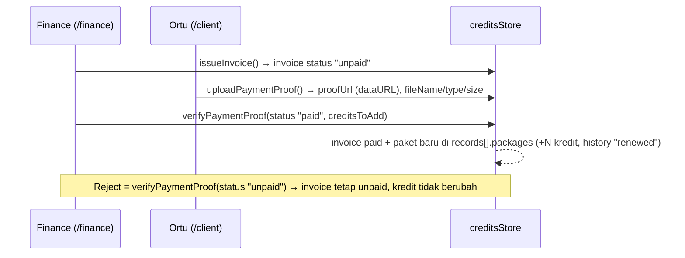

# 06 — Flow Finance (Invoice, Bukti Bayar, Renewal)

## Tujuan & role
Menerbitkan tagihan paket terapi, menerima bukti transfer dari orang tua, memverifikasinya, dan menambah kredit sesi client.
Role: **Finance** dan Master (`/finance`). **Orang tua** mengunggah bukti di `/client`. Admin Inquiry melihat invoice di Client Detail (read-only).

## Alur utama

Jalur pintas: **Renewal langsung** (`renewClientCredit`) membuat invoice `paid` dan paket kredit sekaligus, tanpa langkah upload/verifikasi. Dipakai untuk pembayaran yang sudah diterima di kasir.

## Layar: `/finance`
`features/finance/pages/FinancePortal.js` dengan 4 tab di `features/finance/components/`:

| Tab | Komponen | Isi / aksi |
|---|---|---|
| `verification` | `VerificationTab.js` | Antrean semua invoice yang belum `paid` (`pendingInvoices`, dengan atau tanpa bukti). Lihat bukti (`shared/components/PaymentProofViewerModal.js`, mendukung gambar/PDF), lalu Approve (`handleApprovePayment`) atau Reject (`handleRejectPayment`) |
| `billing` | `BillingTab.js` + `CreateInvoiceDialog.js` + `RenewalDialog.js` | Daftar invoice. Terbitkan invoice (`handleIssueSubmit` → `issueInvoice`). Renewal langsung (`handleRenewSubmit` → `renewClientCredit`) |
| `history` | `HistoryTab.js` | Gabungan semua `records[].history` dari semua client, diurutkan berdasarkan tanggal, dengan pagination 10 |
| `packages` | `PackagesTab.js` + `NewPackageDialog.js` | Master paket (`masterPackages`). Tambah paket (`addMasterPackage`). **Belum ada** edit/hapus |

## Upload bukti (ortu): `/client`
`features/parent/pages/ClientDashboard.js` → `handleUploadSubmit`
- Target: **invoice terbaru** client (`getInvoicesForClient(id)[0]`). Jika belum ada invoice → error toast.
- File diproses oleh `processProofFile()` di `shared/lib/fileUpload.js`: gambar dikompres (`compressImage`, maks 1600px, kualitas 0.82), PDF dibaca sebagai dataURL.
- Disimpan sebagai **dataURL di localStorage** (`proofUrl`). Ini batasan demo karena kuota storage terbatas. Di backend, file disimpan ke storage server (lihat 10).

## Aturan bisnis
- Nomor invoice: `nextInvoiceNumber(invoices)` di `domain/credit.js` → `INV-<tahun>-<urut 3 digit>`, urut = max(nomor terbesar tahun itu, jumlah invoice) + 1, sehingga tidak bentrok walau ada nomor yang lompat. Seed memakai `INV-yyyy-MM-xxx`.
- Kredit yang ditambah saat approve = `masterPackages[packageId].credits` (fallback 10).
- Setiap approve/renewal **menambah paket baru** (`newClientPackage` + `applyPackageAdded`) ke `records[].packages[]`, bukan menambah ke paket lama. Sisa kredit total = jumlah semua paket.
- Jika client belum punya record kredit, `VERIFY_PAYMENT_PROOF` maupun `RENEW_CREDIT` membuat record baru (`newCreditRecord`), jadi pembayaran yang disetujui selalu menghasilkan kredit.
- Status invoice di prototype hanya `unpaid` | `paid` (label di `STATUS_META`). Backend v2 memakai `unpaid → pending_verification → paid | rejected | void` (lihat `schema.md` 04-F & 08.2).
- Nama paket dinormalisasi via `formatPackageName` (legacy "Paket Reguler/VIP" → "Regular/Senior Therapist").

## Revenue
`features/master/pages/DashboardRevenue.js` (Master: `/master/revenue`, Manager: `/manager/revenue`) menghitung omzet dari `invoices` berstatus `paid` per cabang/periode (lihat 07).

## File terkait
`frontend/src/features/finance/pages/`, `frontend/src/stores/creditsStore.js`, `frontend/src/shared/lib/fileUpload.js`, `frontend/src/shared/components/PaymentProofViewerModal.js`, `frontend/src/features/parent/pages/ClientDashboard.js`
