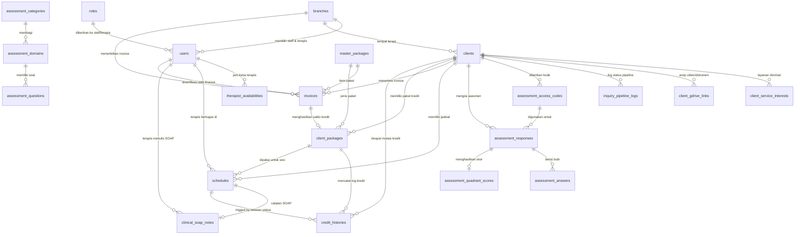

# DOKUMENTASI SKEMA DATABASE (DATABASE SCHEMA)
## ONE GATE INTEGRATED CLINIC SYSTEM — THERAPEDIA
### Standardized for Laravel 11.x RESTful Backend API & MySQL Database (Enterprise & Scalable Grade)

---

## 01. PENDAHULUAN & RINGKASAN EKSEKUTIF

Dokumen **`schema.md`** ini berisi rancangan arsitektur database relasional skala enterprise untuk **Therapedia Developmental Center**. Seluruh skema telah disesuaikan dengan standar konvensi **Laravel 11.x Eloquent ORM**, mencakup nama tabel (*snake_case plural*), primary key (`id` autoincrement / bigInteger), foreign key (`*_id`), penanggalan otomatis (`created_at`, `updated_at`), pencatatan penghapusan aman (`deleted_at` / soft deletes), serta **strategi komposit indeks untuk performa query berkecepatan tinggi**.

### 🔒 Pemisahan Otentikasi Eksekutif & Penyatuan Akun Internal:
1. **Tabel `users` (Satu Akun Terpadu Seluruh Staf Internal & Terapis):**
   - Menampung seluruh pengguna internal klinik (Super Admin, Branch Manager, Admin Inquiry, Admin Schedule, Finance, dan **Terapis**).
   - Profil klinis terapis (seperti `title`, `specialty`, dan `bio`) digabungkan secara efisien ke dalam tabel `users`.
   - Kolom `access_code` telah **dihapus sepenuhnya** dari `users`.
2. **Tabel `clients` (Akses Mandiri Orang Tua Pasien):**
   - Login orang tua dilakukan **langsung menggunakan `client_access_code` dari tabel `clients`** tanpa mencampuri tabel `users`. Pendekatan ini menghilangkan *table lock contention*, menjaga kebersihan *auth guard*, dan mempercepat performa autentikasi portal orang tua.
3. **Penjadwalan Terintegrasi Tanpa Manajerial Ruangan:** Penjadwalan terapi berfokus langsung pada ketersediaan **Staf Terapis (`users`), Pasien (`clients`), dan Saldo Kredit (`client_packages`)**.

---

## 02. MATRIKS MODUL & TABEL DATABASE

Berikut adalah peta distribusi 24 tabel database yang dikelompokkan ke dalam 8 modul utama sistem:

| No | Nama Tabel | Modul Utama Sistem | Deskripsi Singkat Fungsi Tabel |
| :---: | :--- | :--- | :--- |
| **1** | `branches` | Executive & Master Data | Master data lokasi cabang klinik Therapedia |
| **2** | `roles` | RBAC & Security | Master peran hak akses pengguna **Internal Klinik** |
| **3** | `users` | RBAC, Staff & Therapists | Akun pengguna internal (Admin, Finance, **Terapis & Profil Medis**) |
| **4** | `therapist_availabilities` | Scheduling & Capacity | Master jam & hari kerja operasional terapis (link ke `users`) |
| **5** | `clients` | Client Intake & Parent Auth | Master pasien anak **sekaligus Kredensial Login Ortu** |
| **6** | `client_service_interests` | Client Intake Pipeline | Daftar pilihan layanan klinis yang diminati anak |
| **7** | `client_gdrive_links` | Clinical Record Storage | Tautan arsip dokumen rujukan & video observasi GDrive |
| **8** | `inquiry_pipeline_logs` | Audit Intake Pipeline | Tracking riwayat perpindahan 8 tahap pipeline anak |
| **9** | `assessment_categories` | Clinical Assessment Engine | Kategori instrumen asesmen (Sensory Profile 2, dll) |
| **10** | `assessment_domains` | Clinical Assessment Engine | Domain sensori (Auditory, Visual, Touch, Movement, dll) |
| **11** | `assessment_questions` | Clinical Assessment Engine | Bank kuesioner dinamis (6 tipe pertanyaan) |
| **12** | `assessment_access_codes` | Clinical Assessment Engine | Kode unik akses publik kuesioner ortu/guru |
| **13** | `assessment_responses` | Clinical Assessment Engine | Header pengajuan jawaban kuesioner ortu |
| **14** | `assessment_answers` | Clinical Assessment Engine | Detail butir jawaban per soal kuesioner |
| **15** | `assessment_quadrant_scores`| Clinical Assessment Engine | Perhitungan otomatis skor 4 kuadran sensori Winnie Dunn |
| **16** | `schedules` | Timetable & Calendar Engine | Sesi kalender terapi/asesmen, status & proteksi zero-credit |
| **17** | `master_packages` | Finance & Pricing | Catalog harga & kuota paket terapi |
| **18** | `invoices` | Billing & Cashier Gateway | Transaksi tagihan, verifikasi bukti bayar transfer |
| **19** | `client_packages` | Credit & Renewal Management | Saldo kredit aktif milik anak & kuota cancel |
| **20** | `credit_histories` | Credit Ledger & Audit | Log mutasi penambahan/pemotongan kredit & penalti |
| **21** | `clinical_soap_notes` | Therapist Portal & EHR | Catatan rekam medis SOAP & Home Program terapis |
| **22** | `wa_templates` | WhatsApp Automation | Template pesan dinamis 6 skenario komunikasi WA |
| **23** | `wa_message_logs` | WhatsApp Automation | Log pengiriman notifikasi WhatsApp ke orang tua |
| **24** | `audit_trails` | System Security & Log | Log aktivitas sistem & perubahan data sensitif |

---

## 03. DIAGRAM HUBUNGAN ENTITAS (ERD)



---

## 04. SPESIFIKASI DETAIL SKEMA TABEL & COMPOSITE INDEXING

---

### MODUL 1: MASTER DATA, RBAC & USER MANAGEMENT (INTERNAL CLINIC STAFF & THERAPISTS)

#### 1. Tabel `branches`
Master lokasi cabang klinik Therapedia (Surabaya Timur, Citraland, Surabaya Barat).
- **Migration Schema (Laravel):**
```php
Schema::create('branches', function (Blueprint $table) {
    $table->id();
    $table->string('code', 20)->unique(); // EAST, CTL, WEST
    $table->string('name', 100); // East Center, Citraland, West Center
    $table->string('city', 50)->default('Surabaya');
    $table->text('address');
    $table->string('phone', 30);
    $table->string('manager_name', 100)->nullable();
    $table->timestamps();
    $table->softDeletes();
});
```

#### 2. Tabel `roles`
Master peran untuk matriks Hak Akses RBAC pengguna **internal klinik** (termasuk peran `therapist`).
- **Migration Schema (Laravel):**
```php
Schema::create('roles', function (Blueprint $table) {
    $table->id();
    $table->string('slug', 50)->unique(); // super_admin, branch_manager, admin_inquiry, admin_schedule, finance, therapist
    $table->string('name', 100); // Super Admin, Admin Intake, Tim Keuangan, Terapis Medis
    $table->text('description')->nullable();
    $table->timestamps();
});
```

#### 3. Tabel `users`
Akun terpadu pengguna **Internal Klinik** (Super Admin, Branch Manager, Admin Inquiry, Admin Schedule, Finance, **dan Terapis**). Menampung atribut spesialisasi klinis terapis secara efisien.
- **Migration Schema (Laravel):**
```php
Schema::create('users', function (Blueprint $table) {
    $table->id();
    $table->foreignId('branch_id')->nullable()->constrained('branches')->onDelete('set null');
    $table->foreignId('role_id')->constrained('roles')->onDelete('cascade');
    $table->string('name', 100);
    $table->string('email', 100)->unique();
    $table->string('username', 50)->unique();
    $table->string('password');
    $table->string('phone', 30)->nullable();
    
    // ATRIBUT KLINIS SPESIFIK TERAPIS (Nullable untuk Role Non-Terapis)
    $table->string('title', 50)->nullable(); // S.Tr.Kes, S.Ft, A.Md.OT, S.Psi
    $table->string('specialty', 150)->nullable(); // Pediatric Occupational Therapy, Sensory Integration
    $table->text('bio')->nullable();
    
    $table->boolean('is_active')->default(true);
    $table->rememberToken();
    $table->timestamps();
    $table->softDeletes();

    // High Performance Indexing
    $table->index(['branch_id', 'role_id', 'is_active']);
});
```

#### 4. Tabel `therapist_availabilities`
Master jam & hari kerja operasional terapis (berelasi langsung ke `user_id` di tabel `users`).
- **Migration Schema (Laravel):**
```php
Schema::create('therapist_availabilities', function (Blueprint $table) {
    $table->id();
    $table->foreignId('user_id')->constrained('users')->onDelete('cascade'); // ID User ber-role Terapis
    $table->enum('day_of_week', ['Monday', 'Tuesday', 'Wednesday', 'Thursday', 'Friday', 'Saturday', 'Sunday']);
    $table->time('start_time');
    $table->time('end_time');
    $table->timestamps();

    // Fast lookup for therapist schedule validation
    $table->index(['user_id', 'day_of_week']);
});
```

---

### MODUL 2: INTAKE PIPELINE & CLIENT MASTER (PARENT AUTHENTICATION ENTITY)

#### 5. Tabel `clients`
Data master anak & orang tua. **Bertindak sekaligus sebagai entitas kredensial otentikasi login Portal Orang Tua** menggunakan `client_access_code`.
- **Migration Schema (Laravel):**
```php
Schema::create('clients', function (Blueprint $table) {
    $table->id();
    $table->string('client_code', 30)->unique(); // CLI-2026-001
    $table->foreignId('branch_id')->constrained('branches')->onDelete('cascade');
    $table->string('child_name', 100);
    $table->string('child_nickname', 50)->nullable();
    $table->enum('gender', ['male', 'female']);
    $table->date('date_of_birth');
    $table->string('parent_name', 100);
    $table->string('parent_relationship', 50)->default('Mother'); // Mother, Father, Guardian
    $table->string('phone', 30); // WhatsApp Ortu
    $table->string('email', 100)->nullable();
    $table->text('address')->nullable();
    $table->string('emergency_contact', 100)->nullable();
    
    // Status Pipeline Intake & Klientel Pasien
    $table->enum('status', [
        'inquiry', 
        'assessment_scheduled', 
        'admitted', 
        'done_consult', 
        'done_assessment', 
        'discontinued', 
        'discharged'
    ])->default('inquiry')->index();
    
    $table->date('date_of_join')->nullable();
    $table->date('date_of_discharge')->nullable();
    $table->string('discharge_reason', 100)->nullable(); // Goal Achieved, Relocated, Financial, Discontinued
    $table->text('discharge_note')->nullable();
    
    // KREDENSIAL UTAMA AUTH ORANG TUA (Parent Portal Login)
    $table->string('client_access_code', 50)->unique()->index(); // e.g. "CL-8821" atau "PASIEN-KERT-09"
    $table->string('access_pin_hash', 255)->nullable(); // Optional: PIN Keamanan tambahan jika diperlukan
    $table->timestamp('last_login_at')->nullable();
    
    $table->timestamps();
    $table->softDeletes();

    // High Performance Composite Indexes
    $table->index(['branch_id', 'status']);
    $table->index(['client_access_code', 'status']); // Instant auth resolution
});
```

#### 6. Tabel `client_service_interests`
Layanan multidisiplin yang dibutuhkan oleh anak saat intake (OT, SI, TW, FT, School Companion, dll).
- **Migration Schema (Laravel):**
```php
Schema::create('client_service_interests', function (Blueprint $table) {
    $table->id();
    $table->foreignId('client_id')->constrained('clients')->onDelete('cascade');
    $table->string('service_type', 50); // OT, SI, TW, FT, BOT-A, FOT-A, School Companion
    $table->text('notes')->nullable();
    $table->timestamps();

    $table->index(['client_id', 'service_type']);
});
```

#### 7. Tabel `client_gdrive_links`
Tautan penyimpanan cloud (Google Drive) berisi rekaman video observasi & dokumen rujukan medis.
- **Migration Schema (Laravel):**
```php
Schema::create('client_gdrive_links', function (Blueprint $table) {
    $table->id();
    $table->foreignId('client_id')->constrained('clients')->onDelete('cascade');
    $table->string('title', 150);
    $table->text('url');
    $table->text('description')->nullable();
    $table->timestamps();
});
```

#### 8. Tabel `inquiry_pipeline_logs`
Audit log riwayat pergerakan anak pada Kanban / Pipeline 8 Tahap.
- **Migration Schema (Laravel):**
```php
Schema::create('inquiry_pipeline_logs', function (Blueprint $table) {
    $table->id();
    $table->foreignId('client_id')->constrained('clients')->onDelete('cascade');
    $table->string('previous_status', 50)->nullable();
    $table->string('new_status', 50);
    $table->foreignId('changed_by_user_id')->nullable()->constrained('users')->onDelete('set null');
    $table->text('notes')->nullable();
    $table->timestamps();
});
```

---

### MODUL 3: CLINICAL ASSESSMENT ENGINE (KUESIONER DINAMIS & KUADRAN SENSORI)

#### 9. Tabel `assessment_categories`
Master instrumen tes klinis (Sensory Profile 2 Winnie Dunn, Readiness School Test, dll).
- **Migration Schema (Laravel):**
```php
Schema::create('assessment_categories', function (Blueprint $table) {
    $table->id();
    $table->string('code', 50)->unique();
    $table->string('name', 150);
    $table->text('description')->nullable();
    $table->timestamps();
});
```

#### 10. Tabel `assessment_domains`
Pengelompokan domain sensori / aspek observasi klinis.
- **Migration Schema (Laravel):**
```php
Schema::create('assessment_domains', function (Blueprint $table) {
    $table->id();
    $table->foreignId('category_id')->constrained('assessment_categories')->onDelete('cascade');
    $table->string('code', 50);
    $table->string('name', 100);
    $table->text('description')->nullable();
    $table->timestamps();
});
```

#### 11. Tabel `assessment_questions`
Bank soal kuesioner dinamis mendukung 6 tipe pertanyaan.
- **Migration Schema (Laravel):**
```php
Schema::create('assessment_questions', function (Blueprint $table) {
    $table->id();
    $table->foreignId('domain_id')->constrained('assessment_domains')->onDelete('cascade');
    $table->text('question_text');
    $table->enum('question_type', [
        'likert_0_5',     // Skala Winnie Dunn (0: Tidak Berlaku s/d 5: Hampir Selalu)
        'likert_custom',  // Skala Angka Custom
        'single_choice',  // Pilihan Ganda
        'multi_choice',   // Pilihan Jamak
        'essay',          // Teks Bebas / Observasi Kualitatif
        'binary'          // Ya / Tidak
    ])->default('likert_0_5');
    $table->json('options_json')->nullable();
    $table->integer('order_index')->default(0);
    $table->timestamps();

    $table->index(['domain_id', 'order_index']);
});
```

#### 12. Tabel `assessment_access_codes`
Kode unik sekali pakai yang diberikan Admin ke Orang Tua / Guru untuk mengisi kuesioner tanpa perlu login.
- **Migration Schema (Laravel):**
```php
Schema::create('assessment_access_codes', function (Blueprint $table) {
    $table->id();
    $table->foreignId('client_id')->constrained('clients')->onDelete('cascade');
    $table->foreignId('category_id')->constrained('assessment_categories')->onDelete('cascade');
    $table->string('access_code', 50)->unique()->index();
    $table->boolean('is_used')->default(false);
    $table->timestamp('expires_at')->nullable();
    $table->timestamps();
});
```

#### 13. Tabel `assessment_responses`
Header pengajuan saat orang tua menyelesaikan kuesioner di portal publik (`/assessment`).
- **Migration Schema (Laravel):**
```php
Schema::create('assessment_responses', function (Blueprint $table) {
    $table->id();
    $table->foreignId('client_id')->constrained('clients')->onDelete('cascade');
    $table->foreignId('access_code_id')->constrained('assessment_access_codes')->onDelete('cascade');
    $table->string('filled_by_name', 100);
    $table->string('relationship', 50);
    $table->timestamp('submitted_at');
    $table->timestamps();
});
```

#### 14. Tabel `assessment_answers`
Rincian jawaban per butir soal kuesioner.
- **Migration Schema (Laravel):**
```php
Schema::create('assessment_answers', function (Blueprint $table) {
    $table->id();
    $table->foreignId('response_id')->constrained('assessment_responses')->onDelete('cascade');
    $table->foreignId('question_id')->constrained('assessment_questions')->onDelete('cascade');
    $table->integer('score')->nullable();
    $table->text('text_response')->nullable();
    $table->timestamps();
});
```

#### 15. Tabel `assessment_quadrant_scores`
Kalkulasi otomatis 4 kuadran sensori Winnie Dunn (Sensory Profile 2).
- **Migration Schema (Laravel):**
```php
Schema::create('assessment_quadrant_scores', function (Blueprint $table) {
    $table->id();
    $table->foreignId('response_id')->constrained('assessment_responses')->onDelete('cascade');
    $table->foreignId('client_id')->constrained('clients')->onDelete('cascade');
    
    $table->integer('low_registration_score')->default(0);
    $table->integer('sensation_seeking_score')->default(0);
    $table->integer('sensory_sensitivity_score')->default(0);
    $table->integer('sensation_avoiding_score')->default(0);
    
    $table->text('summary_evaluation')->nullable();
    $table->timestamps();
});
```

---

### MODUL 4: TIMETABLE & PENJADWALAN KALENDER OPERASIONAL (HIGH FREQUENCY LOOKUP)

#### 16. Tabel `schedules`
Tabel utama kalender mingguan. `therapist_user_id` berelasi langsung ke `users` (pengguna dengan role `therapist`).
- **Migration Schema (Laravel):**
```php
Schema::create('schedules', function (Blueprint $table) {
    $table->id();
    $table->foreignId('branch_id')->constrained('branches')->onDelete('cascade');
    $table->foreignId('client_id')->constrained('clients')->onDelete('cascade');
    $table->foreignId('therapist_user_id')->constrained('users')->onDelete('cascade'); // Link ke User Terapis
    $table->foreignId('client_package_id')->nullable()->constrained('client_packages')->onDelete('set null');
    
    $table->enum('schedule_type', ['therapy', 'assessment', 'consultation'])->default('therapy');
    $table->date('date'); // Tanggal pelaksanaan sesi
    $table->time('start_time');
    $table->time('end_time');
    
    // Status Sesi & Zero Credit Lock
    $table->enum('status', [
        'scheduled',   // Terjadwal Aktif
        'completed',   // Sesi Selesai (Memotong 1 Kredit)
        'cancelled',   // Dibatalkan (Izin/Sakit/Penalti)
        'rescheduled', // Dijadwal Ulang
        'frozen'       // SLOT BEKU: Saldo Kredit Pasien 0 (Proteksi Klinik)
    ])->default('scheduled');
    
    $table->boolean('is_recurring')->default(false);
    $table->string('recurrence_rule', 50)->nullable();
    
    $table->enum('cancel_reason', [
        'sakit', 
        'izin_keluarga', 
        'bentrok_sekolah', 
        'tanpa_kabar', // Memotong Penalti 1 Kredit!
        'internal_clinic'
    ])->nullable();
    $table->boolean('is_excused')->default(true);
    
    $table->text('activity_section')->nullable();
    $table->text('homework_section')->nullable();
    
    $table->foreignId('created_by_user_id')->nullable()->constrained('users')->onDelete('set null');
    $table->timestamps();
    $table->softDeletes();

    // ENTERPRISE COMPOSITE INDEXES (Untuk Render Kalender Ultra Cepat)
    $table->index(['branch_id', 'date', 'status']);
    $table->index(['therapist_user_id', 'date', 'start_time']);
    $table->index(['client_id', 'date', 'status']);
});
```

---

### MODUL 5: KEUANGAN, INVOICING, PAKET & SALDO KREDIT SESI

#### 17. Tabel `master_packages`
Katalog tarif resmi paket terapi & registrasi intake.
- **Migration Schema (Laravel):**
```php
Schema::create('master_packages', function (Blueprint $table) {
    $table->id();
    $table->string('code', 50)->unique();
    $table->string('name', 150);
    $table->string('category', 50)->default('Therapy');
    $table->integer('credits_count')->default(10);
    $table->decimal('price', 12, 2);
    $table->text('description')->nullable();
    $table->boolean('is_active')->default(true);
    $table->timestamps();
});
```

#### 18. Tabel `invoices`
Transaksi tagihan billing & antrean verifikasi bukti transfer bank kasir/finance.
- **Migration Schema (Laravel):**
```php
Schema::create('invoices', function (Blueprint $table) {
    $table->id();
    $table->string('invoice_number', 50)->unique();
    $table->foreignId('client_id')->constrained('clients')->onDelete('cascade');
    $table->foreignId('branch_id')->constrained('branches')->onDelete('cascade');
    $table->foreignId('master_package_id')->nullable()->constrained('master_packages')->onDelete('set null');
    
    $table->enum('invoice_type', ['intake_fee', 'assessment_fee', 'package_renewal', 'single_session'])->default('package_renewal');
    $table->decimal('total_amount', 12, 2);
    $table->decimal('discount_amount', 12, 2)->default(0.00);
    $table->decimal('net_amount', 12, 2);
    
    $table->enum('status', [
        'unpaid',               // Belum Ada Pembayaran
        'pending_verification', // Bukti Bayar Diunggah Ortu (Antrean Finance)
        'paid',                 // Terverifikasi Lunas oleh Finance (Otomatis Top-Up Kredit)
        'rejected'              // Bukti Bayar Ditolak
    ])->default('unpaid');
    
    $table->text('payment_proof_path')->nullable();
    $table->string('payment_method', 50)->default('Bank Transfer');
    $table->timestamp('paid_at')->nullable();
    $table->timestamp('verified_at')->nullable();
    $table->foreignId('verified_by_user_id')->nullable()->constrained('users')->onDelete('set null');
    $table->text('rejection_reason')->nullable();
    
    $table->timestamps();
    $table->softDeletes();

    // Composite Indexing untuk Antrean Verification Queue Finance
    $table->index(['branch_id', 'status', 'created_at']);
    $table->index(['client_id', 'status']);
});
```

#### 19. Tabel `client_packages`
Saldo kredit aktif milik anak.
- **Migration Schema (Laravel):**
```php
Schema::create('client_packages', function (Blueprint $table) {
    $table->id();
    $table->foreignId('client_id')->constrained('clients')->onDelete('cascade');
    $table->foreignId('invoice_id')->nullable()->constrained('invoices')->onDelete('set null');
    $table->foreignId('master_package_id')->constrained('master_packages')->onDelete('cascade');
    
    $table->string('package_name', 150);
    $table->integer('total_credit')->default(10);
    $table->integer('remaining_credit')->default(10); // DENORMALIZED FOR REAL-TIME PERF
    $table->integer('cancel_count')->default(0);
    
    $table->enum('status', ['active', 'exhausted', 'expired'])->default('active');
    $table->date('start_date')->nullable();
    $table->date('expiry_date')->nullable();
    
    $table->timestamps();

    $table->index(['client_id', 'status', 'remaining_credit']);
});
```

#### 20. Tabel `credit_histories`
Buku besar (*Ledger*) pencatatan mutasi penambahan, pemotongan, dan penalti kredit sesi.
- **Migration Schema (Laravel):**
```php
Schema::create('credit_histories', function (Blueprint $table) {
    $table->id();
    $table->foreignId('client_id')->constrained('clients')->onDelete('cascade');
    $table->foreignId('client_package_id')->constrained('client_packages')->onDelete('cascade');
    $table->foreignId('schedule_id')->nullable()->constrained('schedules')->onDelete('set null');
    
    $table->date('date');
    $table->enum('action', [
        'purchased',       // Pembelian / Top-up Paket Baru (+)
        'used',            // Sesi Selesai Dijalani (-1)
        'cancel_excused',  // Izin Wajar Sesuai SOP (0)
        'cancel_penalty',  // Penalti Pembatalan Tanpa Kabar (-1)
        'manual_adjust'    // Penyesuaian Manual Admin
    ]);
    $table->integer('credit_change');
    $table->string('cancel_reason', 100)->nullable();
    $table->text('note')->nullable();
    
    $table->timestamps();

    $table->index(['client_id', 'date']);
    $table->index(['client_package_id', 'action']);
});
```

---

### MODUL 6: REKAM MEDIS KLINIS TERAPIS (SOAP & EHR)

#### 21. Tabel `clinical_soap_notes`
Pencatatan rekam medis klinis berbasis SOAP dan Latihan di Rumah.
- **Migration Schema (Laravel):**
```php
Schema::create('clinical_soap_notes', function (Blueprint $table) {
    $table->id();
    $table->foreignId('schedule_id')->unique()->constrained('schedules')->onDelete('cascade');
    $table->foreignId('client_id')->constrained('clients')->onDelete('cascade');
    $table->foreignId('therapist_user_id')->constrained('users')->onDelete('cascade'); // Link ke User Terapis
    
    $table->text('subjective_note')->nullable();
    $table->text('objective_note')->nullable();
    $table->text('assessment_note')->nullable();
    $table->text('plan_note')->nullable();
    $table->text('home_program_note')->nullable();
    
    $table->timestamps();

    $table->index(['client_id', 'created_at']);
    $table->index(['therapist_user_id', 'created_at']);
});
```

---

### MODUL 7: OTOMATISASI WHATSAPP & HUB KOMUNIKASI

#### 22. Tabel `wa_templates`
Master format template pesan WhatsApp.
- **Migration Schema (Laravel):**
```php
Schema::create('wa_templates', function (Blueprint $table) {
    $table->id();
    $table->string('code', 50)->unique();
    $table->string('scenario_name', 100);
    $table->text('message_body');
    $table->json('placeholder_tags_json')->nullable();
    $table->boolean('is_active')->default(true);
    $table->timestamps();
});
```

#### 23. Tabel `wa_message_logs`
Catatan pengiriman pesan WhatsApp ke orang tua pasien.
- **Migration Schema (Laravel):**
```php
Schema::create('wa_message_logs', function (Blueprint $table) {
    $table->id();
    $table->foreignId('client_id')->nullable()->constrained('clients')->onDelete('cascade');
    $table->string('recipient_phone', 30);
    $table->string('scenario', 50);
    $table->text('message_content');
    $table->enum('status', ['generated', 'sent', 'failed'])->default('generated');
    $table->timestamp('sent_at')->nullable();
    $table->timestamps();

    $table->index(['client_id', 'status']);
    $table->index(['recipient_phone', 'created_at']);
});
```

---

### MODUL 8: AUDIT TRAIL & LOG KEAMANAN SISTEM

#### 24. Tabel `audit_trails`
Audit trail keamanan untuk mencatat aktivitas sensitif internal.
- **Migration Schema (Laravel):**
```php
Schema::create('audit_trails', function (Blueprint $table) {
    $table->id();
    $table->foreignId('user_id')->nullable()->constrained('users')->onDelete('set null');
    $table->string('action', 100);
    $table->string('module', 50);
    $table->unsignedBigInteger('record_id')->nullable();
    $table->json('old_values_json')->nullable();
    $table->json('new_values_json')->nullable();
    $table->string('ip_address', 45)->nullable();
    $table->text('user_agent')->nullable();
    $table->timestamps();

    $table->index(['module', 'created_at']);
    $table->index(['user_id', 'created_at']);
});
```

---

## 05. PENJELASAN RINCI PER MODUL & PENGGUNAAN TABEL

### 1. Modul Executive & HQ Multi-Branch Control
- **Tabel Yang Terlibat:** `branches`, `roles`, `users`, `audit_trails`.
- **Untuk Apa & Digunakan Di Mana:**
  - Dipakai pada **Dashboard Direksi / HQ Executive**.
  - Tabel `branches` memisahkan performa cabang (East Center, Citraland, West Center).
  - Tabel `users` **menampung seluruh staf internal & terapis**. Kolom `access_code` telah dihapus. Hak akses diatur oleh `roles`.

### 2. Modul Intake Pipeline & Registrasi Pasien (Admin Inquiry)
- **Tabel Yang Terlibat:** `clients`, `client_service_interests`, `client_gdrive_links`, `inquiry_pipeline_logs`.
- **Untuk Apa & Digunakan Di Mana:**
  - Dipakai pada **Admin Inquiry Pipeline (Kanban Board 8 Tahap)**.
  - Data pasien tersimpan di `clients`. Kolom `client_access_code` otomatis digenerate sebagai kode unik yang nantinya akan dipakai oleh orang tua untuk masuk ke Portal Mandiri.

### 3. Modul Engine Kuesioner Asesmen Psikologi (Clinical Assessment Engine)
- **Tabel Yang Terlibat:** `assessment_categories`, `assessment_domains`, `assessment_questions`, `assessment_access_codes`, `assessment_responses`, `assessment_answers`, `assessment_quadrant_scores`.
- **Untuk Apa & Digunakan Di Mana:**
  - Dipakai di **Master Asesmen**, **Portal Pengisian Publik (`/assessment`)**, dan **Laporan Klinis**.
  - Kode akses unik di `assessment_access_codes` memungkinkan orang tua mengisi kuesioner tanpa login, dan backend Laravel menghitung skor kuadran sensori Winnie Dunn di `assessment_quadrant_scores`.

### 4. Modul Timetable Kalender & Deteksi Bentrok (Admin Schedule)
- **Tabel Yang Terlibat:** `therapist_availabilities`, `schedules`, `users`.
- **Untuk Apa & Digunakan Di Mana:**
  - Dipakai pada **Weekly Timetable Grid**.
  - Admin memasukkan jadwal. Backend Laravel memvalidasi ketersediaan terapis (`users` dengan role `therapist`) berdasarkan jam kerja di `therapist_availabilities`.
  - **❄️ Zero-Credit Lock:** Jika saldo kredit pasien 0, jadwal tersimpan dengan `status = frozen`.

### 5. Modul Keuangan, Invoicing & Kasir (Finance & Billing Gateway)
- **Tabel Yang Terlibat:** `master_packages`, `invoices`, `client_packages`, `credit_histories`.
- **Untuk Apa & Digunakan Di Mana:**
  - Finance melakukan verifikasi bukti bayar di `invoices`. Begitu diset `paid`, saldo kredit di `client_packages` otomatis bertambah (+10), dan mutasi tercatat di `credit_histories`.

### 6. Modul Portal Terapis & SOAP Rekam Medis (Therapist Portal)
- **Tabel Yang Terlibat:** `clinical_soap_notes`, `schedules`, `users`, `clients`.
- **Untuk Apa & Digunakan Di Mana:**
  - Dipakai pada **Portal Terapis (My Schedule & SOAP Note Editor)**.
  - Terapis (akun di `users`) mencatat perkembangan klinis di `clinical_soap_notes`. Ketika status sesi diset `completed`, 1 saldo kredit pasien otomatis dipotong.

### 7. Modul Portal Keluarga Pasien (Parent Portal — Independent Client Auth)
- **Tabel Yang Terlibat:** `clients` (sebagai Authenticatable Entity), `client_packages`, `schedules`, `invoices`.
- **Untuk Apa & Digunakan Di Mana:**
  - Dipakai pada **Portal Mandiri Orang Tua (`/parent-portal`)**.
  - Orang tua login menggunakan `client_access_code` ke endpoint API `/api/v1/parent/login`. Backend Laravel memverifikasi langsung ke tabel `clients`.

---

## 06. PANDUAN IMPLEMENTASI LARAVEL (DUAL AUTH GUARDS & ELOQUENT MODELS)

### 1. Eloquent Model `User.php` (Internal Staff & Therapists)
```php
namespace App\Models;

use Illuminate\Foundation\Auth\User as Authenticatable;
use Laravel\Sanctum\HasApiTokens;
use Illuminate\Database\Eloquent\SoftDeletes;
use Illuminate\Database\Eloquent\Relations\HasMany;

class User extends Authenticatable
{
    use HasApiTokens, SoftDeletes;

    protected $guarded = ['id'];

    protected $hidden = [
        'password',
        'remember_token',
    ];

    public function branch()
    {
        return $this->belongsTo(Branch::class);
    }

    public function role()
    {
        return $this->belongsTo(Role::class);
    }

    // Untuk User dengan Role Therapist
    public function availabilities(): HasMany
    {
        return $this->hasMany(TherapistAvailability::class, 'user_id');
    }

    public function therapistSchedules(): HasMany
    {
        return $this->hasMany(Schedule::class, 'therapist_user_id');
    }

    public function therapistSoapNotes(): HasMany
    {
        return $this->hasMany(ClinicalSoapNote::class, 'therapist_user_id');
    }
}
```

### 2. Eloquent Model `Client.php` (Sebagai Authenticatable Parent Entity)
```php
namespace App\Models;

use Illuminate\Foundation\Auth\User as Authenticatable;
use Laravel\Sanctum\HasApiTokens;
use Illuminate\Database\Eloquent\SoftDeletes;
use Illuminate\Database\Eloquent\Relations\BelongsTo;
use Illuminate\Database\Eloquent\Relations\HasMany;

class Client extends Authenticatable
{
    use HasApiTokens, SoftDeletes;

    protected $guarded = ['id'];

    protected $hidden = [
        'access_pin_hash',
    ];

    protected $casts = [
        'date_of_birth' => 'date',
        'date_of_join' => 'date',
        'date_of_discharge' => 'date',
        'last_login_at' => 'datetime',
    ];

    public function branch(): BelongsTo
    {
        return $this->belongsTo(Branch::class);
    }

    public function serviceInterests(): HasMany
    {
        return $this->hasMany(ClientServiceInterest::class);
    }

    public function packages(): HasMany
    {
        return $this->hasMany(ClientPackage::class);
    }

    public function schedules(): HasMany
    {
        return $this->hasMany(Schedule::class);
    }

    public function activePackage()
    {
        return $this->hasOne(ClientPackage::class)->where('status', 'active')->latestOfMany();
    }
}
```

---

## 07. ANJURAN PENULISAN SEEDER & MIGRATION SEQUENCE

Saat menjalankan `php artisan migrate`, buatlah file migrasi dengan urutan dependensi foreign key berikut:

1. `create_branches_table`
2. `create_roles_table`
3. `create_users_table`
4. `create_therapist_availabilities_table`
5. `create_clients_table`
6. `create_client_service_interests_table`
7. `create_client_gdrive_links_table`
8. `create_inquiry_pipeline_logs_table`
9. `create_assessment_categories_table`
10. `create_assessment_domains_table`
11. `create_assessment_questions_table`
12. `create_assessment_access_codes_table`
13. `create_assessment_responses_table`
14. `create_assessment_answers_table`
15. `create_assessment_quadrant_scores_table`
16. `create_master_packages_table`
17. `create_invoices_table`
18. `create_client_packages_table`
19. `create_schedules_table`
20. `create_credit_histories_table`
21. `create_clinical_soap_notes_table`
22. `create_wa_templates_table`
23. `create_wa_message_logs_table`
24. `create_audit_trails_table`

---
*Dokumen skema database enterprise ini telah disesuaikan khusus sebagai acuan pengembangan Backend Laravel 11.x untuk Therapedia Developmental Center.*
