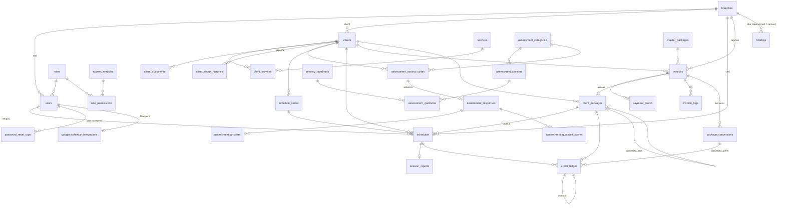

# Skema Database Therapedia — v2

**One Gate Integrated Clinic System** · MySQL 8.0.22+ (InnoDB) · Laravel 11 · Sanctum · **tanpa Redis** (cache, queue, session memakai MySQL)

Dokumen ini adalah sumber kebenaran desain database backend. Skema mencakup **seluruh fitur prototype frontend** (`frontend/`): intake & pipeline, mesin asesmen, penjadwalan + kredit, finance, portal terapis, portal orang tua, dashboard, RBAC, dan **jejak perubahan ringan**: kolom `created_by`/`updated_by`/`deleted_by` di semua modul, `client_status_histories` untuk pipeline, `credit_ledger` untuk kredit, dan **`invoice_logs` khusus invoice**. Tidak ada tabel audit log (ADR 0004).

Disusun dengan skill `database-design` (`.claude/skills/database-design/SKILL.md`). Mapping field frontend ↔ kolom ada di bagian 08 dan `docs/guide/03-data-model.md`.

---

## Daftar Isi
- [00. Prinsip desain](#00-prinsip-desain)
- [01. Query utama & target performa](#01-query-utama--target-performa)
- [02. Peta modul & tabel](#02-peta-modul--tabel)
- [03. ERD](#03-erd)
- [04. Spesifikasi tabel](#04-spesifikasi-tabel)
- [05. Jejak perubahan](#05-jejak-perubahan-tanpa-audit-log)
- [06. Alur transaksi kritis](#06-alur-transaksi-kritis)
- [07. Strategi performa](#07-strategi-performa)
- [08. Mapping frontend ↔ database & keputusan enum](#08-mapping-frontend--database--keputusan-enum)
- [09. Urutan migration & seeder](#09-urutan-migration--seeder)
- [10. Catatan implementasi Laravel](#10-catatan-implementasi-laravel)
- [11. Job terjadwal (Laravel Scheduler)](#11-job-terjadwal-laravel-scheduler)

---

## 00. Prinsip desain

| # | Prinsip | Wujud di skema |
|---|---|---|
| 1 | **Indeks dari query, bukan dari kolom** | Setiap indeks komposit di bagian 04 menyebut query yang dilayani (lihat 01) |
| 2 | **Ledger sebagai sumber kebenaran kredit** | `credit_ledger` append-only; saldo di `client_packages` & `clients` adalah denormalisasi yang diperbarui di transaksi yang sama |
| 3 | **Jejak ringan, tanpa audit log** | Semua modul: `created_by`/`updated_by`/`deleted_by`. Kredit = `credit_ledger` append-only (undo = baris `reversal`), pipeline = `client_status_histories`, invoice = `invoice_logs` (log milik invoice sendiri, termasuk konversi & pemakaian saldo) |
| 4 | **Reversible by design** | Kolom `previous_status`, `prev_*` (slot sebelum reschedule terakhir), `reverted_at`, `credit_effect`, `reverses_ledger_id`, `client_status_from/to` memungkinkan "completed lalu dibatalkan" tanpa kehilangan jejak |
| 5 | **Aman dari edit bersamaan** | Kolom `version` (optimistic lock) pada entity yang sering diubah → HTTP 409 |
| 6 | **Idempoten** | `credit_ledger.idempotency_key` UNIQUE mencegah potong kredit ganda |
| 7 | **Snapshot nilai transaksi** | Nama paket, harga, nama pelaku disalin saat transaksi agar histori tidak berubah ketika master diedit |
| 8 | **Baca cepat tanpa infrastruktur tambahan** | Dashboard = **VIEW + JOIN** di atas indeks covering & generated column tanggal; tanpa Redis dan tanpa tabel ringkasan selama target terpenuhi (§04-G, §07) |
| 9 | **Lookup table untuk daftar yang bisa diedit** | Layanan dan kuadran = tabel ber-PK `code`. Alasan cancel/discharge juga tabel `code`, tetapi hanya **pilihan cepat tanpa FK** (transaksi menyimpan string, boleh teks custom) |
| 10 | **ENUM untuk siklus hidup tetap** | Status client/sesi/invoice/paket |
| 11 | **Hapus dikendalikan role, bukan hardcode** | Punya akses modul = boleh semua aksi non-hapus; hapus (soft delete + `deleted_by`) hanya bila `roles.can_delete` |

Konvensi umum (detail di skill): InnoDB `utf8mb4_0900_ai_ci`; PK `BIGINT UNSIGNED`; waktu `DATETIME` UTC; tanggal kalender `DATE`; slot `TIME`; uang `BIGINT UNSIGNED` rupiah utuh; soft delete hanya untuk entity bisnis (tabel ber-`softDeletes` yang bisa dihapus lewat UI menyertakan `deleted_by`); ledger kredit, `invoice_logs`, dan `package_conversions` tidak pernah di-UPDATE/DELETE.

---

## 01. Query utama & target performa

Daftar ini adalah dasar desain indeks. Setiap halaman prototype dipetakan ke query utamanya.

| ID | Halaman / fitur | Query | Indeks yang melayani | Target DB p95 |
|---|---|---|---|---|
| Q1 | Weekly Calendar (Admin Schedule) | sesi 1 cabang, 1 minggu, opsional terapis | `schedules (branch_id, session_date, status)` · `schedules (therapist_id, session_date, start_time)` | < 30 ms |
| Q2 | Conflict check saat buat/pindah sesi | sesi aktif terapis X tanggal D yang overlap jam | `schedules (therapist_id, session_date, start_time)` | < 10 ms |
| Q3 | My Schedule (Terapis) | sesi terapis X rentang minggu | `schedules (therapist_id, session_date, start_time)` | < 20 ms |
| Q4 | Inquiry Pipeline (kanban) | client per cabang per status, urut terbaru | `clients (branch_id, status, created_at)` | < 30 ms |
| Q5 | Search client (nama / ortu / kode) | prefix nama anak / nama ortu / kode client | `clients (child_name)`, `clients (parent_name)`, UNIQUE `client_code` | < 30 ms |
| Q6 | Active Clients roster + filter kredit | client `admitted` per cabang + saldo | `clients (branch_id, status, credit_balance)` | < 30 ms |
| Q7 | Birthday radar | client aktif per cabang per bulan lahir | `clients (branch_id, birth_month)` (generated column) | < 20 ms |
| Q8 | Detail client (kredit, sesi, invoice) | by id + relasi | PK + `schedules (client_id, session_date)` · `client_packages (client_id, status)` · `invoices (client_id, issued_at)` | < 30 ms |
| Q9 | Finance — antrean verifikasi | invoice `pending_verification` per cabang | `invoices (branch_id, status, issued_at)` | < 20 ms |
| Q10 | Finance — riwayat mutasi kredit | ledger semua client per cabang, terbaru, keyset | `credit_ledger (branch_id, created_at, id)` | < 30 ms |
| Q11 | Revenue dashboard | omzet `paid` per cabang per periode | view `v_daily_revenue` → `invoices idx_inv_paid_date (status, branch_id, paid_date, amount, deleted_at)` | < 50 ms |
| Q12 | Inquiry / Schedule / Branch dashboard | KPI per cabang per periode | view `v_daily_sessions`, `v_daily_pipeline`, `v_daily_credit_usage` (indeks diawali `branch_id, tanggal`) | < 50 ms |
| Q13 | Kode kuesioner publik | lookup kode, lalu cek `expires_at` & invoice assessment client yang belum lunas (`invoices idx_inv_client`) | UNIQUE `assessment_access_codes (code)` | < 5 ms |
| Q14 | Login ortu | lookup `client_code` + cek `date_of_birth` | UNIQUE `clients (client_code)` | < 5 ms |
| Q17 | Therapist summary | sesi `completed` terapis X per periode + status laporan | `schedules (therapist_id, session_date, start_time)` + `session_reports (schedule_id)` | < 30 ms |
| Q18 | Awaiting questionnaire (+ search nama) | kode `issued` belum submit per cabang | `assessment_access_codes (status, issued_at)` + join client | < 30 ms |
| Q19 | Monitoring: sesi completed belum ada report | `completed` per cabang rentang tanggal, `filled_sections = 0` | view `v_unreported_sessions` → `schedules idx_sch_calendar` + `session_reports (schedule_id)` | < 30 ms |
| Q20 | Analitik client periode custom + jadwal rutin/aktif | sesi 1 client rentang tanggal bebas | `schedules (client_id, session_date)`, `schedule_series (client_id, starts_on)` | < 30 ms |
| Q21 | Log satu invoice (tombol Log di tab Billing) | `invoice_logs` per invoice, terbaru dulu | `invoice_logs (invoice_id, created_at, id)` | < 20 ms |

Target API (server, p95): detail < 100 ms · list < 200 ms · aksi transaksional < 150 ms · dashboard < 100 ms.

---

## 02. Peta modul & tabel

| Modul | Tabel | Fungsi singkat |
|---|---|---|
| **A. Organisasi & akses** | `branches` | Cabang klinik |
| | `roles` | Role sistem & kustom (+ flag `can_delete`) |
| | `access_modules` | Daftar modul RBAC |
| | `role_permissions` | Matriks role × modul |
| | `users` | Staf internal + terapis (satu tabel) |
| | `password_reset_otps` | OTP email untuk lupa password staf |
| **B. Master data** | `services` | Layanan intake (BOT-A, FOT-A, Consultation, …) |
| | `sensory_quadrants` | Kuadran sensori (AV/SN/RG/SK) |
| | `cancel_reasons` | Pilihan cepat alasan cancel (tanpa FK; transaksi menyimpan string) |
| | `discharge_reasons` | Pilihan cepat alasan discharge (tanpa FK; transaksi menyimpan string) |
| | `master_packages` | Katalog paket kredit |
| | `holidays` | Hari libur (dilewati jadwal berulang, tak bisa dipilih di kalender) |
| **C. Client & intake** | `clients` | Master anak (kode client = login portal ortu) |
| | `client_code_counters` | Counter kode client per grup huruf (AE/FJ/KO/PT/UZ) |
| | `client_services` | Layanan dipilih (multi) |
| | `client_documents` | Tautan GDrive / dokumen |
| | `client_status_histories` | Riwayat tahap pipeline |
| **D. Asesmen** | `assessment_categories` | Instrumen (Sensory Profile 2, …) |
| | `assessment_sections` | Bagian/domain soal |
| | `assessment_questions` | Bank soal (12 tipe) |
| | `assessment_access_codes` | Kode kuesioner publik |
| | `assessment_responses` | Pengisian kuesioner (sekali isi) |
| | `assessment_answers` | Jawaban per soal |
| | `assessment_quadrant_scores` | Skor kuadran per pengisian |
| **E. Penjadwalan** | `schedule_series` | Pola jadwal berulang |
| | `schedules` | Sesi terapi/asesmen |
| | `session_reports` | Laporan sesi 3 bagian + SOAP |
| | `google_calendar_integrations` | *(fase terakhir)* Token & kalender Google per user |
| **F. Keuangan & kredit** | `invoices` | Tagihan (paket sesi / assessment) |
| | `invoice_counters` | Counter nomor invoice per kode + tanggal |
| | `payment_proofs` | Bukti transfer (riwayat upload) |
| | `client_packages` | Paket kredit milik client |
| | `credit_ledger` | Mutasi kredit append-only |
| | `package_conversions` | Konversi sisa sesi paket ke paket lain (Finance) |
| | `invoice_logs` | Log milik invoice sendiri (append-only) |
| **G. Analitik** | *view* `v_daily_revenue`, `v_daily_sessions`, `v_daily_pipeline`, `v_daily_credit_usage`, `v_therapist_sessions`, `v_invoice_queue`, `v_unreported_sessions` | Dashboard & list gabungan (bukan tabel, tidak menyimpan data) |
| **H. Laravel bawaan** | `personal_access_tokens`, `sessions`, `cache`, `cache_locks`, `jobs`, `failed_jobs`, `job_batches` | Sanctum, session, cache & queue driver `database` (MySQL) |

Total: 34 tabel domain (+1 tabel fase terakhir: `google_calendar_integrations`) + 7 view + tabel bawaan Laravel.

---

## 03. ERD



---

## 04. Spesifikasi tabel

Notasi indeks: `idx_<tabel>_<kolom>` dan komentar `// Qn` = query di bagian 01 yang dilayani.

### A. Organisasi & akses

#### `branches`
```php
Schema::create('branches', function (Blueprint $table) {
    $table->id();
    $table->string('code', 20)->unique();            // EAST, CTL, WEST
    $table->string('name', 100);                      // East, Citraland, West
    $table->string('city', 50)->default('Surabaya');
    $table->text('address')->nullable();
    $table->string('phone', 30)->nullable();
    $table->boolean('is_active')->default(true);
    $table->unsignedBigInteger('updated_by')->nullable();   // FK ke users ditambahkan di migration terpisah setelah `users` dibuat (tabel ini dibuat lebih awal)
    $table->unsignedBigInteger('deleted_by')->nullable();   // FK ke users ditambahkan di migration terpisah setelah `users` dibuat (tabel ini dibuat lebih awal)
    $table->timestamps();
    $table->softDeletes();
});
```

#### `roles`
Role sistem (`master`, `manager`, `admin_inquiry`, `admin_schedule`, `finance`, `therapist`) + role kustom buatan Master. Orang tua **tidak** memakai tabel ini (auth via `clients`).
```php
Schema::create('roles', function (Blueprint $table) {
    $table->id();
    $table->string('code', 50)->unique();             // master, admin_inquiry, custom_xxx
    $table->string('name', 100);
    $table->string('badge', 100)->nullable();
    $table->text('description')->nullable();
    $table->boolean('is_system')->default(false);     // role sistem tidak bisa dihapus
    $table->boolean('can_delete')->default(false);    // true = tombol hapus tampil di semua modul yang diakses role ini (master selalu true)
    $table->foreignId('updated_by')->nullable()->constrained('users')->nullOnDelete();
    $table->unsignedBigInteger('deleted_by')->nullable();   // FK ke users ditambahkan di migration terpisah setelah `users` dibuat (tabel ini dibuat lebih awal)
    $table->timestamps();
    $table->softDeletes();
});
```

#### `access_modules`
```php
Schema::create('access_modules', function (Blueprint $table) {
    $table->string('code', 50)->primary();            // revenue, inquiry_pipeline, weekly_calendar, finance, rbac, unreported_reports (monitoring report), holidays, …
    $table->string('label', 100);
    $table->string('category', 50);                   // Financial, Inquiry, Scheduling, Administration, Clinical
    $table->text('description')->nullable();
    $table->unsignedSmallInteger('sort_order')->default(0);
});
```

#### `role_permissions`
```php
Schema::create('role_permissions', function (Blueprint $table) {
    $table->foreignId('role_id')->constrained()->cascadeOnDelete();
    $table->string('module_code', 50);
    $table->boolean('allowed')->default(false);
    $table->timestamps();
    $table->primary(['role_id', 'module_code']);
    $table->foreign('module_code')->references('code')->on('access_modules')->cascadeOnUpdate()->cascadeOnDelete();
});
```
Dibaca setiap request (policy): satu query by PK `role_id` (±12 baris) — cukup **dimemo per request** di `PermissionService`. Opsional: cache driver `database` (`Cache::remember("rbac:role:{id}")`, tabel `cache` MySQL) dengan invalidasi saat matriks diubah. Tidak butuh Redis.

**Aturan akses (keputusan klien):** `allowed = true` pada suatu modul = role boleh **semua aksi** di modul itu (lihat, tambah, ubah, ubah status), termasuk Manager (tidak lagi read-only). Aksi **hapus** hanya muncul/diizinkan bila `roles.can_delete = 1` **dan** role punya akses modul tersebut. Void invoice, renewal langsung, dan koreksi saldo kredit = aksi modul `finance` (tanpa daftar role hardcode).

#### `users`
Staf internal & terapis dalam satu tabel. Atribut klinis nullable untuk non-terapis.
```php
Schema::create('users', function (Blueprint $table) {
    $table->id();
    $table->foreignId('role_id')->constrained()->restrictOnDelete();
    $table->foreignId('branch_id')->nullable()->constrained()->nullOnDelete(); // wajib terisi untuk semua role kecuali master (null = semua cabang, hanya master); divalidasi di service. Terapis & staf lain = tepat 1 cabang
    $table->string('name', 150);
    $table->string('email', 150)->unique();
    $table->string('password');
    $table->boolean('must_change_password')->default(true);  // true bila password diatur / di-reset Master → wajib ganti saat login berikutnya
    $table->timestamp('password_changed_at')->nullable();
    $table->string('phone', 30)->nullable();
    $table->string('title', 50)->nullable();          // S.Tr.Kes, S.Ft, A.Md.OT
    $table->string('specialty', 150)->nullable();
    $table->text('bio')->nullable();
    $table->boolean('is_active')->default(true);
    $table->timestamp('last_login_at')->nullable();
    $table->rememberToken();
    $table->foreignId('created_by')->nullable()->constrained('users')->nullOnDelete();
    $table->foreignId('updated_by')->nullable()->constrained('users')->nullOnDelete();
    $table->unsignedBigInteger('deleted_by')->nullable();
    $table->timestamps();                              // tanpa softDeletes: staf yang berhenti dinonaktifkan (`is_active = 0`), data & riwayat sesi tetap

    $table->index(['branch_id', 'role_id', 'is_active'], 'idx_users_branch_role');   // daftar staf/terapis per cabang
});
```

Catatan akun:
- **Password awal / reset oleh Master**: Master mengisi password sementara → `must_change_password = 1`; setelah login pertama user wajib menggantinya (`password_changed_at` terisi, flag 0).
- **Lupa password** (staf): minta OTP via email → baris `password_reset_otps` → verifikasi OTP → set password baru. Master juga bisa mereset langsung dari User Management (password sementara + `must_change_password = 1`, tanpa OTP).

#### `password_reset_otps`
```php
Schema::create('password_reset_otps', function (Blueprint $table) {
    $table->id();
    $table->foreignId('user_id')->constrained()->cascadeOnDelete();
    $table->string('otp_hash');                       // hash OTP 6 digit (tidak disimpan polos)
    $table->timestamp('expires_at');                  // mis. 10 menit
    $table->unsignedTinyInteger('attempts')->default(0);   // maks 5 salah → OTP hangus
    $table->timestamp('used_at')->nullable();
    $table->string('requested_ip', 45)->nullable();
    $table->timestamp('created_at')->useCurrent();
    $table->index(['user_id', 'created_at'], 'idx_otp_user');
});
```
Throttle permintaan OTP per email & per IP (RateLimiter). Baris kedaluwarsa dibersihkan housekeeping (§11).

### B. Master data

Tabel master kecil (puluhan baris) dan dibaca lewat PK → query langsung < 1 ms dari buffer pool InnoDB. Frontend memuatnya sekali per sesi (react-query `staleTime` panjang). Tidak perlu Redis.

#### `services`
```php
Schema::create('services', function (Blueprint $table) {
    $table->string('code', 50)->primary();            // b_ota, f_ota, school_companion, consult_wo_report, consult_w_report
    $table->string('label', 150);
    $table->string('short_label', 60);
    $table->string('category', 50);                   // string bebas (tanpa enum): combo box UI menawarkan Asesmen / Konsultasi / Terapi + opsi ketik kategori sendiri
    $table->text('description')->nullable();
    $table->boolean('is_active')->default(true);      // nonaktif = tidak bisa dipilih, label tetap tampil
    $table->unsignedSmallInteger('sort_order')->default(0);
    $table->foreignId('updated_by')->nullable()->constrained('users')->nullOnDelete();
    $table->timestamps();
});
```

#### `sensory_quadrants`
```php
Schema::create('sensory_quadrants', function (Blueprint $table) {
    $table->string('code', 10)->primary();            // AV, SN, RG, SK
    $table->string('title', 60);
    $table->string('full_name', 100);
    $table->text('description')->nullable();
    $table->string('color', 20)->default('slate');
    $table->unsignedSmallInteger('sort_order')->default(0);
    $table->foreignId('updated_by')->nullable()->constrained('users')->nullOnDelete();
    $table->timestamps();
});
```

#### `cancel_reasons` & `discharge_reasons` (pilihan cepat, TANPA foreign key)
Hanya **sumber pilihan cepat** untuk dropdown di UI (dikelola di menu Master Data). Tabel transaksi (`schedules`, `clients`, `credit_ledger`) menyimpan alasan sebagai **string biasa** (`cancel_reason`, `pending_reason`, `discharge_reason`): berisi `code` pilihan cepat **atau** teks bebas yang diketik user ("Lainnya"). Karena itu tidak ada FK: mengubah/menghapus pilihan tidak memengaruhi riwayat, dan teks bebas tidak perlu terdaftar. Label tampil = `label` bila string cocok dengan `code`, selain itu string apa adanya.
Kuota cancel (3 per paket, penghitung `client_packages.cancel_count`) adalah aturan di service (§6.2), bukan atribut per alasan. Alasan sistem `reschedule_dibatalkan` (drop reschedule menggantung, netral kredit) adalah konstanta kode, bukan baris tabel.
```php
Schema::create('cancel_reasons', function (Blueprint $table) {
    $table->string('code', 40)->primary();            // sakit, izin_keluarga, bentrok_sekolah, tanpa_kabar
    $table->string('label', 120);
    $table->boolean('is_active')->default(true);      // nonaktif = tidak muncul di pilihan baru
    $table->unsignedSmallInteger('sort_order')->default(0);
    $table->foreignId('updated_by')->nullable()->constrained('users')->nullOnDelete();
    $table->timestamps();
});

Schema::create('discharge_reasons', function (Blueprint $table) {
    $table->string('code', 40)->primary();            // moving, financial, conflict_schedule, expectation_not_met, graduate
    $table->string('label', 120);
    $table->boolean('is_active')->default(true);
    $table->unsignedSmallInteger('sort_order')->default(0);
    $table->foreignId('updated_by')->nullable()->constrained('users')->nullOnDelete();
    $table->timestamps();
});
```

#### `master_packages`
```php
Schema::create('master_packages', function (Blueprint $table) {
    $table->id();
    $table->string('code', 50)->unique();             // pkg-reguler, pkg-vip, pkg-consult
    $table->string('invoice_code', 10)->unique();     // kode pendek untuk nomor invoice (mis. REG, VIP); `ASM` dicadangkan untuk invoice assessment
    $table->string('name', 150);
    $table->unsignedSmallInteger('credits');
    $table->unsignedBigInteger('price');              // rupiah
    $table->text('description')->nullable();
    $table->boolean('is_active')->default(true);
    $table->foreignId('updated_by')->nullable()->constrained('users')->nullOnDelete();
    $table->foreignId('deleted_by')->nullable()->constrained('users')->nullOnDelete();
    $table->timestamps();
    $table->softDeletes();
});
```

#### `holidays`
Tanggal libur (nasional / klinik). Jadwal berulang **melewati** tanggal ini (tidak dibuatkan sesi) dan kalender tidak bisa memilihnya (422 saat buat/pindah sesi). Menambah libur **tidak** mengubah sesi yang sudah ada (UI memberi penanda). Hapus = hard delete (data konfigurasi, tanpa riwayat).
```php
Schema::create('holidays', function (Blueprint $table) {
    $table->id();
    $table->foreignId('branch_id')->nullable()->constrained()->cascadeOnDelete();   // null = semua cabang
    $table->unsignedBigInteger('branch_key')->storedAs('IFNULL(branch_id, 0)');
    $table->date('holiday_date');
    $table->string('name', 150);                      // Hari Kemerdekaan RI
    $table->foreignId('created_by')->nullable()->constrained('users')->nullOnDelete();
    $table->foreignId('updated_by')->nullable()->constrained('users')->nullOnDelete();
    $table->timestamps();
    $table->unique(['holiday_date', 'branch_key'], 'uq_holidays_date_branch');
});
```

### C. Client & intake

#### `clients`
Master anak, entity pipeline, **sekaligus entity login portal ortu** (`client_code` + tanggal lahir anak). 1 client = 1 orang tua yang didaftarkan.
```php
Schema::create('clients', function (Blueprint $table) {
    $table->id();
    $table->string('client_code', 10)->unique();      // AE-00001: grup 2 huruf (dari huruf pertama nama) + 5 digit counter per grup (`client_code_counters`). ID rekam medis SEKALIGUS kode login ortu (Q14); tidak berubah walau nama diedit
    $table->foreignId('branch_id')->constrained()->restrictOnDelete();

    // Biodata
    $table->string('child_name', 120);                // nama lengkap (tanpa nama panggilan)
    $table->enum('gender', ['male', 'female']);
    $table->date('date_of_birth');
    $table->unsignedTinyInteger('birth_month')->storedAs('MONTH(date_of_birth)');   // Q7 birthday radar
    $table->string('parent_name', 120);
    $table->string('parent_phone', 30);               // WhatsApp
    $table->string('parent_email', 150)->nullable();
    $table->text('address')->nullable();
    $table->text('intake_note')->nullable();          // catatan saat intake (keluhan utama, rujukan, dll). Laporan asesmen memakai session_reports, bukan kolom ini

    // Pipeline & outcome
    $table->enum('status', [
        'inquiry', 'service_selected', 'assessment_scheduled', 'assessment_done',
        'admitted', 'done_consult', 'done_assessment', 'discontinued', 'discharged',
    ])->default('inquiry');
    $table->enum('final_outcome', ['admitted', 'done_consult', 'done_assessment', 'discontinued'])->nullable();
    $table->timestamp('status_changed_at')->nullable();
    $table->date('date_of_join')->nullable();
    $table->date('date_of_discharge')->nullable();
    $table->date('date_of_discontinue')->nullable();       // tanggal discontinue (terpisah dari discharge)
    $table->string('discharge_reason', 150)->nullable();   // string bebas: code pilihan cepat atau teks custom (tanpa FK); dipakai juga sebagai alasan discontinue
    $table->text('discharge_note')->nullable();

    // Denormalisasi kredit (sumber kebenaran: credit_ledger) — diperbarui di transaksi yang sama
    $table->integer('credit_balance')->default(0);    // Σ remaining_credit paket aktif; 0 = Frozen
    $table->unsignedBigInteger('leftover_balance')->default(0);   // RUPIAH: saldo lebihan konversi paket, memotong invoice paket berikutnya (= Σ package_conversions.leftover_amount − Σ invoices.balance_applied yang tidak dibatalkan)

    // Portal ortu: login = client_code + date_of_birth (Q14)
    $table->timestamp('last_login_at')->nullable();

    $table->unsignedInteger('version')->default(1);
    $table->foreignId('created_by')->nullable()->constrained('users')->nullOnDelete();
    $table->foreignId('updated_by')->nullable()->constrained('users')->nullOnDelete();
    $table->timestamps();
    $table->softDeletes();
    $table->foreignId('deleted_by')->nullable()->constrained('users')->nullOnDelete();   // hapus hanya bila roles.can_delete (§6.7)

    $table->index(['branch_id', 'status', 'created_at'], 'idx_clients_pipeline');        // Q4
    $table->index(['branch_id', 'status', 'credit_balance'], 'idx_clients_roster');      // Q6
    $table->index(['branch_id', 'birth_month'], 'idx_clients_birthday');                 // Q7
    $table->index('child_name', 'idx_clients_child_name');                               // Q5 prefix search
    $table->index('parent_name', 'idx_clients_parent_name');                             // Q5
});
```
Catatan:
- **Frozen** tidak disimpan sebagai status; diturunkan dari `credit_balance = 0` (sesuai frontend).
- Search nama memakai prefix (`LIKE 'abc%'`). Jika butuh search di tengah kata, tambahkan `FULLTEXT(child_name, parent_name)` (ngram parser).
- Login ortu: `client_code` **+ tanggal lahir anak** (`date_of_birth`) sebagai verifikasi kedua (tanpa PIN). Respons gagal selalu generik (tidak membocorkan mana yang salah). `client_code` **berurutan** (AE-00001, AE-00002, …) sehingga mudah ditebak: tanggal lahir adalah satu-satunya faktor kedua, jadi wajib throttle per IP & per kode + lockout sementara (Laravel RateLimiter). Client yang di-soft-delete tidak bisa login. Kode tidak diberikan ulang/diganti sendiri oleh ortu: admin yang menginformasikan kode (D5).
- **Status**: perpindahan otomatis (assessment dijadwalkan, kuesioner terisi, sesi asesmen completed) hanya maju; perubahan **manual** (outcome, discharge, reaktivasi) boleh ke tahap mana pun, dicatat di `client_status_histories` (lihat §6.6). Client discharge/discontinued dapat diaktifkan kembali (`admitted`) dari list maupun detail.
- Pencarian client: awal nama anak, nama ortu, atau kode client (prefix).
- Nama anak hanya satu kolom `child_name` (nama lengkap). Layanan pendamping sekolah = layanan `school_companion` di `client_services`, bukan flag di `clients`.

#### `client_code_counters`
Counter kode client per grup huruf. Grup ditentukan dari huruf pertama nama: A–E = `AE`, F–J = `FJ`, K–O = `KO`, P–T = `PT`, U–Z = `UZ`. Nomor = counter grup + 1 (global lintas cabang), tampil 5 digit (`AE-00001`). Dinaikkan di transaksi pembuatan client: `UPDATE client_code_counters SET last_number = LAST_INSERT_ID(last_number + 1) WHERE group_code = ?` (atomik, tanpa celah bentrok).
```php
Schema::create('client_code_counters', function (Blueprint $table) {
    $table->char('group_code', 2)->primary();         // AE, FJ, KO, PT, UZ (di-seed)
    $table->unsignedInteger('last_number')->default(0);
});
```

#### `client_services`
```php
Schema::create('client_services', function (Blueprint $table) {
    $table->foreignId('client_id')->constrained()->cascadeOnDelete();
    $table->string('service_code', 50);
    $table->timestamp('selected_at')->useCurrent();
    $table->foreignId('selected_by')->nullable()->constrained('users')->nullOnDelete();
    $table->primary(['client_id', 'service_code']);
    $table->foreign('service_code')->references('code')->on('services');
    $table->index('service_code', 'idx_client_services_service');                         // funnel per layanan
});
```

#### `client_documents`
```php
Schema::create('client_documents', function (Blueprint $table) {
    $table->id();
    $table->foreignId('client_id')->constrained()->cascadeOnDelete();
    $table->enum('type', ['gdrive_folder', 'referral', 'observation_video', 'report', 'other'])->default('gdrive_folder');
    $table->string('label', 150)->nullable();
    $table->string('url', 500);
    $table->foreignId('created_by')->nullable()->constrained('users')->nullOnDelete();
    $table->foreignId('updated_by')->nullable()->constrained('users')->nullOnDelete();
    $table->foreignId('deleted_by')->nullable()->constrained('users')->nullOnDelete();
    $table->timestamps();
    $table->softDeletes();
    $table->index(['client_id', 'type'], 'idx_client_docs_client');
});
```

#### `client_status_histories`
Timeline bisnis pipeline (ditampilkan ke user). Tabel ini adalah satu-satunya riwayat pipeline . Perubahan manual ke tahap mana pun (maju **maupun mundur**) dicatat di sini dengan `trigger = manual` / `outcome` / `discharge` / `revert`.
```php
Schema::create('client_status_histories', function (Blueprint $table) {
    $table->id();
    $table->foreignId('client_id')->constrained()->cascadeOnDelete();
    $table->foreignId('branch_id')->constrained()->restrictOnDelete();          // denormalisasi dari clients (untuk view per cabang)
    $table->string('from_status', 30)->nullable();
    $table->string('to_status', 30);
    $table->enum('trigger', ['manual', 'service_selected', 'code_issued', 'assessment_scheduled', 'questionnaire_submitted', 'session_completed', 'outcome', 'discharge', 'revert', 'created']);   // `created` = baris riwayat pertama saat client dibuat
    $table->text('note')->nullable();
    $table->foreignId('changed_by')->nullable()->constrained('users')->nullOnDelete();  // null = sistem / ortu
    $table->timestamp('changed_at')->useCurrent();
    $table->date('changed_date')->storedAs("DATE(changed_at + INTERVAL 7 HOUR)");  // tanggal WIB
    $table->index(['client_id', 'changed_at'], 'idx_csh_client');                        // timeline client
    $table->index(['branch_id', 'changed_date', 'to_status'], 'idx_csh_branch_date');    // v_daily_pipeline (funnel & tren)
});
```

### D. Mesin asesmen

#### `assessment_categories`
```php
Schema::create('assessment_categories', function (Blueprint $table) {
    $table->id();
    $table->string('code', 50)->unique();             // cat-001
    $table->string('type_code', 10)->unique();        // kode jenis asesmen = prefix kode kuesioner (mis. SP2, SC); jangan diubah setelah ada kode terbit
    $table->string('name', 200);                      // Child Sensory Profile 2 (Winnie Dunn…)
    $table->string('standard_title', 150)->nullable();
    $table->string('author', 150)->nullable();
    $table->string('domain', 150)->nullable();
    $table->json('scoring_key')->nullable();          // {"0": "Tidak berlaku", … "5": "Hampir selalu"}
    $table->boolean('is_active')->default(true);
    $table->unsignedInteger('version')->default(1);
    $table->foreignId('updated_by')->nullable()->constrained('users')->nullOnDelete();
    $table->foreignId('deleted_by')->nullable()->constrained('users')->nullOnDelete();
    $table->timestamps();
    $table->softDeletes();
});
```

#### `assessment_sections`
```php
Schema::create('assessment_sections', function (Blueprint $table) {
    $table->id();
    $table->foreignId('category_id')->constrained('assessment_categories')->cascadeOnDelete();
    $table->string('title', 150);                     // Pemrosesan AUDITORI
    $table->string('lead_text', 150)->nullable();     // "Anakku ..."
    $table->unsignedSmallInteger('sort_order')->default(0);
    $table->foreignId('updated_by')->nullable()->constrained('users')->nullOnDelete();
    $table->timestamps();
    $table->index(['category_id', 'sort_order'], 'idx_sections_category');
});
```

#### `assessment_questions`
```php
Schema::create('assessment_questions', function (Blueprint $table) {
    $table->id();
    $table->foreignId('category_id')->constrained('assessment_categories')->cascadeOnDelete(); // denormalisasi untuk load 1 query
    $table->foreignId('section_id')->constrained('assessment_sections')->cascadeOnDelete();
    $table->unsignedSmallInteger('item_no');
    $table->string('quadrant_code', 10)->nullable();
    $table->enum('question_type', ['scale_0_5', 'range', 'multiple_choice', 'checkbox_multi', 'free_text', 'yes_no', 'short_text', 'number', 'dropdown', 'date', 'birth_date', 'time'])->default('scale_0_5');
    $table->text('question');
    $table->json('options')->nullable();              // pilihan untuk multiple_choice / checkbox_multi / dropdown
    $table->smallInteger('range_min')->nullable();
    $table->smallInteger('range_max')->nullable();
    $table->string('range_min_label', 60)->nullable();
    $table->string('range_max_label', 60)->nullable();
    $table->boolean('is_required')->default(true);
    $table->unsignedSmallInteger('sort_order')->default(0);
    $table->foreignId('updated_by')->nullable()->constrained('users')->nullOnDelete();
    $table->foreignId('deleted_by')->nullable()->constrained('users')->nullOnDelete();
    $table->timestamps();
    $table->softDeletes();

    $table->foreign('quadrant_code')->references('code')->on('sensory_quadrants');
    $table->index(['category_id', 'section_id', 'sort_order'], 'idx_questions_form');  // render form
});
```

#### `assessment_access_codes`
```php
Schema::create('assessment_access_codes', function (Blueprint $table) {
    $table->id();
    $table->string('code', 20)->unique();             // {assessment_categories.type_code}-{suffix acak 6 karakter}, mis. SP2-K7M4QX — Q13
    $table->foreignId('client_id')->constrained()->cascadeOnDelete();
    $table->foreignId('category_id')->constrained('assessment_categories')->restrictOnDelete();
    $table->enum('status', ['issued', 'submitted'])->default('issued');   // diisi SEKALI saja; kode `issued` yang belum diisi boleh DIHAPUS (baris dihapus, tanpa jejak); `submitted` tidak bisa dihapus
    $table->foreignId('issued_by')->nullable()->constrained('users')->nullOnDelete();
    $table->timestamp('issued_at')->useCurrent();
    $table->timestamp('expires_at')->nullable();      // OPSIONAL: admin memilih saat generate; NULL = tanpa masa berlaku. Dicek saat kode dibuka (tanpa job harian)
    $table->timestamp('submitted_at')->nullable();
    $table->timestamps();

    $table->index(['client_id', 'category_id'], 'idx_codes_client');
    $table->index(['status', 'issued_at'], 'idx_codes_awaiting');                         // Q18
});
```
"Kedaluwarsa" **tidak** disimpan sebagai status: kode dianggap kedaluwarsa bila `expires_at IS NOT NULL AND expires_at < NOW()` saat dibuka (410, tidak ada job). Kode kedaluwarsa tetap tampil di daftar "menunggu kuesioner" (ditandai) agar admin bisa menghapus/menerbitkan ulang.

#### `assessment_responses`
**Satu kode = satu pengisian** (tanpa revisi): `access_code_id` UNIQUE, submit kedua ditolak (409). Hasil dapat dilihat semua staf internal yang punya akses modul; **ortu tidak** melihat hasil.
```php
Schema::create('assessment_responses', function (Blueprint $table) {
    $table->id();
    $table->foreignId('access_code_id')->unique()->constrained('assessment_access_codes')->cascadeOnDelete();
    $table->foreignId('client_id')->constrained()->cascadeOnDelete();
    $table->foreignId('category_id')->constrained('assessment_categories')->restrictOnDelete();
    $table->string('respondent_name', 120)->nullable();
    $table->string('respondent_relation', 30)->nullable();
    $table->unsignedSmallInteger('answered_count');
    $table->timestamp('consent_at');                  // persetujuan penggunaan data anak (checkbox wajib diisi sebelum submit)
    $table->timestamp('submitted_at')->useCurrent();
    $table->string('ip_address', 45)->nullable();
    $table->timestamps();

    $table->index(['client_id', 'category_id', 'submitted_at'], 'idx_responses_client');   // hasil per client
});
```

#### `assessment_answers`
```php
Schema::create('assessment_answers', function (Blueprint $table) {
    $table->id();
    $table->foreignId('response_id')->constrained('assessment_responses')->cascadeOnDelete();
    $table->foreignId('question_id')->constrained('assessment_questions')->restrictOnDelete();
    $table->unsignedSmallInteger('item_no');          // snapshot
    $table->string('quadrant_code', 10)->nullable();  // snapshot
    $table->text('answer_text');                      // "4 - Sering (75%)"; tipe date/birth_date = yyyy-MM-dd, time = HH:mm
    $table->json('answer_values')->nullable();        // checkbox_multi
    $table->smallInteger('score')->nullable();        // NULL untuk tipe tak bernilai (short_text, number, date, birth_date, time, free_text, yes_no, checkbox_multi)
    $table->unique(['response_id', 'question_id'], 'uq_answers_question');
});
```

#### `assessment_quadrant_scores`
Dihitung **server** saat submit (Σ score per kuadran). Disimpan agar laporan & dashboard tidak menghitung ulang.
```php
Schema::create('assessment_quadrant_scores', function (Blueprint $table) {
    $table->foreignId('response_id')->constrained('assessment_responses')->cascadeOnDelete();
    $table->string('quadrant_code', 10);
    $table->unsignedSmallInteger('raw_score');
    $table->unsignedSmallInteger('item_count');
    $table->string('classification', 40)->nullable(); // mis. "Much More Than Others"
    $table->primary(['response_id', 'quadrant_code']);
    $table->foreign('quadrant_code')->references('code')->on('sensory_quadrants');
});
```

### E. Penjadwalan

#### `schedule_series`
Pola jadwal berulang (multi-hari, N minggu) agar operasi "ubah/batalkan seluruh seri" efisien.
```php
Schema::create('schedule_series', function (Blueprint $table) {
    $table->id();
    $table->foreignId('client_id')->constrained()->cascadeOnDelete();
    $table->foreignId('branch_id')->constrained()->restrictOnDelete();
    $table->json('pattern');                          // tanggal yang jatuh di `holidays` dilewati saat generate. [{"day":1,"start":"09:00","end":"10:00","therapist_id":7,"client_package_id":3,"type":"therapy"}]
    $table->unsignedTinyInteger('weeks');             // default 12
    $table->date('starts_on');
    $table->date('ends_on');
    $table->foreignId('created_by')->nullable()->constrained('users')->nullOnDelete();
    $table->foreignId('updated_by')->nullable()->constrained('users')->nullOnDelete();
    $table->timestamps();
    $table->index(['client_id', 'starts_on'], 'idx_series_client');
});
```

#### `schedules`
Tabel paling sering dibaca (kalender). Teks laporan dipisah ke `session_reports` agar baris tetap ramping.
```php
Schema::create('schedules', function (Blueprint $table) {
    $table->id();
    $table->foreignId('branch_id')->constrained()->restrictOnDelete();
    $table->foreignId('client_id')->constrained()->restrictOnDelete();
    $table->foreignId('therapist_id')->constrained('users')->restrictOnDelete();
    $table->foreignId('series_id')->nullable()->constrained('schedule_series')->nullOnDelete();
    $table->foreignId('client_package_id')->nullable()->constrained()->nullOnDelete();   // null untuk asesmen
    $table->string('service_code', 50)->nullable();     // diturunkan dari client_services, tidak dipilih di form jadwal
    $table->enum('type', ['therapy', 'assessment', 'consultation'])->default('therapy');

    $table->date('session_date');
    $table->time('start_time');
    $table->time('end_time');

    $table->enum('status', ['scheduled', 'completed', 'cancelled', 'rescheduled', 'reschedule_pending'])->default('scheduled');
    $table->string('previous_status', 30)->nullable();   // status sebelum transisi terakhir — dipakai revert
    $table->string('client_status_from', 30)->nullable(); // sesi asesmen completed yang memajukan client otomatis: tahap client sebelumnya (dipakai revert)
    $table->string('client_status_to', 30)->nullable();   // tahap hasil transisi otomatis; revert hanya memulihkan bila `clients.status` masih sama
    $table->timestamp('reverted_at')->nullable();        // diisi saat revert; revert hanya 1x → diblokir bila terisi, dikosongkan oleh transisi berikutnya
    $table->enum('credit_effect', ['none', 'used', 'excused', 'penalty'])->default('none'); // efek kredit transisi terakhir; pada cancel = KEPUTUSAN ADMIN (wajib dipilih): `penalty` = kredit dipotong, `excused` = tidak dipotong

    // Cancel
    $table->string('cancel_reason', 150)->nullable();    // string bebas: code pilihan cepat atau teks custom (tanpa FK)
    $table->text('cancel_note')->nullable();
    $table->timestamp('cancelled_at')->nullable();
    $table->foreignId('cancelled_by')->nullable()->constrained('users')->nullOnDelete();

    // Complete
    $table->timestamp('completed_at')->nullable();
    $table->foreignId('completed_by')->nullable()->constrained('users')->nullOnDelete();

    // Reschedule (jejak slot asal pertama) & reschedule menggantung
    $table->date('origin_date')->nullable();
    $table->time('origin_start_time')->nullable();
    $table->time('origin_end_time')->nullable();
    $table->foreignId('origin_therapist_id')->nullable()->constrained('users')->nullOnDelete();
    // Slot TEPAT SEBELUM reschedule terakhir — target revert (sama dengan origin_* bila baru 1x reschedule; berbeda setelah reschedule 2x)
    $table->date('prev_date')->nullable();
    $table->time('prev_start_time')->nullable();
    $table->time('prev_end_time')->nullable();
    $table->foreignId('prev_therapist_id')->nullable()->constrained('users')->nullOnDelete();
    $table->timestamp('rescheduled_at')->nullable();
    $table->string('pending_reason', 150)->nullable();   // string bebas, sama seperti cancel_reason
    $table->text('pending_note')->nullable();
    $table->timestamp('pending_at')->nullable();

    $table->unsignedInteger('version')->default(1);
    $table->foreignId('created_by')->nullable()->constrained('users')->nullOnDelete();
    $table->foreignId('updated_by')->nullable()->constrained('users')->nullOnDelete();
    $table->timestamps();
    $table->softDeletes();
    $table->foreignId('deleted_by')->nullable()->constrained('users')->nullOnDelete();   // hapus hanya bila roles.can_delete (`deleted_by`)

    $table->foreign('service_code')->references('code')->on('services');

    $table->index(['branch_id', 'session_date', 'status', 'deleted_at'], 'idx_sch_calendar'); // Q1 + v_daily_sessions (covering)
    $table->index(['therapist_id', 'session_date', 'start_time'], 'idx_sch_therapist');   // Q2, Q3, Q17
    $table->index(['client_id', 'session_date'], 'idx_sch_client');                       // Q8, portal ortu
    $table->index(['status', 'session_date'], 'idx_sch_status');                          // auto-complete job, rekap
    $table->index('series_id', 'idx_sch_series');
});
```
Catatan:
- `rescheduled` = sudah pindah slot (slot baru di `session_date/start_time`, asal pertama di `origin_*`, slot sebelum reschedule terakhir di `prev_*`).
- `reschedule_pending` diabaikan oleh conflict check (sama dengan frontend).
- Cancel (sesi berstatus `scheduled` / `rescheduled` / `reschedule_pending`, semua jenis kalender) **wajib** disertai keputusan admin: potong kredit atau tidak (§6.2). Reschedule dan tandai pending tetap netral kredit. Revert hanya 1x (§6.3).
- `session_date` tidak boleh jatuh di `holidays` (422); seri berulang melewatinya.
- *(Fase terakhir, Google Calendar)* tambah `google_event_id VARCHAR(100) NULL` pada tabel ini.
- **Frozen** tidak disimpan; diturunkan dari `clients.credit_balance = 0` saat render.

#### `session_reports`
Laporan sesi 3 bagian (prototype) + kolom SOAP terstruktur opsional.
```php
Schema::create('session_reports', function (Blueprint $table) {
    $table->id();
    $table->foreignId('schedule_id')->unique()->constrained()->cascadeOnDelete();
    $table->foreignId('client_id')->constrained()->cascadeOnDelete();         // denormalisasi: riwayat laporan per client
    $table->foreignId('therapist_id')->constrained('users')->restrictOnDelete();
    $table->text('activity_section')->nullable();     // Aktivitas sesi
    $table->text('note_section')->nullable();         // Catatan klinis (ringkas, prototype)
    $table->text('homework_section')->nullable();     // PR / home program
    $table->text('subjective_note')->nullable();      // SOAP opsional
    $table->text('objective_note')->nullable();
    $table->text('assessment_note')->nullable();
    $table->text('plan_note')->nullable();
    $table->unsignedTinyInteger('filled_sections')->storedAs(
        "(activity_section IS NOT NULL AND activity_section <> '') + (note_section IS NOT NULL AND note_section <> '') + (homework_section IS NOT NULL AND homework_section <> '')"
    );                                                // 0..3 → filter "laporan lengkap 3/3" (TherapistSummary)
    $table->unsignedInteger('version')->default(1);
    $table->foreignId('updated_by')->nullable()->constrained('users')->nullOnDelete();
    $table->timestamps();

    $table->index(['client_id', 'created_at'], 'idx_reports_client');
    $table->index(['therapist_id', 'filled_sections'], 'idx_reports_therapist');
});
```

#### `google_calendar_integrations` *(fase terakhir — migration ditunda sampai semua fitur lain selesai)*
```php
Schema::create('google_calendar_integrations', function (Blueprint $table) {
    $table->id();
    $table->foreignId('user_id')->unique()->constrained()->cascadeOnDelete();
    $table->string('google_email', 150);
    $table->text('refresh_token');                    // terenkripsi (cast `encrypted`)
    $table->string('calendar_id', 150)->default('primary');
    $table->boolean('sync_enabled')->default(true);
    $table->timestamp('last_synced_at')->nullable();
    $table->timestamps();
});
```
Sinkron satu arah (sesi → Google Calendar) lewat queue `database`, di luar transaksi sesi.

### F. Keuangan & kredit

#### `invoices`
```php
Schema::create('invoices', function (Blueprint $table) {
    $table->id();
    $table->string('invoice_number', 40)->unique();   // INV-{type_code}-{YYYYMMDD WIB}-{NNN}, mis. INV-ASM-20261003-001 / INV-REG-20261003-001 (counter per kode + tanggal, dibuat server)
    $table->foreignId('client_id')->constrained()->restrictOnDelete();
    $table->foreignId('branch_id')->constrained()->restrictOnDelete();
    $table->foreignId('master_package_id')->nullable()->constrained()->nullOnDelete();
    $table->enum('invoice_type', ['package', 'assessment'])->default('package');   // Paket Sesi | Assessment (diterbitkan Finance). Tanpa diskon manual, DP, cicilan, refund, jatuh tempo (satu-satunya pengurang = saldo lebihan konversi, `balance_applied`)
    $table->string('type_code', 10);                  // snapshot: `ASM` untuk assessment, master_packages.invoice_code untuk paket

    // Snapshot saat tagihan diterbitkan
    $table->string('package_name', 150);
    $table->unsignedSmallInteger('credits')->default(0);
    $table->unsignedBigInteger('amount');             // rupiah, NOMINAL BERSIH yang dibayar ortu (= gross_amount − balance_applied)
    $table->unsignedBigInteger('gross_amount')->nullable();     // nominal sebelum saldo lebihan; null bila tak ada saldo dipakai
    $table->unsignedBigInteger('balance_applied')->default(0); // saldo lebihan konversi yang dipotongkan saat terbit; hanya invoice `package`, maks sampai nominal invoice

    $table->enum('status', ['unpaid', 'pending_verification', 'paid', 'rejected', 'void'])->default('unpaid');
    $table->timestamp('issued_at')->useCurrent();
    $table->timestamp('paid_at')->nullable();
    $table->date('paid_date')->nullable()->storedAs("DATE(paid_at + INTERVAL 7 HOUR)");  // tanggal WIB untuk v_daily_revenue
    $table->foreignId('verified_by')->nullable()->constrained('users')->nullOnDelete();
    $table->timestamp('verified_at')->nullable();
    $table->text('rejection_reason')->nullable();
    $table->string('payment_method', 40)->default('transfer');   // teks bebas (mis. transfer, tunai)
    $table->unsignedTinyInteger('proof_upload_count')->default(0);   // upload pertama + re-upload; maks 4 (1 + 3 re-upload), dicek di service

    $table->unsignedInteger('version')->default(1);
    $table->foreignId('created_by')->nullable()->constrained('users')->nullOnDelete();
    $table->foreignId('updated_by')->nullable()->constrained('users')->nullOnDelete();
    $table->timestamps();
    $table->softDeletes();
    $table->foreignId('deleted_by')->nullable()->constrained('users')->nullOnDelete();   // hapus hanya bila roles.can_delete + akses modul finance (`deleted_by` + `invoice_logs` `deleted`)

    $table->index(['branch_id', 'status', 'issued_at'], 'idx_inv_queue');                // Q9
    $table->index(['client_id', 'issued_at'], 'idx_inv_client');                         // Q8, portal ortu
    $table->index(['status', 'branch_id', 'paid_date', 'amount', 'deleted_at'], 'idx_inv_paid_date'); // Q11 v_daily_revenue (covering)
});
```
Status: `unpaid` → (ortu upload) `pending_verification` → Finance `paid` / `rejected` (ortu bisa upload ulang → `pending_verification`, maks 3x re-upload). `void` = dibatalkan role dengan akses modul finance (wajib alasan, tercatat di `invoice_logs`).

- **Jenis `assessment`**: diterbitkan Finance (nominal diisi saat terbit, `master_package_id` null, `credits = 0`, tidak membuat `client_packages`). Selama client punya invoice `assessment` yang belum `paid` (`unpaid` / `pending_verification` / `rejected`), semua kuesioner client itu tidak bisa dibuka ortu (§6.5b); dicek lewat `idx_inv_client`.
- **Jenis `package`**: `amount`, `credits`, `package_name` adalah **snapshot** master paket saat terbit/renewal; mengubah harga master tidak memengaruhi invoice atau paket yang sudah ada. Renewal langsung Finance (tunai) = invoice `paid` dibuat sekaligus. `purchased` vs `renewed` di ledger ditentukan otomatis dari ada tidaknya paket sebelumnya.
- Tanpa jatuh tempo: pengingat tagihan dilakukan admin manual lewat WhatsApp.
- **Saldo lebihan**: saat invoice `package` terbit / renewal langsung, `balance_applied = min(clients.leftover_balance, gross)` mengurangi nominal dan saldo client; invoice **belum lunas** yang dihapus/void mengembalikan saldonya (log `balance_restored`). Paket yang dibuat dari invoice ini memakai **harga gross** sebagai `package_price` (nilai paket utuh).

#### `invoice_logs`
Log **milik invoice sendiri**, append-only (UPDATE/DELETE dilarang), ditulis di transaksi yang sama dengan perubahan invoice. Dipakai tombol **Log** di tab Billing (Q21). Satu-satunya jejak per invoice (tidak ada audit log).
```php
Schema::create('invoice_logs', function (Blueprint $table) {
    $table->id();
    $table->foreignId('invoice_id')->constrained()->restrictOnDelete();
    $table->enum('action', ['issued', 'proof_uploaded', 'verified', 'rejected', 'renewal_paid', 'balance_applied', 'balance_restored', 'converted', 'deleted']);   // tambah nilai baru di akhir
    $table->string('actor_name', 120)->nullable();    // snapshot pelaku (staf / "Orang tua")
    $table->foreignId('actor_id')->nullable()->constrained('users')->nullOnDelete();
    $table->string('note', 500)->nullable();          // teks ringkas tampil di UI
    $table->json('data')->nullable();                 // tidak difilter (mis. conversion_id, sisa, lebihan, nominal saldo)
    $table->timestamp('created_at', 3)->useCurrent();

    $table->index(['invoice_id', 'created_at', 'id'], 'idx_invlog_invoice');   // Q21: log 1 invoice, terbaru dulu (keyset)
});
```

#### `package_conversions`
Satu baris per konversi paket oleh Finance (`POST /invoices/{id}/convert-package`). Baris ledger `converted_out`/`converted_in` menunjuk baris ini lewat `credit_ledger.conversion_id`.
```php
Schema::create('package_conversions', function (Blueprint $table) {
    $table->id();
    $table->foreignId('client_id')->constrained()->restrictOnDelete();
    $table->foreignId('invoice_id')->constrained()->restrictOnDelete();             // invoice yang ditekan tombol Konversi
    $table->foreignId('from_package_id')->constrained('client_packages')->restrictOnDelete();
    $table->foreignId('to_package_id')->constrained('client_packages')->restrictOnDelete();
    $table->unsignedSmallInteger('from_remaining');   // sisa sesi paket asal yang dikonversi
    $table->unsignedSmallInteger('to_sessions');      // sesi di paket baru (otomatis = floor(nilai sisa ÷ harga per sesi tujuan); manual ≤ itu)
    $table->unsignedBigInteger('remaining_value');    // rupiah: from_remaining × (harga bayar ÷ total kredit asal)
    $table->unsignedBigInteger('leftover_amount')->default(0);   // rupiah lebihan → clients.leftover_balance (tidak boleh negatif / kekurangan)
    $table->enum('mode', ['auto', 'manual']);
    $table->string('reason', 500)->nullable();        // wajib bila mode = manual
    $table->unsignedSmallInteger('deleted_schedule_count')->default(0);   // jadwal terapi mendatang yang dihapus
    $table->foreignId('created_by')->nullable()->constrained('users')->nullOnDelete();
    $table->timestamp('created_at')->useCurrent();

    $table->index(['client_id', 'created_at'], 'idx_conv_client');
    $table->index(['invoice_id', 'created_at'], 'idx_conv_invoice');
});
```
Tanpa UPDATE/DELETE dan tanpa fitur revert (jadwal yang dihapus tidak bisa dipulihkan otomatis; koreksi = `manual_adjust` / konversi ulang).

#### `invoice_counters`
Counter nomor invoice per kode jenis + tanggal WIB (increment reset harian). Dinaikkan atomik di transaksi terbit invoice: `INSERT … ON DUPLICATE KEY UPDATE last_number = LAST_INSERT_ID(last_number + 1)`. Nomor tampil 3 digit minimal (`001`; melebihi 999 otomatis 4 digit).
```php
Schema::create('invoice_counters', function (Blueprint $table) {
    $table->string('type_code', 10);
    $table->date('counter_date');                     // tanggal WIB
    $table->unsignedInteger('last_number')->default(0);
    $table->primary(['type_code', 'counter_date']);
});
```

#### `payment_proofs`
Riwayat setiap upload bukti (bukan hanya yang terakhir). Aturan (divalidasi di service): format **JPG/PNG/PDF**, maks **5 MB**; ortu upload sekali dan boleh upload ulang maks **3x** (total ≤ 4 baris per invoice, lihat `invoices.proof_upload_count`); file disimpan di storage privat selama data client ada.
```php
Schema::create('payment_proofs', function (Blueprint $table) {
    $table->id();
    $table->foreignId('invoice_id')->constrained()->cascadeOnDelete();
    $table->string('file_path', 500);                 // storage privat (bukan public URL)
    $table->string('file_name', 200);
    $table->string('mime_type', 80);
    $table->unsignedInteger('file_size');
    $table->enum('uploaded_by_type', ['client', 'user']);
    $table->unsignedBigInteger('uploaded_by_id');
    $table->timestamp('uploaded_at')->useCurrent();
    $table->enum('review_status', ['pending', 'accepted', 'rejected'])->default('pending');
    $table->foreignId('reviewed_by')->nullable()->constrained('users')->nullOnDelete();
    $table->timestamp('reviewed_at')->nullable();
    $table->text('review_note')->nullable();
    $table->index(['invoice_id', 'uploaded_at'], 'idx_proofs_invoice');
});
```

#### `client_packages`
Paket kredit milik client. Satu client bisa punya banyak paket; saldo total = Σ `remaining_credit` paket aktif.
```php
Schema::create('client_packages', function (Blueprint $table) {
    $table->id();
    $table->foreignId('client_id')->constrained()->restrictOnDelete();
    $table->foreignId('invoice_id')->nullable()->unique()->constrained()->nullOnDelete(); // 1 invoice paid → 1 paket
    $table->foreignId('master_package_id')->nullable()->constrained()->nullOnDelete();
    $table->string('package_name', 150);              // snapshot
    $table->unsignedBigInteger('package_price');      // snapshot harga saat paket dibuat/diperpanjang (tidak ikut berubah bila master diedit)
    $table->unsignedSmallInteger('total_credit');
    $table->smallInteger('remaining_credit');         // denormalisasi dari ledger; CHECK >= 0
    $table->unsignedSmallInteger('cancel_count')->default(0);   // penghitung cancel PER PAKET (kuota 3 per paket; hanya penghitung, tidak otomatis memotong kredit)
    $table->enum('status', ['active', 'depleted', 'converted'])->default('active');   // paket tanpa masa berlaku; `converted` = sisa sesi sudah dikonversi ke paket lain (remaining_credit = 0)
    $table->foreignId('converted_from_package_id')->nullable()->constrained('client_packages')->nullOnDelete();   // paket asal bila dibuat lewat konversi (invoice_id null; `cancel_count` disalin dari paket asal)
    $table->foreignId('converted_to_package_id')->nullable()->constrained('client_packages')->nullOnDelete();     // paket tujuan bila status = converted
    $table->timestamp('activated_at')->useCurrent();
    $table->unsignedInteger('version')->default(1);
    $table->foreignId('updated_by')->nullable()->constrained('users')->nullOnDelete();
    $table->timestamps();

    $table->index(['client_id', 'status', 'activated_at'], 'idx_pkg_client');            // pilih paket aktif tertua (FIFO)
});
// MySQL 8.0.16+: CHECK constraint
DB::statement('ALTER TABLE client_packages ADD CONSTRAINT chk_pkg_remaining CHECK (remaining_credit >= 0 AND remaining_credit <= total_credit)');
```

#### `credit_ledger`
Mutasi kredit **append-only**. Tidak ada UPDATE/DELETE; koreksi = baris `reversal`.
```php
Schema::create('credit_ledger', function (Blueprint $table) {
    $table->id();
    $table->foreignId('client_id')->constrained()->restrictOnDelete();
    $table->foreignId('branch_id')->constrained()->restrictOnDelete();          // denormalisasi untuk Q10
    $table->foreignId('client_package_id')->nullable()->constrained()->restrictOnDelete();
    $table->foreignId('schedule_id')->nullable()->constrained()->nullOnDelete();
    $table->foreignId('invoice_id')->nullable()->constrained()->nullOnDelete();
    $table->enum('action', ['purchased', 'renewed', 'used', 'cancel_excused', 'cancel_penalty', 'reversal', 'manual_adjust', 'converted_out', 'converted_in']);   // converted_out = −sisa paket lama, converted_in = +sesi paket baru (berbagi conversion_id)
    $table->foreignId('conversion_id')->nullable()->constrained('package_conversions')->restrictOnDelete();
    $table->smallInteger('credit_change');            // +N / -1 / 0
    $table->smallInteger('package_balance_after');    // saldo paket setelah mutasi (audit cepat)
    $table->integer('client_balance_after');          // saldo total client setelah mutasi
    $table->unsignedSmallInteger('cancel_count_after')->nullable();   // client_packages.cancel_count setelah mutasi (per paket)
    $table->string('cancel_reason', 150)->nullable();   // string bebas (tanpa FK)
    $table->string('package_name', 150)->nullable();  // snapshot
    $table->text('note')->nullable();
    $table->foreignId('reverses_ledger_id')->nullable()->unique()->constrained('credit_ledger')->restrictOnDelete(); // 1 baris hanya bisa di-reverse sekali
    $table->string('idempotency_key', 100)->nullable()->unique();   // used:schedule:{id}:v{version}
    $table->char('batch_id', 26)->nullable();         // ULID: mengelompokkan baris ledger dari 1 aksi user (mis. bulk complete)
    $table->foreignId('created_by')->nullable()->constrained('users')->nullOnDelete();
    $table->timestamp('created_at', 3)->useCurrent();

    $table->index(['client_id', 'created_at'], 'idx_ledger_client');                     // riwayat per client
    $table->index(['branch_id', 'created_at', 'id'], 'idx_ledger_branch');               // Q10 keyset
    $table->index(['schedule_id', 'action'], 'idx_ledger_schedule');                     // revert sesi
    $table->date('entry_date')->storedAs("DATE(created_at + INTERVAL 7 HOUR)");  // tanggal WIB
    $table->index(['branch_id', 'entry_date', 'action'], 'idx_ledger_branch_date');      // v_daily_credit_usage
});
```

### G. Analitik

#### View dashboard (tanpa tabel ringkasan)
Dashboard membaca **VIEW MySQL** di atas tabel transaksi. View tidak menyimpan data (bukan materialized) — kecepatannya sama dengan query di dalamnya, jadi setiap view dirancang agar:
1. Kolom yang di-`GROUP BY` / difilter **terindeks** dan **sargable** (tanpa fungsi di kolom saat WHERE).
2. Tanggal bisnis memakai **generated column tanggal WIB** (`… + INTERVAL 7 HOUR`, WIB tanpa DST) agar transaksi jam 00:00–06:59 WIB tidak tercatat di tanggal UTC kemarin.
3. Query ke view **selalu** memakai filter cabang + rentang tanggal. MySQL ≥ 8.0.22 mendorong filter itu ke dalam view ber-`GROUP BY` (*derived condition pushdown*), sehingga hanya rentang indeks yang dibaca.

Generated column & indeks pendukung (ringkasan — sudah tercantum di spesifikasi tabel masing-masing):
```php
// invoices
$table->date('paid_date')->nullable()->storedAs("DATE(paid_at + INTERVAL 7 HOUR)");
$table->index(['status', 'branch_id', 'paid_date', 'amount', 'deleted_at'], 'idx_inv_paid_date'); // v_daily_revenue (covering)
// client_status_histories (branch_id ikut disimpan saat insert — denormalisasi dari clients)
$table->date('changed_date')->storedAs("DATE(changed_at + INTERVAL 7 HOUR)");
$table->index(['branch_id', 'changed_date', 'to_status'], 'idx_csh_branch_date');       // v_daily_pipeline (covering)
// credit_ledger
$table->date('entry_date')->storedAs("DATE(created_at + INTERVAL 7 HOUR)");
$table->index(['branch_id', 'entry_date', 'action'], 'idx_ledger_branch_date');         // v_daily_credit_usage
// schedules: session_date sudah DATE lokal → cukup idx_sch_calendar (branch_id, session_date, status, deleted_at), covering untuk v_daily_sessions
```

```sql
-- Q11 Revenue dashboard: omzet harian per cabang
CREATE OR REPLACE VIEW v_daily_revenue AS
SELECT branch_id, paid_date, COUNT(*) AS invoices_paid, SUM(amount) AS revenue
FROM invoices
WHERE status = 'paid' AND deleted_at IS NULL
GROUP BY branch_id, paid_date;

-- Q12 Schedule dashboard: status sesi harian per cabang
CREATE OR REPLACE VIEW v_daily_sessions AS
SELECT branch_id, session_date,
       COUNT(*)                                   AS sessions_total,
       SUM(status = 'completed')                  AS sessions_completed,
       SUM(status = 'cancelled')                  AS sessions_cancelled,
       SUM(status = 'reschedule_pending')         AS sessions_pending,
       SUM(status IN ('scheduled','rescheduled')) AS sessions_upcoming
FROM schedules
WHERE deleted_at IS NULL
GROUP BY branch_id, session_date;

-- Q12 Inquiry dashboard & Branch performance: funnel pipeline harian per cabang
CREATE OR REPLACE VIEW v_daily_pipeline AS
SELECT branch_id, changed_date, to_status, COUNT(*) AS transitions
FROM client_status_histories
GROUP BY branch_id, changed_date, to_status;

-- Finance / revenue: pemakaian & penambahan kredit harian per cabang
CREATE OR REPLACE VIEW v_daily_credit_usage AS
SELECT branch_id, entry_date, action, COUNT(*) AS entries, SUM(credit_change) AS credit_change
FROM credit_ledger
GROUP BY branch_id, entry_date, action;

-- Q17 Therapist summary: JOIN tanpa agregasi (algoritma MERGE → filter langsung memakai idx_sch_therapist)
CREATE OR REPLACE VIEW v_therapist_sessions AS
SELECT s.id AS schedule_id, s.branch_id, s.therapist_id, s.client_id, c.child_name,
       s.session_date, s.start_time, s.end_time, s.type, s.status,
       COALESCE(r.filled_sections, 0) AS filled_sections, r.updated_at AS report_updated_at
FROM schedules s
JOIN clients c ON c.id = s.client_id
LEFT JOIN session_reports r ON r.schedule_id = s.id
WHERE s.deleted_at IS NULL;

-- Q19 Monitoring manager: sesi completed yang laporannya belum diisi (filled_sections = 0; UI bisa juga menyorot < 3 = belum lengkap)
CREATE OR REPLACE VIEW v_unreported_sessions AS
SELECT s.id AS schedule_id, s.branch_id, s.therapist_id, s.client_id, c.child_name,
       s.session_date, s.start_time, s.end_time, s.type, s.completed_at,
       COALESCE(r.filled_sections, 0) AS filled_sections
FROM schedules s
JOIN clients c ON c.id = s.client_id
LEFT JOIN session_reports r ON r.schedule_id = s.id
WHERE s.status = 'completed' AND s.deleted_at IS NULL AND COALESCE(r.filled_sections, 0) = 0;

-- Q9 Antrean verifikasi Finance: JOIN invoice + bukti terakhir + client (MERGE)
CREATE OR REPLACE VIEW v_invoice_queue AS
SELECT i.id AS invoice_id, i.branch_id, i.invoice_number, i.status, i.amount, i.issued_at,
       c.id AS client_id, c.child_name, c.parent_name,
       p.id AS last_proof_id, p.uploaded_at AS last_proof_at, p.review_status
FROM invoices i
JOIN clients c ON c.id = i.client_id
LEFT JOIN payment_proofs p ON p.id = (
  SELECT p2.id FROM payment_proofs p2 WHERE p2.invoice_id = i.id ORDER BY p2.uploaded_at DESC LIMIT 1
)
WHERE i.deleted_at IS NULL;
```

Contoh pemakaian (dari Laravel: `DB::table('v_daily_revenue')->where(...)`):
```sql
SELECT paid_date, revenue FROM v_daily_revenue
WHERE branch_id = 1 AND paid_date BETWEEN '2026-01-01' AND '2026-12-31';
```

**Perkiraan beban:** 3 cabang × ±60 sesi/hari ≈ 65 ribu sesi/tahun. Dashboard 12 bulan satu cabang membaca ±22 ribu entri indeks (covering, tanpa akses baris) → orde puluhan milidetik. Masih jauh di bawah target selama filter cabang + tanggal selalu ada.

**Kapan pindah ke tabel ringkasan?** Hanya jika `EXPLAIN ANALYZE` view dashboard konsisten > 100 ms (mis. data > 5 tahun / cabang bertambah banyak). Saat itu buat `daily_branch_metrics` (PK `branch_id, metric_date`) yang diisi job malam `metrics:rebuild` (lihat §11) — struktur view di atas bisa langsung dipakai sebagai query pengisinya, jadi API dashboard tidak berubah.

---

## 05. Jejak perubahan (tanpa audit log)

Keputusan ADR 0004: **tidak ada tabel `audit_logs`**. Jejak perubahan memakai kolom pelaku di setiap tabel dan tiga log khusus yang memang dibutuhkan bisnis.

### 5.1 Kolom pelaku (semua modul)
Setiap tabel transaksi/master punya `created_by` dan `updated_by` (FK `users`, nullable); tabel ber-`softDeletes` yang bisa dihapus lewat UI juga punya `deleted_by`. `updated_by` hanya menyimpan editor **terakhir** (tanpa nilai lama/baru) — keputusan klien.

### 5.2 Jejak khusus
| Data | Jejak |
|---|---|
| Kredit (sesi completed/cancel/revert, renewal, konversi, koreksi) | `credit_ledger` append-only: `created_by`, `reverses_ledger_id` (undo = baris `reversal` yang menunjuk baris asal, hanya 1x), `batch_id`, `conversion_id` |
| Pipeline client (otomatis & manual, outcome, discharge, revert) | `client_status_histories` (from/to, `changed_by`, `trigger`, `note`) |
| Invoice (terbit, upload bukti, verifikasi/tolak, renewal, pemakaian/pengembalian saldo, konversi, hapus) | `invoice_logs` (§F; pelaku, waktu, catatan, `data` JSON) |
| Konversi paket | `package_conversions` (`created_by`, mode, alasan, sisa, sesi baru, lebihan, jumlah jadwal terhapus) |
| Status client yang berubah otomatis oleh sesi asesmen | `schedules.client_status_from/to` (dipakai revert untuk memulihkan tahap client) |
| Sesi (completed/cancel/reschedule/pending/revert) | `schedules.previous_status`, `prev_*`, `reverted_at`, `credit_effect`, `completed_by`, `updated_by` |
| Hapus (soft delete) | `deleted_at` + `deleted_by` pada tabelnya (sesi, invoice, client, master, dll.) |
| Asesmen (kode, jawaban, kategori, soal) | `assessment_access_codes.issued_by`, `assessment_responses`, `updated_by`. Kode `issued` yang dihapus = baris hilang tanpa jejak (diterima) |
| Akun & hak akses | `created_by/updated_by` pada `users` & `roles`; OTP di `password_reset_otps`; hanya `master` yang mengelola |

Tidak dicatat sama sekali: lihat bukti bayar (`proof_viewed`), login/logout, export/print, akses hasil asesmen (login gagal cukup di log aplikasi Laravel).

### 5.3 Skenario: completed lalu dibatalkan

**Langkah 1** — Admin Fajar (id 5) menandai sesi #9012 (Kenzo, client #9) completed. Satu transaksi.

| tabel | isi |
|---|---|
| `schedules` #9012 | `status: scheduled → completed`, `previous_status = scheduled`, `credit_effect = used`, `completed_by = 5`, `updated_by = 5`, `version 3 → 4` |
| `client_packages` #31 | `remaining_credit 6 → 5` |
| `clients` #9 | `credit_balance 6 → 5` |
| `credit_ledger` #7001 | `action=used, credit_change=-1, schedule_id=9012, created_by=5, idempotency_key=used:schedule:9012:v3` |

**Langkah 2** — Fajar sadar salah sesi dan membatalkan completed dengan alasan "Salah klik, sesi belum berlangsung". Transaksi baru.

| tabel | isi |
|---|---|
| `schedules` #9012 | `status: completed → scheduled` (dari `previous_status`), `credit_effect = none`, `completed_at/by = null`, `reverted_at = now`, `updated_by = 5`, `version 4 → 5` |
| `client_packages` #31 | `remaining_credit 5 → 6` |
| `clients` #9 | `credit_balance 5 → 6` |
| `credit_ledger` #7002 | `action=reversal, credit_change=+1, reverses_ledger_id=7001, note="Salah klik…"` (#7001 tetap ada) |

Jika sesi itu kemudian di-complete lagi, `idempotency_key = used:schedule:9012:v5` (versi berbeda) sehingga pemotongan baru sah dan tidak bentrok dengan #7001.

### 5.4 Query contoh
```sql
-- Riwayat kredit satu client (keyset: tambahkan AND (created_at, id) < (:last_at, :last_id))
SELECT created_at, action, credit_change, package_name, note, created_by
FROM credit_ledger
WHERE client_id = 9
ORDER BY created_at DESC, id DESC
LIMIT 50;

-- Log satu invoice, terbaru dulu (Q21)
SELECT created_at, actor_name, action, note, data
FROM invoice_logs
WHERE invoice_id = 123
ORDER BY created_at DESC, id DESC;

-- Semua baris ledger yang pernah dibalik beserta pembalikannya
SELECT a.created_at AS done_at, a.action, r.created_at AS reverted_at, r.note
FROM credit_ledger r
JOIN credit_ledger a ON a.id = r.reverses_ledger_id
WHERE r.created_at >= '2026-10-01';
```

### 5.5 Volume
`credit_ledger` ≈ 1 baris per sesi selesai/cancel (±450/hari untuk 3 cabang ≈ 165 ribu/tahun) dan `invoice_logs` ≈ 3–5 baris per invoice; keduanya kecil, tanpa partisi. Retensi data keuangan/rekam medis: simpan ≥ 5 tahun sesuai kebijakan klinik.

---

## 06. Alur transaksi kritis

Semua alur: `DB::transaction()`, kunci baris dengan `lockForUpdate()`, cek `version` (optimistic lock), isi kolom pelaku (`updated_by`, `created_by`) dan log khusus (`credit_ledger`, `invoice_logs`, `client_status_histories`) di transaksi yang sama. Respons error: 409 (versi berubah / bentrok jadwal), 422 (validasi).

### 6.1 Complete sesi (`POST /schedules/{id}/complete`)
1. Lock `schedules` (id) → cek `version` & status ∈ {scheduled, rescheduled}.
2. Jika `type = therapy`: lock `client_packages` aktif client (`ORDER BY activated_at` — FIFO; prioritas `client_package_id` sesi) → `remaining_credit -= 1` (CHECK ≥ 0), status `depleted` bila 0.
3. Insert `credit_ledger` (`used`, idempotency key) → update `clients.credit_balance`.
4. Update sesi: `status=completed`, `previous_status`, `credit_effect=used`, `completed_*`, `version+1`; upsert `session_reports`.
5. Jika `type = assessment` dan status client sebelum `assessment_done` → update `clients.status`, insert `client_status_histories` (`trigger=session_completed`).
6. Jejak: `schedules.updated_by/completed_by` + ledger `used`; perubahan status client tercatat di `client_status_histories`. Dashboard otomatis ikut berubah karena membaca view (tidak ada ringkasan yang perlu di-update).

### 6.2 Cancel sesi (`POST /schedules/{id}/cancel`) — keputusan kredit oleh admin
Berlaku untuk sesi berstatus `scheduled`, `rescheduled`, dan `reschedule_pending` (termasuk "drop" reschedule yang menggantung), di **semua jenis kalender** (terapi, asesmen, konsultasi). Request wajib `reason` dan `deduct_credit` (boolean **tanpa default**: admin harus memilih potong kredit atau tidak).
1. Lock sesi + client + paket target (`client_package_id` sesi; bila null → paket aktif tertua / FIFO). Alasan = string dari request (code pilihan cepat atau teks custom; wajib terisi, maks 150 karakter; tidak divalidasi ke tabel `cancel_reasons`).
2. `client_packages.cancel_count += 1` pada paket target. Kuota **3 per paket** hanya **penghitung**: tidak otomatis memotong kredit. Respons memuat `cancel_count` dan `quota_exceeded = (cancel_count > 3)` agar UI memberi peringatan.
3. `deduct_credit = true`: `remaining_credit -= 1` (CHECK ≥ 0, status `depleted` bila 0) → ledger `cancel_penalty`, `credit_effect=penalty`, update `clients.credit_balance`. `deduct_credit = false`: ledger `cancel_excused` (0), `credit_effect=excused`. Bila `deduct_credit = true` tetapi tidak ada paket aktif/saldo 0 → 422.
4. Update sesi `cancelled` + alasan + `previous_status`; ledger `cancel_penalty`/`cancel_excused` menyimpan keputusan admin & `cancel_count_after`.

Reschedule dan tandai pending **netral kredit** (tidak ada ledger, tidak menambah `cancel_count`).

### 6.3 Revert (`POST /schedules/{id}/revert`, wajib `reason`)
**Hanya 1x**: satu langkah mundur ke keadaan sebelumnya. Revert ditolak (422 `already_reverted`) bila `reverted_at` terisi; transisi berikutnya (complete / cancel / reschedule / pending) mengosongkan `reverted_at` sehingga hasilnya bisa di-revert sekali lagi. Tidak ada undo berantai.
| Dari | Ke | Efek |
|---|---|---|
| `completed` | `previous_status` | Bila `credit_effect=used`: ledger `reversal` (+1) untuk ledger `used` sesi ini; kembalikan status client bila transisi otomatis terjadi di batch yang sama |
| `cancelled` | `previous_status` (`scheduled` / `rescheduled` / `reschedule_pending`) | Bila `credit_effect=penalty`: reversal (+1). `client_packages.cancel_count -= 1` pada paket yang sama (`cancel_excused` direverse dengan `credit_change = 0`, hanya kuota −1) |
| `rescheduled` | Slot `prev_*` (slot tepat sebelum reschedule terakhir): reschedule 1x → jadwal asal (`scheduled`); sudah reschedule 2x → jadwal yang tersimpan terakhir (tetap `rescheduled`, `origin_*` dipertahankan) | Cek bentrok slot target dulu (409 bila terisi); `prev_*` dikosongkan; `origin_*` & `rescheduled_at` dikosongkan hanya bila kembali ke slot asal pertama; tanpa efek kredit. Audit `schedule.reschedule_reverted` |
| `reschedule_pending` | `previous_status` (jadwal asal; slot tidak pernah berubah) | `pending_*` dikosongkan; tanpa efek kredit. 
Revert menulis `reverted_at` + baris `reversal` di ledger (bila ada efek kredit). Hak akses revert: role dengan akses modul schedule (tanpa daftar role hardcode), opsional batas waktu (mis. ≤ 7 hari) via konfigurasi.

Aturan tambahan (diterapkan di frontend demo, `useSessionActions.revertSession`):
- **Alasan wajib** (maks 300 karakter). Sesi yang kembali aktif (`scheduled`/`rescheduled`) harus lolos cek bentrok §6.4 (409 bila slot sudah terisi).
- **Ledger append-only**: baris `used` / `cancel_*` lama tidak diubah. Revert = baris `reversal` baru dengan `reverses_ledger_id` → baris asal (UNIQUE, jadi satu baris hanya bisa dibalik sekali).
- **Complete lagi setelah revert** sah dan membuat baris `used` **baru** (id berbeda, `idempotency_key` memakai `version` baru). Revert berikutnya menunjuk baris `used` yang terbaru yang belum dibalik, bukan yang lama.
- **Asesmen completed**: bila di aksi asal status client naik otomatis ke `assessment_done`, revert mengembalikannya ke status sebelumnya (hanya jika status client masih `assessment_done`) + `client_status_histories` `trigger = revert`.
- Revert `completed` memakai `previous_status` sesi; data lama tanpa `previous_status` dianggap `scheduled` (atau `rescheduled` bila ada jejak `origin_*`).

### 6.4 Buat / pindah sesi (conflict check)
Sebelum conflict check: tolak (422) bila `session_date` ada di `holidays` (cabang itu atau semua cabang); seri berulang **melewati** tanggal libur (tidak dibuatkan sesi). Form jadwal asesmen/terapi tidak memilih service (diturunkan dari client).

1. `SELECT … FROM schedules WHERE therapist_id=? AND session_date=? AND status NOT IN ('cancelled','reschedule_pending') FOR UPDATE` (indeks `idx_sch_therapist`).
2. Cek overlap jam dengan sesi aktif terapis itu (tidak ada konsep jam kerja; bentrok = terapis sudah handle client lain di jam yang sama). Bentrok → 409 dengan daftar sesi bentrok (kecuali `force=true` oleh role yang diizinkan; dicatat di audit `meta.forced=true`).
3. Insert/update. Pindah slot (reschedule): isi `prev_*` dari slot sekarang (dan `origin_*` hanya bila masih kosong). Seri berulang: insert batch dalam satu transaksi (`schedule_series` + N `schedules`, tanggal libur dilewati).
4. Saat **membuat** sesi `type = assessment` dan `clients.status` masih sebelum `assessment_scheduled` (`inquiry` / `service_selected`): update `clients.status = assessment_scheduled` + insert `client_status_histories` (`trigger=assessment_scheduled`) di transaksi yang sama (riwayat = `client_status_histories`). Boleh melompat dari `inquiry` (tidak perlu `service_selected` / kode kuesioner dulu); transisi **otomatis** tidak pernah mundur (perubahan manual bebas, lihat §6.6). Pindah jadwal (reschedule) tidak memicu transisi.

### 6.5 Terbit invoice & verifikasi pembayaran
**Terbit** (`POST /invoices`, role dengan akses modul finance): `invoice_type` = `package` | `assessment`. Nomor `INV-{type_code}-{YYYYMMDD WIB}-{NNN}` dari `invoice_counters` (atomik di transaksi yang sama). Paket: salin snapshot (`package_name`, `credits`, `amount`, harga) dari `master_packages`; kode = `invoice_code`. Assessment: `type_code = ASM`, nominal diisi Finance, tanpa paket/kredit. Audit `invoice.issued`.

**Upload bukti** (`POST /invoices/{id}/proof`, oleh ortu): validasi JPG/PNG/PDF ≤ 5 MB; tolak (422) bila `proof_upload_count >= 4` (1 upload + 3 re-upload); `proof_upload_count += 1`, invoice → `pending_verification`; audit `invoice.proof_uploaded` (`meta.attempt`).

**Verifikasi** (`POST /invoices/{id}/verify`):
1. Lock invoice (status harus `pending_verification`) + cek `version`.
2. `approve`: invoice `paid`, `paid_at`, `verified_by`; `payment_proofs.review_status=accepted`. Bila `invoice_type = package`: insert `client_packages` (snapshot nama, harga, kredit; `invoice_id` UNIQUE mencegah aktivasi ganda), ledger `purchased`/`renewed` (+N; `renewed` bila client sudah punya paket sebelumnya), update `clients.credit_balance`. Bila `assessment`: tidak ada paket/ledger; kuesioner client otomatis terbuka bila tidak ada invoice assessment lain yang belum lunas (§6.5b).
3. `reject`: invoice `rejected` + `rejection_reason`; proof `rejected` (ortu boleh upload ulang selama kuota re-upload belum habis).
4. Tulis `invoice_logs` (`verified` / `rejected`).

**Renewal langsung Finance** (tunai/di tempat): satu transaksi membuat invoice `paid` + `client_packages` + ledger `renewed`; `invoice_logs` (`renewal_paid`). **Void** dan **koreksi saldo** (`manual_adjust`, wajib alasan) = aksi modul finance.

**Konversi paket** (`POST /invoices/{id}/convert-package`, modul finance; body `target_package_id`, `sessions?`, `reason?`): satu transaksi.
1. Lock invoice + paket hidup invoice itu (ikuti rantai `converted_to_package_id`); invoice harus `paid`, `invoice_type = package`, paket `active` dengan `remaining_credit > 0`.
2. Hitung: `remaining_value = remaining × (harga bayar paket ÷ total_credit)`; `max = floor(remaining_value ÷ harga per sesi tujuan)`. `sessions` kosong → otomatis = `max`; diisi → manual (`reason` wajib), 1 ≤ sessions ≤ `max` (**tidak boleh ada kekurangan bayar**). `leftover = remaining_value − sessions × harga per sesi tujuan`. 422 bila `max < 1`.
3. Paket lama → `converted` (`remaining_credit = 0`); paket baru (`converted_from_package_id`, `package_price = sessions × harga per sesi tujuan`, **`cancel_count` disalin dari paket lama**); ledger `converted_out` (−sisa) + `converted_in` (+sessions) dengan `conversion_id`; update `clients.credit_balance`; `clients.leftover_balance += leftover`.
4. **Hapus (soft delete) semua jadwal terapi mendatang client** (`status ∈ scheduled, reschedule_pending`, `type = therapy`); admin schedule menjadwalkan ulang karena paket & terapis berubah. Sesi completed/cancelled/rescheduled & asesmen tidak disentuh. `deleted_schedule_count` dicatat.
5. Tulis `package_conversions` dan `invoice_logs` (`converted`; juga `balance_applied` saat saldo dipakai invoice berikutnya). Jadwal yang dihapus menyimpan `deleted_by`.

### 6.5b Buka & kirim kuesioner publik (`GET/POST /public/assessment/{code}`)
1. Lookup kode (`UNIQUE code`); tidak ada → respons generik 404 (throttle per IP).
2. `status = submitted` → 409 (kuesioner hanya boleh diisi **sekali**).
3. `expires_at IS NOT NULL AND expires_at < NOW()` → 410 kedaluwarsa (dicek saat dibuka; tanpa job harian).
4. Client punya invoice `assessment` yang belum `paid` → 403 `invoice_unpaid` (respons memuat nomor invoice agar ortu diarahkan ke portal untuk membayar).
5. Submit: `consent_at` wajib (checkbox); satu transaksi: insert `assessment_responses` (UNIQUE `access_code_id`) + `assessment_answers` + `assessment_quadrant_scores` (dihitung server, tanpa klasifikasi otomatis), kode → `submitted`, `submitted_at`; status client maju otomatis bila perlu (`trigger = questionnaire_submitted`, hanya maju). Tanpa audit.

### 6.6 Transisi status client (`POST /clients/{id}/transition`)
- **Otomatis** (efek aksi lain: jadwal asesmen, kuesioner terisi, sesi asesmen completed) hanya **maju** (`advanceStatus` di `frontend/src/domain/client.js`).
- **Manual**: admin boleh mengubah ke **tahap pipeline mana pun**, maju maupun mundur, termasuk koreksi outcome yang salah (cari client di pipeline lalu ubah status, mis. kembali ke `admitted`) dan reaktivasi `discharged` / `discontinued` → `admitted` (dari list maupun detail client).
- Efek: set `status`, `status_changed_at`, `final_outcome` (sesuai outcome), `date_of_join` saat admit pertama, `date_of_discharge` saat discharged, `date_of_discontinue` saat discontinued, `updated_by`. Selalu insert `client_status_histories` (`trigger` = `manual` / `outcome` / `discharge` / `revert`). Admit tidak membuat paket (saldo 0 = frozen sampai Finance mengaktifkan paket).

### 6.7 Hapus data (soft delete, semua modul)
1. Policy: `roles.can_delete = 1` **dan** role punya akses modul bersangkutan; selain itu tombol tidak tampil dan endpoint 403.
2. Set `deleted_at` + `deleted_by`; baris terkait tidak dihapus (FK `restrict` tetap aman). Hapus **client** ikut men-soft-delete sesi dan invoice miliknya agar tidak menjadi data yatim (demo frontend melakukan hal yang sama); view yang join `clients` memfilter `c.deleted_at IS NULL`. Entity hilang dari list/view (view sudah memfilter `deleted_at IS NULL`).
3. Semua modul cukup `deleted_by` (+ `invoice_logs` `deleted` untuk invoice).
4. Dampak (default tim teknis, **perlu konfirmasi klien**): client terhapus tidak bisa login ortu; sesi `completed` harus di-revert dulu (422) agar kredit konsisten; invoice `paid` yang dihapus keluar dari omzet (view) tetapi tidak membatalkan paket/kredit (koreksi saldo lewat `manual_adjust`). Staf tidak dihapus: dinonaktifkan (`is_active = 0`).

---

## 07. Strategi performa

| Area | Strategi |
|---|---|
| **Indeks** | Komposit sesuai bagian 01; urutan kolom: equality (`branch_id`, `therapist_id`, `status`) → range (`session_date`, `issued_at`) → sort. Tidak ada indeks tunggal untuk kolom kardinalitas rendah |
| **Baris ramping** | Teks panjang dipisah (`session_reports`); tabel hot (`schedules`, `clients`) hanya kolom yang difilter/ditampilkan di list |
| **Denormalisasi terkendali** | `clients.credit_balance`, `client_packages.remaining_credit`, `client_packages.cancel_count`, `credit_ledger.branch_id`, `session_reports.client_id` — diperbarui di transaksi yang sama; job rekonsiliasi malam membandingkan dengan Σ ledger dan mencatat selisih di log aplikasi Laravel + peringatan ke Master bila ada |
| **Generated column** | `clients.birth_month`, `session_reports.filled_sections` → filter tanpa fungsi di WHERE (indeks tetap terpakai) |
| **Dashboard via VIEW** | `v_daily_*` di atas indeks covering + generated column tanggal WIB; selalu difilter cabang + rentang tanggal (pushdown MySQL ≥ 8.0.22). Tabel ringkasan hanya jika view > 100 ms (§04-G) |
| **Tanpa Redis** | Andalkan InnoDB buffer pool (data hot: kalender, client aktif, master data muat di RAM). Cache Laravel & queue memakai driver `database` (tabel `cache`, `jobs`). Permission dimemo per request. Hasil dashboard boleh di-cache driver `database` TTL 60 detik bila perlu |
| **Pagination** | Keyset untuk `credit_ledger`, `invoice_logs`, riwayat sesi; offset hanya untuk list kecil ber-filter |
| **N+1** | API Resource memakai `with()` eksplisit; aktifkan `Model::preventLazyLoading()` di non-produksi |
| **Payload** | List mengembalikan kolom ringkas (Resource khusus list), detail lengkap di endpoint detail |
| **Kalender** | Satu query per minggu per cabang (Q1) + daftar terapis/client ringkas (dimuat sekali di frontend); frontend tidak memanggil per sel |
| **Lock singkat** | `lockForUpdate` hanya pada baris yang diubah; transaksi tidak memanggil I/O eksternal (email OTP, upload, Google Calendar) — itu dilakukan setelah commit via queue `database` |
| **Partisi** | Belum perlu (estimasi < 5 juta baris/5 tahun) |
| **Konfigurasi MySQL** | `innodb_buffer_pool_size` ≈ 60–70% RAM, `innodb_flush_log_at_trx_commit=1` (data finansial), slow query log ≥ 200 ms dipantau |
| **Skala lanjut** | Read replica untuk dashboard & laporan bila beban baca naik; koneksi persistent via Octane/PHP-FPM tuning |

Verifikasi: setiap query di bagian 01 diuji `EXPLAIN ANALYZE` dengan data seed ±50 ribu sesi; target `type` = `ref`/`range`, tanpa `Using filesort` untuk list utama.

---

## 08. Mapping frontend ↔ database & keputusan enum

### 8.1 Mapping field utama
| Frontend (`frontend/src`) | Database |
|---|---|
| `clients[].clientName / dob / parentContact / parentEmail` | `clients.child_name / date_of_birth / parent_phone / parent_email` |
| `clients[].serviceTypes[]` (+ legacy `serviceType`) | `client_services` |
| `clients[].gdriveClientLink` | `client_documents (type=gdrive_folder)` |
| `clients[].assessmentCodes[]` | `assessment_access_codes` |
| `clients[].assessmentAnswers[]` | `assessment_responses` + `assessment_answers` + `assessment_quadrant_scores` |
| `clients[].intakeNote` | `clients.intake_note` |
| kode client / kode login ortu (dulu `TDC-XXXX`) | `clients.client_code` (`AE-00001`) |
| `clients[].dischargeReason / dischargeNote` | `clients.discharge_reason / discharge_note` |
| `clients[].dateOfDiscontinue` (baru) | `clients.date_of_discontinue` |
| perubahan status client | `client_status_histories` |
| `schedules[].date / startTime / endTime / therapistId` | `schedules.session_date / start_time / end_time / therapist_id` |
| `schedules[].creditPackageId` | `schedules.client_package_id` |
| `schedules[].rescheduledFrom{…}` | `schedules.origin_date / origin_start_time / origin_end_time / origin_therapist_id` |
| `schedules[].pendingFrom / pendingReason / pendingNote` | slot tetap + `pending_reason / pending_note / pending_at` |
| `schedules[].activitySection / noteSection / homeworkSection` | `session_reports.*` |
| `schedules[].recurrenceRule / isRecurring` | `schedule_series` + `schedules.series_id` |
| `credits.masterPackages[]` | `master_packages` |
| `credits.records[].packages[]` | `client_packages` |
| `credits.records[].history[]` | `credit_ledger` |
| `credits.records[].cancelCountTotal` (lama, per client) → `packages[].cancelCount` | `client_packages.cancel_count` (per paket) |
| `credits.invoices[]` (+ `proof*`) | `invoices` + `payment_proofs` |
| `invoices[].type / typeCode / proofUploadCount` (baru) | `invoices.invoice_type / type_code / proof_upload_count` |
| `masterPackages[].invoiceCode` (baru) | `master_packages.invoice_code` |
| kategori asesmen `typeCode` (baru) | `assessment_categories.type_code` |
| hari libur (baru) | `holidays` |
| flag hapus per role (baru) | `roles.can_delete` |
| `therapists[]` + `staffUsers[]` | `users` |
| `rolesList[]` / `rbacPermissions` | `roles` / `role_permissions` (+ `access_modules`) |
| `master_services` / `master_quadrants` | `services` / `sensory_quadrants` |
| `master_cancel_reasons`, `master_discharge_reasons` (+ `DEFAULT_*` seed) | `cancel_reasons`, `discharge_reasons` (pilihan cepat; kolom transaksi = string, tanpa FK) |
| dashboard (hitung di `useMemo`) | view `v_daily_revenue`, `v_daily_sessions`, `v_daily_pipeline`, `v_daily_credit_usage` |

Konversi camelCase ↔ snake_case dilakukan otomatis oleh `frontend/src/services/http/httpClient.js`.

### 8.2 Keputusan enum (menyelesaikan gap prototype vs schema v1)
| Area | Keputusan v2 | Dampak ke frontend |
|---|---|---|
| `clients.status` | Ikut prototype: 9 status termasuk `service_selected`, `assessment_done`, `discharged`. Perubahan manual bebas ke tahap mana pun; otomatis hanya maju | Tidak ada |
| `schedules.status` | `scheduled, completed, cancelled, rescheduled, reschedule_pending`; **frozen = turunan** | Tidak ada |
| `cancel_reasons` / `discharge_reasons` | Tabel pilihan cepat tanpa FK; kolom transaksi menyimpan **string** (code atau teks custom) | Tidak ada: UI menyediakan pilihan cepat + opsi "Lainnya (ketik sendiri)"; label tampil dicari dari master, fallback ke string |
| Kuota cancel & penalti | Kuota 3 per **paket** (`client_packages.cancel_count`), hanya penghitung; admin **memilih** potong kredit atau tidak di tiap cancel (`deduct_credit`) | `CANCEL_QUOTA` dihitung per paket; dialog cancel punya pilihan potong/tidak (wajib dipilih) |
| `invoices.status` | `unpaid, pending_verification, paid, rejected, void` | Frontend perlu menampilkan `pending_verification` & `rejected` (sekarang: bukti diunggah tetap `unpaid`) |
| `invoices.invoice_type` | `package`, `assessment` (tanpa diskon/cicilan/refund/jatuh tempo); nomor `INV-{kode}-{YYYYMMDD}-{NNN}` | Tambah jenis invoice, hapus jatuh tempo |
| `assessment_access_codes.status` | `issued, submitted`; kedaluwarsa = turunan `expires_at` (opsional) | Kode submitted tidak boleh diisi ulang; consent wajib |
| `client_packages.status` | `active, depleted` (paket tanpa masa berlaku) | Tidak ada status `expired` |
| `credit_ledger.action` | `purchased, renewed, used, cancel_excused, cancel_penalty, reversal, manual_adjust` | Tidak ada |
| Revert sesi | `POST /schedules/{id}/revert`, hanya 1x (`reverted_at`); reschedule → slot `prev_*` | Blokir revert kedua; simpan riwayat slot (`prev_*`) |

---

## 09. Urutan migration & seeder

1. `branches`, `roles`, `access_modules`, `role_permissions`, `users`, `password_reset_otps`
2. `services`, `sensory_quadrants`, `cancel_reasons`, `discharge_reasons`, `master_packages`, `holidays`
3. `client_code_counters`, `clients`, `client_services`, `client_documents`, `client_status_histories`
4. `assessment_categories`, `assessment_sections`, `assessment_questions`, `assessment_access_codes`, `assessment_responses`, `assessment_answers`, `assessment_quadrant_scores`
5. `invoice_counters`, `invoices`, `payment_proofs`, `client_packages` (+ kolom `converted_*_package_id` setelah tabelnya ada)
6. `schedule_series`, `schedules`, `session_reports`
7. `package_conversions`, `credit_ledger` (+ FK `conversion_id`), `invoice_logs`
   - *(fase terakhir)* `google_calendar_integrations` + kolom `schedules.google_event_id`
8. View dashboard (`CREATE OR REPLACE VIEW …` di migration terpisah, setelah semua tabel)
9. Laravel bawaan: `personal_access_tokens`, `sessions`, `cache`, `cache_locks`, `jobs`, `failed_jobs`, `job_batches` (`php artisan cache:table`, `queue:table`, `session:table`)

Seeder:
- **Wajib (produksi)**: branches, roles + role_permissions (dari `frontend/src/domain/rbac.js`), access_modules, services (`INTAKE_SERVICES`), sensory_quadrants, cancel_reasons, discharge_reasons, master_packages (+ `invoice_code`), `client_code_counters` (5 grup: AE, FJ, KO, PT, UZ), `assessment_categories.type_code`, akun master awal (`roles.can_delete = 1` untuk master; modul akses baru `unreported_reports`, `holidays`).
- **Demo/staging**: konversi seed frontend (`frontend/src/data/*.seed.json`, `scripts/generate_demo_seed.py`) — tanggal relatif hari ini, ledger dibangun dari histori agar saldo konsisten.
- Setelah seed demo: jalankan `credits:reconcile` sekali untuk memastikan saldo denormalisasi cocok dengan ledger.

---

## 10. Catatan implementasi Laravel

- **Auth ganda**: guard `staff` (model `User`, Sanctum token) dan guard `client` (model `Client` sebagai `Authenticatable`, login dengan `client_code` + tanggal lahir anak + throttle/lockout). Token ability membedakan portal. Staf dengan `must_change_password = 1` hanya boleh memanggil endpoint ganti password sampai password diganti. Lupa password staf: OTP email (`password_reset_otps`, throttle) atau reset oleh Master dari User Management.
- **Policy**: berbasis `role_permissions` (akses modul): punya akses modul = boleh semua aksi non-hapus di modul itu (termasuk Manager; void/renewal/koreksi saldo = modul `finance`). Aksi **hapus** tambahan butuh `roles.can_delete`. Tidak ada daftar role hardcode per aksi (`canManageSchedule` frontend diganti cek akses modul).
- **Scope cabang**: global scope `BranchScope` pada model ber-`branch_id` untuk user non-master.
- **Action class per use-case** (`CompleteSessionAction`, `CancelSessionAction`, `RevertSessionAction`, `VerifyPaymentAction`, `TransitionClientAction`) — padanan hook use-case frontend; semua aturan kredit mengikuti `frontend/src/domain/credit.js` (acuan test).
- **Jejak pelaku**: trait/observer sederhana mengisi `created_by`/`updated_by`/`deleted_by` dari user terautentikasi; tidak ada service audit. Log khusus (`credit_ledger`, `invoice_logs`, `client_status_histories`, `package_conversions`) ditulis eksplisit oleh action class di transaksi yang sama.
- **Optimistic lock**: request mengirim `version`; `update … where version = ?` → 0 baris = `409 Conflict` (frontend: `ApiError.isConflict`).
- **Queue** (driver `database`, worker `php artisan queue:work`): hanya untuk email OTP lupa password (+ sinkron Google Calendar di fase terakhir). **Tidak ada notifikasi otomatis** (WA tetap klik-kirim di frontend; email ortu hanya data). Tidak ada listener pengisi ringkasan.
- **`.env` tanpa Redis**: `CACHE_STORE=database`, `QUEUE_CONNECTION=database`, `SESSION_DRIVER=database`.
- **Kontrak API & endpoint**: `docs/guide/10-api-migration.md` dan `frontend/src/services/api/endpoints.js`.

---

## 11. Job terjadwal (Laravel Scheduler)

Semua job dijalankan **Laravel Scheduler** + **queue driver `database`** (tanpa Redis). Di server cukup:

```bash
# crontab (satu baris, setiap menit) — Laravel yang menentukan job mana yang jalan
* * * * * cd /var/www/therapedia && php artisan schedule:run >> /dev/null 2>&1

# Supervisor: worker queue (email OTP lupa password; sinkron Google Calendar di fase terakhir)
php artisan queue:work --queue=default --tries=3 --max-time=3600
```

Prinsip:
- Jadwal memakai zona **Asia/Jakarta** dan jam sepi (00:30–04:30 WIB), agar tidak berebut lock dengan jam operasional klinik (07:00–18:00).
- Setiap job `withoutOverlapping()` + `onOneServer()` (lock disimpan di tabel `cache_locks` MySQL).
- Data diproses **per batch kecil** (`chunkById(500)`), satu transaksi per batch, supaya lock InnoDB singkat.
- Job yang mengubah kredit/sesi (`credits:reconcile`) mencatat ringkasan run (jumlah baris, durasi, gagal/berhasil) ke log aplikasi Laravel; perubahan ledger oleh job memakai `created_by = null`.
- Job harus **idempoten**: dijalankan dua kali tidak menghasilkan efek ganda.

### 11.1 Daftar job

| Jam (WIB) | Command | Untuk apa | Tabel / indeks | Wajib? |
|---|---|---|---|---|
| Setiap hari 02:00 | `credits:reconcile` | **Pengaman denormalisasi**: bandingkan Σ `credit_ledger.credit_change` per paket dengan `client_packages.remaining_credit`, serta Σ per client dengan `clients.credit_balance`, dan `client_packages.cancel_count` dengan jumlah baris ledger `cancel_*` yang belum di-reversal. Bila beda → perbaiki dari ledger (ledger = sumber kebenaran), catat di log aplikasi, dan kirim peringatan ke Master. Normalnya selisih 0; bila ada selisih, itu tanda bug yang harus diselidiki | `credit_ledger` (`idx_ledger_client`), `client_packages`, `clients` | **Ya** |
| Setiap hari 03:30 | backup DB (cron sistem, bukan Laravel) | `mysqldump --single-transaction --routines --triggers` (atau Percona XtraBackup) + binary log untuk point-in-time recovery; simpan 14 hari lokal + salinan off-server | seluruh DB | **Ya** |
| Setiap hari 04:00 | housekeeping Laravel | `sanctum:prune-expired --hours=24`, `queue:prune-failed --hours=168`, `queue:prune-batches --hours=48`, `otp:prune` (hapus `password_reset_otps` kedaluwarsa/terpakai), dan hapus baris `cache` yang sudah lewat `expiration` (driver `database` tidak menghapusnya otomatis) | `personal_access_tokens`, `failed_jobs`, `job_batches`, `password_reset_otps`, `cache` | Ya |
| Minggu 04:30 | `db:analyze` | `ANALYZE TABLE schedules, clients, invoices, credit_ledger, client_status_histories` — menyegarkan statistik indeks agar optimizer tetap memilih indeks yang tepat saat data bertambah | tabel transaksi utama | Disarankan |

Contoh pendaftaran di `routes/console.php`:
```php
use Illuminate\Support\Facades\Schedule;

Schedule::command('credits:reconcile')->dailyAt('02:00')->timezone('Asia/Jakarta')->withoutOverlapping()->onOneServer()
    ->onFailure(fn () => NotifyMaster::dispatch('credits:reconcile gagal'));
Schedule::command('sanctum:prune-expired --hours=24')->dailyAt('04:00')->timezone('Asia/Jakarta');
Schedule::command('queue:prune-failed --hours=168')->dailyAt('04:05')->timezone('Asia/Jakarta');
Schedule::command('cache:purge-expired')->dailyAt('04:10')->timezone('Asia/Jakarta');   // custom: DELETE FROM cache WHERE expiration < UNIX_TIMESTAMP()
Schedule::command('db:analyze')->weeklyOn(0, '04:30')->timezone('Asia/Jakarta');
```

### 11.2 Yang sengaja **tidak** memakai job
| Fitur | Kenapa tidak perlu job |
|---|---|
| Dashboard revenue / inquiry / schedule / cabang | Dibaca langsung dari view `v_daily_*` (§04-G), selalu real-time |
| Status **Frozen** (kredit 0) | Turunan `clients.credit_balance = 0`, dihitung saat query |
| Birthday radar | Query live `clients (branch_id, birth_month)` dengan generated column + indeks |
| Kuota cancel & penalti | Diterapkan di transaksi cancel (§06.2), bukan batch malam |
| Skor kuadran asesmen | Dihitung saat ortu submit, disimpan di `assessment_quadrant_scores` |
| Kode kuesioner kedaluwarsa | Dicek **saat kode dibuka** (`expires_at < NOW()`), tanpa job harian |
| Masa berlaku paket | Tidak ada (paket tanpa masa berlaku) |
| Pengingat invoice & digest sesi terlambat | Tidak ada; admin mengingatkan manual lewat WhatsApp (klik-kirim) |
| Notifikasi otomatis | Tidak ada; queue `database` hanya untuk email OTP |

### 11.3 Kapan menambah job ringkasan
Hanya jika view dashboard melewati target (> 100 ms p95, lihat §04-G). Saat itu tambahkan `metrics:rebuild` (setiap hari 01:30, membangun ulang `daily_branch_metrics` untuk H-1 s.d. H-7 memakai query view yang sama) dan arahkan endpoint dashboard ke tabel itu. Sebelum itu, job ini **tidak dibuat**.
