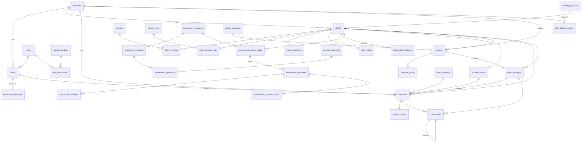

# Skema Database Therapedia — v2

**One Gate Integrated Clinic System** · MySQL 8.0 (InnoDB) · Laravel 11 · Sanctum · Redis

Dokumen ini adalah sumber kebenaran desain database backend. Skema mencakup **seluruh fitur prototype frontend** (`frontend/`): intake & pipeline, mesin asesmen, penjadwalan + kredit, finance, portal terapis, portal orang tua, dashboard, RBAC, dan **audit log untuk setiap aksi yang mengubah data**.

Disusun dengan skill `database-design` (`.claude/skills/database-design/SKILL.md`). Mapping field frontend ↔ kolom ada di bagian 08 dan `docs/guide/03-data-model.md`.

---

## Daftar Isi
- [00. Prinsip desain](#00-prinsip-desain)
- [01. Query utama & target performa](#01-query-utama--target-performa)
- [02. Peta modul & tabel](#02-peta-modul--tabel)
- [03. ERD](#03-erd)
- [04. Spesifikasi tabel](#04-spesifikasi-tabel)
- [05. Audit log](#05-audit-log)
- [06. Alur transaksi kritis](#06-alur-transaksi-kritis)
- [07. Strategi performa](#07-strategi-performa)
- [08. Mapping frontend ↔ database & keputusan enum](#08-mapping-frontend--database--keputusan-enum)
- [09. Urutan migration & seeder](#09-urutan-migration--seeder)
- [10. Catatan implementasi Laravel](#10-catatan-implementasi-laravel)

---

## 00. Prinsip desain

| # | Prinsip | Wujud di skema |
|---|---|---|
| 1 | **Indeks dari query, bukan dari kolom** | Setiap indeks komposit di bagian 04 menyebut query yang dilayani (lihat 01) |
| 2 | **Ledger sebagai sumber kebenaran kredit** | `credit_ledger` append-only; saldo di `client_packages` & `clients` adalah denormalisasi yang diperbarui di transaksi yang sama |
| 3 | **Tidak ada perubahan yang hilang** | `audit_logs` mencatat semua aksi + nilai lama/baru; pembatalan (undo) = aksi baru yang menunjuk aksi asal, bukan menghapus/menimpa |
| 4 | **Reversible by design** | Kolom `previous_status`, `credit_effect`, `reverses_ledger_id`, `reverts_audit_id` memungkinkan "completed lalu dibatalkan" tanpa kehilangan jejak |
| 5 | **Aman dari edit bersamaan** | Kolom `version` (optimistic lock) pada entity yang sering diubah → HTTP 409 |
| 6 | **Idempoten** | `credit_ledger.idempotency_key` UNIQUE mencegah potong kredit ganda |
| 7 | **Snapshot nilai transaksi** | Nama paket, harga, nama pelaku disalin saat transaksi agar histori tidak berubah ketika master diedit |
| 8 | **Baca cepat untuk dashboard** | `daily_branch_metrics` (ringkasan harian) + cache Redis master data |
| 9 | **Lookup table untuk daftar yang bisa diedit** | Layanan, kuadran, alasan cancel/discharge, tag keluhan = tabel ber-PK `code` |
| 10 | **ENUM untuk siklus hidup tetap** | Status client/sesi/invoice/paket |

Konvensi umum (detail di skill): InnoDB `utf8mb4_0900_ai_ci`; PK `BIGINT UNSIGNED`; waktu `DATETIME` UTC; tanggal kalender `DATE`; slot `TIME`; uang `BIGINT UNSIGNED` rupiah utuh; soft delete hanya untuk entity bisnis; ledger & audit tidak pernah di-UPDATE/DELETE.

---

## 01. Query utama & target performa

Daftar ini adalah dasar desain indeks. Setiap halaman prototype dipetakan ke query utamanya.

| ID | Halaman / fitur | Query | Indeks yang melayani | Target DB p95 |
|---|---|---|---|---|
| Q1 | Weekly Calendar (Admin Schedule) | sesi 1 cabang, 1 minggu, opsional terapis | `schedules (branch_id, session_date, status)` · `schedules (therapist_id, session_date, start_time)` | < 30 ms |
| Q2 | Conflict check saat buat/pindah sesi | sesi aktif terapis X tanggal D yang overlap jam | `schedules (therapist_id, session_date, start_time)` | < 10 ms |
| Q3 | My Schedule (Terapis) | sesi terapis X rentang minggu | `schedules (therapist_id, session_date, start_time)` | < 20 ms |
| Q4 | Inquiry Pipeline (kanban) | client per cabang per status, urut terbaru | `clients (branch_id, status, created_at)` | < 30 ms |
| Q5 | Search client (nama / ortu / kode) | prefix nama / kode akses | `clients (child_name)`, `clients (parent_name)`, UNIQUE `client_access_code` | < 30 ms |
| Q6 | Active Clients roster + filter kredit | client `admitted` per cabang + saldo | `clients (branch_id, status, credit_balance)` | < 30 ms |
| Q7 | Birthday radar | client aktif per cabang per bulan lahir | `clients (branch_id, birth_month)` (generated column) | < 20 ms |
| Q8 | Detail client (kredit, sesi, invoice) | by id + relasi | PK + `schedules (client_id, session_date)` · `client_packages (client_id, status)` · `invoices (client_id, issued_at)` | < 30 ms |
| Q9 | Finance — antrean verifikasi | invoice `pending_verification` per cabang | `invoices (branch_id, status, issued_at)` | < 20 ms |
| Q10 | Finance — riwayat mutasi kredit | ledger semua client per cabang, terbaru, keyset | `credit_ledger (branch_id, created_at, id)` | < 30 ms |
| Q11 | Revenue dashboard | omzet `paid` per cabang per periode | `daily_branch_metrics (branch_id, metric_date)`; fallback `invoices (status, paid_at, branch_id)` | < 20 ms |
| Q12 | Inquiry / Schedule / Branch dashboard | KPI per cabang per periode | `daily_branch_metrics` | < 20 ms |
| Q13 | Kode kuesioner publik | lookup kode | UNIQUE `assessment_access_codes (code)` | < 5 ms |
| Q14 | Login ortu | lookup kode akses client | UNIQUE `clients (client_access_code)` | < 5 ms |
| Q15 | Audit timeline 1 client / 1 sesi | log per entity / per induk, terbaru | `audit_logs (subject_type, subject_id, occurred_at)` · `audit_logs (entity_type, entity_id, occurred_at)` | < 30 ms |
| Q16 | Audit per user / per aksi | aktivitas staf X atau aksi Y per periode | `audit_logs (actor_id, occurred_at)` · `audit_logs (action, occurred_at)` | < 50 ms |
| Q17 | Therapist summary | sesi `completed` terapis X per periode + status laporan | `schedules (therapist_id, session_date, start_time)` + `session_reports (schedule_id)` | < 30 ms |
| Q18 | Awaiting questionnaire | kode `issued` belum submit per cabang | `assessment_access_codes (status, issued_at)` + join client | < 30 ms |

Target API (server, p95): detail < 100 ms · list < 200 ms · aksi transaksional < 150 ms · dashboard < 100 ms.

---

## 02. Peta modul & tabel

| Modul | Tabel | Fungsi singkat |
|---|---|---|
| **A. Organisasi & akses** | `branches` | Cabang klinik |
| | `roles` | Role sistem & kustom |
| | `access_modules` | Daftar modul RBAC |
| | `role_permissions` | Matriks role × modul |
| | `users` | Staf internal + terapis (satu tabel) |
| | `therapist_availabilities` | Jam kerja terapis |
| **B. Master data** | `services` | Layanan intake (BOT-A, FOT-A, Consultation, …) |
| | `sensory_quadrants` | Kuadran sensori (AV/SN/RG/SK) |
| | `concern_tags` | Tag keluhan anak |
| | `cancel_reasons` | Alasan cancel + aturan kuota |
| | `discharge_reasons` | Alasan discharge |
| | `master_packages` | Katalog paket kredit |
| **C. Client & intake** | `clients` | Master anak + kredensial portal ortu |
| | `client_services` | Layanan dipilih (multi) |
| | `client_concern_tags` | Tag keluhan client |
| | `client_documents` | Tautan GDrive / dokumen |
| | `client_notes` | Catatan laporan asesmen & catatan umum |
| | `client_status_histories` | Riwayat tahap pipeline |
| **D. Asesmen** | `assessment_categories` | Instrumen (Sensory Profile 2, …) |
| | `assessment_sections` | Bagian/domain soal |
| | `assessment_questions` | Bank soal (6 tipe) |
| | `assessment_access_codes` | Kode kuesioner publik |
| | `assessment_responses` | Pengisian kuesioner (per revisi) |
| | `assessment_answers` | Jawaban per soal |
| | `assessment_quadrant_scores` | Skor kuadran per pengisian |
| **E. Penjadwalan** | `schedule_series` | Pola jadwal berulang |
| | `schedules` | Sesi terapi/asesmen |
| | `session_reports` | Laporan sesi 3 bagian + SOAP |
| **F. Keuangan & kredit** | `invoices` | Tagihan |
| | `payment_proofs` | Bukti transfer (riwayat upload) |
| | `client_packages` | Paket kredit milik client |
| | `credit_ledger` | Mutasi kredit append-only |
| **G. Audit & analitik** | `audit_logs` | Log semua aksi (partisi bulanan) |
| | `daily_branch_metrics` | Ringkasan harian per cabang |
| **H. Laravel bawaan** | `personal_access_tokens`, `cache`, `jobs`, `failed_jobs`, `job_batches` | Sanctum, cache, queue |

Total: 36 tabel domain + tabel bawaan Laravel.

---

## 03. ERD


`audit_logs` sengaja tanpa FK (partisi + data historis tetap ada walau entity dihapus).

---

## 04. Spesifikasi tabel

Notasi indeks: `idx_<tabel>_<kolom>` dan komentar `// Qn` = query di bagian 01 yang dilayani.

### A. Organisasi & akses

#### `branches`
```php
Schema::create('branches', function (Blueprint $table) {
    $table->id();
    $table->string('code', 20)->unique();            // EAST, CTL, WEST
    $table->string('name', 100);                      // East, Citraland, West
    $table->string('city', 50)->default('Surabaya');
    $table->text('address')->nullable();
    $table->string('phone', 30)->nullable();
    $table->boolean('is_active')->default(true);
    $table->timestamps();
    $table->softDeletes();
});
```

#### `roles`
Role sistem (`master`, `manager`, `admin_inquiry`, `admin_schedule`, `finance`, `therapist`) + role kustom buatan Master. Orang tua **tidak** memakai tabel ini (auth via `clients`).
```php
Schema::create('roles', function (Blueprint $table) {
    $table->id();
    $table->string('code', 50)->unique();             // master, admin_inquiry, custom_xxx
    $table->string('name', 100);
    $table->string('badge', 100)->nullable();
    $table->text('description')->nullable();
    $table->boolean('is_system')->default(false);     // role sistem tidak bisa dihapus
    $table->timestamps();
    $table->softDeletes();
});
```

#### `access_modules`
```php
Schema::create('access_modules', function (Blueprint $table) {
    $table->string('code', 50)->primary();            // revenue, inquiry_pipeline, weekly_calendar, finance, rbac, …
    $table->string('label', 100);
    $table->string('category', 50);                   // Financial, Inquiry, Scheduling, Administration, Clinical
    $table->text('description')->nullable();
    $table->unsignedSmallInteger('sort_order')->default(0);
});
```

#### `role_permissions`
```php
Schema::create('role_permissions', function (Blueprint $table) {
    $table->foreignId('role_id')->constrained()->cascadeOnDelete();
    $table->string('module_code', 50);
    $table->boolean('allowed')->default(false);
    $table->timestamps();
    $table->primary(['role_id', 'module_code']);
    $table->foreign('module_code')->references('code')->on('access_modules')->cascadeOnUpdate()->cascadeOnDelete();
});
```
Dibaca setiap request (policy) → **cache Redis** per role (`rbac:role:{id}`), invalidasi saat matriks diubah.

#### `users`
Staf internal & terapis dalam satu tabel. Atribut klinis nullable untuk non-terapis.
```php
Schema::create('users', function (Blueprint $table) {
    $table->id();
    $table->foreignId('role_id')->constrained()->restrictOnDelete();
    $table->foreignId('branch_id')->nullable()->constrained()->nullOnDelete(); // null = semua cabang (master)
    $table->string('name', 150);
    $table->string('email', 150)->unique();
    $table->string('password');
    $table->string('phone', 30)->nullable();
    $table->string('title', 50)->nullable();          // S.Tr.Kes, S.Ft, A.Md.OT
    $table->string('specialty', 150)->nullable();
    $table->text('bio')->nullable();
    $table->boolean('is_active')->default(true);
    $table->timestamp('last_login_at')->nullable();
    $table->rememberToken();
    $table->timestamps();
    $table->softDeletes();

    $table->index(['branch_id', 'role_id', 'is_active'], 'idx_users_branch_role');   // daftar staf/terapis per cabang
});
```

#### `therapist_availabilities`
```php
Schema::create('therapist_availabilities', function (Blueprint $table) {
    $table->id();
    $table->foreignId('user_id')->constrained()->cascadeOnDelete();
    $table->unsignedTinyInteger('day_of_week');       // 1=Senin … 7=Minggu (ISO-8601)
    $table->time('start_time');
    $table->time('end_time');
    $table->timestamps();
    $table->index(['user_id', 'day_of_week'], 'idx_avail_user_day');                 // Q2
});
```

### B. Master data

Semua tabel master di-cache Redis (`master:{tabel}`), invalidasi saat create/update/delete.

#### `services`
```php
Schema::create('services', function (Blueprint $table) {
    $table->string('code', 50)->primary();            // b_ota, f_ota, school_companion, consult_wo_report, consult_w_report
    $table->string('label', 150);
    $table->string('short_label', 60);
    $table->enum('category', ['assessment', 'consultation', 'therapy']);
    $table->text('description')->nullable();
    $table->boolean('is_active')->default(true);      // nonaktif = tidak bisa dipilih, label tetap tampil
    $table->unsignedSmallInteger('sort_order')->default(0);
    $table->timestamps();
});
```

#### `sensory_quadrants`
```php
Schema::create('sensory_quadrants', function (Blueprint $table) {
    $table->string('code', 10)->primary();            // AV, SN, RG, SK
    $table->string('title', 60);
    $table->string('full_name', 100);
    $table->text('description')->nullable();
    $table->string('color', 20)->default('slate');
    $table->unsignedSmallInteger('sort_order')->default(0);
    $table->timestamps();
});
```

#### `concern_tags`
```php
Schema::create('concern_tags', function (Blueprint $table) {
    $table->string('code', 30)->primary();            // speech, sensory, motor, behavior, social, school
    $table->string('label', 100);
    $table->boolean('is_active')->default(true);
});
```

#### `cancel_reasons`
Aturan kuota cancel dibuat **data-driven** sehingga kebijakan klinik bisa diubah tanpa deploy.
```php
Schema::create('cancel_reasons', function (Blueprint $table) {
    $table->string('code', 40)->primary();            // sakit, izin_keluarga, bentrok_sekolah, tanpa_kabar, lainnya, reschedule_dibatalkan
    $table->string('label', 120);
    $table->boolean('counts_toward_quota')->default(true);   // false = netral (mis. reschedule_dibatalkan)
    $table->boolean('always_penalty')->default(false);       // true = langsung potong kredit (opsi kebijakan "tanpa kabar")
    $table->boolean('is_system')->default(false);            // tidak muncul di dropdown manual
    $table->boolean('is_active')->default(true);
});
```

#### `discharge_reasons`
```php
Schema::create('discharge_reasons', function (Blueprint $table) {
    $table->string('code', 40)->primary();            // moving, financial, conflict_schedule, expectation_not_met, graduate, other
    $table->string('label', 120);
    $table->boolean('is_active')->default(true);
});
```

#### `master_packages`
```php
Schema::create('master_packages', function (Blueprint $table) {
    $table->id();
    $table->string('code', 50)->unique();             // pkg-reguler, pkg-vip, pkg-consult
    $table->string('name', 150);
    $table->unsignedSmallInteger('credits');
    $table->unsignedBigInteger('price');              // rupiah
    $table->text('description')->nullable();
    $table->boolean('is_active')->default(true);
    $table->timestamps();
    $table->softDeletes();
});
```

### C. Client & intake

#### `clients`
Master anak, entity pipeline, **sekaligus entity login portal ortu** (`client_access_code`).
```php
Schema::create('clients', function (Blueprint $table) {
    $table->id();
    $table->string('client_code', 30)->unique();      // CLI-2026-0001 (nomor rekam medis internal)
    $table->foreignId('branch_id')->constrained()->restrictOnDelete();

    // Biodata
    $table->string('child_name', 120);
    $table->string('child_nickname', 60)->nullable();
    $table->enum('gender', ['male', 'female']);
    $table->date('date_of_birth');
    $table->unsignedTinyInteger('birth_month')->storedAs('MONTH(date_of_birth)');   // Q7 birthday radar
    $table->string('parent_name', 120);
    $table->string('parent_relationship', 30)->default('mother');
    $table->string('parent_phone', 30);               // WhatsApp
    $table->string('parent_email', 150)->nullable();
    $table->text('address')->nullable();
    $table->boolean('has_school_companion')->default(false);

    // Pipeline & outcome
    $table->enum('status', [
        'inquiry', 'service_selected', 'assessment_scheduled', 'assessment_done',
        'admitted', 'done_consult', 'done_assessment', 'discontinued', 'discharged',
    ])->default('inquiry');
    $table->enum('final_outcome', ['admitted', 'done_consult', 'done_assessment', 'discontinued'])->nullable();
    $table->timestamp('status_changed_at')->nullable();
    $table->date('date_of_join')->nullable();
    $table->date('date_of_discharge')->nullable();
    $table->string('discharge_reason_code', 40)->nullable();
    $table->text('discharge_note')->nullable();

    // Denormalisasi kredit (sumber kebenaran: credit_ledger) — diperbarui di transaksi yang sama
    $table->integer('credit_balance')->default(0);    // Σ remaining_credit paket aktif; 0 = Frozen
    $table->unsignedSmallInteger('cancel_count_total')->default(0);

    // Kredensial portal ortu
    $table->string('client_access_code', 20)->unique();   // TDC-XXXX — Q14
    $table->string('access_pin_hash')->nullable();        // opsional PIN tambahan
    $table->timestamp('last_login_at')->nullable();

    $table->unsignedInteger('version')->default(1);
    $table->foreignId('created_by')->nullable()->constrained('users')->nullOnDelete();
    $table->foreignId('updated_by')->nullable()->constrained('users')->nullOnDelete();
    $table->timestamps();
    $table->softDeletes();

    $table->foreign('discharge_reason_code')->references('code')->on('discharge_reasons');
    $table->index(['branch_id', 'status', 'created_at'], 'idx_clients_pipeline');        // Q4
    $table->index(['branch_id', 'status', 'credit_balance'], 'idx_clients_roster');      // Q6
    $table->index(['branch_id', 'birth_month'], 'idx_clients_birthday');                 // Q7
    $table->index('child_name', 'idx_clients_child_name');                               // Q5 prefix search
    $table->index('parent_name', 'idx_clients_parent_name');                             // Q5
});
```
Catatan:
- **Frozen** tidak disimpan sebagai status; diturunkan dari `credit_balance = 0` (sesuai frontend).
- Search nama memakai prefix (`LIKE 'abc%'`). Jika butuh search di tengah kata, tambahkan `FULLTEXT(child_name, parent_name)` (ngram parser).
- Login ortu: throttle per IP & per kode (Laravel RateLimiter) karena kode pendek.

#### `client_services`
```php
Schema::create('client_services', function (Blueprint $table) {
    $table->foreignId('client_id')->constrained()->cascadeOnDelete();
    $table->string('service_code', 50);
    $table->timestamp('selected_at')->useCurrent();
    $table->foreignId('selected_by')->nullable()->constrained('users')->nullOnDelete();
    $table->primary(['client_id', 'service_code']);
    $table->foreign('service_code')->references('code')->on('services');
    $table->index('service_code', 'idx_client_services_service');                         // funnel per layanan
});
```

#### `client_concern_tags`
```php
Schema::create('client_concern_tags', function (Blueprint $table) {
    $table->foreignId('client_id')->constrained()->cascadeOnDelete();
    $table->string('tag_code', 30);
    $table->primary(['client_id', 'tag_code']);
    $table->foreign('tag_code')->references('code')->on('concern_tags');
});
```

#### `client_documents`
```php
Schema::create('client_documents', function (Blueprint $table) {
    $table->id();
    $table->foreignId('client_id')->constrained()->cascadeOnDelete();
    $table->enum('type', ['gdrive_folder', 'referral', 'observation_video', 'report', 'other'])->default('gdrive_folder');
    $table->string('label', 150)->nullable();
    $table->string('url', 500);
    $table->foreignId('created_by')->nullable()->constrained('users')->nullOnDelete();
    $table->timestamps();
    $table->softDeletes();
    $table->index(['client_id', 'type'], 'idx_client_docs_client');
});
```

#### `client_notes`
Catatan teks panjang dipisah dari `clients` agar baris hot table tetap ramping.
```php
Schema::create('client_notes', function (Blueprint $table) {
    $table->id();
    $table->foreignId('client_id')->constrained()->cascadeOnDelete();
    $table->enum('type', ['assessment_report', 'intake', 'general']);
    $table->text('body');
    $table->foreignId('created_by')->nullable()->constrained('users')->nullOnDelete();
    $table->foreignId('updated_by')->nullable()->constrained('users')->nullOnDelete();
    $table->timestamps();
    $table->softDeletes();
    $table->index(['client_id', 'type', 'created_at'], 'idx_client_notes_client');
});
```

#### `client_status_histories`
Timeline bisnis pipeline (ditampilkan ke user). Detail teknis tetap di `audit_logs`.
```php
Schema::create('client_status_histories', function (Blueprint $table) {
    $table->id();
    $table->foreignId('client_id')->constrained()->cascadeOnDelete();
    $table->string('from_status', 30)->nullable();
    $table->string('to_status', 30);
    $table->enum('trigger', ['manual', 'service_selected', 'code_issued', 'questionnaire_submitted', 'session_completed', 'outcome', 'discharge', 'revert']);
    $table->text('note')->nullable();
    $table->foreignId('changed_by')->nullable()->constrained('users')->nullOnDelete();  // null = sistem / ortu
    $table->timestamp('changed_at')->useCurrent();
    $table->index(['client_id', 'changed_at'], 'idx_csh_client');
    $table->index(['to_status', 'changed_at'], 'idx_csh_status');                        // funnel & tren
});
```

### D. Mesin asesmen

#### `assessment_categories`
```php
Schema::create('assessment_categories', function (Blueprint $table) {
    $table->id();
    $table->string('code', 50)->unique();             // cat-001
    $table->string('name', 200);                      // Child Sensory Profile 2 (Winnie Dunn…)
    $table->string('standard_title', 150)->nullable();
    $table->string('author', 150)->nullable();
    $table->string('domain', 150)->nullable();
    $table->json('scoring_key')->nullable();          // {"0": "Tidak berlaku", … "5": "Hampir selalu"}
    $table->boolean('is_active')->default(true);
    $table->unsignedInteger('version')->default(1);
    $table->timestamps();
    $table->softDeletes();
});
```

#### `assessment_sections`
```php
Schema::create('assessment_sections', function (Blueprint $table) {
    $table->id();
    $table->foreignId('category_id')->constrained('assessment_categories')->cascadeOnDelete();
    $table->string('title', 150);                     // Pemrosesan AUDITORI
    $table->string('lead_text', 150)->nullable();     // "Anakku ..."
    $table->unsignedSmallInteger('sort_order')->default(0);
    $table->timestamps();
    $table->index(['category_id', 'sort_order'], 'idx_sections_category');
});
```

#### `assessment_questions`
```php
Schema::create('assessment_questions', function (Blueprint $table) {
    $table->id();
    $table->foreignId('category_id')->constrained('assessment_categories')->cascadeOnDelete(); // denormalisasi untuk load 1 query
    $table->foreignId('section_id')->constrained('assessment_sections')->cascadeOnDelete();
    $table->unsignedSmallInteger('item_no');
    $table->string('quadrant_code', 10)->nullable();
    $table->enum('question_type', ['scale_0_5', 'range', 'multiple_choice', 'checkbox_multi', 'free_text', 'yes_no'])->default('scale_0_5');
    $table->text('question');
    $table->json('options')->nullable();              // pilihan untuk multiple_choice / checkbox_multi
    $table->smallInteger('range_min')->nullable();
    $table->smallInteger('range_max')->nullable();
    $table->string('range_min_label', 60)->nullable();
    $table->string('range_max_label', 60)->nullable();
    $table->boolean('is_required')->default(true);
    $table->unsignedSmallInteger('sort_order')->default(0);
    $table->timestamps();
    $table->softDeletes();

    $table->foreign('quadrant_code')->references('code')->on('sensory_quadrants');
    $table->index(['category_id', 'section_id', 'sort_order'], 'idx_questions_form');  // render form
});
```

#### `assessment_access_codes`
```php
Schema::create('assessment_access_codes', function (Blueprint $table) {
    $table->id();
    $table->string('code', 20)->unique();             // ASM-XXXX — Q13
    $table->foreignId('client_id')->constrained()->cascadeOnDelete();
    $table->foreignId('category_id')->constrained('assessment_categories')->restrictOnDelete();
    $table->enum('status', ['issued', 'submitted', 'revoked', 'expired'])->default('issued');
    $table->foreignId('issued_by')->nullable()->constrained('users')->nullOnDelete();
    $table->timestamp('issued_at')->useCurrent();
    $table->timestamp('expires_at')->nullable();
    $table->timestamp('last_submitted_at')->nullable();
    $table->timestamps();

    $table->index(['client_id', 'category_id'], 'idx_codes_client');
    $table->index(['status', 'issued_at'], 'idx_codes_awaiting');                         // Q18
});
```

#### `assessment_responses`
Setiap submit = 1 baris (revisi). Submit ulang **tidak menimpa** — revisi lama tetap ada, yang terbaru `is_latest = 1`.
```php
Schema::create('assessment_responses', function (Blueprint $table) {
    $table->id();
    $table->foreignId('access_code_id')->constrained('assessment_access_codes')->cascadeOnDelete();
    $table->foreignId('client_id')->constrained()->cascadeOnDelete();
    $table->foreignId('category_id')->constrained('assessment_categories')->restrictOnDelete();
    $table->unsignedSmallInteger('revision')->default(1);
    $table->boolean('is_latest')->default(true);
    $table->string('respondent_name', 120)->nullable();
    $table->string('respondent_relation', 30)->nullable();
    $table->unsignedSmallInteger('answered_count');
    $table->timestamp('submitted_at')->useCurrent();
    $table->string('ip_address', 45)->nullable();
    $table->timestamps();

    $table->unique(['access_code_id', 'revision'], 'uq_responses_revision');
    $table->index(['client_id', 'category_id', 'is_latest'], 'idx_responses_latest');    // hasil terbaru per client
});
```

#### `assessment_answers`
```php
Schema::create('assessment_answers', function (Blueprint $table) {
    $table->id();
    $table->foreignId('response_id')->constrained('assessment_responses')->cascadeOnDelete();
    $table->foreignId('question_id')->constrained('assessment_questions')->restrictOnDelete();
    $table->unsignedSmallInteger('item_no');          // snapshot
    $table->string('quadrant_code', 10)->nullable();  // snapshot
    $table->text('answer_text');                      // "4 - Sering (75%)"
    $table->json('answer_values')->nullable();        // checkbox_multi
    $table->smallInteger('score')->nullable();
    $table->unique(['response_id', 'question_id'], 'uq_answers_question');
});
```

#### `assessment_quadrant_scores`
Dihitung **server** saat submit (Σ score per kuadran). Disimpan agar laporan & dashboard tidak menghitung ulang.
```php
Schema::create('assessment_quadrant_scores', function (Blueprint $table) {
    $table->foreignId('response_id')->constrained('assessment_responses')->cascadeOnDelete();
    $table->string('quadrant_code', 10);
    $table->unsignedSmallInteger('raw_score');
    $table->unsignedSmallInteger('item_count');
    $table->string('classification', 40)->nullable(); // mis. "Much More Than Others"
    $table->primary(['response_id', 'quadrant_code']);
    $table->foreign('quadrant_code')->references('code')->on('sensory_quadrants');
});
```

### E. Penjadwalan

#### `schedule_series`
Pola jadwal berulang (multi-hari, N minggu) agar operasi "ubah/batalkan seluruh seri" efisien.
```php
Schema::create('schedule_series', function (Blueprint $table) {
    $table->id();
    $table->foreignId('client_id')->constrained()->cascadeOnDelete();
    $table->foreignId('branch_id')->constrained()->restrictOnDelete();
    $table->json('pattern');                          // [{"day":1,"start":"09:00","end":"10:00","therapist_id":7,"client_package_id":3,"type":"therapy"}]
    $table->unsignedTinyInteger('weeks');             // default 12
    $table->date('starts_on');
    $table->date('ends_on');
    $table->foreignId('created_by')->nullable()->constrained('users')->nullOnDelete();
    $table->timestamps();
    $table->index(['client_id', 'starts_on'], 'idx_series_client');
});
```

#### `schedules`
Tabel paling sering dibaca (kalender). Teks laporan dipisah ke `session_reports` agar baris tetap ramping.
```php
Schema::create('schedules', function (Blueprint $table) {
    $table->id();
    $table->foreignId('branch_id')->constrained()->restrictOnDelete();
    $table->foreignId('client_id')->constrained()->restrictOnDelete();
    $table->foreignId('therapist_id')->constrained('users')->restrictOnDelete();
    $table->foreignId('series_id')->nullable()->constrained('schedule_series')->nullOnDelete();
    $table->foreignId('client_package_id')->nullable()->constrained()->nullOnDelete();   // null untuk asesmen
    $table->string('service_code', 50)->nullable();
    $table->enum('type', ['therapy', 'assessment', 'consultation'])->default('therapy');

    $table->date('session_date');
    $table->time('start_time');
    $table->time('end_time');

    $table->enum('status', ['scheduled', 'completed', 'cancelled', 'rescheduled', 'reschedule_pending'])->default('scheduled');
    $table->string('previous_status', 30)->nullable();   // status sebelum transisi terakhir — dipakai revert
    $table->enum('credit_effect', ['none', 'used', 'excused', 'penalty'])->default('none'); // efek kredit transisi terakhir

    // Cancel
    $table->string('cancel_reason_code', 40)->nullable();
    $table->text('cancel_note')->nullable();
    $table->timestamp('cancelled_at')->nullable();
    $table->foreignId('cancelled_by')->nullable()->constrained('users')->nullOnDelete();

    // Complete
    $table->timestamp('completed_at')->nullable();
    $table->foreignId('completed_by')->nullable()->constrained('users')->nullOnDelete();

    // Reschedule (jejak slot asal pertama) & reschedule menggantung
    $table->date('origin_date')->nullable();
    $table->time('origin_start_time')->nullable();
    $table->time('origin_end_time')->nullable();
    $table->foreignId('origin_therapist_id')->nullable()->constrained('users')->nullOnDelete();
    $table->timestamp('rescheduled_at')->nullable();
    $table->string('pending_reason_code', 40)->nullable();
    $table->text('pending_note')->nullable();
    $table->timestamp('pending_at')->nullable();

    $table->unsignedInteger('version')->default(1);
    $table->foreignId('created_by')->nullable()->constrained('users')->nullOnDelete();
    $table->foreignId('updated_by')->nullable()->constrained('users')->nullOnDelete();
    $table->timestamps();
    $table->softDeletes();

    $table->foreign('service_code')->references('code')->on('services');
    $table->foreign('cancel_reason_code')->references('code')->on('cancel_reasons');
    $table->foreign('pending_reason_code')->references('code')->on('cancel_reasons');

    $table->index(['branch_id', 'session_date', 'status'], 'idx_sch_calendar');           // Q1
    $table->index(['therapist_id', 'session_date', 'start_time'], 'idx_sch_therapist');   // Q2, Q3, Q17
    $table->index(['client_id', 'session_date'], 'idx_sch_client');                       // Q8, portal ortu
    $table->index(['status', 'session_date'], 'idx_sch_status');                          // auto-complete job, rekap
    $table->index('series_id', 'idx_sch_series');
});
```
Catatan:
- `rescheduled` = sudah pindah slot (slot baru di `session_date/start_time`, asal di `origin_*`).
- `reschedule_pending` diabaikan oleh conflict check (sama dengan frontend).
- **Frozen** tidak disimpan; diturunkan dari `clients.credit_balance = 0` saat render.

#### `session_reports`
Laporan sesi 3 bagian (prototype) + kolom SOAP terstruktur opsional.
```php
Schema::create('session_reports', function (Blueprint $table) {
    $table->id();
    $table->foreignId('schedule_id')->unique()->constrained()->cascadeOnDelete();
    $table->foreignId('client_id')->constrained()->cascadeOnDelete();         // denormalisasi: riwayat laporan per client
    $table->foreignId('therapist_id')->constrained('users')->restrictOnDelete();
    $table->text('activity_section')->nullable();     // Aktivitas sesi
    $table->text('note_section')->nullable();         // Catatan klinis (ringkas, prototype)
    $table->text('homework_section')->nullable();     // PR / home program
    $table->text('subjective_note')->nullable();      // SOAP opsional
    $table->text('objective_note')->nullable();
    $table->text('assessment_note')->nullable();
    $table->text('plan_note')->nullable();
    $table->unsignedTinyInteger('filled_sections')->storedAs(
        "(activity_section IS NOT NULL AND activity_section <> '') + (note_section IS NOT NULL AND note_section <> '') + (homework_section IS NOT NULL AND homework_section <> '')"
    );                                                // 0..3 → filter "laporan lengkap 3/3" (TherapistSummary)
    $table->unsignedInteger('version')->default(1);
    $table->foreignId('updated_by')->nullable()->constrained('users')->nullOnDelete();
    $table->timestamps();

    $table->index(['client_id', 'created_at'], 'idx_reports_client');
    $table->index(['therapist_id', 'filled_sections'], 'idx_reports_therapist');
});
```

### F. Keuangan & kredit

#### `invoices`
```php
Schema::create('invoices', function (Blueprint $table) {
    $table->id();
    $table->string('invoice_number', 30)->unique();   // INV-2026-0001 (sequence per tahun, dibuat server)
    $table->foreignId('client_id')->constrained()->restrictOnDelete();
    $table->foreignId('branch_id')->constrained()->restrictOnDelete();
    $table->foreignId('master_package_id')->nullable()->constrained()->nullOnDelete();
    $table->enum('invoice_type', ['package_purchase', 'package_renewal', 'assessment_fee', 'consultation_fee', 'single_session'])->default('package_purchase');

    // Snapshot saat tagihan diterbitkan
    $table->string('package_name', 150);
    $table->unsignedSmallInteger('credits')->default(0);
    $table->unsignedBigInteger('amount');             // rupiah

    $table->enum('status', ['unpaid', 'pending_verification', 'paid', 'rejected', 'void'])->default('unpaid');
    $table->timestamp('issued_at')->useCurrent();
    $table->date('due_date')->nullable();
    $table->timestamp('paid_at')->nullable();
    $table->foreignId('verified_by')->nullable()->constrained('users')->nullOnDelete();
    $table->timestamp('verified_at')->nullable();
    $table->text('rejection_reason')->nullable();
    $table->string('payment_method', 40)->default('bank_transfer');

    $table->unsignedInteger('version')->default(1);
    $table->foreignId('created_by')->nullable()->constrained('users')->nullOnDelete();
    $table->timestamps();
    $table->softDeletes();

    $table->index(['branch_id', 'status', 'issued_at'], 'idx_inv_queue');                // Q9
    $table->index(['client_id', 'issued_at'], 'idx_inv_client');                         // Q8, portal ortu
    $table->index(['status', 'paid_at', 'branch_id', 'amount'], 'idx_inv_revenue');     // Q11 fallback (covering)
});
```
Status: `unpaid` → (ortu upload) `pending_verification` → Finance `paid` / `rejected` (ortu bisa upload ulang → `pending_verification`). `void` = dibatalkan Finance (wajib alasan, tercatat audit).

#### `payment_proofs`
Riwayat setiap upload bukti (bukan hanya yang terakhir).
```php
Schema::create('payment_proofs', function (Blueprint $table) {
    $table->id();
    $table->foreignId('invoice_id')->constrained()->cascadeOnDelete();
    $table->string('file_path', 500);                 // storage privat (bukan public URL)
    $table->string('file_name', 200);
    $table->string('mime_type', 80);
    $table->unsignedInteger('file_size');
    $table->enum('uploaded_by_type', ['client', 'user']);
    $table->unsignedBigInteger('uploaded_by_id');
    $table->timestamp('uploaded_at')->useCurrent();
    $table->enum('review_status', ['pending', 'accepted', 'rejected'])->default('pending');
    $table->foreignId('reviewed_by')->nullable()->constrained('users')->nullOnDelete();
    $table->timestamp('reviewed_at')->nullable();
    $table->text('review_note')->nullable();
    $table->index(['invoice_id', 'uploaded_at'], 'idx_proofs_invoice');
});
```

#### `client_packages`
Paket kredit milik client. Satu client bisa punya banyak paket; saldo total = Σ `remaining_credit` paket aktif.
```php
Schema::create('client_packages', function (Blueprint $table) {
    $table->id();
    $table->foreignId('client_id')->constrained()->restrictOnDelete();
    $table->foreignId('invoice_id')->nullable()->unique()->constrained()->nullOnDelete(); // 1 invoice paid → 1 paket
    $table->foreignId('master_package_id')->nullable()->constrained()->nullOnDelete();
    $table->string('package_name', 150);              // snapshot
    $table->unsignedSmallInteger('total_credit');
    $table->smallInteger('remaining_credit');         // denormalisasi dari ledger; CHECK >= 0
    $table->unsignedSmallInteger('cancel_count')->default(0);
    $table->enum('status', ['active', 'depleted', 'expired'])->default('active');
    $table->timestamp('activated_at')->useCurrent();
    $table->date('expires_at')->nullable();
    $table->unsignedInteger('version')->default(1);
    $table->timestamps();

    $table->index(['client_id', 'status', 'activated_at'], 'idx_pkg_client');            // pilih paket aktif tertua (FIFO)
});
// MySQL 8.0.16+: CHECK constraint
DB::statement('ALTER TABLE client_packages ADD CONSTRAINT chk_pkg_remaining CHECK (remaining_credit >= 0 AND remaining_credit <= total_credit)');
```

#### `credit_ledger`
Mutasi kredit **append-only**. Tidak ada UPDATE/DELETE; koreksi = baris `reversal`.
```php
Schema::create('credit_ledger', function (Blueprint $table) {
    $table->id();
    $table->foreignId('client_id')->constrained()->restrictOnDelete();
    $table->foreignId('branch_id')->constrained()->restrictOnDelete();          // denormalisasi untuk Q10
    $table->foreignId('client_package_id')->nullable()->constrained()->restrictOnDelete();
    $table->foreignId('schedule_id')->nullable()->constrained()->nullOnDelete();
    $table->foreignId('invoice_id')->nullable()->constrained()->nullOnDelete();
    $table->enum('action', ['purchased', 'renewed', 'used', 'cancel_excused', 'cancel_penalty', 'reversal', 'manual_adjust']);
    $table->smallInteger('credit_change');            // +N / -1 / 0
    $table->smallInteger('package_balance_after');    // saldo paket setelah mutasi (audit cepat)
    $table->integer('client_balance_after');          // saldo total client setelah mutasi
    $table->unsignedSmallInteger('cancel_count_after')->nullable();
    $table->string('cancel_reason_code', 40)->nullable();
    $table->string('package_name', 150)->nullable();  // snapshot
    $table->text('note')->nullable();
    $table->foreignId('reverses_ledger_id')->nullable()->unique()->constrained('credit_ledger')->restrictOnDelete(); // 1 baris hanya bisa di-reverse sekali
    $table->string('idempotency_key', 100)->nullable()->unique();   // used:schedule:{id}:v{version}
    $table->char('batch_id', 26)->nullable();         // ULID — sama dengan audit_logs.batch_id
    $table->foreignId('created_by')->nullable()->constrained('users')->nullOnDelete();
    $table->timestamp('created_at', 3)->useCurrent();

    $table->index(['client_id', 'created_at'], 'idx_ledger_client');                     // riwayat per client
    $table->index(['branch_id', 'created_at', 'id'], 'idx_ledger_branch');               // Q10 keyset
    $table->index(['schedule_id', 'action'], 'idx_ledger_schedule');                     // revert sesi
});
```

### G. Audit & analitik

#### `audit_logs`
Dijelaskan lengkap di bagian 05.

#### `daily_branch_metrics`
Ringkasan harian per cabang untuk dashboard (Q11, Q12). Diperbarui incremental oleh listener event domain (queue) dan direkonsiliasi job malam.
```php
Schema::create('daily_branch_metrics', function (Blueprint $table) {
    $table->foreignId('branch_id')->constrained()->cascadeOnDelete();
    $table->date('metric_date');
    $table->unsignedInteger('new_inquiries')->default(0);
    $table->unsignedInteger('codes_issued')->default(0);
    $table->unsignedInteger('questionnaires_submitted')->default(0);
    $table->unsignedInteger('admitted')->default(0);
    $table->unsignedInteger('done_consult')->default(0);
    $table->unsignedInteger('done_assessment')->default(0);
    $table->unsignedInteger('discontinued')->default(0);
    $table->unsignedInteger('discharged')->default(0);
    $table->unsignedInteger('sessions_scheduled')->default(0);
    $table->unsignedInteger('sessions_completed')->default(0);
    $table->unsignedInteger('sessions_cancelled')->default(0);
    $table->unsignedInteger('cancel_penalties')->default(0);
    $table->unsignedInteger('credits_used')->default(0);
    $table->unsignedInteger('invoices_issued')->default(0);
    $table->unsignedBigInteger('invoiced_amount')->default(0);
    $table->unsignedBigInteger('revenue_paid')->default(0);
    $table->timestamp('refreshed_at')->useCurrent();
    $table->primary(['branch_id', 'metric_date']);
    $table->index('metric_date', 'idx_metrics_date');                                    // agregat all-branch
});
```
Metrik per layanan / per terapis bila dibutuhkan dashboard baru: tambahkan tabel ringkasan serupa (`daily_service_metrics`, `daily_therapist_metrics`) — jangan agregasi tabel transaksi saat request.

---

## 05. Audit log

### 5.1 Tujuan
Mencatat **setiap aksi yang mengubah data** (dan aksi baca sensitif tertentu) sehingga bisa dijawab: *siapa, melakukan apa, terhadap data apa, kapan, dari mana, nilai sebelum & sesudahnya, alasannya, dan apakah aksi itu kemudian dibatalkan*.

Contoh yang harus terlacak: Admin Schedule menandai sesi **completed** (kredit terpotong), lalu **membatalkan completed** itu (kredit kembali). Kedua aksi tercatat, saling terhubung, dan log pertama tidak berubah.

### 5.2 Skema
```php
// Tabel dipartisi bulanan → tanpa FK, PK komposit memuat kolom partisi.
Schema::create('audit_logs', function (Blueprint $table) {
    $table->unsignedBigInteger('id', true);          // auto increment
    $table->dateTime('occurred_at', 6);
    $table->char('batch_id', 26)->nullable();        // ULID: semua log dari 1 aksi user (mis. complete → sesi + ledger + client)
    $table->char('request_id', 26)->nullable();      // korelasi dengan log aplikasi

    // Pelaku (snapshot — tetap terbaca walau user dihapus/diganti nama)
    $table->enum('actor_type', ['user', 'client', 'system', 'public']);
    $table->unsignedBigInteger('actor_id')->nullable();
    $table->string('actor_name', 150)->nullable();
    $table->string('actor_role', 50)->nullable();
    $table->unsignedBigInteger('branch_id')->nullable();  // cakupan cabang data yang diubah

    // Aksi & objek
    $table->string('action', 64);                    // <entity>.<verb>, lihat katalog 5.4
    $table->string('entity_type', 40);               // schedule, client, invoice, credit_ledger, …
    $table->unsignedBigInteger('entity_id')->nullable();
    $table->string('entity_label', 200)->nullable(); // snapshot: "Sesi Kenzo 2026-10-02 09:00"
    $table->string('subject_type', 40)->nullable();  // induk untuk timeline (biasanya client)
    $table->unsignedBigInteger('subject_id')->nullable();

    // Perubahan
    $table->json('old_values')->nullable();          // hanya field yang berubah
    $table->json('new_values')->nullable();
    $table->json('meta')->nullable();                // efek turunan: {credit_change:-1, ledger_id:…, bulk_count:12}
    $table->text('reason')->nullable();              // wajib untuk cancel, revert, void, discharge, manual_adjust
    $table->unsignedBigInteger('reverts_audit_id')->nullable(); // log asal yang dibatalkan oleh aksi ini

    // Konteks teknis
    $table->enum('source', ['web', 'api', 'public_form', 'system', 'import'])->default('web');
    $table->string('ip_address', 45)->nullable();
    $table->string('user_agent', 255)->nullable();

    $table->primary(['id', 'occurred_at']);
    $table->index(['entity_type', 'entity_id', 'occurred_at'], 'idx_audit_entity');      // Q15
    $table->index(['subject_type', 'subject_id', 'occurred_at'], 'idx_audit_subject');   // Q15 timeline client
    $table->index(['actor_id', 'occurred_at'], 'idx_audit_actor');                       // Q16
    $table->index(['action', 'occurred_at'], 'idx_audit_action');                        // Q16
    $table->index(['branch_id', 'occurred_at'], 'idx_audit_branch');
    $table->index('batch_id', 'idx_audit_batch');
    $table->index('reverts_audit_id', 'idx_audit_reverts');
});

// Partisi bulanan (dibuat via migration raw SQL; job bulanan menambah partisi berikutnya)
DB::statement("
  ALTER TABLE audit_logs PARTITION BY RANGE (TO_DAYS(occurred_at)) (
    PARTITION p2026_10 VALUES LESS THAN (TO_DAYS('2026-11-01')),
    PARTITION p2026_11 VALUES LESS THAN (TO_DAYS('2026-12-01')),
    PARTITION pmax     VALUES LESS THAN MAXVALUE
  )
");
```

### 5.3 Aturan penulisan
1. **Satu transaksi**: log ditulis di transaksi DB yang sama dengan perubahan data. Jika bisnis gagal/rollback, log ikut batal; tidak ada log "palsu" dan tidak ada perubahan tanpa log.
2. **Append-only**: user DB aplikasi hanya punya `INSERT, SELECT` pada `audit_logs`. Tambahan proteksi:
   ```sql
   CREATE TRIGGER audit_logs_no_update BEFORE UPDATE ON audit_logs FOR EACH ROW
     SIGNAL SQLSTATE '45000' SET MESSAGE_TEXT = 'audit_logs bersifat append-only';
   CREATE TRIGGER audit_logs_no_delete BEFORE DELETE ON audit_logs FOR EACH ROW
     SIGNAL SQLSTATE '45000' SET MESSAGE_TEXT = 'audit_logs bersifat append-only';
   ```
   Penghapusan data lama hanya lewat `DROP/EXCHANGE PARTITION` oleh DBA (arsip), bukan DELETE.
3. **Hanya field yang berubah** di `old_values`/`new_values` (hemat storage, mudah dibaca). Field sensitif (password, PIN, token) **tidak pernah** dicatat; diganti `"[redacted]"`.
4. **Snapshot pelaku & label** supaya log tetap bermakna walau data master berubah.
5. **Undo = log baru**: aksi pembatalan menulis `action = <entity>.<verb>_reverted` (atau aksi kebalikannya) dengan `reverts_audit_id` = id log asal dan `reason` wajib.
6. **Bulk**: satu log per entity yang berubah, semuanya berbagi `batch_id`, plus satu log ringkasan `schedule.bulk_completed` dengan `meta.count`.
7. **Aksi baca sensitif** yang dicatat: lihat bukti bayar, export/print laporan klinis, login/logout & login gagal.

### 5.4 Katalog kode aksi

| Entity | Aksi |
|---|---|
| auth | `auth.login`, `auth.logout`, `auth.login_failed`, `auth.client_login`, `auth.client_login_failed` |
| client | `client.created`, `client.updated`, `client.status_changed`, `client.services_updated`, `client.admitted`, `client.done_consult`, `client.done_assessment`, `client.discontinued`, `client.discharged`, `client.outcome_reverted`, `client.document_added`, `client.document_removed`, `client.note_saved`, `client.deleted`, `client.restored` |
| assessment | `assessment_code.issued`, `assessment_code.revoked`, `assessment_response.submitted` (actor `public`), `assessment_response.viewed`, `assessment_category.created/updated/deleted`, `assessment_question.created/updated/deleted` |
| schedule | `schedule.created`, `schedule.series_created`, `schedule.updated`, `schedule.completed`, `schedule.completion_reverted`, `schedule.cancelled`, `schedule.cancellation_reverted`, `schedule.rescheduled`, `schedule.marked_pending`, `schedule.pending_dropped`, `schedule.report_saved`, `schedule.bulk_completed`, `schedule.bulk_cancelled`, `schedule.bulk_rescheduled`, `schedule.deleted` |
| credit | `credit.package_activated`, `credit.used`, `credit.cancel_excused`, `credit.cancel_penalty`, `credit.reversed`, `credit.manual_adjusted` |
| invoice | `invoice.issued`, `invoice.proof_uploaded` (actor `client`), `invoice.proof_viewed`, `invoice.verified`, `invoice.rejected`, `invoice.voided`, `invoice.renewal_created` |
| master | `service.*`, `quadrant.*`, `package.*`, `cancel_reason.*`, `discharge_reason.*` (`created/updated/deleted`) |
| access | `user.created`, `user.updated`, `user.deactivated`, `user.deleted`, `role.created`, `role.updated`, `role.deleted`, `role.permission_changed` |
| report | `report.printed`, `report.exported` |

### 5.5 Skenario: completed lalu dibatalkan

**Langkah 1** — Admin Fajar (id 5) menandai sesi #9012 (Kenzo, client #9) completed. Satu transaksi, `batch_id = 01J…A`.

| tabel | isi |
|---|---|
| `schedules` #9012 | `status: scheduled → completed`, `previous_status = scheduled`, `credit_effect = used`, `completed_by = 5`, `version 3 → 4` |
| `client_packages` #31 | `remaining_credit 6 → 5` |
| `clients` #9 | `credit_balance 6 → 5` |
| `credit_ledger` #7001 | `action=used, credit_change=-1, schedule_id=9012, idempotency_key=used:schedule:9012:v3` |
| `audit_logs` #500 | `action=schedule.completed, entity=schedule#9012, subject=client#9, old={"status":"scheduled"}, new={"status":"completed"}, meta={"credit_change":-1,"ledger_id":7001}` |
| `audit_logs` #501 | `action=credit.used, entity=credit_ledger#7001, subject=client#9, new={"package_balance":5}` |

**Langkah 2** — Fajar sadar salah sesi dan membatalkan completed dengan alasan "Salah klik, sesi belum berlangsung". Transaksi baru, `batch_id = 01J…B`.

| tabel | isi |
|---|---|
| `schedules` #9012 | `status: completed → scheduled` (dari `previous_status`), `credit_effect = none`, `completed_at/by = null`, `version 4 → 5` |
| `client_packages` #31 | `remaining_credit 5 → 6` |
| `clients` #9 | `credit_balance 5 → 6` |
| `credit_ledger` #7002 | `action=reversal, credit_change=+1, reverses_ledger_id=7001` (#7001 tetap ada) |
| `audit_logs` #502 | `action=schedule.completion_reverted, reverts_audit_id=500, reason="Salah klik…", old={"status":"completed"}, new={"status":"scheduled"}, meta={"credit_change":1,"ledger_id":7002}` |
| `audit_logs` #503 | `action=credit.reversed, entity=credit_ledger#7002, reverts_audit_id=501` |

Jika sesi itu kemudian di-complete lagi, `idempotency_key = used:schedule:9012:v5` (versi berbeda) sehingga pemotongan baru sah dan tidak bentrok dengan #7001.

### 5.6 Query contoh
```sql
-- Timeline lengkap satu client (semua aksi pada client, sesi, invoice, kredit miliknya)
SELECT occurred_at, actor_name, action, entity_type, entity_id, old_values, new_values, reason
FROM audit_logs
WHERE subject_type = 'client' AND subject_id = 9
ORDER BY occurred_at DESC, id DESC
LIMIT 50;

-- Semua aksi yang pernah dibatalkan beserta pembatalannya
SELECT a.occurred_at AS done_at, a.actor_name AS done_by, a.action,
       r.occurred_at AS reverted_at, r.actor_name AS reverted_by, r.reason
FROM audit_logs r
JOIN audit_logs a ON a.id = r.reverts_audit_id
WHERE r.reverts_audit_id IS NOT NULL
  AND r.occurred_at >= '2026-10-01';

-- Aktivitas satu staf hari ini (keyset: tambahkan AND (occurred_at, id) < (:last_at, :last_id))
SELECT * FROM audit_logs
WHERE actor_id = 5 AND occurred_at >= CURDATE()
ORDER BY occurred_at DESC, id DESC LIMIT 50;
```

### 5.7 Retensi & volume
- Estimasi: ±3 cabang × ±400 aksi/hari ≈ 1.200 baris/hari ≈ 450 ribu/tahun (±0,5 KB/baris → ±250 MB/tahun). Partisi bulanan menjaga indeks kecil.
- Retensi online: **24 bulan**; partisi lebih lama di-`EXCHANGE` ke tabel arsip / di-export ke object storage (rekam medis & keuangan: simpan arsip ≥ 5 tahun sesuai kebijakan klinik).
- Job bulanan: tambah partisi bulan depan (`REORGANIZE PARTITION pmax`).

---

## 06. Alur transaksi kritis

Semua alur: `DB::transaction()`, kunci baris dengan `lockForUpdate()`, cek `version` (optimistic lock), tulis audit di transaksi yang sama. Respons error: 409 (versi berubah / bentrok jadwal), 422 (validasi).

### 6.1 Complete sesi (`POST /schedules/{id}/complete`)
1. Lock `schedules` (id) → cek `version` & status ∈ {scheduled, rescheduled}.
2. Jika `type = therapy`: lock `client_packages` aktif client (`ORDER BY activated_at` — FIFO; prioritas `client_package_id` sesi) → `remaining_credit -= 1` (CHECK ≥ 0), status `depleted` bila 0.
3. Insert `credit_ledger` (`used`, idempotency key) → update `clients.credit_balance`.
4. Update sesi: `status=completed`, `previous_status`, `credit_effect=used`, `completed_*`, `version+1`; upsert `session_reports`.
5. Jika `type = assessment` dan status client sebelum `assessment_done` → update `clients.status`, insert `client_status_histories` (`trigger=session_completed`).
6. Audit: `schedule.completed`, `credit.used`, (`client.status_changed`). Event → update `daily_branch_metrics` (queue).

### 6.2 Cancel sesi (`POST /schedules/{id}/cancel`)
1. Lock sesi + client. Ambil `cancel_reasons` (code).
2. Jika `counts_toward_quota`: `clients.cancel_count_total += 1`.
3. Penalti bila `always_penalty` **atau** `cancel_count_total > 3` (kuota): potong 1 kredit seperti 6.1 → ledger `cancel_penalty`, `credit_effect=penalty`. Selain itu ledger `cancel_excused` (0), `credit_effect=excused`.
4. Update sesi `cancelled` + alasan; audit `schedule.cancelled` (+ `credit.cancel_penalty`).

### 6.3 Revert (`POST /schedules/{id}/revert`, wajib `reason`)
| Dari | Ke | Efek |
|---|---|---|
| `completed` | `previous_status` | Bila `credit_effect=used`: ledger `reversal` (+1) untuk ledger `used` sesi ini; kembalikan status client bila transisi otomatis terjadi di batch yang sama |
| `cancelled` | `previous_status` | Bila `credit_effect=penalty`: reversal (+1). Bila kuota terhitung: `cancel_count_total -= 1` |
| `rescheduled` | slot `origin_*` | Cek bentrok slot asal dulu (409 bila terisi) |
Audit `*_reverted` dengan `reverts_audit_id`. Hak akses revert: `master`, `admin_schedule` (policy), opsional batas waktu (mis. ≤ 7 hari) via konfigurasi.

### 6.4 Buat / pindah sesi (conflict check)
1. `SELECT … FROM schedules WHERE therapist_id=? AND session_date=? AND status NOT IN ('cancelled','reschedule_pending') FOR UPDATE` (indeks `idx_sch_therapist`).
2. Cek overlap jam & `therapist_availabilities`. Bentrok → 409 dengan daftar sesi bentrok (kecuali `force=true` oleh role yang diizinkan; dicatat di audit `meta.forced=true`).
3. Insert/update. Seri berulang: insert batch dalam satu transaksi (`schedule_series` + N `schedules`).

### 6.5 Verifikasi pembayaran (`POST /invoices/{id}/verify`)
1. Lock invoice (status harus `pending_verification`) + cek `version`.
2. `approve`: invoice `paid`, `paid_at`, `verified_by`; insert `client_packages` (snapshot paket, `invoice_id` UNIQUE mencegah aktivasi ganda); ledger `purchased`/`renewed` (+N); update `clients.credit_balance`; `payment_proofs.review_status=accepted`.
3. `reject`: invoice `rejected` + `rejection_reason`; proof `rejected`.
4. Audit `invoice.verified`/`invoice.rejected` + `credit.package_activated`.

### 6.6 Transisi status client (`POST /clients/{id}/transition`)
Validasi transisi di server (alur maju otomatis = `advanceStatus` di `frontend/src/domain/client.js`; outcome manual bebas dari tahap mana pun, sesuai prototype). Selalu insert `client_status_histories` + audit `client.status_changed` (atau `client.admitted` dsb.). Admit: set `date_of_join`, tidak membuat paket (saldo 0 = frozen sampai Finance mengaktifkan paket).

---

## 07. Strategi performa

| Area | Strategi |
|---|---|
| **Indeks** | Komposit sesuai bagian 01; urutan kolom: equality (`branch_id`, `therapist_id`, `status`) → range (`session_date`, `issued_at`) → sort. Tidak ada indeks tunggal untuk kolom kardinalitas rendah |
| **Baris ramping** | Teks panjang dipisah (`session_reports`, `client_notes`); tabel hot (`schedules`, `clients`) hanya kolom yang difilter/ditampilkan di list |
| **Denormalisasi terkendali** | `clients.credit_balance`, `cancel_count_total`, `client_packages.remaining_credit`, `credit_ledger.branch_id`, `session_reports.client_id` — diperbarui di transaksi yang sama; job rekonsiliasi malam membandingkan dengan Σ ledger dan menulis audit `system` bila ada selisih |
| **Generated column** | `clients.birth_month`, `session_reports.filled_sections` → filter tanpa fungsi di WHERE (indeks tetap terpakai) |
| **Ringkasan dashboard** | `daily_branch_metrics` (PK `branch_id, metric_date`): dashboard 12 bulan = ≤ 3×365 baris. Update incremental via event + rebuild malam |
| **Cache** | Redis: master data (services, quadrants, packages, reasons, roles+permissions) TTL panjang + invalidasi saat tulis; hasil dashboard per (branch, periode) TTL 60 detik |
| **Pagination** | Keyset untuk `audit_logs`, `credit_ledger`, riwayat sesi; offset hanya untuk list kecil ber-filter |
| **N+1** | API Resource memakai `with()` eksplisit; aktifkan `Model::preventLazyLoading()` di non-produksi |
| **Payload** | List mengembalikan kolom ringkas (Resource khusus list), detail lengkap di endpoint detail |
| **Kalender** | Satu query per minggu per cabang (Q1) + `therapists`/`clients` ringkas dari cache; frontend tidak memanggil per sel |
| **Lock singkat** | `lockForUpdate` hanya pada baris yang diubah; transaksi tidak memanggil I/O eksternal (WA, upload) — itu dilakukan setelah commit via queue |
| **Partisi** | `audit_logs` per bulan. Tabel lain belum perlu (estimasi < 5 juta baris/5 tahun) |
| **Konfigurasi MySQL** | `innodb_buffer_pool_size` ≈ 60–70% RAM, `innodb_flush_log_at_trx_commit=1` (data finansial), slow query log ≥ 200 ms dipantau |
| **Skala lanjut** | Read replica untuk dashboard & laporan bila beban baca naik; koneksi persistent via Octane/PHP-FPM tuning |

Verifikasi: setiap query di bagian 01 diuji `EXPLAIN ANALYZE` dengan data seed ±50 ribu sesi; target `type` = `ref`/`range`, tanpa `Using filesort` untuk list utama.

---

## 08. Mapping frontend ↔ database & keputusan enum

### 8.1 Mapping field utama
| Frontend (`frontend/src`) | Database |
|---|---|
| `clients[].clientName / dob / parentContact / parentEmail` | `clients.child_name / date_of_birth / parent_phone / parent_email` |
| `clients[].serviceTypes[]` (+ legacy `serviceType`) | `client_services` |
| `clients[].gdriveClientLink` | `client_documents (type=gdrive_folder)` |
| `clients[].assessmentCodes[]` | `assessment_access_codes` |
| `clients[].assessmentAnswers[]` | `assessment_responses` + `assessment_answers` + `assessment_quadrant_scores` |
| `clients[].assessmentReportNote` | `client_notes (type=assessment_report)` |
| `clients[].includesSchoolCompanion` | `clients.has_school_companion` |
| `clients[].dischargeReason / dischargeNote` | `clients.discharge_reason_code / discharge_note` |
| perubahan status client | `client_status_histories` + `audit_logs` |
| `schedules[].date / startTime / endTime / therapistId` | `schedules.session_date / start_time / end_time / therapist_id` |
| `schedules[].creditPackageId` | `schedules.client_package_id` |
| `schedules[].rescheduledFrom{…}` | `schedules.origin_date / origin_start_time / origin_end_time / origin_therapist_id` |
| `schedules[].pendingFrom / pendingReason / pendingNote` | slot tetap + `pending_reason_code / pending_note / pending_at` |
| `schedules[].activitySection / noteSection / homeworkSection` | `session_reports.*` |
| `schedules[].recurrenceRule / isRecurring` | `schedule_series` + `schedules.series_id` |
| `credits.masterPackages[]` | `master_packages` |
| `credits.records[].packages[]` | `client_packages` |
| `credits.records[].history[]` | `credit_ledger` |
| `credits.records[].cancelCountTotal` | `clients.cancel_count_total` |
| `credits.invoices[]` (+ `proof*`) | `invoices` + `payment_proofs` |
| `therapists[]` + `staffUsers[]` | `users` (+ `therapist_availabilities`) |
| `rolesList[]` / `rbacPermissions` | `roles` / `role_permissions` (+ `access_modules`) |
| `master_services` / `master_quadrants` | `services` / `sensory_quadrants` |
| `CANCEL_REASONS`, `DISCHARGE_REASONS`, `CONCERN_TAGS` | `cancel_reasons`, `discharge_reasons`, `concern_tags` |
| dashboard (hitung di `useMemo`) | `daily_branch_metrics` |

Konversi camelCase ↔ snake_case dilakukan otomatis oleh `frontend/src/services/http/httpClient.js`.

### 8.2 Keputusan enum (menyelesaikan gap prototype vs schema v1)
| Area | Keputusan v2 | Dampak ke frontend |
|---|---|---|
| `clients.status` | Ikut prototype: 9 status termasuk `service_selected`, `assessment_done`, `discharged` | Tidak ada |
| `schedules.status` | `scheduled, completed, cancelled, rescheduled, reschedule_pending`; **frozen = turunan** | Tidak ada |
| `cancel_reasons` | Lookup table + flag `counts_toward_quota`, `always_penalty` | Default: semua alasan manual dihitung kuota, `reschedule_dibatalkan` netral → sama dengan prototype |
| Aturan penalti | Kuota 3 cancel per client (prototype) + opsi kebijakan `always_penalty` per alasan | Tidak ada (opsi baru di backend) |
| `invoices.status` | `unpaid, pending_verification, paid, rejected, void` | Frontend perlu menampilkan `pending_verification` & `rejected` (sekarang: bukti diunggah tetap `unpaid`) |
| `client_packages.status` | `active, depleted, expired` | Tambah `expired` (paket berbatas waktu, opsional) |
| `credit_ledger.action` | `purchased, renewed, used, cancel_excused, cancel_penalty, reversal, manual_adjust` | Label baru di riwayat kredit Finance |
| Revert sesi | Endpoint baru `POST /schedules/{id}/revert` | Fitur UI "Batalkan completed/cancel" (belum ada di prototype) |

---

## 09. Urutan migration & seeder

1. `branches`, `roles`, `access_modules`, `role_permissions`, `users`, `therapist_availabilities`
2. `services`, `sensory_quadrants`, `concern_tags`, `cancel_reasons`, `discharge_reasons`, `master_packages`
3. `clients`, `client_services`, `client_concern_tags`, `client_documents`, `client_notes`, `client_status_histories`
4. `assessment_categories`, `assessment_sections`, `assessment_questions`, `assessment_access_codes`, `assessment_responses`, `assessment_answers`, `assessment_quadrant_scores`
5. `invoices`, `payment_proofs`, `client_packages`
6. `schedule_series`, `schedules`, `session_reports`
7. `credit_ledger`
8. `audit_logs` (+ partisi + trigger), `daily_branch_metrics`
9. Laravel bawaan: `personal_access_tokens`, `cache`, `jobs`, `failed_jobs`, `job_batches`

Seeder:
- **Wajib (produksi)**: branches, roles + role_permissions (dari `frontend/src/domain/rbac.js`), access_modules, services (`INTAKE_SERVICES`), sensory_quadrants, concern_tags, cancel_reasons, discharge_reasons, master_packages, akun master awal.
- **Demo/staging**: konversi seed frontend (`frontend/src/data/*.seed.json`, `scripts/generate_demo_seed.py`) — tanggal relatif hari ini, ledger dibangun dari histori agar saldo konsisten.
- Setelah seed demo: jalankan `metrics:rebuild` untuk mengisi `daily_branch_metrics`.

---

## 10. Catatan implementasi Laravel

- **Auth ganda**: guard `staff` (model `User`, Sanctum token) dan guard `client` (model `Client` sebagai `Authenticatable`, login dengan `client_access_code` + throttle). Token ability membedakan portal.
- **Policy**: berbasis `role_permissions` (modul) + aturan aksi (mis. `SchedulePolicy::complete` hanya `master`/`admin_schedule`), selaras `frontend/src/domain/rbac.js` & `canManageSchedule`.
- **Scope cabang**: global scope `BranchScope` pada model ber-`branch_id` untuk user non-master.
- **Action class per use-case** (`CompleteSessionAction`, `CancelSessionAction`, `RevertSessionAction`, `VerifyPaymentAction`, `TransitionClientAction`) — padanan hook use-case frontend; semua aturan kredit mengikuti `frontend/src/domain/credit.js` (acuan test).
- **AuditLogger** service:
  ```php
  AuditLogger::batch(function () use ($schedule, $dto) {
      $before = $schedule->only(['status']);
      // … perubahan data …
      AuditLogger::log('schedule.completed', $schedule, old: $before, new: $schedule->only(['status']),
          subject: $schedule->client, meta: ['credit_change' => -1, 'ledger_id' => $ledger->id]);
  });
  ```
  `batch()` membungkus `DB::transaction` + membuat `batch_id` (ULID). Trait `Auditable` (observer) hanya untuk CRUD master sederhana; aksi bisnis selalu eksplisit agar `reason`, `subject`, dan `meta` lengkap.
- **Optimistic lock**: request mengirim `version`; `update … where version = ?` → 0 baris = `409 Conflict` (frontend: `ApiError.isConflict`).
- **Event & queue**: `SessionCompleted`, `InvoicePaid`, `ClientStatusChanged` → listener update `daily_branch_metrics`, kirim notifikasi WA (setelah commit).
- **Kontrak API & endpoint**: `docs/guide/10-api-migration.md` dan `frontend/src/services/api/endpoints.js`.
