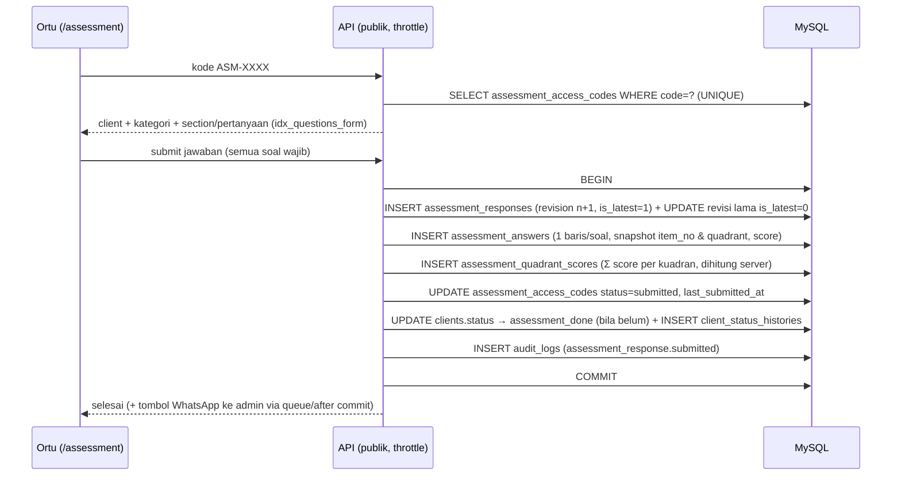
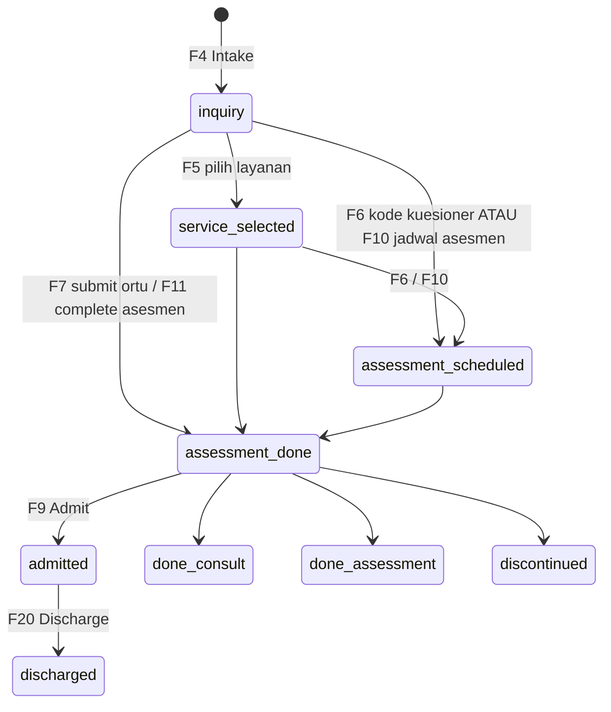
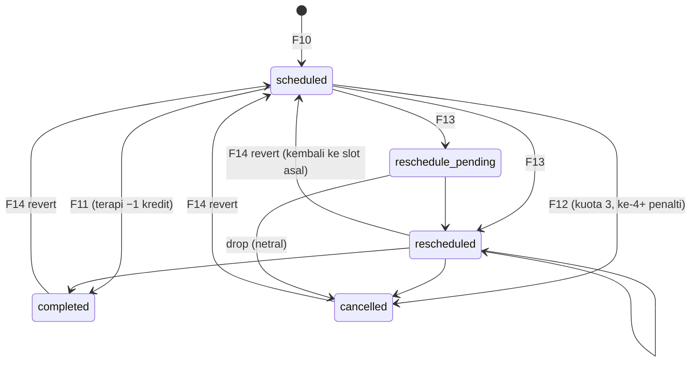
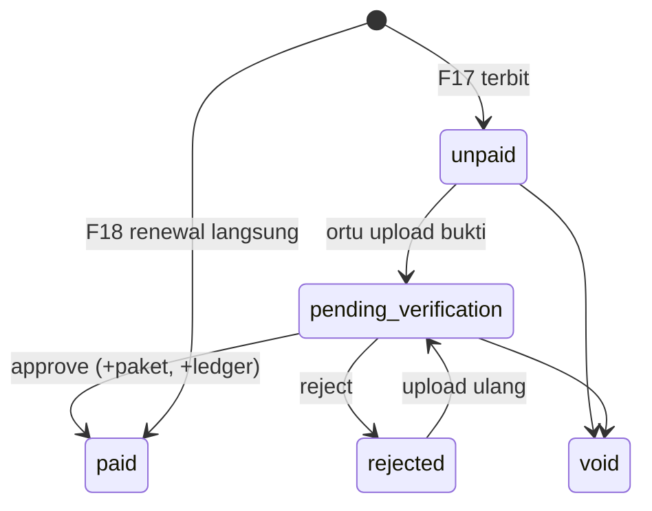

# Technical Workflow Therapedia

Alur pemrosesan data **per fitur**: cara fitur berjalan, tabel database yang terdampak, dan urutan operasinya. Ditulis sebagai bahan review desain database (`schema.md` v2) dan acuan implementasi backend Laravel 11 + MySQL 8.

Sumber: perilaku frontend saat ini (`frontend/src/domain`, `features/*/hooks`, `docs/guide/`) dan desain DB (`schema.md`). Bila keduanya berbeda, perbedaan ditandai **[Beda]** dan dikumpulkan di bagian [Catatan untuk review database](#catatan-untuk-review-database).

## Daftar isi
- [0. Konvensi yang berlaku di semua alur](#0-konvensi-yang-berlaku-di-semua-alur)
- [1. Peta fitur → tabel](#1-peta-fitur--tabel)
- [A. Akses & administrasi](#a-akses--administrasi): F1 Login, F2 User/Role/RBAC, F3 Master data
- [B. Inquiry & asesmen](#b-inquiry--asesmen): F4 Intake, F5 Layanan, F6 Kode kuesioner, F7 Isi kuesioner (ortu), F8 Mesin kuesioner, F9 Outcome & dokumen
- [C. Penjadwalan & sesi](#c-penjadwalan--sesi): F10 Buat jadwal, F11 Complete, F12 Cancel, F13 Reschedule/Pending/Drop, F14 Revert, F15 Bulk, F16 Laporan sesi
- [D. Keuangan & kredit](#d-keuangan--kredit): F17 Invoice & pembayaran, F18 Renewal langsung, F19 Paket kredit
- [E. Client aktif](#e-client-aktif): F20 Active client, Frozen, Discharge
- [F. Portal & pelaporan](#f-portal--pelaporan): F21 Portal terapis, F22 Portal ortu, F23 Dashboard, F24 Audit log
- [G. Job terjadwal & notifikasi](#g-job-terjadwal--notifikasi): F25
- [Lampiran A. State machine](#lampiran-a-state-machine)
- [Lampiran B. Matriks tabel × fitur](#lampiran-b-matriks-tabel--fitur)
- [Catatan untuk review database](#catatan-untuk-review-database)

---

## 0. Konvensi yang berlaku di semua alur

| Aturan | Penjelasan |
|---|---|
| **Satu use-case = satu endpoint transaksional** | Aksi lintas tabel (complete, cancel, verify, transition) dikerjakan satu request di dalam `DB::transaction()`. Frontend tidak merangkai beberapa request. |
| **Audit di transaksi yang sama** | Setiap aksi yang mengubah data menulis `audit_logs` lewat `AuditLogger::batch()`. Rollback = log ikut batal. Satu aksi user = satu `batch_id` (ULID). |
| **Kunci & versi** | Baris yang diubah dikunci `lockForUpdate()`. Entity ber-`version` (`clients`, `schedules`, `invoices`, `client_packages`, `session_reports`, `assessment_categories`) dicek optimistic lock: `UPDATE … WHERE version = ?`, 0 baris → HTTP 409. |
| **Ledger sumber kebenaran** | `credit_ledger` append-only. Saldo di `client_packages.remaining_credit` dan `clients.credit_balance` adalah denormalisasi, diperbarui di transaksi yang sama. Koreksi = baris `reversal`, tidak pernah UPDATE/DELETE. |
| **Idempoten** | Potong kredit memakai `credit_ledger.idempotency_key` UNIQUE (`used:schedule:{id}:v{version}`); aktivasi paket memakai `client_packages.invoice_id` UNIQUE. |
| **Data turunan tidak disimpan** | Frozen = `clients.credit_balance = 0`. KPI dashboard = VIEW. Skor kuadran disimpan hanya karena dihitung sekali saat submit. |
| **Alasan = string bebas** | `schedules.cancel_reason`, `pending_reason`, `clients.discharge_reason`, `credit_ledger.cancel_reason` berisi code pilihan cepat atau teks custom. Tanpa FK ke `cancel_reasons` / `discharge_reasons`. |
| **Scope cabang** | Role non-master hanya melihat/mengubah data `branch_id` miliknya (`BranchScope`). Master bisa semua cabang. |
| **Status client hanya maju (otomatis)** | `advanceStatus` melompat ke tahap tertinggi yang tercapai, tidak mundur. Outcome manual boleh dari tahap mana pun. Setiap perubahan status = 1 baris `client_status_histories` + audit `client.status_changed`. |
| **Efek samping eksternal setelah commit** | Notifikasi WA lewat queue `database` dengan `afterCommit`, tidak di dalam transaksi. |
| **Tanggal WIB** | Kolom bisnis `*_date` adalah generated column `DATE(ts + INTERVAL 7 HOUR)` agar dashboard tidak salah hari. |

Notasi tabel dampak: **C** = insert, **U** = update, **D** = delete, **R** = baca/lock.

---

## 1. Peta fitur → tabel

| Fitur | Tabel yang diubah (C/U/D) | Tabel yang dibaca |
|---|---|---|
| F1 Login | `personal_access_tokens`(C), `users`(U `last_login_at`), `clients`(U `last_login_at`), `audit_logs`(C) | `users`, `clients`, `roles`, `role_permissions` |
| F2 User/Role/RBAC | `users`, `roles`, `role_permissions` (C/U/D), `audit_logs` | `access_modules`, `branches` |
| F3 Master data | `services`, `sensory_quadrants`, `cancel_reasons`, `discharge_reasons`, `master_packages`, `audit_logs` | tabel pemakai (untuk pengaman hapus) |
| F4 Intake | `clients`(C), `client_status_histories`(C), `audit_logs` | `branches` |
| F5 Layanan | `client_services`(C/D), `clients`(U status), `client_status_histories`(C), `audit_logs` | `services` |
| F6 Kode kuesioner | `assessment_access_codes`(C/D), `clients`(U status), `client_status_histories`(C), `audit_logs` | `assessment_categories` |
| F7 Isi kuesioner | `assessment_responses`(C/U), `assessment_answers`(C), `assessment_quadrant_scores`(C), `assessment_access_codes`(U), `clients`(U status), `client_status_histories`(C), `audit_logs` | `assessment_questions`, `sensory_quadrants` |
| F8 Mesin kuesioner | `assessment_categories`, `assessment_sections`, `assessment_questions` (C/U/D), `audit_logs` | `sensory_quadrants` |
| F9 Outcome & dokumen | `clients`(U), `client_status_histories`(C), `client_documents`, `audit_logs` | — |
| F10 Buat jadwal | `schedules`(C), `schedule_series`(C), `clients`+`client_status_histories` (bila asesmen), `audit_logs` | `schedules` (cek bentrok), `client_packages`, `users` |
| F11 Complete | `schedules`(U), `client_packages`(U), `clients`(U), `credit_ledger`(C), `session_reports`(C/U), `client_status_histories`(C bila asesmen), `audit_logs` | — |
| F12 Cancel | `schedules`(U), `clients`(U), `client_packages`(U bila penalti), `credit_ledger`(C), `audit_logs` | `client_packages` |
| F13 Reschedule/Pending/Drop | `schedules`(U), `audit_logs` | `schedules` (cek bentrok) |
| F14 Revert | `schedules`, `credit_ledger`(C reversal), `client_packages`, `clients`, `audit_logs` | `audit_logs` (log asal) |
| F15 Bulk | sama dengan aksi tunggal, satu `batch_id` | — |
| F16 Laporan sesi | `session_reports`(C/U), `audit_logs` | `schedules` |
| F17 Invoice & bayar | `invoices`, `payment_proofs`, `client_packages`(C), `credit_ledger`(C), `clients`(U), `audit_logs` | `master_packages` |
| F18 Renewal langsung | `invoices`(C paid), `client_packages`(C), `credit_ledger`(C), `clients`(U), `audit_logs` | `master_packages` |
| F19 Paket kredit | `master_packages`(C), `client_packages`(U via job expire) | — |
| F20 Active client | `clients`(U discharge), `client_status_histories`(C), `audit_logs` | `client_packages`, `credit_ledger`, `schedules` |
| F21 Portal terapis | `session_reports`(C/U) | `schedules`, `clients`, `v_therapist_sessions` |
| F22 Portal ortu | `payment_proofs`(C), `invoices`(U) | `schedules` (completed), `session_reports`, `client_packages`, `invoices` |
| F23 Dashboard | — (baca saja) | view `v_daily_*`, `v_therapist_sessions`, `v_invoice_queue` |
| F24 Audit log | — (baca saja; `audit_logs` ditulis semua fitur) | `audit_logs` |
| F25 Job | `assessment_access_codes`, `client_packages`, `credit_ledger`, `clients`, `audit_logs`, partisi, tabel Laravel | — |

---

## A. Akses & administrasi

### F1. Login & sesi
**Layar:** `/login`, `/roles` (demo), portal ortu memakai kode akses. **Role:** semua.

**Staf (guard `staff`)**
1. Request email + password → `users` dicari by `email` (UNIQUE), `is_active = 1`, `deleted_at IS NULL`.
2. Password salah → audit `auth.login_failed` (actor `public`, IP, user-agent), throttle.
3. Berhasil → `users.last_login_at`, token Sanctum ke `personal_access_tokens` (ability = portal staf), audit `auth.login`.
4. Respons memuat role + `role_permissions` + `branch_id`; frontend menyimpan token (`tokenStore`).

**Orang tua (guard `client`)**
1. Request `client_access_code` (`TDC-XXXX`) **+ tanggal lahir anak** → lookup UNIQUE `clients.client_access_code` (Q14, < 5 ms), lalu cocokkan `date_of_birth`. Gagal selalu dengan pesan generik; throttle per IP & per kode.
2. Berhasil → `clients.last_login_at`, token Sanctum (tokenable = `Client`, ability = portal ortu), audit `auth.client_login`; gagal → `auth.client_login_failed`.

**Logout:** hapus token, audit `auth.logout`. 401 dari API → frontend logout otomatis.

| Tabel | Op | Efek |
|---|---|---|
| `users` / `clients` | R, U | `last_login_at` |
| `personal_access_tokens` | C/D | token login / logout |
| `audit_logs` | C | `auth.*` |

### F2. User, role, dan RBAC (Master)
**Layar:** `/master/users`, `/master/rbac`.

- **Tambah/ubah/nonaktifkan staf:** `users` C/U (soft delete untuk hapus; terapis yang punya sesi tidak boleh hard delete, FK `restrict`). Audit `user.created/updated/deactivated/deleted`. Field sensitif (`password`) dicatat `[redacted]`.
- **Role kustom:** `roles` C/U/D (`is_system = 1` tidak bisa dihapus). Audit `role.*`.
- **Matriks role × modul:** upsert `role_permissions (role_id, module_code, allowed)`. Audit `role.permission_changed` (old/new per modul).
- **Cek akses setiap request:** `PermissionService` memuat `role_permissions` role itu sekali per request (memo); modul valid dari `access_modules`. Hak **aksi** dicek policy (mis. hanya `master`/`admin_schedule` boleh ubah status sesi).

| Tabel | Op | Efek |
|---|---|---|
| `users` | C/U/D | akun staf & terapis (atribut klinis nullable) |
| `roles`, `role_permissions` | C/U/D | role & izin |
| `access_modules` | R | daftar modul (seed) |
| `audit_logs` | C | `user.*`, `role.*` |

### F3. Master data
**Layar:** `/admin-inquiry/master-data` (layanan, kuadran, alasan cancel, alasan discharge); `/finance` tab Packages (paket).

| Daftar | Tabel | Operasi UI | Pengaman |
|---|---|---|---|
| Layanan | `services` (PK `code`) | tambah, edit, aktif/nonaktif, hapus | tidak boleh dihapus bila dipakai `client_services`/`schedules.service_code` (FK `restrict`); nonaktifkan agar riwayat utuh |
| Kuadran | `sensory_quadrants` | tambah, edit, hapus | tidak boleh dihapus bila dipakai `assessment_questions`; minimal 1 kuadran |
| Alasan cancel / discharge | `cancel_reasons`, `discharge_reasons` | tambah, edit, aktif/nonaktif, hapus | tanpa pengaman: hanya sumber dropdown, riwayat menyimpan string sendiri |
| Paket kredit | `master_packages` | tambah (edit/hapus belum ada di UI) | `invoices.master_package_id` `nullOnDelete` + snapshot nama/harga di invoice |

Audit `service.*`, `quadrant.*`, `package.*`, `cancel_reason.*`, `discharge_reason.*` (`created/updated/deleted`). Tabel master kecil, dibaca by PK dan dimuat sekali per sesi (react-query `staleTime` panjang). Alasan sistem `reschedule_dibatalkan` bukan baris tabel (konstanta kode).

---

## B. Inquiry & asesmen

Urutan langkah di Client Detail **tidak dikunci**: layanan, kode kuesioner, dan jadwal asesmen boleh diisi dalam urutan apa pun. Status hanya melompat maju (lihat [Lampiran A](#lampiran-a-state-machine)). Setiap lompatan = 1 baris `client_status_histories`, tanpa baris untuk tahap yang dilewati.

### F4. New Intake
**Layar:** `/admin-inquiry/pipeline` (dialog New Intake). **Role:** admin_inquiry, master.

1. Validasi: nama anak (nama lengkap), tanggal lahir, nama ortu, WhatsApp, email. Catatan intake opsional.
2. Server membuat `client_code` (CLI-yyyy-nnnn) dan `client_access_code` (TDC-XXXX, UNIQUE dengan retry bila bentrok).
3. Insert `clients`: `status = inquiry`, `branch_id`, `birth_month` (generated), `intake_note` (opsional: keluhan utama / rujukan / catatan awal), `credit_balance = 0`, `cancel_count_total = 0`, `created_by`.
4. Insert `client_status_histories` (`from_status = NULL`, `to_status = inquiry`, `trigger = manual`).
5. Audit `client.created`.

| Tabel | Op | Efek |
|---|---|---|
| `clients` | C | biodata + kredensial portal ortu |
| `client_status_histories` | C | baris awal pipeline |
| `audit_logs` | C | `client.created` |

Edit biodata dan catatan intake (`EditIntakeDialog`): `clients` U (+`version`), audit `client.updated` (hanya field berubah).

### F5. Pilih layanan
**Layar:** Client Detail → `ServiceSelectionCard`.

1. Request daftar `service_code` baru (`PUT clients/{id}/services`), hanya layanan `services.is_active = 1`.
2. Sinkronisasi `client_services`: baris baru C (`selected_at`, `selected_by`), baris yang dilepas D. Tambah/lepas layanan **tidak** membuat history bila status tidak berubah.
3. Bila daftar tidak kosong dan status masih sebelum `service_selected` → `clients.status = service_selected`, history `trigger = service_selected`, audit `client.status_changed`.
4. Audit `client.services_updated` (old/new daftar).

Melepas semua layanan tidak memundurkan status.

### F6. Kode kuesioner
**Layar:** Client Detail → `QuestionnaireCodeCard`; `/admin-inquiry/assessments` → `GenerateCodeDialog`.

1. Pilih kategori kuesioner (`assessment_categories.is_active = 1`).
2. Insert `assessment_access_codes`: `code = ASM-XXXX` (UNIQUE, retry), `client_id`, `category_id`, `status = issued`, `issued_by`, `expires_at` (opsional).
3. Status client maju ke `assessment_scheduled` (dapat melompat dari `inquiry`) → history `trigger = code_issued` + audit `client.status_changed`.
4. Audit `assessment_code.issued`. Kode dibagikan ke ortu (link/WhatsApp).

Satu client boleh punya banyak kode (multi kategori).

**Hapus kode** (`DELETE clients/{id}/assessment-codes/{code}`; UI: tombol hapus di Questionnaire Code Generator): hanya kode `status = issued` (belum diisi ortu). Baris `assessment_access_codes` dihapus (tidak ada `assessment_responses` karena belum pernah diisi) dan hanya dicatat di `audit_logs` (`assessment_code.deleted`, `old_values` = kode, kategori, status). Tanpa revert. Kode `submitted` ditolak (409/422). Status client tidak dimundurkan. Link/kode yang sudah dibagikan ke ortu langsung tidak valid (kode tidak ditemukan).

### F7. Ortu mengisi kuesioner (publik)
**Layar:** `/assessment` (tanpa login). **Aktor audit:** `public`.



Aturan: kode `expired` atau yang sudah dihapus ditolak; `score` = angka di awal jawaban (`"4 - Sering"` → 4); submit ulang membuat **revisi baru**, revisi lama tetap ada. Baca hasil oleh staf (`/admin-inquiry/parent-assessment/:id`, `/therapist/parent-assessment/:id`) mengambil revisi `is_latest = 1` (`idx_responses_latest`); dicatat `assessment_response.viewed`.

| Tabel | Op | Efek |
|---|---|---|
| `assessment_access_codes` | R, U | `status = submitted`, `last_submitted_at` |
| `assessment_responses` | C, U | revisi baru; revisi lama `is_latest = 0`; `ip_address`, `respondent_*` |
| `assessment_answers` | C | satu baris per soal (snapshot) |
| `assessment_quadrant_scores` | C | `raw_score`, `item_count`, `classification` per kuadran |
| `clients` | U | `status = assessment_done` (maju saja) |
| `client_status_histories` | C | `trigger = questionnaire_submitted` |
| `audit_logs` | C | `assessment_response.submitted` |

Dashboard "Awaiting questionnaire" (Q18): kode `issued` belum submit, `idx_codes_awaiting (status, issued_at)`.

### F8. Mesin kuesioner (Master)
**Layar:** `/admin-inquiry/assessments`. CRUD `assessment_categories` (`version`, `scoring_key` JSON), `assessment_sections`, `assessment_questions` (6 tipe soal, `options` JSON, soft delete). Audit `assessment_category.*`, `assessment_question.*`. Soal yang sudah dijawab tidak boleh hard delete (`assessment_answers.question_id` `restrict`) — gunakan soft delete; jawaban lama menyimpan snapshot `item_no` dan `quadrant_code`.

### F9. Outcome, dokumen, dan catatan client
**Layar:** Client Detail → `OutcomeCard`, `GDriveLinkCard`.

| Aksi | Efek di DB | Audit |
|---|---|---|
| **Admit** | `clients.status = admitted`, `final_outcome = admitted`, `date_of_join = today`. **Tidak** membuat paket: saldo 0 = Frozen sampai Finance mengaktifkan paket. History `trigger = outcome`. | `client.admitted` |
| **Done Consult** / **Done Assessment** | `status` + `final_outcome` = `done_consult` / `done_assessment`; history `outcome` | `client.done_consult` / `client.done_assessment` |
| **Discontinue** | `status = discontinued`, `final_outcome = discontinued`; alasan wajib (`discharge_note`; prototype menandai `discharge_reason = "other"`). History `outcome` | `client.discontinued` |
| **Simpan link GDrive** | `client_documents` (`type = gdrive_folder`, `url`) | `client.document_added` |

Outcome boleh dari tahap mana pun (tidak dikunci). Semua lewat `POST clients/{id}/transition` (validasi + history + audit dalam satu transaksi). Pembatalan outcome (`client.outcome_reverted`) disediakan backend, belum ada di UI.

---

## C. Penjadwalan & sesi

### F10. Buat jadwal (single / berulang) + cek bentrok
**Layar:** Weekly Calendar (`AddScheduleModal`), Client Detail (jadwal asesmen). **Role:** master, admin_schedule.

1. **Cek bentrok** (juga preview live `GET schedules/conflicts`): `SELECT … FROM schedules WHERE therapist_id=? AND session_date=? AND status NOT IN ('cancelled','reschedule_pending') FOR UPDATE` (`idx_sch_therapist`). Tidak ada konsep jam kerja: **bentrok = terapis yang sama sudah handle client lain di jam yang overlap**. Bentrok → 409 + daftar sesi bentrok; role berwenang boleh `force=true` (audit `meta.forced = true`).
2. **Single:** insert 1 `schedules` (`status = scheduled`, `type`, `client_package_id` untuk terapi / `NULL` untuk asesmen, `service_code`, `session_date`, `start_time`, `end_time`).
3. **Pola berulang** (terapi, multi-hari, default 12 minggu): insert `schedule_series` (`pattern` JSON, `weeks`, `starts_on`, `ends_on`) + N `schedules` ber-`series_id`, satu transaksi.
4. **Sesi asesmen:** bila status client masih `inquiry`/`service_selected` → `clients.status = assessment_scheduled`, history `trigger = assessment_scheduled`, audit `client.status_changed`. Reschedule tidak memicu transisi.
5. Audit `schedule.created` atau `schedule.series_created`.

Client Frozen tetap boleh dijadwalkan (hanya ditandai di kalender).

| Tabel | Op | Efek |
|---|---|---|
| `schedules` | R(lock), C | sesi baru |
| `schedule_series` | C | pola berulang |
| `clients`, `client_status_histories` | U, C | hanya sesi asesmen |
| `audit_logs` | C | `schedule.created` / `series_created` |

**Baca kalender (Q1):** satu query per minggu per cabang, `idx_sch_calendar (branch_id, session_date, status, deleted_at)`; filter terapis memakai `idx_sch_therapist`. Frozen dihitung saat render dari `clients.credit_balance = 0`.

### F11. Complete sesi
**Endpoint:** `POST /schedules/{id}/complete`. **Role:** master, admin_schedule (terapis hanya mengisi laporan).

```mermaid
sequenceDiagram
  participant U as Admin Schedule
  participant A as API
  participant D as MySQL
  U->>A: complete(id, version, laporan?)
  A->>D: BEGIN; SELECT schedules FOR UPDATE (cek version, status scheduled/rescheduled)
  alt type = therapy
    A->>D: SELECT client_packages aktif FOR UPDATE (prioritas paket sesi, lalu FIFO activated_at)
    A->>D: UPDATE remaining_credit -1 (depleted bila 0)
    A->>D: INSERT credit_ledger (used, -1, idempotency_key)
    A->>D: UPDATE clients.credit_balance -1
  else type = assessment
    A->>D: UPDATE clients.status → assessment_done (bila belum) + INSERT client_status_histories
  end
  A->>D: UPDATE schedules (completed, previous_status, completed_at/by, version+1)
  A->>D: UPSERT session_reports (bila ada laporan)
  A->>D: INSERT audit_logs (schedule.completed, credit.used, client.status_changed)
  A->>D: COMMIT; queue WA (afterCommit)
```

| Tabel | Op | Efek |
|---|---|---|
| `schedules` | U | `status = completed`, `previous_status`, `credit_effect` (`used` untuk terapi, `none` untuk asesmen), `completed_*`, `version+1` |
| `client_packages` | U | `remaining_credit −1`, `status = depleted` bila 0 (**hanya terapi**) |
| `clients` | U | `credit_balance −1` (terapi); `status = assessment_done` (asesmen) |
| `credit_ledger` | C | `action = used`, `credit_change = −1`, `package_balance_after`, `client_balance_after`, `schedule_id`, `idempotency_key`, `batch_id` |
| `client_status_histories` | C | `trigger = session_completed` (asesmen) |
| `session_reports` | C/U | laporan 3 bagian bila dikirim |
| `audit_logs` | C | `schedule.completed`, `credit.used`, `client.status_changed` |

Aturan: asesmen **tidak** memotong kredit (tanpa paket). Complete ulang sesi yang sama tidak memotong lagi (status + `idempotency_key`). Bila tidak ada paket bersisa, tidak ada pemotongan (client sudah Frozen).

### F12. Cancel sesi
**Endpoint:** `POST /schedules/{id}/cancel` (alasan wajib, maks 150 karakter: pilihan cepat atau ketik sendiri).

1. Lock sesi + client; alasan = string dari request (tidak divalidasi ke `cancel_reasons`).
2. `clients.cancel_count_total += 1` → hitung ke-n.
3. **n ≤ 3 (kuota wajar):** `credit_ledger.action = cancel_excused`, `credit_change = 0`, `schedules.credit_effect = excused`.
4. **n > 3 (penalti):** pilih paket (paket sesi, atau FIFO), `remaining_credit −1`, `client_packages.cancel_count +1`, `clients.credit_balance −1`, ledger `cancel_penalty −1`, `credit_effect = penalty`. Bila client tidak punya paket → tidak ada yang dipotong (dicatat `cancel_excused`).
5. Update sesi `status = cancelled`, `cancel_reason`, `cancel_note`, `cancelled_at/by`.
6. Audit `schedule.cancelled` (+ `credit.cancel_excused` / `credit.cancel_penalty`, `meta.cancel_count`).

| Tabel | Op |
|---|---|
| `schedules` | U (`cancelled`, alasan, `credit_effect`) |
| `clients` | U (`cancel_count_total`, `credit_balance` bila penalti) |
| `client_packages` | U (`remaining_credit`, `cancel_count`) bila penalti |
| `credit_ledger` | C (`cancel_excused` / `cancel_penalty`, `cancel_reason`, `cancel_count_after`) |
| `audit_logs` | C |

Kuota 3 dihitung **per client sepanjang masa**, bukan per paket/periode. Lihat [catatan review](#catatan-untuk-review-database) tentang cancel sesi asesmen.

### F13. Reschedule, tandai pending, drop pending
**Role:** master, admin_schedule. Tidak ada efek kredit/kuota.

| Aksi | Efek di `schedules` | Audit |
|---|---|---|
| **Reschedule langsung** | wajib slot/terapis berbeda + lolos cek bentrok (409 bila bentrok). `status = rescheduled`, slot baru di `session_date/start_time/end_time/therapist_id`; jejak slot **asal pertama** di `origin_*` (tidak ditimpa pada reschedule berikutnya), `rescheduled_at`; `pending_*` dikosongkan | `schedule.rescheduled` |
| **Tandai pending** ("jadwal pengganti menyusul") | `status = reschedule_pending`, `pending_reason` (string), `pending_note`, `pending_at`; slot tetap; **diabaikan cek bentrok** | `schedule.marked_pending` |
| **Tetapkan jadwal pengganti** (dari pending) | sama dengan reschedule → `rescheduled` | `schedule.rescheduled` |
| **Drop pending** | `status = cancelled`, `cancel_reason = reschedule_dibatalkan`, `credit_effect = none`; tidak memanggil kredit, tidak masuk kuota (netral) | `schedule.pending_dropped` |

### F14. Revert (batalkan completed / cancel / reschedule)
**Layar:** `SessionDetailModal` → tombol "Batalkan Status Completed/Cancel (Revert)" pada sesi `completed`/`cancelled`, atau "Batalkan Pemindahan Jadwal (Revert)" pada sesi `rescheduled` (`RevertSessionPanel`: alasan wajib, pratinjau efek, diblokir bila slot sudah terisi). **Endpoint:** `POST /schedules/{id}/revert` (alasan wajib; role master/admin_schedule; opsional batas ≤ 7 hari). Frontend demo: `useSessionActions.revertSession` (UI sudah ada).

| Dari | Ke | Efek |
|---|---|---|
| `completed` | `previous_status` | bila `credit_effect = used`: ledger `reversal +1` (`reverses_ledger_id` → baris `used`, UNIQUE sehingga hanya sekali), `remaining_credit +1`, `credit_balance +1`; status client dikembalikan bila transisi otomatis terjadi di batch yang sama |
| `cancelled` | `previous_status` | bila `credit_effect = penalty`: reversal +1; bila kuota terhitung: `cancel_count_total −1` |
| `rescheduled` | `scheduled` di slot `origin_*` (tanggal, jam, terapis asal pertama) | cek bentrok slot asal dulu (409 bila terisi); `origin_*` & `rescheduled_at` dikosongkan; tanpa efek kredit/kuota. Bila sebelumnya `reschedule_pending`, hasilnya `scheduled` (status pending tidak dipulihkan) |

Audit `schedule.completion_reverted` / `cancellation_reverted` / `reschedule_reverted` dengan `reverts_audit_id` = log asal, plus `credit.reversed` (dan `client.status_changed` bila tahap client dikembalikan). Log asal tidak diubah.

**Contoh (kredit):** sesi #9012 di-complete → ledger #7001 `used −1` (saldo 6→5). Salah klik, di-revert → ledger #7002 `reversal +1`, `reverses_ledger_id = 7001` (saldo 5→6); #7001 tetap ada. Sesi di-complete lagi → ledger **#7003 `used −1`** (baris baru, `idempotency_key` versi baru). Bila di-revert lagi → ledger #7004 `reversal +1`, `reverses_ledger_id = 7003` (menunjuk baris `used` terbaru yang belum dibalik).

### F15. Aksi massal (bulk)
**Layar:** Weekly Calendar (pilih banyak chip). Satu endpoint `POST schedules/bulk/{action}`; **satu `batch_id`**; satu audit ringkasan (`schedule.bulk_*`, `meta.count`) + satu audit per sesi.

| Aksi | Aturan |
|---|---|
| Bulk complete | aturan sama dengan F11 per sesi (kredit terapi −1 per sesi, idempoten; asesmen memajukan pipeline) |
| Bulk revert | batalkan completed / cancelled / rescheduled sekaligus (alasan wajib, aturan F14 per sesi). Sesi berstatus lain dilewati; sesi yang slot-nya terisi (termasuk oleh sesi lain dalam batch yang sama) dilewati dan dilaporkan. Audit ringkasan `schedule.bulk_reverted` + log per sesi |
| Bulk reschedule | geser N hari / ke tanggal tertentu / ganti terapis; jejak `origin_*` seperti F13 |
| Bulk cancel mode **leave** | alasan `izin_keluarga`, aturan kuota sama dengan F12 |
| Bulk cancel mode **other** | alasan `lainnya`, tanpa perubahan kredit & kuota |

### F16. Laporan sesi (3 bagian)
**Layar:** `SessionDetailModal`, portal terapis (`SessionReportModal`). **Role:** terapis dan admin boleh menyimpan laporan kapan saja (tidak harus menunggu completed); hanya master/admin_schedule yang mengubah status.

1. `PUT schedules/{id}/report` → UPSERT `session_reports` (UNIQUE `schedule_id`): `activity_section`, `note_section`, `homework_section` (+ SOAP opsional), `client_id`/`therapist_id` didenormalisasi, `version`, `updated_by`.
2. `filled_sections` (generated 0..3) dipakai filter "laporan lengkap 3/3".
3. Audit `schedule.report_saved` (isi dicatat sebagai terisi/kosong, bukan teks klinis).

---

## D. Keuangan & kredit

### F17. Invoice, bukti bayar, dan verifikasi
**Layar:** Finance `/finance` (tab verification, billing, history), portal ortu `/client`.

```mermaid
sequenceDiagram
  participant F as Finance
  participant P as Ortu
  participant D as MySQL
  F->>D: terbitkan invoice (unpaid) + snapshot paket/harga
  P->>D: upload bukti (payment_proofs, file di storage privat) → invoice pending_verification
  F->>D: approve → invoice paid + client_packages (+N) + credit_ledger purchased/renewed + clients.credit_balance
  Note over F,D: reject → invoice rejected + alasan; ortu boleh upload ulang → pending_verification
```

**1. Terbitkan** (`POST invoices`, Finance): insert `invoices` — `invoice_number` dibuat server (INV-yyyy-nnnn per tahun, UNIQUE), `client_id`, `branch_id`, `master_package_id`, `invoice_type`, snapshot `package_name`/`credits`/`amount`, `status = unpaid`, `due_date`. Audit `invoice.issued`.

**2. Upload bukti** (`POST invoices/{id}/proof`, multipart, ortu): file ke storage privat (bukan URL publik; gambar dikompres, PDF diterima) → insert `payment_proofs` (`uploaded_by_type = client`, `review_status = pending`) → `invoices.status = pending_verification`. Audit `invoice.proof_uploaded` (actor `client`). Target: invoice terbaru client.

**3. Verifikasi** (`POST invoices/{id}/verify`, Finance), transaksi, invoice harus `pending_verification`, cek `version`:
- **Approve:** `invoices` → `paid` (`paid_at`, `verified_by/at`); insert `client_packages` (snapshot paket, `invoice_id` UNIQUE mencegah aktivasi ganda, `remaining_credit = total_credit`); insert `credit_ledger` (`purchased` bila pembelian pertama / `renewed` bila perpanjangan, `+N`); `clients.credit_balance += N` (client keluar dari Frozen); `payment_proofs.review_status = accepted`. Audit `invoice.verified`, `credit.package_activated`.
- **Reject:** `invoices.status = rejected`, `rejection_reason`; proof `rejected`. Audit `invoice.rejected`.
- **Void** (Finance, alasan wajib): `status = void`, audit `invoice.voided`.

Melihat bukti bayar dicatat `invoice.proof_viewed` (aksi baca sensitif).

| Tabel | Op | Efek |
|---|---|---|
| `invoices` | C, U | alur status `unpaid → pending_verification → paid / rejected / void` |
| `payment_proofs` | C, U | tiap upload = 1 baris (riwayat); `review_status` |
| `client_packages` | C | paket baru per invoice paid (bukan menambah paket lama) |
| `credit_ledger` | C | `purchased` / `renewed` |
| `clients` | U | `credit_balance` |
| `audit_logs` | C | `invoice.*`, `credit.package_activated` |

Antrean Finance (Q9): `v_invoice_queue` / `idx_inv_queue (branch_id, status, issued_at)`. Riwayat mutasi kredit (Q10): `credit_ledger` keyset `idx_ledger_branch (branch_id, created_at, id)`. Revenue (Q11): invoice `paid` per cabang/periode lewat `v_daily_revenue`.

### F18. Renewal langsung (kasir)
Pembayaran yang sudah diterima di kasir. `POST clients/{id}/renewals` (Finance): satu transaksi membuat `invoices` langsung `paid` (`invoice_type = package_renewal`), `client_packages`, `credit_ledger` (`renewed`), dan `clients.credit_balance`, **tanpa** upload/verifikasi. Audit `invoice.renewal_created` + `credit.package_activated`. Bila client belum punya record kredit, pembayaran yang disetujui tetap menghasilkan kredit.

### F19. Paket kredit
- **Master paket** (`master_packages`): nama, `credits`, `price`, aktif. Dibaca saat menerbitkan invoice; hasilnya disalin (snapshot) ke `invoices` dan `client_packages`, sehingga mengubah master tidak mengubah histori.
- **Pemilihan paket saat pakai kredit:** prioritas `schedules.client_package_id`, lalu FIFO (`idx_pkg_client (client_id, status, activated_at)`).
- **Saldo total** client = Σ `remaining_credit` paket aktif = `clients.credit_balance`. Satu paket per invoice.
- **Kedaluwarsa (opsional):** job `packages:expire` (lihat F25) bila paket dipakai dengan masa berlaku.

---

## E. Client aktif

### F20. Active clients, Frozen, birthday, discharge
**Layar:** `/admin-schedule/clients`, `/admin-schedule/clients/:id`.

- **Roster (Q6):** `clients` ber-`status = admitted` per cabang + saldo (`idx_clients_roster`). **Frozen** = `credit_balance = 0` (turunan, tidak disimpan).
- **Birthday radar (Q7):** `clients (branch_id, birth_month)` live, tanpa job.
- **Detail (Q8):** paket (`client_packages`), riwayat sesi (`idx_sch_client`), history kredit (`credit_ledger`), invoice.
- **Discharge** (`admitted → discharged`, alasan wajib: pilihan cepat atau ketik sendiri): `clients.status = discharged`, `date_of_discharge = today`, `discharge_reason` (string), `discharge_note`, history `trigger = discharge`, audit `client.discharged` (alasan di `reason`). Sesi mendatang **tidak** dibatalkan otomatis (perilaku prototype).

| Tabel | Op |
|---|---|
| `clients` | U (discharge) |
| `client_status_histories` | C |
| `audit_logs` | C |

---

## F. Portal & pelaporan

### F21. Portal terapis
**Layar:** `/therapist`, `/therapist/summary`, `/therapist/clients/:id`, `/print/client/:id`. Semua data difilter `therapist_id` milik user.

- **My Schedule (Q3):** `schedules` terapis X per minggu (`idx_sch_therapist`).
- **Aksi tulis hanya laporan sesi** (F16).
- **Summary (Q17):** `v_therapist_sessions` (JOIN `schedules` + `clients` + `session_reports`), filter periode/client/status laporan (`filled_sections`).
- **Detail & cetak client:** baca `clients`, `schedules`, `session_reports`, hasil asesmen (`assessment_responses` terbaru + skor kuadran). Cetak/ekspor laporan klinis dicatat `report.printed` / `report.exported`.

### F22. Portal orang tua
**Layar:** `/client` (mobile-first). Data milik `auth.clientId`.

- **Tagihan:** `invoices` terbaru + status; upload bukti (F17).
- **Kredit:** sisa total + per paket (`client_packages`).
- **Riwayat terapi:** hanya sesi `completed` (`idx_sch_client`) + laporan (`session_reports`: aktivitas, catatan, PR), filter tanggal, pagination.
- Tidak ada akses tulis selain upload bukti.

### F23. Dashboard & agregasi
Semua angka dibaca dari **VIEW** (bukan tabel ringkasan), selalu dengan filter cabang + rentang tanggal; periode memakai kolom tanggal WIB.

| Dashboard / layar | Query | Sumber |
|---|---|---|
| Revenue (master/manager) | Q11 | `v_daily_revenue` ← `invoices` (`idx_inv_paid_date`) |
| Schedule dashboard | Q12 | `v_daily_sessions` ← `schedules` (`idx_sch_calendar`) |
| Inquiry dashboard & branch performance | Q12 | `v_daily_pipeline` ← `client_status_histories` (`idx_csh_branch_date`) |
| Pemakaian/penambahan kredit | Q12 | `v_daily_credit_usage` ← `credit_ledger` (`idx_ledger_branch_date`) |
| Terapis summary | Q17 | `v_therapist_sessions` |
| Antrean finance | Q9 | `v_invoice_queue` |
| Pie alasan cancel / discharge | agregasi langsung | `schedules.cancel_reason`, `clients.discharge_reason` (string; kode pilihan cepat dikelompokkan per kode, teks custom ke "Lainnya") |

Tabel ringkasan `daily_branch_metrics` hanya dibuat bila `EXPLAIN ANALYZE` view > 100 ms (job `metrics:rebuild`).

### F24. Audit log
**Layar:** `/master/audit-logs`, `/manager/audit-logs` (modul RBAC `audit_logs`).

- **Tulis:** semua fitur di atas lewat `AuditLogger`; tabel `audit_logs` append-only (trigger menolak UPDATE/DELETE; user DB hanya INSERT/SELECT), dipartisi bulanan, tanpa FK.
- **Baca:** filter (pencarian, cabang, periode default 7 hari, kategori, role pelaku), keyset pagination. Manager terkunci ke cabangnya; log global hanya terlihat master.
- **Timeline per client/sesi/invoice (Q15):** `idx_audit_subject`, `idx_audit_entity`. **Per staf/aksi (Q16):** `idx_audit_actor`, `idx_audit_action`.
- **Undo:** aksi pembatalan = log baru dengan `reverts_audit_id`; UI menampilkan rantai "sudah dibatalkan" / "membatalkan aksi" dan entri dalam satu `batch_id`.
- Aksi catatan lengkap: `schema.md` §5.4.

---

## G. Job terjadwal & notifikasi

### F25. Laravel Scheduler (WIB, `withoutOverlapping`, `onOneServer`, `chunkById(500)`, idempoten, audit `actor_type = system`)

| Jam | Job | Efek data |
|---|---|---|
| 00:30 harian | `assessment-codes:expire` | `assessment_access_codes` `issued` lewat `expires_at` → `expired` |
| 01:00 harian | `packages:expire` | paket `active` lewat `expires_at` → `expired`; ledger `expired` (−sisa); `clients.credit_balance` dikurangi |
| 02:00 harian | `credits:reconcile` | bandingkan Σ `credit_ledger` vs `client_packages.remaining_credit`, `clients.credit_balance`, `cancel_count_total`; selisih diperbaiki dari ledger + audit `credit.reconciled` + peringatan ke Master |
| tgl 1, 03:00 | `audit:partitions` | tambah partisi `audit_logs` bulan depan; arsipkan partisi > 24 bulan |
| 03:30 harian | backup DB | `mysqldump --single-transaction` + binlog |
| 04:00 harian | housekeeping | prune token Sanctum, failed jobs, cache kedaluwarsa |
| Minggu 04:30 | `db:analyze` | `ANALYZE TABLE` tabel transaksi utama |
| 07:00 harian | `schedules:overdue-digest` | ringkasan sesi lewat tanggal belum complete/cancel ke Admin Schedule (**tidak** auto-complete) |
| 08:00 harian | `invoices:overdue-reminder` | pengingat WA invoice `unpaid` lewat `due_date` (status tidak berubah) |

**Notifikasi (queue `database`, setelah commit):** event `SessionCompleted`, `InvoicePaid`, `ClientStatusChanged` → listener kirim WA. Tidak ada listener pengisi ringkasan.

**Sengaja tanpa job:** dashboard (view), Frozen, birthday radar, kuota cancel/penalti, skor kuadran.

---

## Lampiran A. State machine

**Client (`clients.status`)**

Otomatis hanya maju; tombol outcome boleh dari tahap mana pun.

**Sesi (`schedules.status`)**


**Invoice (`invoices.status`)**


**Kode kuesioner (`assessment_access_codes.status`):** `issued → submitted` (bisa submit ulang = revisi baru), `issued → expired` (job, bila dipakai), `issued → (dihapus)` oleh admin (tercatat di audit).

**Paket (`client_packages.status`):** `active → depleted` (sisa 0) | `expired` (job).

---

## Lampiran B. Matriks tabel × fitur

C = insert, U = update, D = delete, R = baca/lock.

| Tabel | Ditulis oleh | Dibaca oleh |
|---|---|---|
| `branches` | seed/admin | semua (scope cabang) |
| `roles`, `role_permissions` | F2 (C/U/D) | tiap request (policy) |
| `access_modules` | seed | F2 |
| `users` | F1 (U login), F2 (C/U/D) | F10 (terapis), F21, F23 |
| `services` | F3 | F5, F10, dashboard |
| `sensory_quadrants` | F3 | F7, F8, hasil asesmen |
| `cancel_reasons`, `discharge_reasons` | F3 | UI dropdown saja (tanpa FK) |
| `master_packages` | F3/F19 (C) | F17, F18 |
| `clients` | F1 (U), F4 (C), F5/F6/F7/F9/F10/F11 (status), F11/F12/F14/F17/F18 (saldo, kuota), F20 (discharge) | hampir semua |
| `client_services` | F5 | dashboard funnel, F10 |
| `client_documents` | F9 | Client Detail |
| `client_status_histories` | F4, F5, F6, F7, F9, F10, F11, F14, F20 (C) | `v_daily_pipeline`, timeline client |
| `assessment_categories/sections/questions` | F8 | F6, F7 |
| `assessment_access_codes` | F6 (C, D bila belum diisi), F7 (U), F25 (U expire) | F7, Q18 |
| `assessment_responses/answers/quadrant_scores` | F7 (C) | hasil asesmen (F21, Client Detail) |
| `schedule_series` | F10 | F10 (ubah/batal seri) |
| `schedules` | F10 (C), F11–F15 (U) | kalender, portal, dashboard, F25 |
| `session_reports` | F11, F16 (C/U) | F21, F22, `v_therapist_sessions` |
| `invoices` | F17, F18 (C/U) | F17, F22, F23 |
| `payment_proofs` | F17 (C/U) | F17, `v_invoice_queue` |
| `client_packages` | F17, F18 (C), F11/F12/F14 (U), F25 (U expire) | F11, F12, F22 |
| `credit_ledger` | F11, F12, F14, F17, F18, F25 (C saja) | riwayat kredit, `v_daily_credit_usage`, reconcile |
| `audit_logs` | semua fitur (C saja) | F24 |
| tabel Laravel (`personal_access_tokens`, `sessions`, `cache`, `jobs`, …) | F1, F25 | framework |

---

## Catatan untuk review database

Temuan saat menyusun dokumen ini.

| # | Topik | Detail | Status |
|---|---|---|---|
| 1 | Jumlah tabel | `schema.md` §02 menulis "35 tabel domain"; hitungan sebenarnya **29 tabel domain** (organisasi 5, master 5, client 4, asesmen 7, jadwal 3, keuangan 4, audit 1; `client_notes` sudah dihapus, catatan intake = `clients.intake_note`) + 6 view. Sudah dikoreksi di `schema.md`, `CLAUDE.md`, `docs/guide/00-index.md`. | Selesai |
| 2 | §6.1 langkah 3–4 | Ledger `used` dan `credit_effect = used` ditulis tanpa syarat tipe sesi. Untuk `assessment` seharusnya **tidak ada ledger** dan `credit_effect = none`. Frontend sudah benar (`type === "therapy"`). | Menunggu keputusan |
| 3 | Cancel sesi asesmen | Frontend menaikkan `cancelCountTotal` juga untuk sesi asesmen (tanpa paket, tanpa penalti), sehingga satu cancel asesmen ikut menghabiskan kuota 3x terapi. §6.2 mengikuti. Usul: hanya `type = therapy` yang dihitung kuota. | Menunggu keputusan |
| 4 | Revisi kuesioner | DB menyimpan revisi (`is_latest`), sedangkan frontend menimpa jawaban lama. Perilaku backend sudah benar; frontend akan menyesuaikan saat integrasi. | **[Beda]** diketahui |
| 5 | `purchased` vs `renewed` | Aturan pemilihan action ledger belum tertulis. Usul: `invoice_type = package_purchase` → `purchased`, `package_renewal` → `renewed`; frontend saat ini selalu menulis `renewed`. | Perlu ditegaskan |
| 6 | `trigger` history awal | Baris pertama `client_status_histories` memakai `trigger = manual` (enum belum punya nilai `created`). Dashboard funnel membaca `to_status`, jadi tidak berdampak. | Opsional |
| 7 | Discontinue | Prototype menandai `discharge_reason = "other"` + `discharge_note`, dan **tidak** mengisi `date_of_discharge`. Perlu diputuskan apakah discontinue mengisi tanggal. | Perlu keputusan |
| 8 | Sesi mendatang saat discharge | Sesi `scheduled` masa depan tidak dibatalkan otomatis saat client di-discharge. Roster tidak menampilkannya, tetapi kalender masih. | Perlu keputusan |
| 9 | Tipe `consultation` | Enum `schedules.type` punya `consultation`, tetapi UI hanya membuat `therapy` dan `assessment`; aturan kredit konsultasi belum didefinisikan (saat ini tanpa kredit, sama seperti asesmen). | Perlu keputusan |
| 10 | Cancel tanpa paket | Bila client belum punya paket, cancel melewati kuota tetap tercatat `cancel_excused` dan menaikkan `cancel_count_total` (mengikuti `applySessionCancelled`). | Sesuai prototype |
| 11 | Sesi bentrok | Backend menolak (409) kecuali `force=true`; UI membuat sesi baru hanya memberi **peringatan** ("Schedule Anyway") dan memblokir reschedule bentrok. Perbedaan sengaja, perlu dipastikan siapa yang boleh `force`. | Perlu ditegaskan |
| 12 | Hapus pilihan cepat alasan | Riwayat menampilkan kode (mis. `sakit`) bila baris master dihapus. Nonaktifkan lebih aman daripada hapus. | Diketahui |
