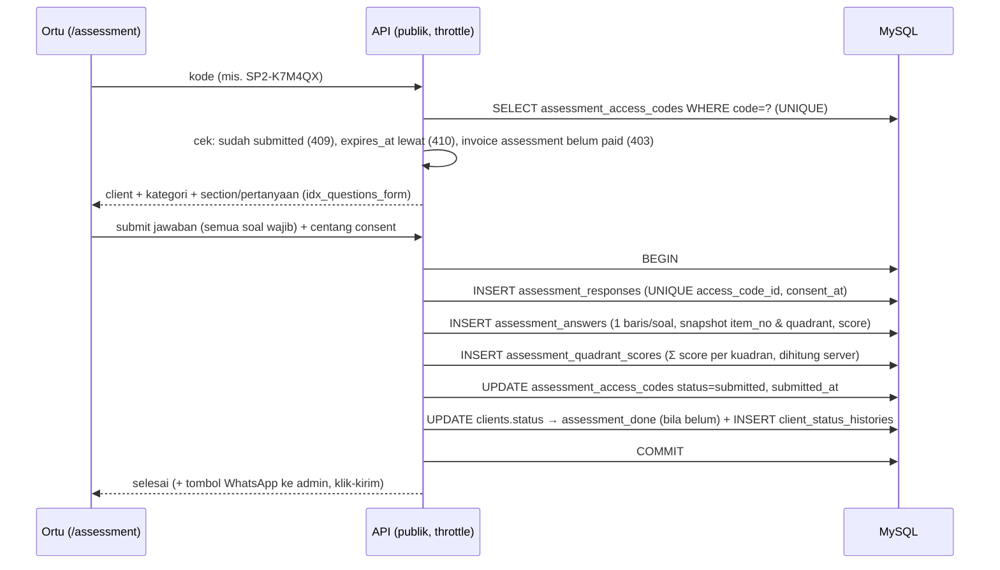
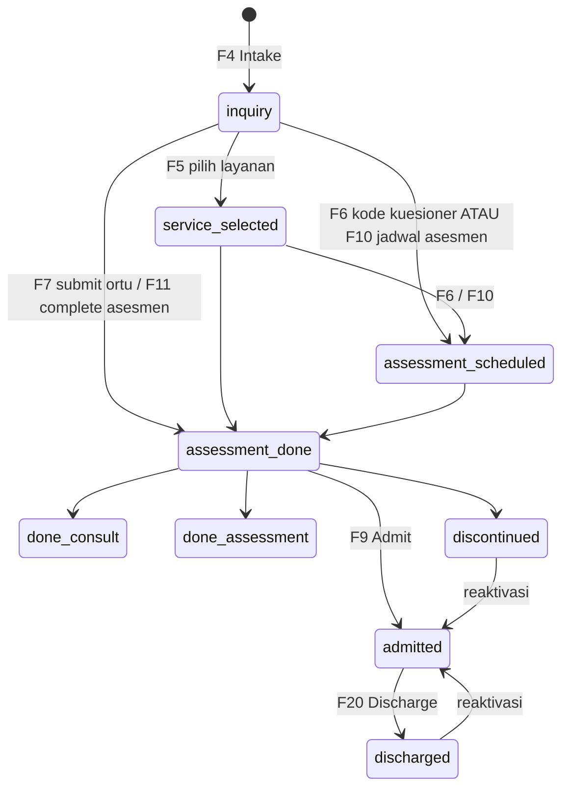
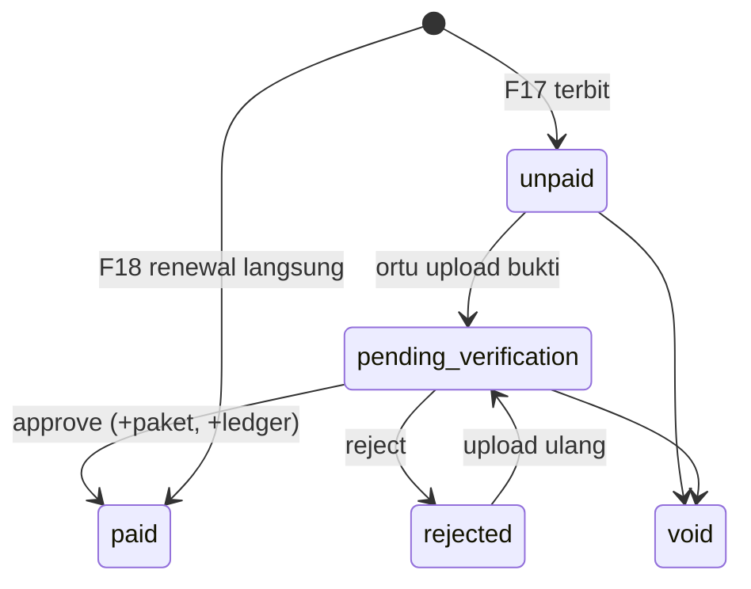

# Technical Workflow Therapedia

Alur pemrosesan data **per fitur**: cara fitur berjalan, tabel database yang terdampak, dan urutan operasinya. Ditulis sebagai bahan review desain database (`schema.md` v2) dan acuan implementasi backend Laravel 11 + MySQL 8.

Rincian API dan tabel per endpoint: `implementation_detail.md`.

Sumber: perilaku frontend saat ini (`frontend/src/domain`, `features/*/hooks`, `docs/guide/`), desain DB (`schema.md`), dan jawaban klien + hasil meeting 3 Okt 2026 (`pertanyaan_klien.md`). Bila keduanya berbeda, perbedaan ditandai **[Beda]** dan dikumpulkan di bagian [Catatan untuk review database](#catatan-untuk-review-database).

## Daftar isi
- [0. Konvensi yang berlaku di semua alur](#0-konvensi-yang-berlaku-di-semua-alur)
- [1. Peta fitur → tabel](#1-peta-fitur--tabel)
- [A. Akses & administrasi](#a-akses--administrasi): F1 Login & lupa password, F2 User/Role/RBAC, F3 Master data
- [B. Inquiry & asesmen](#b-inquiry--asesmen): F4 Intake, F5 Layanan, F6 Kode kuesioner, F7 Isi kuesioner (ortu), F8 Mesin kuesioner, F9 Outcome & dokumen
- [C. Penjadwalan & sesi](#c-penjadwalan--sesi): F10 Buat jadwal, F11 Complete, F12 Cancel, F13 Reschedule/Pending/Drop, F14 Revert, F15 Bulk, F16 Laporan sesi
- [D. Keuangan & kredit](#d-keuangan--kredit): F17 Invoice & pembayaran, F18 Renewal (2 jalur), F19 Paket kredit, F29 Konversi paket & log invoice
- [E. Client aktif](#e-client-aktif): F20 Active client, Frozen, Discharge
- [F. Portal & pelaporan](#f-portal--pelaporan): F21 Portal terapis, F22 Portal ortu, F23 Dashboard, F24 (dihapus: tanpa audit log)
- [G. Job terjadwal](#g-job-terjadwal): F25
- [H. Fitur tambahan](#h-fitur-tambahan): F26 Hari libur, F27 Monitoring laporan sesi, F28 Google Calendar (fase terakhir)
- [Lampiran A. State machine](#lampiran-a-state-machine)
- [Lampiran B. Matriks tabel × fitur](#lampiran-b-matriks-tabel--fitur)
- [Catatan untuk review database](#catatan-untuk-review-database)

---

## 0. Konvensi yang berlaku di semua alur

| Aturan | Penjelasan |
|---|---|
| **Satu use-case = satu endpoint transaksional** | Aksi lintas tabel (complete, cancel, verify, transition) dikerjakan satu request di dalam `DB::transaction()`. Frontend tidak merangkai beberapa request. |
| **Tanpa audit log (ADR 0004)** | Semua modul cukup `created_by` / `updated_by`. Log khusus hanya yang dipakai logika/UI: `credit_ledger` (kredit), `client_status_histories` (pipeline), **`invoice_logs`** (log milik tiap invoice: terbit, bukti, verifikasi, saldo, konversi, hapus), `package_conversions`. Ditulis di transaksi yang sama dengan perubahan datanya. |
| **Kunci & versi** | Baris yang diubah dikunci `lockForUpdate()`. Entity ber-`version` (`clients`, `schedules`, `invoices`, `client_packages`, `session_reports`, `assessment_categories`) dicek optimistic lock: `UPDATE … WHERE version = ?`, 0 baris → HTTP 409. |
| **Ledger sumber kebenaran** | `credit_ledger` append-only. Saldo di `client_packages.remaining_credit` dan `clients.credit_balance` adalah denormalisasi, diperbarui di transaksi yang sama. Koreksi = baris `reversal`, tidak pernah UPDATE/DELETE. |
| **Idempoten** | Potong kredit memakai `credit_ledger.idempotency_key` UNIQUE (`used:schedule:{id}:v{version}`); aktivasi paket memakai `client_packages.invoice_id` UNIQUE. |
| **Data turunan tidak disimpan** | Frozen = `clients.credit_balance = 0`. KPI dashboard = VIEW. Skor kuadran disimpan hanya karena dihitung sekali saat submit. |
| **Alasan = string bebas** | `schedules.cancel_reason`, `pending_reason`, `clients.discharge_reason`, `credit_ledger.cancel_reason` berisi code pilihan cepat atau teks custom. Tanpa FK ke `cancel_reasons` / `discharge_reasons`. |
| **Scope cabang** | Semua akun non-master (termasuk terapis dan manager) terikat **tepat 1 cabang** dan hanya melihat/mengubah data `branch_id` miliknya (`BranchScope`). Hanya Master yang bisa semua cabang. |
| **Hak akses = modul** | Punya akses modul (RBAC) = boleh **semua aksi** di modul itu kecuali hapus (termasuk Manager). Aksi **hapus** hanya tampil/diizinkan bila `roles.can_delete = 1` dan role punya akses modulnya. Hapus = permanen (ADR 0005, `schema.md` §6.7). Staf dinonaktifkan, tidak dihapus. |
| **Status client: otomatis maju, manual bebas** | `advanceStatus` (efek jadwal asesmen / kuesioner terisi / sesi asesmen completed) melompat ke tahap tertinggi yang tercapai, tidak mundur. Perubahan **manual** boleh ke tahap pipeline mana pun (maju maupun mundur, termasuk reaktivasi discharged/discontinued → admitted). Setiap perubahan status = 1 baris `client_status_histories`. |
| **Efek samping eksternal setelah commit** | Tidak ada notifikasi otomatis (WA tetap klik-kirim di frontend; email ortu hanya data). Tidak ada queue/job async: email OTP lupa password, hapus file bukti bayar, dan sinkron Google Calendar (fase akhir) dijalankan **sinkron tepat setelah commit**. |
| **List = pagination 10 data, bukan infinite scroll** | Semua list/tabel/feed di UI memuat **10 data per halaman** (default; pilihan 10/25/50) supaya render dan query ringan. Endpoint list menerima `page` + `per_page` (default 10, maks 50) dan mengembalikan `data` + `meta` (`total`, `page`, `per_page`, `last_page`); server tidak pernah mengirim seluruh isi tabel. Filter & pencarian dijalankan **di server** sebelum dipaginasi, dan ganti filter mengembalikan ke halaman 1. List kecil ber-filter (master data, hari libur, daftar staf) memakai offset (`LIMIT 10 OFFSET n`); list yang terus bertambah dan dibaca terbaru-dulu (`credit_ledger`, `invoice_logs`, riwayat sesi) memakai **keyset** (`WHERE (created_at, id) < (?, ?) ORDER BY created_at DESC, id DESC LIMIT 10`, cursor `next_cursor`). Detail di `docs/guide/08-ui-conventions.md` dan `schema.md` §07. |
| **Tanggal WIB** | Kolom bisnis `*_date` adalah generated column `DATE(ts + INTERVAL 7 HOUR)` agar dashboard tidak salah hari. |

Notasi tabel dampak: **C** = insert, **U** = update, **D** = delete, **R** = baca/lock.

---

## 1. Peta fitur → tabel

| Fitur | Tabel yang diubah (C/U/D) | Tabel yang dibaca |
|---|---|---|
| F1 Login & lupa password | `personal_access_tokens`(C), `users`(U `last_login_at`, password, `must_change_password`), `clients`(U `last_login_at`), `password_reset_otps`(C/U) | `users`, `clients`, `roles`, `role_permissions` |
| F2 User/Role/RBAC | `users`, `roles` (termasuk `can_delete`), `role_permissions` (C/U) | `access_modules`, `branches` |
| F3 Master data | `services`, `sensory_quadrants`, `cancel_reasons`, `discharge_reasons`, `master_packages` (`updated_by`) | tabel pemakai (untuk pengaman hapus) |
| F4 Intake | `clients`(C), `client_code_counters`(U), `client_status_histories`(C) | `branches` |
| F5 Layanan | `client_services`(C/D), `clients`(U status), `client_status_histories`(C) | `services` |
| F6 Kode kuesioner | `assessment_access_codes`(C/D), `clients`(U status), `client_status_histories`(C) | `assessment_categories`, `invoices` (gating) |
| F7 Isi kuesioner | `assessment_responses`(C), `assessment_answers`(C), `assessment_quadrant_scores`(C), `assessment_access_codes`(U), `clients`(U status), `client_status_histories`(C) | `assessment_questions`, `sensory_quadrants`, `invoices` |
| F8 Mesin kuesioner | `assessment_categories`, `assessment_sections`, `assessment_questions` (C/U/D) | `sensory_quadrants` |
| F9 Outcome & dokumen | `clients`(U), `client_status_histories`(C), `client_documents` | — |
| F10 Buat jadwal | `schedules`(C), `schedule_series`(C), `clients`+`client_status_histories` (bila asesmen) | `schedules` (cek bentrok), `client_packages`, `users`, `holidays` |
| F11 Complete | `schedules`(U), `client_packages`(U), `clients`(U), `credit_ledger`(C), `session_reports`(C/U), `client_status_histories`(C bila asesmen) | — |
| F12 Cancel | `schedules`(U), `client_packages`(U `cancel_count`, + `remaining_credit` bila dipotong), `clients`(U bila dipotong), `credit_ledger`(C) | `client_packages` |
| F13 Reschedule/Pending/Drop | `schedules`(U) | `schedules` (cek bentrok), `holidays` |
| F14 Revert (1x) | `schedules`, `credit_ledger`(C reversal), `client_packages`, `clients` | — |
| F15 Bulk | sama dengan aksi tunggal, satu `batch_id` | — |
| F16 Laporan sesi | `session_reports`(C/U) | `schedules` |
| F17 Invoice & bayar | `invoices`, `invoice_counters`, `payment_proofs`, `invoice_logs`(C), `client_packages`(C), `credit_ledger`(C), `clients`(U; `leftover_balance` bila saldo dipakai) | `master_packages` |
| F18 Renewal (2 jalur) | `invoices`(C paid), `invoice_counters`, `invoice_logs`(C), `client_packages`(C), `credit_ledger`(C), `clients`(U) | `master_packages` |
| F19 Paket kredit | `master_packages`(C) | — |
| F29 Konversi paket | `package_conversions`(C), `client_packages`(C paket baru, U paket lama `converted`), `credit_ledger`(C `converted_out`/`converted_in`), `clients`(U `credit_balance`, `leftover_balance`), `invoice_logs`(C), `schedules`(D jadwal mendatang) | `invoices`, `master_packages`, `schedules` |
| F20 Active client | `clients`(U discharge/discontinue/reaktivasi), `client_status_histories`(C) | `client_packages`, `credit_ledger`, `schedules`, `schedule_series` |
| F21 Portal terapis | `session_reports`(C/U) | `schedules`, `clients`, `v_therapist_sessions` |
| F22 Portal ortu | `payment_proofs`(C), `invoices`(U) | `schedules` (completed), `session_reports`, `client_packages`, `invoices`, `assessment_access_codes` |
| F23 Dashboard | — (baca saja) | view `v_daily_*`, `v_therapist_sessions`, `v_invoice_queue` |
| F24 Audit log (dihapus) | — | — |
| F25 Job | `credit_ledger`/`clients`/`client_packages` (rekonsiliasi), tabel Laravel, `password_reset_otps` (prune) | — |
| F26 Hari libur | `holidays`(C/U/D) | `schedule_series`, `schedules` |
| F27 Monitoring laporan | — (baca saja) | `v_unreported_sessions` |
| F28 Google Calendar | `google_calendar_integrations`, `schedules.google_event_id` | `schedules` |

---

## A. Akses & administrasi

### F1. Login, ganti password, dan lupa password
**Layar:** `/login`, `/roles` (demo), portal ortu memakai kode client. **Role:** semua.

**Staf (guard `staff`)**
1. Request email + password → `users` dicari by `email` (UNIQUE), `is_active = 1`. Salah → pesan generik + throttle.
2. Berhasil → `users.last_login_at`, token Sanctum ke `personal_access_tokens`. Respons memuat role + `role_permissions` + `can_delete` + `branch_id` (+ `must_change_password`).
3. **Login pertama:** password sementara diatur Master → `must_change_password = 1` → user hanya boleh memanggil endpoint ganti password; setelah diganti flag 0 dan `password_changed_at` terisi.

**Lupa password (staf)**
1. User memasukkan email → bila akun aktif, buat OTP 6 digit (hash di `password_reset_otps`, kedaluwarsa ±10 menit, maks 5 percobaan) dan kirim email sinkron setelah commit (SMTP gagal → 503, OTP dibatalkan). Respons sukses selalu generik. Throttle per email & IP.
2. User memasukkan OTP + password baru → OTP valid dan belum dipakai → password diganti, `used_at` terisi, token lama dicabut.
3. **Dibantu Master:** dari User Management, Master mengatur password sementara baru (`must_change_password = 1`), sama seperti pembuatan akun.

**Orang tua (guard `client`)**
1. Request `client_code` (mis. `AE-00001`) **+ tanggal lahir anak** → lookup UNIQUE `clients.client_code` (Q14, < 5 ms), lalu cocokkan `date_of_birth`. Gagal selalu dengan pesan generik; throttle + lockout sementara per IP & per kode (kode berurutan, mudah ditebak).
2. Berhasil → `clients.last_login_at`, token Sanctum (tokenable = `Client`, ability = portal ortu). Tidak ada lupa password ortu: admin yang menginformasikan kode client.

**Logout:** hapus token. 401 dari API → frontend logout otomatis.

| Tabel | Op | Efek |
|---|---|---|
| `users` / `clients` | R, U | `last_login_at`, password, `must_change_password` |
| `password_reset_otps` | C, U | OTP lupa password |
| `personal_access_tokens` | C/D | token login / logout |

### F2. User, role, dan RBAC (Master)
**Layar:** `/master/users`, `/master/rbac`. Jejak = `created_by` / `updated_by`.

- **Tambah/ubah/nonaktifkan staf:** `users` C/U. Staf yang berhenti **dinonaktifkan** (`is_active = 0`), tidak dihapus (terapis punya riwayat sesi). Setiap akun non-master wajib punya `branch_id` (terapis dan manager per cabang); hanya Master yang boleh tanpa cabang. Master mengatur password sementara + `must_change_password = 1`, dan dapat mereset password staf yang lupa.
- **Role kustom:** `roles` C/U/D (`is_system = 1` tidak bisa dihapus). Role kustom dipertahankan; tiap role punya flag **`can_delete`** (tombol hapus tampil di modul yang diakses role itu).
- **Matriks role × modul:** upsert `role_permissions (role_id, module_code, allowed)`. Modul baru: `unreported_reports` (monitoring laporan), `holidays` (hari libur).
- **Cek akses setiap request:** `PermissionService` memuat `role_permissions` role itu sekali per request (memo). Punya akses modul = boleh semua aksi non-hapus di modul itu (Manager sesuai cabang & modul yang diberikan, boleh edit); hapus butuh `can_delete`. Void invoice, renewal langsung, dan koreksi saldo = aksi modul `finance`. Tidak ada daftar role hardcode per aksi.

| Tabel | Op | Efek |
|---|---|---|
| `users` | C/U | akun staf & terapis (atribut klinis nullable) |
| `roles`, `role_permissions` | C/U/D | role, `can_delete`, izin modul |
| `access_modules` | R | daftar modul (seed) |

### F3. Master data
**Layar:** `/admin-inquiry/master-data` (layanan, kuadran, alasan cancel, alasan discharge); `/finance` tab Packages (paket).

| Daftar | Tabel | Operasi UI | Pengaman |
|---|---|---|---|
| Layanan | `services` (PK `code`) | tambah, edit, aktif/nonaktif, hapus | tidak boleh dihapus bila dipakai `client_services`/`schedules.service_code` (FK `restrict`); nonaktifkan agar riwayat utuh |
| Kuadran | `sensory_quadrants` | tambah, edit, hapus | tidak boleh dihapus bila dipakai `assessment_questions`; minimal 1 kuadran |
| Alasan cancel / therapist off / discharge | `cancel_reasons` (`is_therapist_off`), `discharge_reasons` | tambah, edit, aktif/nonaktif, hapus | tanpa pengaman: hanya sumber dropdown, riwayat menyimpan string sendiri (menghapus alasan Therapist Off mengubah hitungan Therapist Off Rate riwayat) |
| Paket kredit | `master_packages` | tambah (edit/nonaktifkan; harga yang diubah tidak memengaruhi invoice/paket lama) | FK `RESTRICT` dari `invoices`/`client_packages.master_package_id` (paket yang pernah dipakai tidak bisa dihapus; nonaktifkan) + snapshot nama/harga di invoice dan `client_packages` |

Jejak: `updated_by`. Hapus hanya untuk role `can_delete`. `master_packages` punya `invoice_code` (kode pendek di nomor invoice; `ASM` dicadangkan untuk invoice assessment). Tabel master kecil, dibaca by PK dan dimuat sekali per sesi (react-query `staleTime` panjang). Alasan sistem `reschedule_dibatalkan` bukan baris tabel (konstanta kode).

---

## B. Inquiry & asesmen

Urutan langkah di Client Detail **tidak dikunci**: layanan, kode kuesioner, dan jadwal asesmen boleh diisi dalam urutan apa pun. Status **otomatis** hanya melompat maju; perubahan **manual** boleh ke tahap mana pun (lihat [Lampiran A](#lampiran-a-state-machine)). Setiap perubahan = 1 baris `client_status_histories`, tanpa baris untuk tahap yang dilewati. Jejak inquiry/asesmen: `created_by`/`updated_by` + riwayat status.

### F4. New Intake
**Layar:** `/admin-inquiry/pipeline` (dialog New Intake). **Role:** role dengan akses modul inquiry.

1. Validasi: nama anak (nama lengkap), tanggal lahir, nama ortu, WhatsApp. Email opsional (hanya data). Catatan intake opsional. **1 client = 1 ortu** yang didaftarkan. Bila nama + tanggal lahir sama dengan client lain, tampilkan peringatan (bukan blokir).
2. Server membuat `client_code` = grup huruf dari **huruf pertama nama** (A–E = `AE`, F–J = `FJ`, K–O = `KO`, P–T = `PT`, U–Z = `UZ`) + `-` + 5 digit counter grup dari `client_code_counters` (`UPDATE … last_number = LAST_INSERT_ID(last_number + 1)`), contoh `AE-00001`. Kode ini juga dipakai login ortu (+ tanggal lahir anak) dan tidak berubah walau nama diedit.
3. Insert `clients`: `status = inquiry`, `branch_id`, `birth_month` (generated), `intake_note`, `credit_balance = 0`, `created_by`.
4. Insert `client_status_histories` (`from_status = NULL`, `to_status = inquiry`, `trigger = created`).

| Tabel | Op | Efek |
|---|---|---|
| `clients` | C | biodata + `client_code` |
| `client_code_counters` | U | counter grup |
| `client_status_histories` | C | baris awal pipeline |

Edit biodata dan catatan intake (`EditIntakeDialog`): `clients` U (+`version`, `updated_by`). Pencarian client: awal nama anak, nama ortu, atau kode client.

### F5. Pilih layanan
**Layar:** Client Detail → `ServiceSelectionCard`.

1. Request daftar `service_code` baru (`PUT clients/{id}/services`), hanya layanan `services.is_active = 1`.
2. Sinkronisasi `client_services`: baris baru C (`selected_at`, `selected_by`), baris yang dilepas D. Tambah/lepas layanan **tidak** membuat history bila status tidak berubah.
3. Bila daftar tidak kosong dan status masih sebelum `service_selected` → `clients.status = service_selected`, history `trigger = service_selected`.

Melepas semua layanan tidak memundurkan status.

### F6. Kode kuesioner
**Layar:** Client Detail → `QuestionnaireCodeCard`; `/admin-inquiry/assessments` → `GenerateCodeDialog`.

1. Pilih kategori kuesioner (`assessment_categories.is_active = 1`) dan **masa berlaku**: admin memilih kode diberi `expires_at` atau tanpa masa berlaku.
2. Insert `assessment_access_codes`: `code` = `{type_code kategori}-{suffix acak 6 karakter}` (mis. `SP2-K7M4QX`, UNIQUE, retry bila bentrok), `client_id`, `category_id`, `status = issued`, `issued_by`, `expires_at` (opsional).
3. Status client maju ke `assessment_scheduled` (dapat melompat dari `inquiry`) → history `trigger = code_issued`. Kode dibagikan ke ortu (link/WhatsApp klik-kirim).

Satu client boleh punya banyak kode (multi kategori).

**Hapus kode** (UI: tombol hapus di Questionnaire Code Generator): hanya kode `status = issued` (belum diisi ortu); baris dihapus permanen tanpa jejak. Kode `submitted` ditolak (409/422). Status client tidak dimundurkan. Link yang sudah dibagikan langsung tidak valid.

### F7. Ortu mengisi kuesioner (publik)
**Layar:** `/assessment` (tanpa login).



Aturan:
- **Hanya sekali isi**: kode `submitted` tidak bisa dibuka/diisi ulang (tanpa revisi).
- **Masa berlaku opsional**, dicek saat kode dibuka (`expires_at < NOW()` → tidak bisa diakses); tidak ada job harian.
- **Invoice assessment**: selama client punya invoice jenis `assessment` yang belum `paid`, ortu tidak bisa mengakses kuesioner mana pun (diarahkan membayar di portal ortu; invoice lunas membuka kembali).
- **Consent** wajib (checkbox) dan waktunya disimpan (`assessment_responses.consent_at`).
- `score` = angka di awal jawaban (`"4 - Sering"` → 4). Skor mentah per kuadran saja, **tanpa klasifikasi otomatis**.
- Hasil dapat dilihat **semua staf internal** yang punya akses modul (`/admin-inquiry/parent-assessment/:id`, `/therapist/parent-assessment/:id`); **ortu tidak** melihat hasil.

| Tabel | Op | Efek |
|---|---|---|
| `assessment_access_codes` | R, U | `status = submitted`, `submitted_at` |
| `assessment_responses` | C | satu baris per kode; `consent_at`, `ip_address`, `respondent_*` |
| `assessment_answers` | C | satu baris per soal (snapshot) |
| `assessment_quadrant_scores` | C | `raw_score`, `item_count` per kuadran |
| `clients` | U | `status = assessment_done` (maju saja) |
| `client_status_histories` | C | `trigger = questionnaire_submitted` |

Dashboard "Awaiting questionnaire" (Q18, dengan pencarian nama): kode `issued` belum submit, `idx_codes_awaiting (status, issued_at)`; kode kedaluwarsa tetap tampil (ditandai).

### F8. Mesin kuesioner (Master)
**Layar:** `/admin-inquiry/assessments`. CRUD `assessment_categories` (`version`, `scoring_key` JSON, **`type_code`** = prefix kode kuesioner), `assessment_sections`, `assessment_questions` (12 tipe soal selengkap Google Form, termasuk `birth_date`; `options` JSON, hapus permanen bila belum dijawab). Jejak: `updated_by`. Soal yang sudah dijawab tidak boleh hard delete (`assessment_answers.question_id` `restrict`) — nonaktifkan bila sudah dipakai; jawaban lama menyimpan snapshot `item_no` dan `quadrant_code`.

### F9. Outcome, dokumen, dan catatan client
**Layar:** Client Detail → `OutcomeCard`, `GDriveLinkCard`. Riwayat = `client_status_histories`.

| Aksi | Efek di DB |
|---|---|
| **Admit** | `status = admitted`, `final_outcome = admitted`, `date_of_join = today`. **Tidak** membuat paket: saldo 0 = Frozen sampai Finance mengaktifkan paket. History `trigger = outcome` |
| **Done Consult** / **Done Assessment** | `status` + `final_outcome` = `done_consult` / `done_assessment`; history `outcome` |
| **Discontinue** | `status = discontinued`, `final_outcome = discontinued`, **`date_of_discontinue = today`**; alasan (`discharge_reason` / `discharge_note`). History `outcome` |
| **Ubah status manual / koreksi** | Cari client di pipeline, klik ubah status ke **tahap mana pun** (mis. salah klik Admit → pindah lagi; atau Admit to Active dari status lain). Tidak ada tombol "revert" khusus. History `manual` / `revert` |
| **Simpan link GDrive** | `client_documents` (`type = gdrive_folder`, `url`); dokumen client = link Google Drive saja (tanpa upload file) |
| **Hapus** (client / inquiry) | hapus **permanen** hanya untuk role `can_delete` (ADR 0005, `schema.md` §6.7): client + jadwal + laporan sesi + invoice (bukti, log, paket, konversi) + ledger + riwayat status + kuesioner ikut terhapus lewat FK `CASCADE`; file bukti bayar dihapus setelah commit; client terhapus tidak bisa login ortu |

Semua perubahan status lewat `POST clients/{id}/transition` (validasi + history dalam satu transaksi). Client discharge/discontinued bisa diaktifkan kembali dari list maupun detail (F20).

---

## C. Penjadwalan & sesi

### F10. Buat jadwal (single / berulang) + cek bentrok
**Layar:** Weekly Calendar (`AddScheduleModal`), Client Detail (jadwal asesmen). **Role:** master, admin_schedule.

0. **Cek hari libur:** `session_date` yang ada di `holidays` (cabang itu atau semua cabang) ditolak (422); kalender tidak bisa memilihnya. Form jadwal asesmen/terapi **tidak memilih service** (diturunkan dari client).
1. **Cek bentrok** (juga preview live `GET schedules/conflicts`): `SELECT … FROM schedules WHERE therapist_id=? AND session_date=? AND status NOT IN ('cancelled','reschedule_pending') FOR UPDATE` (`idx_sch_therapist`). Tidak ada konsep jam kerja: **bentrok = terapis yang sama sudah handle client lain di jam yang overlap**. Bentrok → 409 + daftar sesi bentrok; role berwenang boleh `force=true`.
2. **Single:** insert 1 `schedules` (`status = scheduled`, `type`, `client_package_id` untuk terapi / `NULL` untuk asesmen, `service_code` (turunan dari client), `session_date`, `start_time`, `end_time`).
3. **Pola berulang** (terapi, multi-hari, default 12 minggu): insert `schedule_series` (`pattern` JSON, `weeks`, `starts_on`, `ends_on`) + N `schedules` ber-`series_id`, satu transaksi. Tanggal yang jatuh di `holidays` **dilewati** (tidak dibuatkan sesi).
4. **Sesi asesmen:** bila status client masih `inquiry`/`service_selected` → `clients.status = assessment_scheduled`, history `trigger = assessment_scheduled`. Reschedule tidak memicu transisi.
5. Jejak: `created_by`.

Client Frozen tetap boleh dijadwalkan (hanya ditandai di kalender).

| Tabel | Op | Efek |
|---|---|---|
| `schedules` | R(lock), C | sesi baru |
| `schedule_series` | C | pola berulang |
| `clients`, `client_status_histories` | U, C | hanya sesi asesmen |

**Baca kalender (Q1):** satu query per minggu per cabang, `idx_sch_calendar (branch_id, session_date, status)`; filter terapis memakai `idx_sch_therapist`. Frozen dihitung saat render dari `clients.credit_balance = 0`.

### F11. Complete sesi
**Endpoint:** `POST /schedules/{id}/complete`. **Role:** akses modul schedule (terapis hanya mengisi laporan).

```mermaid
sequenceDiagram
  participant U as Admin Schedule
  participant A as API
  participant D as MySQL
  U->>A: complete(id, version, laporan?)
  A->>D: BEGIN; SELECT schedules FOR UPDATE (cek version, status scheduled/rescheduled)
  alt type = therapy
    A->>D: SELECT client_packages aktif FOR UPDATE (prioritas paket sesi, lalu FIFO activated_at)
    A->>D: UPDATE remaining_credit -1 (depleted bila 0)
    A->>D: INSERT credit_ledger (used, -1, idempotency_key)
    A->>D: UPDATE clients.credit_balance -1
  else type = assessment
    A->>D: UPDATE clients.status → assessment_done (bila belum) + INSERT client_status_histories
  end
  A->>D: UPDATE schedules (completed, previous_status, completed_at/by, version+1)
  A->>D: UPSERT session_reports (bila ada laporan)
  A->>D: COMMIT
```

| Tabel | Op | Efek |
|---|---|---|
| `schedules` | U | `status = completed`, `previous_status`, `credit_effect` (`used` untuk terapi, `none` untuk asesmen), `completed_*`, `version+1` |
| `client_packages` | U | `remaining_credit −1`, `status = depleted` bila 0 (**hanya terapi**) |
| `clients` | U | `credit_balance −1` (terapi); `status = assessment_done` (asesmen) |
| `credit_ledger` | C | `action = used`, `credit_change = −1`, `package_balance_after`, `client_balance_after`, `schedule_id`, `idempotency_key`, `batch_id` |
| `client_status_histories` | C | `trigger = session_completed` (asesmen) |
| `session_reports` | C/U | laporan 3 bagian bila dikirim |

Aturan: asesmen **tidak** memotong kredit (tanpa paket). Complete ulang sesi yang sama tidak memotong lagi (status + `idempotency_key`). Bila tidak ada paket bersisa, tidak ada pemotongan (client sudah Frozen).

### F12. Cancel sesi (admin memilih potong kredit atau tidak)
**Endpoint:** `POST /schedules/{id}/cancel` (alasan wajib, maks 150 karakter: pilihan cepat atau ketik sendiri). Berlaku untuk sesi berstatus `scheduled`, `rescheduled`, `reschedule_pending` di **semua jenis kalender** (terapi, asesmen, konsultasi). Request wajib `deduct_credit` (boolean, **tanpa default**): admin yang menentukan.

1. Lock sesi + client + paket target (`client_package_id` sesi, atau paket aktif tertua / FIFO).
2. `client_packages.cancel_count += 1` pada paket target. **Kuota 3 per paket** hanya **penghitung**: tidak otomatis memotong; respons memuat `quota_exceeded` (`cancel_count > 3`) agar UI memberi peringatan.
3. **`deduct_credit = true`:** `remaining_credit −1`, `clients.credit_balance −1`, ledger `cancel_penalty −1`, `credit_effect = penalty`. Bila tidak ada paket aktif/saldo 0 → 422 (hanya bisa "tidak potong").
4. **`deduct_credit = false`:** ledger `cancel_excused` (`credit_change = 0`), `credit_effect = excused`.
5. Update sesi `status = cancelled`, `previous_status`, `cancel_reason`, `cancel_note`, `cancelled_at/by`.
6. Keputusan admin tersimpan di ledger (`cancel_penalty` / `cancel_excused`, `cancel_count_after`).

| Tabel | Op |
|---|---|
| `schedules` | U (`cancelled`, alasan, `credit_effect`) |
| `client_packages` | U (`cancel_count`; `remaining_credit` bila dipotong) |
| `clients` | U (`credit_balance` bila dipotong) |
| `credit_ledger` | C (`cancel_excused` / `cancel_penalty`, `cancel_reason`, `cancel_count_after`) |

Kuota dihitung **per paket** (bukan per client). Reschedule dan tandai pending tetap netral kredit/kuota.

### F13. Reschedule, tandai pending, drop pending
**Role:** akses modul schedule. Tidak ada efek kredit/kuota.

| Aksi | Efek di `schedules` |
|---|---|
| **Reschedule langsung** | wajib slot/terapis berbeda + lolos cek bentrok (409 bila bentrok). `status = rescheduled`, slot baru di `session_date/start_time/end_time/therapist_id`; jejak slot **asal pertama** di `origin_*` (tidak ditimpa pada reschedule berikutnya), slot **tepat sebelum reschedule ini** di `prev_*` (target revert), `rescheduled_at`; `pending_*` dikosongkan; tanggal libur tidak bisa dipilih |
| **Tandai pending** ("jadwal pengganti menyusul") | `status = reschedule_pending`, `pending_reason` (string), `pending_note`, `pending_at`; slot tetap; **diabaikan cek bentrok** |
| **Tetapkan jadwal pengganti** (dari pending) | sama dengan reschedule → `rescheduled` |
| **Drop pending** (batalkan sesi yang menggantung) | sama dengan cancel (F12): admin memilih potong kredit atau tidak; alasan sistem `reschedule_dibatalkan` |

### F14. Revert (hanya 1x: completed / cancel / reschedule / pending)
**Layar:** `SessionDetailModal` → tombol "Batalkan Status Completed/Cancel (Revert)" pada sesi `completed`/`cancelled`, "Batalkan Pemindahan Jadwal (Revert)" pada `rescheduled`, dan revert pada `reschedule_pending` (`RevertSessionPanel`: alasan wajib, pratinjau efek, diblokir bila slot target terisi). **Endpoint:** `POST /schedules/{id}/revert` (alasan wajib; akses modul schedule; opsional batas ≤ 7 hari). Frontend demo: `useSessionActions.revertSession`.

**Hanya 1x**: satu langkah mundur ke keadaan sebelumnya. Setelah revert, sesi tidak bisa di-revert lagi (`reverted_at` terisi, 422 `already_reverted`) sampai ada transisi baru pada sesi itu (complete / cancel / reschedule / pending), yang mengosongkan `reverted_at`. Tidak ada undo berantai.

| Dari | Ke | Efek |
|---|---|---|
| `completed` | `previous_status` | bila `credit_effect = used`: ledger `reversal +1` (`reverses_ledger_id` → baris `used`, UNIQUE sehingga hanya sekali), `remaining_credit +1`, `credit_balance +1`; status client dikembalikan bila sesi asesmen itu memajukan client otomatis (`client_status_from`) |
| `cancelled` | `previous_status` (`scheduled` / `rescheduled` / `reschedule_pending`) | bila `credit_effect = penalty`: reversal +1; `client_packages.cancel_count −1` pada paket yang sama (`cancel_excused` direverse dengan `credit_change = 0`) |
| `rescheduled` | slot `prev_*` (tepat sebelum reschedule terakhir): reschedule 1x → **jadwal asal** (`scheduled`); sudah reschedule 2x → **jadwal tersimpan terakhir** (tetap `rescheduled`, `origin_*` dipertahankan) | cek bentrok slot target dulu (409 bila terisi); `prev_*` dikosongkan; `origin_*` & `rescheduled_at` dikosongkan hanya bila kembali ke slot asal pertama; tanpa efek kredit/kuota |
| `reschedule_pending` | `previous_status` (jadwal asal; slot tidak pernah berubah) | `pending_*` dikosongkan; tanpa efek kredit/kuota |

Jejak: `reverted_at` + `updated_by` di sesi dan baris `reversal` di ledger (bila ada efek kredit). Tahap client yang dipulihkan memakai `schedules.client_status_from/to` (hanya bila `clients.status` masih = `client_status_to`) dan tercatat di `client_status_histories` (`trigger = revert`). Baris ledger asal tidak diubah.

**Contoh (kredit):** sesi #9012 di-complete → ledger #7001 `used −1` (saldo 6→5). Salah klik, di-revert → ledger #7002 `reversal +1`, `reverses_ledger_id = 7001` (saldo 5→6); #7001 tetap ada. Sesi di-complete lagi → ledger **#7003 `used −1`** (baris baru, `idempotency_key` versi baru); `reverted_at` dikosongkan, sehingga boleh di-revert sekali lagi → ledger #7004 `reversal +1`, `reverses_ledger_id = 7003`.

### F15. Aksi massal (bulk)
**Layar:** Weekly Calendar (pilih banyak chip). Satu endpoint `POST schedules/bulk/{action}`; **satu `batch_id`** (mengelompokkan baris ledger); tanpa audit.

| Aksi | Aturan |
|---|---|
| Bulk complete | aturan sama dengan F11 per sesi (kredit terapi −1 per sesi, idempoten; asesmen memajukan pipeline) |
| Bulk revert | batalkan completed / cancelled / rescheduled / pending sekaligus (alasan wajib, aturan F14 per sesi, termasuk **1x revert** per sesi; sesi yang sudah di-revert dilewati dan dilaporkan). Sesi berstatus lain dilewati; sesi yang slot-nya terisi (termasuk oleh sesi lain dalam batch yang sama) dilewati dan dilaporkan. |
| Bulk reschedule | geser N hari / ke tanggal tertentu / ganti terapis; jejak `origin_*` seperti F13 |
| Bulk cancel mode **leave** | alasan `izin_keluarga`; admin memilih potong kredit atau tidak (berlaku untuk seluruh batch), aturan F12 per sesi |
| Bulk cancel mode **other** | alasan `lainnya`; admin memilih potong kredit atau tidak (berlaku untuk seluruh batch), aturan F12 per sesi |

### F16. Laporan sesi (3 bagian)
**Layar:** `SessionDetailModal`, portal terapis (`SessionReportModal`). **Role:** terapis dan admin boleh menyimpan laporan kapan saja (tidak harus menunggu completed); mengubah status sesi = akses modul schedule.

1. `PUT schedules/{id}/report` → UPSERT `session_reports` (UNIQUE `schedule_id`): `activity_section`, `note_section`, `homework_section` (+ SOAP opsional), `client_id`/`therapist_id` didenormalisasi, `version`, `updated_by`.
2. `filled_sections` (generated 0..3) dipakai filter "laporan lengkap 3/3".
3. Jejak: `updated_by` (isi laporan tidak dicatat di tempat lain).

---

## D. Keuangan & kredit

### F17. Invoice, bukti bayar, dan verifikasi
**Layar:** Finance `/finance` (tab verification, billing, history), portal ortu `/client`. Semua aksi = role dengan akses modul **finance**.

```mermaid
sequenceDiagram
  participant F as Finance
  participant P as Ortu
  participant D as MySQL
  F->>D: terbitkan invoice (unpaid): Paket Sesi atau Assessment
  P->>D: upload bukti (payment_proofs, file di storage privat) → invoice pending_verification
  F->>D: approve → invoice paid (+ client_packages & credit_ledger bila Paket Sesi)
  Note over F,D: reject → invoice rejected + alasan; ortu boleh upload ulang (maks 3x) → pending_verification
```

**1. Terbitkan** (`POST invoices`, Finance): dua jenis, **Paket Sesi** dan **Assessment**. Insert `invoices` — `invoice_number` dibuat server: `INV-{type_code}-{YYYYMMDD WIB}-{NNN}` (mis. `INV-ASM-20261003-001`, `INV-REG-20261003-001`; `type_code` = `ASM` untuk assessment, `master_packages.invoice_code` untuk paket; increment dari `invoice_counters` per kode + tanggal, reset harian). Paket: snapshot `package_name`/`credits`/`amount` dari master (perubahan harga master tidak mengubah invoice). Assessment: nominal diisi Finance, tanpa paket/kredit. `status = unpaid`. **Tanpa jatuh tempo, diskon, DP, cicilan, refund.** Pengingat tagihan dilakukan admin manual lewat WhatsApp. `invoice_logs` (`issued`); bila invoice paket dan client punya **saldo lebihan** konversi (F29): `balance_applied` memotong nominal (`gross_amount − balance_applied = amount`), saldo client berkurang, log `balance_applied`.

**2. Upload bukti** (`POST invoices/{id}/proof`, multipart, ortu): JPG/PNG/PDF **maks 5 MB**, storage privat (disimpan selama data client ada) → insert `payment_proofs` (`review_status = pending`) → `invoices.status = pending_verification`, `proof_upload_count += 1`. Upload pertama + **re-upload maks 3x** (total ≤ 4); lebihnya ditolak (422). Tercatat di `invoice_logs` (`proof_uploaded`).

**3. Verifikasi** (`POST invoices/{id}/verify`, Finance), transaksi, invoice harus `pending_verification`, cek `version`:
- **Approve:** `invoices` → `paid` (`paid_at`, `verified_by/at`); `payment_proofs.review_status = accepted`. Bila **Paket Sesi**: insert `client_packages` (snapshot nama/harga/kredit, `invoice_id` UNIQUE mencegah aktivasi ganda), ledger `purchased` (client belum pernah punya paket) / `renewed` (sudah pernah; otomatis), `clients.credit_balance += N` (keluar dari Frozen). Bila **Assessment**: hanya `paid`; kuesioner client otomatis terbuka untuk ortu bila tidak ada invoice assessment lain yang belum lunas. `invoice_logs` (`verified`). Paket hasil verifikasi memakai harga **gross** (nilai paket utuh).
- **Reject:** `invoices.status = rejected`, `rejection_reason`; proof `rejected`. `invoice_logs` (`rejected`).
- **Hapus** invoice: hapus **permanen**, role `can_delete`, **hanya invoice belum lunas / ditolak** (ADR 0005): `payment_proofs` (+ file) dan `invoice_logs` ikut terhapus, saldo lebihan yang dipakai kembali ke `clients.leftover_balance`. Invoice `paid`/`void` ditolak (409).
- **Void** invoice lunas (`POST invoices/{id}/void`, modul finance): `status = void`, alasan wajib, pilihan kredit `keep`/`revoke` (wajib bila invoice paket). `revoke`: paket hidup → `voided`, ledger `manual_adjust` −sisa, saldo lebihan kembali; sesi selesai & laporan utuh; sesi mendatang pindah ke paket aktif lain atau `client_package_id = NULL` (Frozen). `invoice_logs` `voided`. **Invoice pengganti** (`replaces_invoice_id`; dari Buat Tagihan maupun Renewal, kedua jalurnya): saat verifikasi / renewal langsung, paket lama dipakai ulang (`client_packages.invoice_id` dipindah), tanpa kredit baru. Detail: `schema.md` §6.5.

Melihat bukti bayar tidak dicatat. Metode bayar = teks bebas (mis. transfer, tunai).

| Tabel | Op | Efek |
|---|---|---|
| `invoices` | C, U | alur status `unpaid → pending_verification → paid / rejected / void` |
| `invoice_counters` | U | nomor invoice |
| `payment_proofs` | C, U | tiap upload = 1 baris (riwayat); `review_status` |
| `client_packages` | C | paket baru per invoice paket paid |
| `credit_ledger` | C | `purchased` / `renewed` |
| `clients` | U | `credit_balance` |
| `invoice_logs` | C | satu baris per kejadian (`issued`, `proof_uploaded`, `verified` / `rejected`, `balance_applied`, …) |

Antrean Finance (Q9): `v_invoice_queue` / `idx_inv_queue (branch_id, status, issued_at)`. Riwayat mutasi kredit (Q10): `credit_ledger` keyset `idx_ledger_branch (branch_id, created_at, id)`. Revenue (Q11): invoice `paid` per cabang/periode lewat `v_daily_revenue`.

### F18. Renewal (dua jalur)
Renewal dilakukan dari dialog Renewal (modul finance) dengan **dua jalur**; keduanya menghasilkan invoice `invoice_type = package` dengan `is_renewal = 1`:
1. **Terbitkan invoice baru**: sama dengan F17 (invoice `unpaid` → ortu upload → Finance verifikasi → paket aktif). `invoice_logs` `issued` (catatan "renewal").
2. **Langsung lunas** (pembayaran sudah diterima, mis. tunai di kasir): `POST clients/{id}/renewals` (akses modul finance). **Wajib** `renewal_reason` (teks bebas, min. 3 karakter) dan `renewal_justification` (teks, min. 10 karakter), 422 bila kosong. Satu transaksi membuat `invoices` langsung `paid` (`payment_method` teks bebas mis. "tunai", nomor dari `invoice_counters`, alasan + justifikasi tersimpan di kolom invoice), `client_packages` (**snapshot harga paket saat perpanjang**: harga master yang berubah kemudian tidak ikut berubah), `credit_ledger` (`renewed`), dan `clients.credit_balance`, **tanpa** upload/verifikasi. `invoice_logs` (`renewal_paid`, `data` memuat alasan & justifikasi); saldo lebihan konversi (F29) otomatis mengurangi nominal bila ada. Bila client belum punya record kredit, pembayaran yang disetujui tetap menghasilkan kredit.

**Efek ke jadwal (kedua jalur, saat paket aktif):** sesi terapi mendatang client yang `client_package_id`-nya kosong / menunjuk paket habis dipindah ke paket aktif tertua (atau paket baru) di transaksi yang sama; sesi tidak lagi Frozen (turunan `credit_balance`). Lihat `schema.md` §6.5 langkah 5. **Invoice pengganti** (`replaces_invoice_id`) memakai ulang paket void tanpa kredit baru (lihat F17).

### F19. Paket kredit
- **Master paket** (`master_packages`): nama, `credits`, `price`, aktif. Dibaca saat menerbitkan invoice; hasilnya disalin (snapshot) ke `invoices` dan `client_packages`, sehingga mengubah master tidak mengubah histori.
- **Pemilihan paket saat pakai kredit:** prioritas `schedules.client_package_id`, lalu FIFO (`idx_pkg_client (client_id, status, activated_at)`).
- **Saldo total** client = Σ `remaining_credit` paket aktif = `clients.credit_balance`. Satu paket per invoice.
- **Tanpa masa berlaku:** paket aktif sampai habis (`active → depleted`); tidak ada job kedaluwarsa.
- **Snapshot harga:** harga/kredit disalin ke `invoices` dan `client_packages` saat terbit/perpanjang; mengubah master paket tidak mengubah paket/invoice yang sudah ada.
- **Kuota cancel** 3 per paket (`client_packages.cancel_count`, lihat F12).

### F29. Konversi paket & log invoice
**Layar:** `/finance` → tab Billing → tombol **Konversi** (invoice paket lunas yang paketnya masih punya sisa) dan **Log** (semua invoice). **Endpoint:** `POST /invoices/{id}/convert-package` (`target_package_id`, `sessions?`, `reason?`; akses modul finance), `GET /invoices/{id}/logs`.

**Aturan (keputusan klien, ADR 0003):**
1. Yang dikonversi adalah **paket kredit client** (mis. sisa sesi Senior), bukan invoice; nominal invoice asal tidak berubah.
2. `remaining_value = sisa sesi × (harga bayar paket ÷ total_credit)`; **otomatis** `sessions = floor(remaining_value ÷ harga per sesi tujuan)`. **Manual**: Finance mengisi `sessions` (alasan wajib) dengan batas atas = hasil otomatis — **tidak boleh ada kekurangan bayar**. 422 bila nilai sisa < 1 sesi tujuan.
3. `leftover = remaining_value − sessions × harga per sesi tujuan` → **saldo rupiah client** (`clients.leftover_balance`), otomatis mengurangi invoice **paket** berikutnya (terbit invoice atau renewal langsung; F17/F18) sampai sebesar nominal invoice.
4. **Kuota cancel (penalti) ikut pindah**: `client_packages.cancel_count` paket baru = paket lama.
5. **Semua jadwal terapi mendatang client dihapus permanen** (status `scheduled`/`reschedule_pending`) agar admin schedule menjadwalkan ulang sesuai paket dan terapis baru. Sesi riwayat dan asesmen tidak disentuh.
6. Tanpa revert konversi.

**Transaksi:** lock invoice + paket hidup → paket lama `converted` (`remaining_credit = 0`, `converted_to_package_id`) → paket baru (`converted_from_package_id`, `package_price = sessions × harga per sesi tujuan`, `cancel_count` disalin) → ledger `converted_out` (−sisa) + `converted_in` (+sessions) dengan `conversion_id` → `clients.credit_balance` dan `leftover_balance` → insert `package_conversions` → insert `invoice_logs` (`converted`) → hapus jadwal mendatang (permanen).

**Log invoice (`invoice_logs`)** — log milik invoice sendiri, append-only, bukan dari audit: `issued`, `proof_uploaded`, `verified`, `rejected`, `renewal_paid`, `balance_applied`, `converted`; berisi pelaku, waktu, `note`, dan `data` JSON. Kueri: `idx_invlog_invoice (invoice_id, created_at, id)`.

| Tabel | Op | Efek |
|---|---|---|
| `package_conversions` | C | mode, alasan, sisa, sesi baru, lebihan, jumlah jadwal terhapus |
| `client_packages` | U, C | paket lama `converted`; paket baru (kuota cancel disalin) |
| `credit_ledger` | C | `converted_out` / `converted_in` |
| `clients` | U | `credit_balance`, `leftover_balance` |
| `invoice_logs` | C | `converted` |
| `schedules` | D | hapus jadwal terapi mendatang |

---

## E. Client aktif

### F20. Active clients, Frozen, birthday, discharge, reaktivasi
**Layar:** `/admin-schedule/clients`, `/admin-schedule/clients/:id` (detail = halaman profile client).

- **Roster (Q6):** client `admitted`, `discharged`, dan `discontinued` per cabang + saldo (`idx_clients_roster`), dengan **filter status**. **Frozen** = `credit_balance = 0` (turunan, tidak disimpan).
- **Reaktivasi:** client `discharged` / `discontinued` bisa langsung diubah menjadi active (`admitted`) dari list maupun dari detail client (transisi manual, history `manual`).
- **Birthday radar (Q7):** `clients (branch_id, birth_month)` live, tanpa job.
- **Detail (Q8, Q20):** paket (`client_packages`, termasuk `cancel_count`/kuota), riwayat sesi (`idx_sch_client`), history kredit (`credit_ledger`), invoice. Bagian profile menampilkan **jadwal rutin (recurring)** (dari `schedule_series`) dan di bawahnya **jadwal yang sedang aktif di kalender** (sesi `scheduled`/`rescheduled`/`reschedule_pending` mendatang).
- **Filter analitik:** periode preset **dan custom** (pilih tanggal awal–akhir) atas sesi client (`idx_sch_client`).
- **Discharge** (`admitted → discharged`, alasan wajib): `status = discharged`, `date_of_discharge = today`, `discharge_reason` (string), `discharge_note`, history `trigger = discharge`. **Discontinue** mengisi `date_of_discontinue` (F9). Sesi mendatang **tidak** dibatalkan otomatis (perilaku prototype).

| Tabel | Op |
|---|---|
| `clients` | U (discharge / discontinue / reaktivasi) |
| `client_status_histories` | C |

---

## F. Portal & pelaporan

### F21. Portal terapis
**Layar:** `/therapist`, `/therapist/summary`, `/therapist/clients/:id`, `/print/client/:id`. Semua data difilter `therapist_id` milik user.

- **My Schedule (Q3):** `schedules` terapis X per minggu (`idx_sch_therapist`).
- **Aksi tulis hanya laporan sesi** (F16).
- **Summary (Q17):** `v_therapist_sessions` (JOIN `schedules` + `clients` + `session_reports`), filter periode/client/status laporan (`filled_sections`).
- **Detail & cetak client:** baca `clients`, `schedules`, `session_reports`, hasil asesmen (`assessment_responses` terbaru + skor kuadran). Cetak/ekspor laporan klinis tidak dicatat.

### F22. Portal orang tua
**Layar:** `/client` (mobile-first). Data milik `auth.clientId`.

- **Tagihan:** `invoices` terbaru + status; upload bukti (F17).
- **Kredit:** sisa total + per paket (`client_packages`).
- **Riwayat terapi:** hanya sesi `completed` (`idx_sch_client`) + laporan (`session_reports`: aktivitas, catatan, PR), filter tanggal, pagination. Tombol **View Report nonaktif** bila laporan sesi belum diisi (`filled_sections = 0`). **Export laporan harian** (per sesi) tersedia untuk sesi dengan laporan.
- **Kuesioner:** daftar kode kuesioner yang sudah digenerate tetapi belum diisi. Bila ada **invoice assessment pending** (belum `paid`), ortu wajib menyelesaikan pembayaran dulu sebelum bisa mengisi (F7). Ortu tidak melihat hasil asesmen.
- Tidak ada akses tulis selain upload bukti dan mengisi kuesioner.

### F23. Dashboard & agregasi
Semua angka dibaca dari **VIEW** (bukan tabel ringkasan), selalu dengan filter cabang + rentang tanggal; periode memakai kolom tanggal WIB.

| Dashboard / layar | Query | Sumber |
|---|---|---|
| Revenue (master/manager) | Q11 | `v_daily_revenue` ← `invoices` (`idx_inv_paid_date`) |
| Schedule dashboard | Q12 | `v_daily_sessions` ← `schedules` (`idx_sch_calendar`) |
| Inquiry dashboard & branch performance | Q12 | `v_daily_pipeline` ← `client_status_histories` (`idx_csh_branch_date`) |
| Pemakaian/penambahan kredit | Q12 | `v_daily_credit_usage` ← `credit_ledger` (`idx_ledger_branch_date`) |
| Terapis summary | Q17 | `v_therapist_sessions` |
| Antrean finance | Q9 | `v_invoice_queue` |
| Cancellation Rate & Therapist Off Rate | `v_daily_sessions` (`sessions_cancel_counted`, `sessions_cancel_therapist_off` dibagi `sessions_total`) |
| Pie alasan cancel / discharge | agregasi langsung | `schedules.cancel_reason`, `clients.discharge_reason` (string; kode pilihan cepat dikelompokkan per kode, teks custom ke "Lainnya") |

Tabel ringkasan `daily_branch_metrics` hanya dibuat bila `EXPLAIN ANALYZE` view > 100 ms (job `metrics:rebuild`).

### F24. Audit log — dihapus (ADR 0004)
Tidak ada halaman maupun tabel `audit_logs`. Jejak perubahan: `created_by`/`updated_by` di semua modul, `credit_ledger`, `client_status_histories`, `invoice_logs`, `package_conversions`. Nomor F24 dipertahankan agar rujukan lain tidak bergeser.

---

## G. Job terjadwal

### F25. Laravel Scheduler (WIB, `withoutOverlapping`, `onOneServer`, `chunkById(500)`, idempoten)

| Jam | Job | Efek data |
|---|---|---|
| 02:00 harian | `credits:reconcile` | bandingkan Σ `credit_ledger` vs `client_packages.remaining_credit` dan `clients.credit_balance`, serta `client_packages.cancel_count` vs jumlah baris ledger `cancel_*` yang belum di-reversal; selisih diperbaiki dari ledger + dicatat di log aplikasi Laravel + peringatan ke Master |
| 03:30 harian | backup DB | `mysqldump --single-transaction` + binlog |
| Tiap 6 bulan (alt. 1 tahun, konfigurasi) | backup arsip jangka panjang | dump penuh + file bukti bayar, off-server, uji restore; tanpa hapus permanen otomatis |
| 04:00 harian | housekeeping | prune token Sanctum, cache kedaluwarsa, `password_reset_otps` kedaluwarsa (`otp:prune`) |
| Minggu 04:30 | `db:analyze` | `ANALYZE TABLE` tabel transaksi utama |

**Tidak ada notifikasi otomatis.** WhatsApp tetap klik-kirim di frontend; email ortu hanya data. Tidak ada queue: email OTP lupa password (dan sinkron Google Calendar di fase terakhir) dikirim sinkron setelah commit.

**Sengaja tanpa job:** dashboard (view), Frozen, birthday radar, kuota cancel/penalti, skor kuadran, kedaluwarsa kode kuesioner (dicek saat dibuka), masa berlaku paket (tidak ada), pengingat invoice & digest sesi terlambat (admin mengingatkan manual lewat WhatsApp).

---

## H. Fitur tambahan

### F26. Hari libur
**Layar:** pengaturan hari libur (modul `holidays`). CRUD `holidays` (`holiday_date`, `name`, `branch_id` null = semua cabang; hapus = hard delete, hanya role `can_delete`). Efek: jadwal berulang **melewati** tanggal libur (tidak dibuatkan sesi); kalender tidak bisa memilihnya; buat/pindah sesi di tanggal libur ditolak (422). Menambah libur **tidak** mengubah sesi yang sudah ada (ditandai di UI). Jejak: `created_by`/`updated_by`.

### F27. Monitoring laporan sesi (untuk manager)
**Layar:** modul `unreported_reports`. Daftar seluruh sesi `completed` yang laporannya belum diisi (Q19, view `v_unreported_sessions`: `status = completed`, `filled_sections = 0`), filter cabang/terapis/periode, agar manager dapat memantau. Baca saja.

### F28. Integrasi Google Calendar (fase terakhir)
Dikerjakan **paling akhir**, setelah semua fitur lain selesai. Sinkron satu arah sesi → Google Calendar per user (`google_calendar_integrations`, token terenkripsi; `schedules.google_event_id`), dipanggil sinkron setelah commit. Detail desain ditetapkan saat fase ini dimulai.

---

## Lampiran A. State machine

**Client (`clients.status`)**

Perpindahan **otomatis** hanya maju; perubahan **manual** boleh dari tahap mana pun ke tahap mana pun (klik ubah status), termasuk koreksi outcome dan reaktivasi.

**Sesi (`schedules.status`)**

```mermaid
stateDiagram-v2
  [*] --> scheduled: F10
  scheduled --> completed: F11 (terapi −1 kredit)
  scheduled --> cancelled: F12 (admin pilih potong kredit atau tidak)
  scheduled --> rescheduled: F13
  scheduled --> reschedule_pending: F13
  rescheduled --> completed
  rescheduled --> cancelled
  rescheduled --> rescheduled
  reschedule_pending --> rescheduled
  reschedule_pending --> cancelled: F12 (drop; admin pilih potong atau tidak)
  completed --> scheduled: F14 revert
  cancelled --> scheduled: F14 revert
  rescheduled --> scheduled: F14 revert (ke slot prev_*; 2x reschedule = jadwal tersimpan terakhir)
  reschedule_pending --> scheduled: F14 revert
```

Revert hanya 1x per aksi (`reverted_at`).

**Invoice (`invoices.status`)**


**Kode kuesioner (`assessment_access_codes.status`):** `issued → submitted` (**hanya sekali isi**, tanpa revisi), `issued → (dihapus)` oleh admin. Kedaluwarsa bukan status: dicek dari `expires_at` (opsional) saat kode dibuka. Selama client punya invoice assessment yang belum `paid`, kode tidak bisa dibuka.

**Paket (`client_packages.status`):** `active → depleted` (sisa 0). Tanpa masa berlaku.

---

## Lampiran B. Matriks tabel × fitur

C = insert, U = update, D = delete, R = baca/lock.

| Tabel | Ditulis oleh | Dibaca oleh |
|---|---|---|
| `branches` | seed/admin | semua (scope cabang) |
| `roles` (termasuk `can_delete`), `role_permissions` | F2 (C/U/D) | tiap request (policy) |
| `access_modules` | seed | F2 |
| `users` | F1 (U login/password), F2 (C/U) | F10 (terapis), F21, F23 |
| `password_reset_otps` | F1 (C/U), F25 (prune) | F1 |
| `holidays` | F26 | F10, F13, kalender |
| `client_code_counters` | F4 | F4 |
| `invoice_counters` | F17, F18 | F17, F18 |
| `google_calendar_integrations` | F28 | F28 |
| `services` | F3 | F5, F10, dashboard |
| `sensory_quadrants` | F3 | F7, F8, hasil asesmen |
| `cancel_reasons`, `discharge_reasons` | F3 | UI dropdown saja (tanpa FK) |
| `master_packages` | F3/F19 (C) | F17, F18 |
| `clients` | F1 (U), F4 (C), F5/F6/F7/F9/F10/F11 (status), F11/F12/F14/F17/F18 (saldo), F20 (discharge/discontinue/reaktivasi) | hampir semua |
| `client_services` | F5 | dashboard funnel, F10 |
| `client_documents` | F9 | Client Detail |
| `client_status_histories` | F4, F5, F6, F7, F9, F10, F11, F14, F20 (C) | `v_daily_pipeline`, timeline client |
| `assessment_categories/sections/questions` | F8 | F6, F7 |
| `assessment_access_codes` | F6 (C, D bila belum diisi), F7 (U) | F7, F22, Q18 |
| `assessment_responses/answers/quadrant_scores` | F7 (C) | hasil asesmen (F21, Client Detail) |
| `schedule_series` | F10 | F10 (ubah/batal seri) |
| `schedules` | F10 (C), F11–F15 (U) | kalender, portal, dashboard, F25 |
| `session_reports` | F11, F16 (C/U) | F21, F22, `v_therapist_sessions` |
| `invoices` | F17, F18 (C/U) | F17, F22, F23 |
| `payment_proofs` | F17 (C/U) | F17, `v_invoice_queue` |
| `client_packages` | F17, F18 (C), F11/F12/F14 (U) | F11, F12, F22 |
| `credit_ledger` | F11, F12, F14, F17, F18 (C saja) | riwayat kredit, `v_daily_credit_usage`, reconcile |
| `invoice_logs` | F17, F18, F29 (C saja), hapus invoice | tombol Log di tab Billing |
| `package_conversions` | F29 (C saja) | F29 |
| tabel Laravel (`personal_access_tokens`, `sessions`, `cache`, `cache_locks`, `jobs`, `failed_jobs`, `job_batches`; tabel queue dibuat tetapi tidak dipakai) | F1, F25 | framework |

---

## Catatan untuk review database

Temuan saat menyusun dokumen ini.

| # | Topik | Detail | Status |
|---|---|---|---|
| 1 | Jumlah tabel | `schema.md` §02 menulis "35 tabel domain"; hitungan sebelum jawaban klien **29 tabel domain**. Setelah jawaban klien + meeting: **33 tabel domain** (+ `password_reset_otps`, `holidays`, `client_code_counters`, `invoice_counters`; `google_calendar_integrations` fase terakhir = 34) + 7 view (`v_unreported_sessions`). | Selesai |
| 2 | §6.1 langkah 3–4 | Ledger `used` dan `credit_effect = used` ditulis tanpa syarat tipe sesi. Untuk `assessment` seharusnya **tidak ada ledger** dan `credit_effect = none`. Frontend sudah benar (`type === "therapy"`). | Menunggu keputusan |
| 3 | Cancel sesi asesmen | Kuota kini **per paket**; sesi asesmen tanpa paket. Pilihan "potong kredit" pada cancel asesmen memotong paket aktif client; bila tidak ada paket aktif hanya "tidak potong" (default tim teknis, perlu konfirmasi klien). | Perlu konfirmasi |
| 4 | Revisi kuesioner | **Selesai (keputusan klien):** kuesioner hanya diisi sekali; tanpa revisi. Frontend demo masih bisa mengisi ulang (diperbaiki di tahap frontend). | **[Beda]** diketahui |
| 5 | `purchased` vs `renewed` | **Selesai (C11):** otomatis dari ada tidaknya paket sebelumnya (belum pernah = `purchased`, selanjutnya `renewed`); frontend saat ini selalu menulis `renewed`. | Selesai |
| 6 | `trigger` history awal | Enum `trigger` kini punya nilai `created` untuk baris pertama. Frontend demo masih `manual`. | Selesai di schema |
| 7 | Discontinue | **Selesai (A3):** discontinue mengisi `date_of_discontinue` (field sendiri); alasan memakai `discharge_reason`/`discharge_note`. | Selesai |
| 8 | Sesi mendatang saat discharge | Sesi `scheduled` masa depan tidak dibatalkan otomatis saat client di-discharge. Roster tidak menampilkannya, tetapi kalender masih. | Perlu keputusan |
| 9 | Tipe `consultation` | Enum `schedules.type` punya `consultation`, tetapi UI hanya membuat `therapy` dan `assessment`; aturan kredit konsultasi belum didefinisikan (saat ini tanpa kredit, sama seperti asesmen). | Perlu keputusan |
| 10 | Cancel tanpa paket | Bila client belum punya paket aktif, cancel hanya bisa "tidak potong" (`cancel_excused`); `cancel_count` per paket tidak bertambah karena tidak ada paket. | Default tim teknis |
| 11 | Sesi bentrok | Backend menolak (409) kecuali `force=true`; UI membuat sesi baru hanya memberi **peringatan** ("Schedule Anyway") dan memblokir reschedule bentrok. Perbedaan sengaja, perlu dipastikan siapa yang boleh `force`. | Perlu ditegaskan |
| 12 | Hapus pilihan cepat alasan | Riwayat menampilkan kode (mis. `sakit`) bila baris master dihapus. Nonaktifkan lebih aman daripada hapus. | Diketahui |
| 13 | Audit log dihapus | **Selesai (ADR 0004):** tidak ada `audit_logs`; jejak = kolom pelaku + `credit_ledger`, `client_status_histories`, `invoice_logs`, `package_conversions`. Revert sesi asesmen memulihkan tahap client dari `schedules.client_status_from/to`. | Selesai |
| 14 | Konversi paket | **Selesai (ADR 0003):** F29; tabel baru `package_conversions`, `invoice_logs`; saldo lebihan (`clients.leftover_balance`) memotong invoice berikutnya. Jumlah tabel kini **34 domain** (+1 fase akhir). | Selesai |
